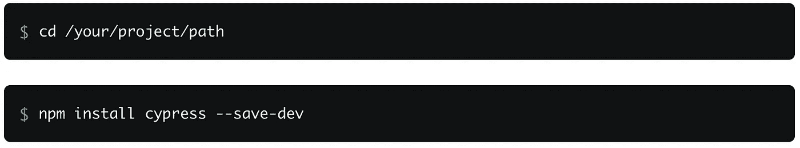

# 我第一次使用 Cypress.io 进行自动化测试

> 原文：<https://medium.easyread.co/automation-testing-using-cypress-io-211aa1d34333?source=collection_archive---------0----------------------->

## 使用 Cypress.io 进行自动化测试

[www.cypress.io](http://www.cypress.io)

> 嗨，这是我的第一个媒体故事。在这篇文章中，我将分享我使用 Cypress.io 进行自动化测试的经验，希望你会喜欢。

# **自动化测试**

> [**自动化测试**](https://www.softwaretestinghelp.com/automation-testing-tutorial-1/) 是一种在自动化工具中使用脚本测试的软件测试方法。这很有用，因为我们可以非常高效快速地测试软件。

我之前用过的自动化工具有很多，像 ***Selenium，机器人框架*** *，* ***Katalon，*** 和 ***Cypress.io*** 。我从 2018 年到现在都在用 Cypress.io。 [**Cypress.io**](https://www.cypress.io) 使用 Javascript 编程语言，具有类似`**cy.( )**`的独特语法。

# 柏树是什么？

> [**Cypress**](https://docs.cypress.io/guides/overview/why-cypress.html#In-a-nutshell) 是为现代 web 打造的下一代前端测试工具。我们解决了开发人员和 QA 工程师在测试现代应用程序时面临的主要难题。这使您能够编写更快、更容易、更可靠的测试。

在我们开始自动化测试之前，我们必须先阅读文档。有步骤设置和安装 Cypress。

**需要 3 个操作系统，例如:**

1.  macOS 10.9 及以上*(仅限 64 位)*
2.  Windows 7 及更高版本
3.  Linux Ubuntu 12.04 及以上，Fedora 21 和 Debian 8 *(仅限 64 位)*

## 安装柏树

安装 Cypress 必须**安装** [**node.js**](https://nodejs.org/en/) 和 [**npm**](https://www.npmjs.com/get-npm) 因为 Cypress 支持 node.js 或者不使用 npm 就安装 yarn。

1.  然后在我们的计算机上安装 npm，并检查 npm 版本以获得更新版本。
2.  为我们的项目创建一个新文件夹。
3.  打开终端，运行项目文件夹中的`**npm init**`。
4.  使用终端打开安装 Cypress 的路径。

Install Cypress via npm

**我们必须有这样的基本文件夹:**

1.  `**cypress folder**`(有夹具、集成、插件和支持文件夹)
2.  `**node_modules**`文件夹
3.  `**package.json**`
4.  `**cypress.json**`
5.  `**package-lock.json**`

安装 Cypress 之后，我们可以在集成文件夹中创建一个脚本测试。打开 IDE 并创建一个名为`[**sample_spec.js**](https://docs.cypress.io/guides/getting-started/writing-your-first-test.html#Step-4-Make-an-assertion)`的新测试文件。这个脚本中有几个步骤:

1.  访问网页。
2.  查询元素。
3.  与元素互动。
4.  断言页面上的内容。

**脚本:**

sample_spec.js

**结果:**

First Test with Cypress

## 什么是描述、它和期望？

所有这些功能都来自 Cypress bakes 的捆绑工具。

*   `**describe**`和`**it**`来自[摩卡](https://mochajs.org/)
*   `**expect**`出自[柴](http://www.chaijs.com/)

Cypress 构建在这些流行的工具和框架之上，希望您已经对这些工具和框架有所熟悉和了解。

在 cypress 中，我了解到有许多与元素、变量和别名、断言和等待元素的交互。我用 Cypress 测试 Web 应用程序，它运行得很快。我在 3 秒钟内将`**cy.wait(3000)**`添加到等待元素中，因为 Cypress 运行速度很快。当 DOM 存在时，我们可以测试被点击的元素。在 Cypress Dashboard 中，我们可以单击 Open Selector Playground 来检查元素，并可以复制它。

[Open Selector Playground](https://docs.cypress.io/guides/core-concepts/test-runner.html#Selector-Playground)

# 结论

我喜欢用 Cypress 测试 web 应用程序。我推荐这个自动化工具进行端到端测试，因为它可以在 web 应用程序中快速有效地运行脚本测试。我一年的使用 Cypress 的经验确实在软件测试过程中帮助了我。我还为测试相关模块创建集成测试。我使用 Cypress Dashboard 改进了我测试。我可以用一个命令运行我所有的脚本，它会在测试完成后生成测试报告。我已经将我的测试项目与 Docker 集成在一起。我将很快发布教程。如果你安装了 Cypress，你也会学到一些基本的 Javascript。总的来说，Cypress 是一个自动化工具，可以帮助你快速有效地进行测试。因此您可以获得完整的端到端测试体验。

[automation testing](https://www.goteaminternet.com/what-are-the-most-significant-automation-testing-services/)

谢谢你花时间阅读我的故事。

编码快乐！上帝保佑我们😇

# 参考

1.  [**Javascript 端到端测试框架:Cypress**](https://www.cypress.io)
2.  [**为什么是柏树？**](https://docs.cypress.io/guides/overview/why-cypress.html#In-a-nutshell)
3.  [**Node.js**](https://nodejs.org/en/)
4.  [**npm |获取 npm**](https://www.npmjs.com/get-npm)
5.  [**编写您的第一个测试#第 4 步-断言**](https://docs.cypress.io/guides/getting-started/writing-your-first-test.html#Step-4-Make-an-assertion)
6.  [**用柏树写你的第一个试验**](https://www.youtube.com/watch?v=VvLocgtCQnY&t=2s)
7.  [**捆绑工具|摩卡**](https://docs.cypress.io/guides/references/bundled-tools.html#Mocha)
8.  [**Mocha——有趣、简单、灵活的 JavaScript 测试框架**](https://mochajs.org)
9.  [**柴断言库**](https://www.chaijs.com)
10.  [**试跑者|赛柏文档**](https://docs.cypress.io/guides/core-concepts/test-runner.html#Errors)
11.  [**最重要的自动化测试服务有哪些？**](https://www.goteaminternet.com/what-are-the-most-significant-automation-testing-services/)