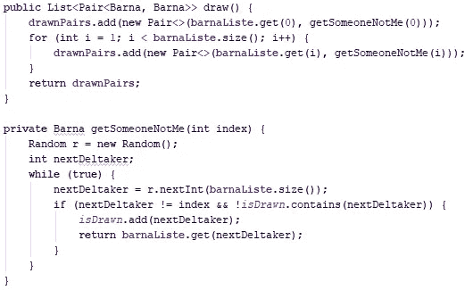
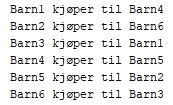
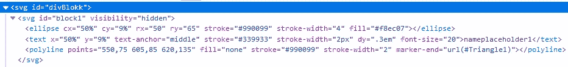

# Automatisert påskeegg-trekning

> 原文：<https://medium.com/compendium/automatisert-p%C3%A5skeegg-trekning-3e38d9dd4931?source=collection_archive---------5----------------------->

Påske for meg inneholder blant annet en forberedelse som går ut på å finne ut hvem som skal kjøpe påskeegg til hvem. Vanligvis foregår denne forberedelsen på følgende måte: “barna” i familien bekrefter at de ønsker å være med i ordningen, vi setter budsjett, så gjør vi en trekning med papirlapper for å finne ut hvem som kjøper påskeegg til hvem. Det var denne trekningen jeg i 2017 tenkte jeg kunne forbedre ved å skrive et program som gjorde trekningen for oss.

## Første påskeegg-trekning

Under flyturen fra Oslo til Tromsø påsken 2017 kodet jeg et program som skulle gjøre trekningen for oss. Måten programmet fant ut hvem som skulle kjøpe til hvem var at jeg hadde en liste som inneholdt alle “barna”, *barnaList* . Jeg tok første elementet i *barnaList* , deretter tok jeg et tilfeldig tall *tall1* mellom 0 og størrelsen til *barnaList* , og valgte det *tall1* ’te elementet i *barnaList.* Dersom det var samme “barn” som fra *barnaList* valgte programmet et nytt tilfeldig tall.

Metode for å gjøre trekningen i 2017

Resultatet fra trekningen ble skrevet ut som ren tekst i utviklerverktøyet jeg brukte.

Resultatet fra trekningen 2017

## Forsøk nr. 2: Grafikken kommer på plass

Ny påske sto for tur og denne gangen skulle jeg oppgradere programmet til å i tillegg vise litt kul grafikk. Det ble programmering på tog og fly uten internett, så jeg holdt meg til “the basics”. Selve trekningen endret jeg ikke så mye på, jeg hadde fullt fokus på visningen av resultatet. Dette året endte jeg på et bilde av en påskehare, med seks egg rundt seg, med navnet til “barna” i seg, og piler mellom eggene.

Video av trekningen gjort i 2018

## Alle gode ting er tre

I år ble det bestemt at trekningen skulle skje i god tid før påsken, så man hadde godt tid på seg til å kjøpe inn påskeegget. Det ble i så god tid at jeg ikke rakk å gjøre noen oppgradering av programmet denne gangen.

Resultatet ble ikke særlig vellykket. For det første var vi en person mindre, så programmet krasjet med en *IndexOutOfBoundsException* . Hvorfor?

Da må vi spole tilbake til starten. Jeg programmerte første versjonen på flyet til Tromsø i 2017\. Flyturen tar litt under 2 timer, så dette var kode klasket sammen uten å tenke på at det skulle leve lenger enn den påsken. Året etter, da jeg la på grafikk, var også fokuset på å få inn noe kode som kunne vise resultatet av trekningen på en passe kul måte. Valgene jeg tok på det grafiske ble svg-tagger med ID’er som hver inneholdt en ellipse, som skulle være egget, en text, som skulle være et navn, og en polyline, som skulle være pilen mellom to egg. Dvs. det kunne vel ikke bli gjort mer hardkodet?

HTML-utdrag fra koden

For å fylle inn et av text-elementene hadde jeg en kodesnutt som sa *line = line.replace(* ***“nameplaceholder6”*** *, drawnPairs.get(5).getKey().getName());* Når *drawnPairs* har 5 elementer, og man begynner å telle med 0, så vil *get(5)* skape trøbbel. Vel, vel, dette går raskt å fikse! Koden ble utkommentert. Nå kompilerte det og jeg satte igang grafikken.

Video av trekningen gjort i 2019

Det burde ikke vært en overraskelse for meg at et av eggene ikke fikk et navn, men jeg ble overraskende overrasket!

Dette var heldigvis ikke et program for en betalende kunde, for det hadde nok skapt litt trøbbel. Når det er sagt, ble det ikke holdt igjen på kritikken fra de andre “barna” når de så denne grafikken. Det var full enighet i at programmet trengte en oppgradering, eller kanskje en erstatter. Derfor er planen denne påsken å samle sammen krav og ønsker, for deretter å begynne tidlig med neste års program.