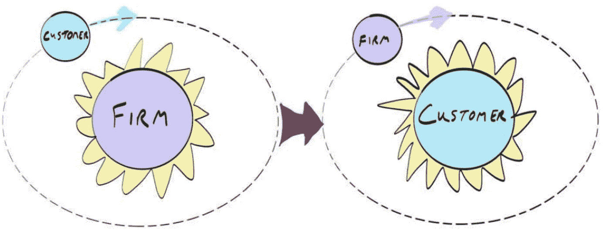
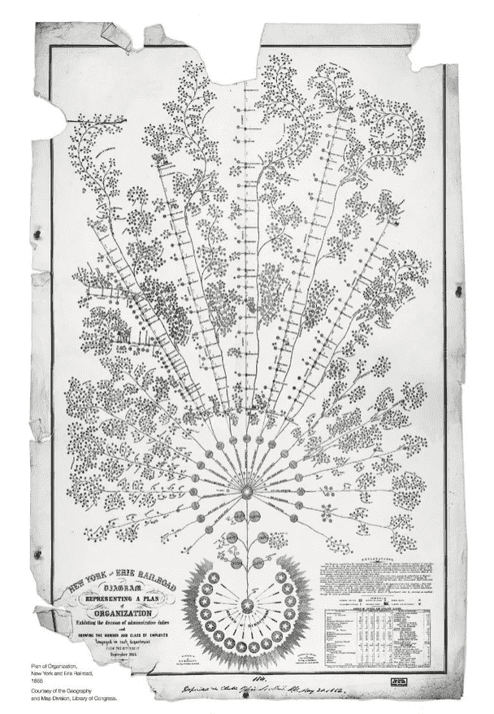
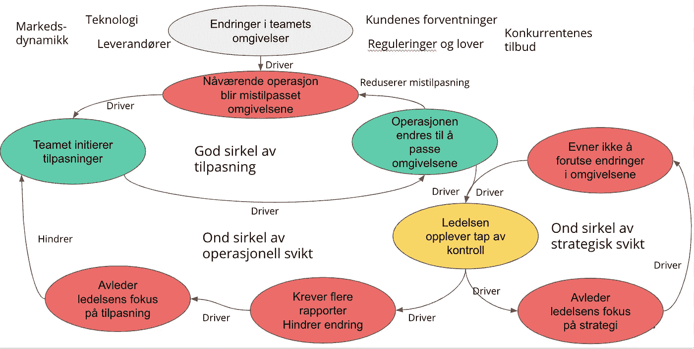
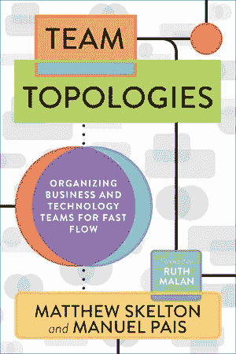
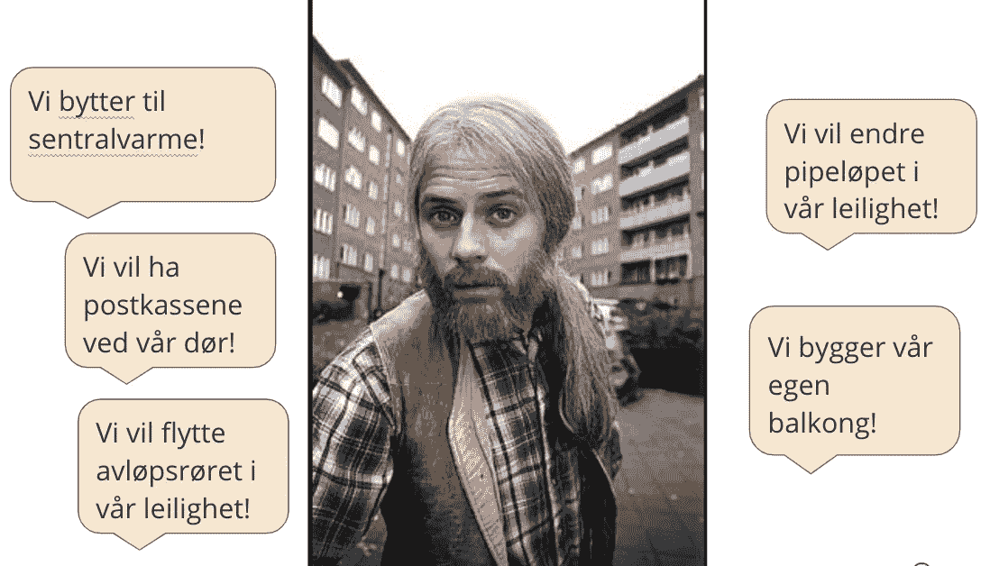

# Autonome team — hvorfor det?

> 原文：<https://medium.com/compendium/autonome-team-hvorfor-det-fa428ffad0e?source=collection_archive---------1----------------------->

*Lurer du på om en organisering i autonome team er verdt å prøve? Hvilke problemer er egentlig autonome team et svar på? Hvilke forutsetninger finnes for at autonome team skal fungere? Er det bare å kjøre på? Kanskje er dere allerede i gang…?*

> **“Work and organizations should be about people creating value for other people”**
> 
> World Agility Forum, 26–27\. sept. 2020

Hva er den beste måten å oppnå resultater på i organisasjoner i verden anno 2020? Det spørsmålet var nettopp tema for en stor online konferanse kalt *World Agility Forum* . Svaret på det henger sammen med vårt syn på hva hele hensikten med arbeidet i en organisasjon er.

Vi opplever et verdisyn i endring: I manges øyne har hensikten med en bedrift inntil nylig vært *å produsere overskudd for eierne.* Peter Drucker prøvde å endre dette ved å postulere at: *The purpose of business is to create a customer!* Det handler om at mennesker skaper verdi for andre mennesker.

Agile har også endret vårt syn på *ledelse* og hvordan ledelse utøves. Hva er ledelsens rolle? Det har beveget seg fra kommando og kontroll til visjonsbygger og tjenende lederskap. Fra at organisasjonen er til for å tjene eiernes interesser og øke aksjeverdi og profitt, til at profitt mer blir sett på som et resultat av at man har satt kundene i sentrum og skapt noe verdifullt for dem.

Akkurat som den kopernikanske revolusjonen innen astronomi førte til at man stilte spørsmålstegn ved datidens samfunnsorden der konger og prester ledet samfunnet i kraft av guddommelig forordning, har den *kopernikanske revolusjonen innen ledelse* satt spørsmål ved de store byråkratiene som regjerer i dagens samfunn. I de organisasjonene som oppstår nå er det lite behov for sjefer og papirskyflere, men et desto større behov for ledere som kan inspirere selvorganiserende team, nettverk og økosystemer til å respondere på skiftende kundebehov.

Bilde: Jason Schreuder, 2018

De bedriftene som er bygget rundt et *innenfra-og-ut* mindset, som pusher ut produkter og tjenester basert på hva som passer best sett fra bedriftens ståsted, er mindre motstandsdyktige i skiftende tider enn bedrifter som er organisert rundt en *utenfra-og-inn* mindset som starter med markedet og satser på å levere kreativt på de mulighetene som oppstår etterhvert. Utenfra-og-inn orientering maksimerer kundeverdi og leder til mer smidige organisasjoner.

Hvordan vi organiserer virksomheten og teamene er en del av en større trend som egentlig stiller det samme spørsmålet rundt *alle* organisatoriske strukturer og prosesser, fra strategi til møtekultur: Hva er den beste måten å oppnå resultater på i organisasjoner i verden anno 2020? Hvordan bør en organisasjons **operativsystem** skrus sammen og fungere? Ikke minst fordi *digital transformasjon* av bedriftene gjør det nødvendig å ta alt opp til en dypere vurdering enn hva vi kanskje ellers ville gjort.

Det er ledelsens jobb å legge bedriftens operativsystem til rette. Hvis ledelsen ikke kjenner sin besøkelsestid og er på ballen her, vil inspirerte medarbeidere bli utålmodige og ta skjeen i egen hånd. Dette ser vi mange eksempler på — endringene starter ikke fra toppen og ned, de starter et sted midt i organisasjonen og brer seg utover. Ofte fra IT-utviklingsdelen av en organisasjon, som har operert etter smidige prinsipper i mange år og kjent på at samspillet med resten av organisasjonen knaker i sammenføyningene.

# Hva er et team og hva er et autonomt team?

For å operere som et *ekte* team må to ting være oppfylt: vi må **arbeide mot samme mål** og vi må **være avhengige av hverandre** for å nå det.

I og med at teammedlemmene er “avhengig av hverandre” ligger det i kortene at ikke alle har samme kompetanse og faglige bakgrunn. Alle ferdigheter som trengs for å ta avgjørelser og utføre jobben i det daglige bør være samlet i teamet.

I dette ligger en erkjennelse av at teknologisk gjennomføringsevne ikke ligger i hvilke prosesser, maler, dokumentasjon, kode eller infrastruktur du har på plass. Gjennomføringsevne eksisterer og vokser **i et team** .

Mange problemer bunner i at det vi kaller team ikke i realiteten *er* et team. For hva skjer hvis de ulike medlemmene i et produktteam tar fatt på veldig ulike oppgaver i samme sprint og bare jobber hver for seg? Hva skjer hvis en sprint bare er en samling tasks som skal være ferdige til en dato uten noe felles sprintmål? Før du satser på *autonome* team — sørg for at folk faktisk kan jobbe som *team.*

# Motivasjonen bak autonome team

Er dette en ny ide? Neida: allerede på 1800-tallet var Erie Railroad et suksessrikt men dårlig organisert selskap med ansvar for godstransport i det nordøstre USA. De hadde over 500 miles med spor og var et av datidens største. Dette var bra for business, men dårlig for organisering.

Dette blomsteraktige organisasjonskartet ble skapt av selskapets operative leder for å effektivt levere kritisk informasjon og delegere oppgaver til riktig person. I stedet for en top-down struktur sprer kartet seg oppover som fra røttene i et tre. Makten var sentralisert hos presidenten og styret som et ankerpunkt, men mye av det daglige ansvaret for jernbanesporene var distribuert til oppsynsfolk på lavere nivå. Rasjonalet bak dette var at de innehar best operative data, sitter nærmere der det foregår og er dermed best egnet til å håndtere de problemene og ineffektiviteten som oppstår.

Man flyttet beslutnings-myndighet *ut* dit informasjonen fantes.

Hierarkisk byråkrati er det motsatte. Her sitter beslutningsmakten på toppen, og informasjonen som trengs for å fatte en beslutning må flytte seg fra der den innhentes og opp dit den trengs. Og ofte utvannes og forenkles den veldig på veien opp dit, fordi ledelsen rett og slett har begrenset båndbredde. Byråkratiet er effektivt for lik håndtering av en serie like hendelser, og det lever og fungerer under forutsetning av at oppgavene det skal løse i stor grad kan forutsees og planlegges for.

Men hva skjer når forutsetningene endres? Når mengden og tempoet i endringer bare øker og øker? World Agility forum konkluderte konferansen med:

> Agile is now the norm. Top-down bureaucracy needs to be seen as an exception to the normal way of getting work done.” — Steve Denning

# Kompleksiteten øker

Alle organisasjoner må matche økt kompleksitet i omgivelsene med økt operasjonell kompleksitet internt. Dette kan ta former som mer skreddersøm og brukertilpasning, hyppigere endringer, flere kanaler for kundesupport, diversifisering, økt innovasjonstakt osv.

Økt kompleksitet på utsiden gir økt kompleksitet på innsiden. Sagt med Ashbys lov: *Only variety can absorb variety* . Økt **operasjonell** kompleksitet i en organisasjon må videre matches av **ledelsens kapasitet til å håndtere den.** Antall aktiviteter som må koordineres øker. Hyppigheten og kompleksiteten av beslutninger som må tas øker. Men du kan ikke bare fortsette å øke kompleksiteten i ledelsen eller øke antallet ledere. Så hvordan håndterer du det?

1.  Autonome operasjonelle team håndterer dette ved å **styre seg selv** — autonomi *sprer kontrollen og setter organisasjonen i stand til å håndtere økt kompleksitet.*
2.  …ved at de som sitter nærmest **et problem** (tettest på brukerne) og har mest informasjon om det — også blir gitt ansvar og myndighet til å løse det og drive den videre utviklingen på området.

Men merk at behovet for koordinering forsvinner ikke: Teamene må fortsatt klare å koordinere sin aktivitet mot hverandre, mot omgivelsene og organisasjonens mål.

# Beslutningsmyndighet og reaksjonsevne

Autonomi består i å flytte **beslutningsmyndighet** inn i teamene. Hvorfor er dette så viktig?

Nye muligheter blir som regel *mindre* verdifulle hvis du venter med å utnytte dem, likedan blir hindringer ofte *større* hvis du venter med å håndtere dem. Hvis du skal ta en beslutning som utnytter en mulighet vil verdien av den avta jo lenger tid det går. Likeledes, hvis du må ta en beslutning for å redusere risiko vil verdien avta jo lenger tid det går.

Hastighet er essensielt!

Hvis de fleste muligheter og hindringer først kommer til syne for de som sitter på såkalt laveste nivå i organisasjonen, eller nærmest kundene/markedet, så bør dette nivået være i stand til å ta disse beslutningene. Dette taler for å desentralisere kontroll.

Vi trenger kortreiste beslutninger! Nærhet til der det skjer!
Dette betinger at informasjonen finnes der beslutningene tas.

US Marines antar at enhver initiell plan er basert på ufullstendige og feilaktige data, hva enn de hadde tilgjengelig da planene ble lagt. De vet at fienden aktivt vil endre sin oppførsel som respons på hvordan kampen utfolder seg og at ny informasjon konstant blir tilgjengelig i løpet av kampen.

De innser at ny informasjon **først** blir synlig for dem som opererer i frontlinjen. Siden de skaper et overtak ved å reagere raskt, dytter de kontroll ned til troppene i frontlinjen, og trener dem til å opptre autonomt. De ville blitt forbauset over måten vi i prosjektdrevet produktutvikling har forsøkt å hanskes med usikkerhet på, ved å bruke stadig mer detaljerte planer og mer sentralisert kontroll.

Det betyr ikke at 100% desentralisering er løsningen for alt! Her unngår US Marines å falle i den andre grøfta: I stedet fokuserer de på desentralisert **eksekvering** støttet av **sentralisert koordinering.** Hvordan balanserer vi sentralisering og desentralisering best? Prinsippet er:

*   Desentraliser kontroll for utfordringer og muligheter som ikke tåler å bli gamle og krever rask reaksjon — et godt eksempel er BRANN
*   Sentraliser kontroll for utfordringer som opptrer sporadisk, er store eller har vesentlige stordriftsfordeler

# Usikkerhet og kontroll

Det motsatte av kontroll er usikkerhet. Vi mennesker har en iboende aversjon mot usikkerhet og forsøker å unngå den ved å skaffe oss kontroll. Dette gjelder alle mennesker, også ledelsen i en organisasjon. Dette ønsket om kontroll kan gi seg utslag i handlinger fra ledelsen som undergraver autonomi og reaksjonsevne. Det fører til et dilemma kjent som *kontrolldilemmaet* som er forsøkt illustrert under:

Tilpasset fra Patrick Hoverstadt: The Fractal Organization, 2008

Forskningsprosjektet A-team i regi av SINTEF fant at Autonome team krever en annen type ledelse, og en hypotese vi har er at mange ledere blir usikre på hva de skal gjøre og hvordan de skal lede sine team når de går fra klassisk prosjektstyring og rapportering til å bruke autonome team.

Når vi desentraliserer kontroll er det avgjørende hvordan vi håndterer den gule boblen: “Ledelsen opplever tap av kontroll” og at vi ikke tolker det som at ledelsen er redd for å miste makt og posisjon eller at ledelsen motsetter seg all endring.

Hvordan løser organisasjonen dette — hvordan skal lederne våge å delegere mer av kontrollen nedover i organisasjonen, til teamene som er tettest på endringene i kundebehov, teknologi og marked? “Dere må bare ha tillit” — er mantraet fra mange smidige team, bare ha tillit til at vi fikser det. Men er tillit noe man bare kan bestemme seg for å ha, og fortjener alle team nødvendigvis dette uten videre?

Tillit bygges over tid. Og faste varige team er et grep som er med på å bygge kompetanse, mestringsevne og tillit internt i teamet, som gjør at de presterer høyt og som igjen gjør at ledelsen tør å slippe kontrollen og kan konsentrere seg om å tilrettelegge og stake ut kursen videre.

# Autonome team og produktorganisering

Flere og flere produkter og tjenester er i bunn og grunn software eller svært avhengig av software. Og den eneste softwaren som ikke trenger endringer og vedlikehold er den som aldri blir brukt…

Det gir ingen mening å organisere utvikling av produkter som kommer til å kreve varig vedlikehold gjennom hele sin levetid i kortlivede prosjekter. Faste produktteam har derfor inntatt førsteplassen i valget av organisering i oppegående softwareutviklingsorganisasjoner.

Softwareutvikling er ikke en produksjonsprosess eller fabrikk der man pøser ut implementerte user stories. Du lager ikke samme software to ganger av den enkle grunn at software rett og slett kan kopieres uten kostnad. Softwareutvikling er en ***produktutviklingssprosess*** , der vi finner opp og lager nye ting for første gang. Det foregår utrolig mye læring i softwareteam, og det gir ingen mening å løse opp teamet og innsette nye folk til å forvalte og videreutvikle det som er skapt.

Så vi ønsker å organisere autonome faste team rundt *produkter* **, dvs. noe som gir verdi for en kunde** . Det reiser spørsmålet: hva er produktet? Er det et fysisk produkt og tjenestene rundt det? Er det en kundereise? Er det en verdikjede? Hvor går produktgrensene? Hvor stort er produktet? Hvor mange av prosessene relatert til produktet skal teamet ha ansvaret for? Utvikling? Arkitektur? Innovasjon? Leveranse og support? Markedsføring? Salg?

Ender vi opp med mange verdikjeder som henger sammen? Må vi ha mange team for samme produkt? Og hvordan koordinerer vi det? Dette er ikke helt trivielt. Og vi kan ikke bare gå over til autonome team uten samtidig å tenke på dette.

Produkt- og tjenesteinndeling starter med hva vi gjør for brukerne — effekten vi skaper (outcome) — Her må man ofte tenke nytt for å få til en god organisering. Hvilke effekter ønsker vi å skape hos brukerne av organisasjonens tjenester og produkter, og hvordan bør dette deles inn for å fasilitere autonomi i teamene?

Det vi ønsker oss er stabile team som er innrettet etter forretningsbehov og kapabiliteter med fokus på hvilken **effekt** de skal skape (mål eller outcome, ikke output eller en bestemt løsning).

Hvis et team, for å få utført en oppgave i backloggen sin, er avhengig av å opprette korresponderende saker hos et annet team eller koordinere med mange, vil produktiviteten og responstiden lide enormt. Sakene vil henge sammen i en kjede gjennom organisasjonen og hver av dem prioriteres etter sitt eget system. Oppgaver blir blokkert av andre oppgaver.

Undersøkelser har vist at saker bruker 10–12 ganger så lang tid på å bli løst hvis teamet er avhengig av at noe fikses av et annet team, sammenlignet med hvis de kan fullføre dem på egen hånd. Avhengigheter har stor betydning.

Det er ikke en triviell oppgave å trekke opp grenser rundt tjenester og applikasjoner i en virksomhet slik at man kan fordele dem til team. Eksisterende monolittiske applikasjoner er bare *en* hindring man kan støte på. **Å dele opp etter en eller annen ønsket effekt eller forretningskapabilitet** er en god rettesnor. Dette må også helst være en **målbar** effekt for at teamet skal kunne styre etter feedbacken de får.

Det er mange mulige måter å løse god produktinndeling og god teaminndeling på. Team Topologies er en bok jeg anbefaler alle som kommer borti dette å lese. Den gir noen forslag til ulike typer team og ansvarsfordeling og er et redskap som kan brukes til å sortere i kompleksiteten.

Produkter er sjelden så små og enkle at ett team på 7–10 personer kan håndtere alt dette alene. Vi ender opp med flere team som vi på en eller annen måte må få til å gå i takt i samme retning og ikke bare gjøre det de selv har mest lyst til…

# Autonomi og alignment

I en stor organisasjon er det mange team som alle er del av noe større. Hvilke rammer skal teamene ha, hvor stramme skal de være, hvilken form skal de ha?

Alle team kan ikke sette sine egne rammer — vi trenger et organ til å koordinere og peke ut retning og mål. Autonome team betyr ikke at vi avskaffer ledelse.

Tight — Loose — Tight er en måte å fremstille dette på: visjon, mål og retning må tydelig kommuniseres og alle må innrette seg etter disse (tight). Hvordan teamet jobber og hva slags form løsningen tar har teamet kontroll over (loose), men hvilken verdi og kvalitet som skal leveres til slutt er tydelig fastsatt på organisasjonsnivå (tight). Ledelsen må evne å være tydelig på de to ytterste punktene og se det som sin viktigste jobb!

**Det kanskje aller hyppigste spørsmålet er: hva kan teamene bestemme selv og hva må være del av et felles fundament? Betyr selvbestemmelse anarki?**

Hvis en organisasjon er som et borettslag der hver leilighet eies av et team, betyr ikke *selveierleilighet* at du kan gjøre akkurat hva du vil:

De fleste team er enige i at det er noen ting som er del av et felles fundament som alle team deler. Hvis et team ønsker å endre noe som ledelsen anser som et felles fundament koker det ned til en avveining: i dette tilfellet mellom teamets autonomi og gevinstene ved fellesløsninger.

Gode prinsipper og beslutningsregler som veileder teamene her er nødvendig, hvis det oppstår vag eller ulik forståelse av dette risikerer vi suboptimalisering: ett team gjør det som passer best for dem i deres situasjon uten å ta høyde for at det skader organisasjonen eller kundene som helhet.

Det vil f.eks. være svært uvanlig for ett team å velge sitt eget konfigurasjonsstyringsverktøy. Hvis man har standardisert på GitHub så er dette vanligvis ansett å være en del av det felles fundamentet. Selv om ett team har sterk preferanse for et annet verktøy vil totalkostnaden for hele organisasjonen langt overstige gevinstene for det ene teamet.

For en bedrift som helhet er det nødvendig med et felles fundament og enkelte felles løsninger som alle må forholde seg til. I hvor stor grad man skal kreve bruk av fellesløsninger versus å gi teamene autonomi avhenger av flere faktorer, som blant annet teamenes ferdighetsnivå, viktigheten av fart og integrasjon på tvers i selskapet, i hvilken del av teknologistacken man bedriver mest innovasjon, selskapets størrelse, geografiske spredning og kultur samt hvor moden og anvendelig den felles plattformen faktisk er.

Som organisasjon trenger vi felles forståelse for hvor vi skal, hvordan vi skal komme dit, hvordan vi vet at vi er på riktig vei og vi må sikre at ikke enkeltinitiativer går på bekostning av helhetens interesser. Å sikre en felles retning og måte å håndtere tingene på er et ledelsesansvar og det finnes mange mekanismer som kan tas i bruk:

*   **Prinsipper** som “Don´t f & $#k the customer!”
*   **Beslutningsregler:** “en arkitekturendring som øker ytelsen med minst 20% kan fritt gjennomføres hvis den tar mindre enn 750 timer”
*   **Økonomisk forståelse:** Cost of Delay, Total Lifecycle value, budsjett
*   **Felles visjon**
*   **OKRs** (objectives and key results) med målbare indikatorer
*   **Team Topology** — ansvarsområder og samhandlingsmekanismer
*   **Mission orders / “Commander´s intent” fra militær praksis:** tydeliggjør hva ledelsens intensjon er, og la teamene være kreative med hensyn til hvordan de løser oppgaven.

de fleste utfordringene lar seg LSE-og husk:ta teamene med pls ningen！在第一次去 tt 的时候，他被带到了一个陌生的地方…

> 正如 16 世纪和 17 世纪当权者的共同努力无法阻止哥白尼天文学革命的进程一样，今天的大型等级官僚机构尽管看似全能，但最终将屈服于更好的组织运营理念的力量——对客户、员工、经理、社会和组织及其投资者更好。
> 
> 史蒂夫·丹宁。《福布斯杂志:管理中的哥白尼革命》