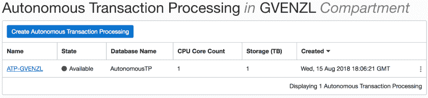

# 自治数据库:创建自治事务处理实例

> 原文：<https://medium.com/oracledevs/autonomous-database-creating-an-autonomous-transaction-processing-instance-f1d0e516bedc?source=collection_archive---------0----------------------->

在这篇文章中，我将展示如何快速简单地创建一个[自主事务处理](https://cloud.oracle.com/en_US/atp)，简称 ATP，Oracle 的[自主数据库云服务](https://www.oracle.com/database/autonomous-database/think-autonomous.html)的实例。Oracle 的 ATP 于 2018 年 8 月 7 日推出，是 Oracle 自治数据库的通用版本。我的同事 [SQLMaria](https://twitter.com/sqlmaria) (又名玛利亚·科尔根😉)已经很好地解释了自治事务处理和自治数据仓库服务之间的区别。她还写了另一篇关于[Oracle 自主事务处理](https://sqlmaria.com/2018/08/07/what-you-can-expect-from-oracle-autonomous-transaction-processing/)的文章。我强烈建议先阅读她的两篇文章，以便更好地理解这些产品。

最后但同样重要的是，您可以通过 [**Oracle 免费云试用**](https://cloud.oracle.com/tryit?source=:ex:tb:::RC_WWMK180406P00002:MediumOracleDevs&SC=:ex:tb:::RC_WWMK180406P00002:MediumOracleDevs&pcode=WWMK180406P00002) 亲自试用 ATP。

现在让我们开始吧。如上所述，提供 ATP 服务既快速又简单。

# TL；博士；医生

要创建实例，您只需遵循以下三个简单步骤:

1.  登录 [Oracle 云控制台](https://console.us-ashburn-1.oraclecloud.com/)，从菜单中选择*自主事务处理*。
2.  点击*创建自主交易处理*
3.  指定名称、CPU 和存储量、管理员密码并点击"*创建自主事务处理*

# 创建 ATP 实例

为了创建 ATP 环境，您首先必须登录到 [Oracle 云控制台](https://console.us-ashburn-1.oraclecloud.com/)。从那里，点击左上方的菜单并选择“*自主事务处理*”。

在下一个屏幕上，您将看到您所有的 ATP 数据库，在我的例子中没有，因为我还没有创建任何数据库。点击*创建自主事务处理*按钮。

将打开一个新窗口，询问您显示器和数据库名称、CPU 数量和存储容量，以及管理员密码和使用许可证。

创建数据库服务后，您将在云控制台中看到显示名称。数据库名称是您稍后将从应用程序连接到的数据库本身的名称。两者可以使用相同的名称，也可以使用不同的名称。在我的例子中，我将为数据库和服务使用不同的名称。

最小 CPU 和存储计数是 1，这就是我想要的。不要忘记**扩展 CPU 和/或存储与 Oracle 自治数据库完全在线，并且对应用程序透明。**因此，即使您还不知道您到底需要多少 CPU 或 TB 的存储，您也可以在不停机的情况下随时更改！

接下来，您必须为`admin`用户指定密码。

`admin`用户是具有管理权限的数据库用户，允许您创建其他用户并执行各种其他任务。

最后但同样重要的是，您必须选择想要使用的许可模式。

您可以选择自带许可证，即“*我的组织已经拥有 Oracle 数据库软件许可证*”，有时也称为“ *BYOL* ”或“*自带许可证*”，这意味着您已经有一些未使用的 Oracle 数据库许可证，您希望将其重新用于您的自主事务处理实例。如果您希望将本地数据库迁移到云中，并且希望利用您过去已经购买了 Oracle 数据库许可证这一事实，通常会这样做。

另一个选项是订阅新的 Oracle 数据库软件许可证，作为资源调配的一部分。如果您想要一个不替换现有数据库的新数据库云服务，通常会使用此选项。

一旦做出选择，就该点击“*创建自治事务处理*”了。

现在正在设置您的数据库。

一旦状态变为*绿色—可用*，您的数据库就启动并运行了。

单击服务名称将为您提供进一步的详细信息。

恭喜，您刚刚创建了您的第一个自主事务处理数据库云服务。确保您还查看了[自主事务处理文档](https://docs.oracle.com/en/cloud/paas/atp-cloud/index.html)。

*原载于 2018 年 8 月 28 日*[*geraldonit.com*](https://geraldonit.com/2018/08/28/autonomous-database-creating-an-autonomous-transaction-processing-instance/)*。*