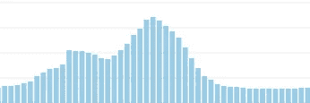

# 基于请求队列的自动缩放

> 原文：<https://medium.com/square-corner-blog/autoscaling-based-on-request-queuing-c4c0f57f860f?source=collection_archive---------2----------------------->

> 注意，我们已经行动了！如果您想继续了解 Square 的最新技术内容，请访问我们的新家[https://developer.squareup.com/blog](https://developer.squareup.com/blog)

现代 web 开发通常包括流量大的 web 应用程序和 API。这些服务的任务是双重的:它们需要能够做大量的*工作，并且能够处理大量的请求。例如，一个应用程序可以负责用户认证、请求路由、视图呈现(HTML 和 JSON)、业务逻辑以及从永久数据存储中访问数据[1]。能够做到这一点并响应高水平的负载是一个很大的问题。试图做到这两者的应用程序本身无法很好地扩展，作为一个行业，我们已经找到了一些方法来解决这一挑战。*

我们首先使用的工具是通过硬件来解决问题。在相对较小的规模下，向正在工作的服务器添加更多的资源(即添加更多的 CPU、RAM 或磁盘空间)比横向扩展(我们稍后将讨论)更便宜。这可以称为“纵向扩展”或“大铁”。这是 Caviar 第一次解决我们的缩放问题的方式(实际上，对于某些应用程序，我们仍然这样做)。

以这种方式扩展是对问题的两阶段攻击，1)添加更多资源或 2)更有效地使用这些资源。更有效地使用资源意味着实际上不改变机器上的资源数量，而是使用线程和并行化等技术来充分利用它们。这也可能意味着转换到其他使用模式..例如使用基于事件的程序，而不是让 I/O 块使用线程，并最终使用底层资源。但是，最终您会耗尽优化空间，需要添加硬件。然而，添加更好、更快、更大的硬件只能让你做到这一步。在某种程度上，硬件变得越来越昂贵，因为所需的需求超出了商用硬件的能力。

另一种方法是使用水平缩放。我们增加了更多的服务器，而不是给单个服务器增加 CPU、RAM 和磁盘空间。这些服务器通常配备了中档商用硬件，并且极具成本效益。有了这些服务器，您可以将相同的服务放在两个或更多的服务器上，并在每个服务器上分发请求。这里有几个含义。首先，所有状态都必须存储在一个集中的数据存储中，比如数据库[2]。第二，在这种设置下，您可以有效地扩展到无限大小，根据需要添加任意多的商用硬件服务器。

云计算兴起的一大好处是他们非常擅长横向扩展。几乎默认情况下，现代 web 应用程序使用这些云服务提供的集中式数据存储。像亚马逊和谷歌这样的云服务提供商已经创建了分配请求的负载平衡设备。这些负载平衡器处理一些困难的、不明显的障碍，如服务注册、健康检查和连接排出。云计算提供商可以在几分钟内添加或删除资源。这使我们能够非常快速地扩大规模以满足客户需求，并且随着我们对资源的需求越来越少，我们也可以停止使用资源。

将水平扩展付诸实践有多种方式，最简单的开始方式之一是过度供应。我们通过找到服务的峰值使用量来实现这一点，并且至少将我们的服务器数量扩展到能够处理该负载量的规模。这可能会有一些挑战。例如，鱼子酱在一天中会经历不对称的负荷。可以想象，对于一个订餐服务来说，午餐和晚餐是我们的高峰期。这是来自我们的一个服务的负载概况，在过去的 3 年中保持了惊人的相似。

通过计算水平网格线可以看出，我们的峰值负载大约是这个特定服务的最小负载的 5 倍(在边缘附近可以看到)。这意味着在非高峰负载的所有时间里，都有资源处于闲置状态。这既浪费又脆弱。如果你有一个特别的促销活动，你的供应可能不够，你必须增加你的资源。如果你没有很好地预料到这一点，你就有可能让你的系统超载，并让网站因负载而关闭。

另一种方法是根据您的负载进行扩展。这解决了过度供应场景中遇到的两个问题。首先，您的系统是动态的，并且一直在响应变化，因此处理负载的意外增加应该没有问题。第二，您可以将您的资源供应配置文件与您的负载配置文件相匹配，并在这些资源上节省时间和金钱。但是，您需要决定如何自动扩展您的服务。目前还没有很多关于不同方法的信息，但是我会讲两个例子和 Caviar 的经验。

我们在 Caviar 使用的第一种方法，也是我以前使用的方法，是使用服务的响应时间作为服务负载概况的指标。当我们有一个单一的整体式 Rails 服务时，我们使用了这种方法，这个服务有数百个不同的端点，每个端点都有不同的预期响应时间。这种方法让我们很难了解服务的真实健康状况。如果我们在一直调用我们的 fast API 端点上进行备份，它通常会被调用频率较低的响应时间较长的端点所掩盖。这使得扩展变得不可预测，并且没有实现我们的最终目标，即拥有足够的资源来及时满足每个用户的请求。

我们使用请求队列切换到另一种方法。这里有一点细微差别，我们随着时间的推移发展了我们的方法，所以我将解释我们接近它们的每种方法之间的差异以及我们目前所处的位置。我们已经尝试了不同的测量请求队列的方法，并最终找到了一个我们认为运行良好的系统。

我们首先使用请求队列的粗略近似值，计算从负载均衡器(在本例中，它是 Amazon 的 ELB)到机架堆栈的第一部分所需的时间。由于 ELB 没有提供添加到请求中的时间戳头(这可以在 nginx 中实现)，我们需要通过来自 ELB 和 Rack 的报告指标为每个请求计算时间戳头。这比使用响应时间要好，因为它让我们了解每个请求等待服务器为新请求提供服务的时间。这将发生在每个端点上，我们可以测量所有端点上的近似请求排队时间，而与它们的最终响应时间无关。这样做的缺点是有点不可靠(很难完美匹配所有数据，因此我们可能会丢失数据或错误地报告数据)，并且依赖于网络堆栈等其他变量。网络堆栈为我们的计算增加了一个相对稳定但不总是可预测的开销成本。因此，我们的请求排队指标永远不会下降到 0，因为 ELB 总是需要一些时间来处理请求，如果需要的话卸载 SSL，并将请求路由到等待请求的服务器。一般来说，我们可以解决这个问题，但我们找到了另一种方法来解决这个问题。

我们意识到我们真正想知道的是在我们的 Rails 应用程序中是否有任何东西在排队。我们使用 puma 作为我们的 web 应用程序服务器，它有一系列的优点，我们可以在以后的时间里继续使用，但其中之一是它允许我们在任何给定的时间检查队列长度。在启动时，我们启动一个新线程，它将在循环的基础上向我们的指标收集器(在我们的例子中是 CloudWatch)报告统计数据。每隔 30 秒，我们查询 puma 主进程以获取每个工作线程的统计数据，包括工作线程的数量和当前的积压(队列)计数。我们将这些指标报告给我们的指标收集器。然后，我们汇总所有正在运行的服务的队列，以了解我们的备份情况。如果我们持续备份一段时间，我们会添加服务来清除该队列。如果我们在更长的一段时间内是空闲的，我们从堆栈中删除服务(在某种程度上，我们总是有至少 3 个冗余)。该系统使我们能够更快、更清晰地响应我们的生产负荷。此外，同样的缩放系统对后台工作人员的作用完全相同。我们不使用 puma 队列，而是使用 Sidekiq 队列，并在类似的参数上扩展。

这个系统还有待改进，但今天我们对整体设置相当满意。这种设置的主要问题是，由于排队是我们用来响应自动扩展和缩减的唯一指标，因此不存在“稳定状态”,我们会不断地调配不足/过度调配，并更改我们正在运行的服务数量。我们将继续调整系统，以便为我们未来的发展找到正确的平衡。

总的来说，使用请求队列作为我们服务扩展的输入使我们对自己响应变化的能力充满信心。一年多来，我们一直在运行某种形式的基于请求队列的自动伸缩，这种努力绝对是值得的。最后，我想删除一个[示例 GitHub 存储库](https://github.com/hammerdr/sample-autoscaling)，它有一个 puma web 服务器，向 AWS CloudWatch 报告指标作为起点。一旦你到达那里，它是所有关于创建警报和自动缩放，我已经包括了一些例子 CloudFormation 模板如何做那部分。最后，如果你有一个大规模的 web 系统需要响应可变的流量，那么我会推荐基于请求队列的自动伸缩。

[1]还有其他有趣的架构方法来减轻负载，而不是依靠服务器来做这么多工作。这包括单页应用程序(spa)和静态预生成的网站。我有兴趣在后面探索这些主题，但是在这篇文章中，我们将关注更经典的 web 应用程序。

[2]这实际上通常不是问题。大多数现代 web 栈都是从数据库开始的，作为引导步骤的一部分。其他要考虑的是缓存、上传的文件等。缓存可以卸载到 memcached 之类的缓存存储中，文件可以存储在 S3 之类的文件存储库中。

[3]我不能/不会谈论“全球范围”理论上，这些技术是可行的，但我从未在那些环境中测试过。