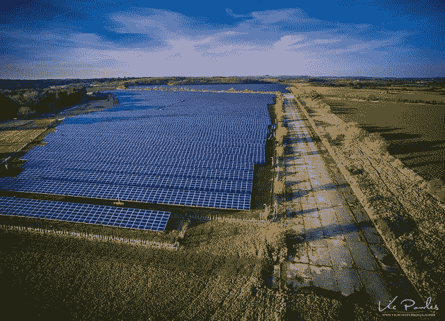

# Oracle 云中的自动扩展和作为负载生成器的 OKE (Oracle 容器引擎)

> 原文：<https://medium.com/oracledevs/autoscaling-in-oracle-cloud-and-oke-oracle-container-engine-as-load-generator-2e9ccb44b44?source=collection_archive---------0----------------------->

Source: [https://www.flickr.com/photos/vicpowles/38654098810/](https://www.flickr.com/photos/vicpowles/38654098810/)

在本帖中，我们将探讨 Oracle Cloud 中的自动伸缩。[出自马嘴](https://docs.cloud.oracle.com/iaas/Content/Compute/Tasks/autoscalinginstancepools.htm):

> 自动扩展使您能够根据性能指标(如 CPU 利用率)自动调整实例池中的计算实例数量。这有助于您在高…