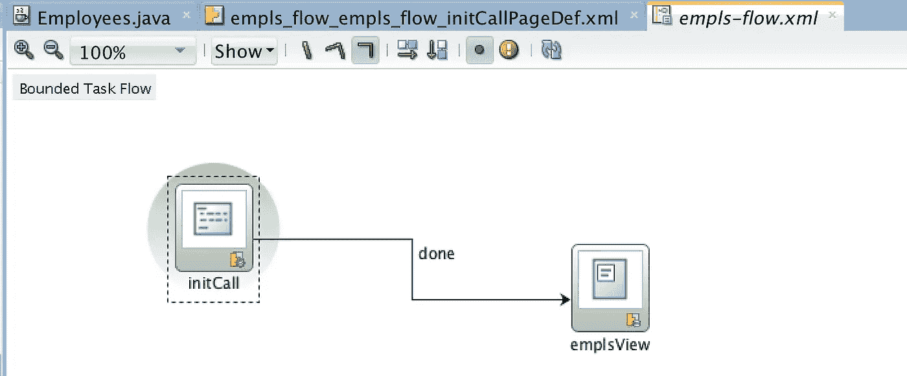
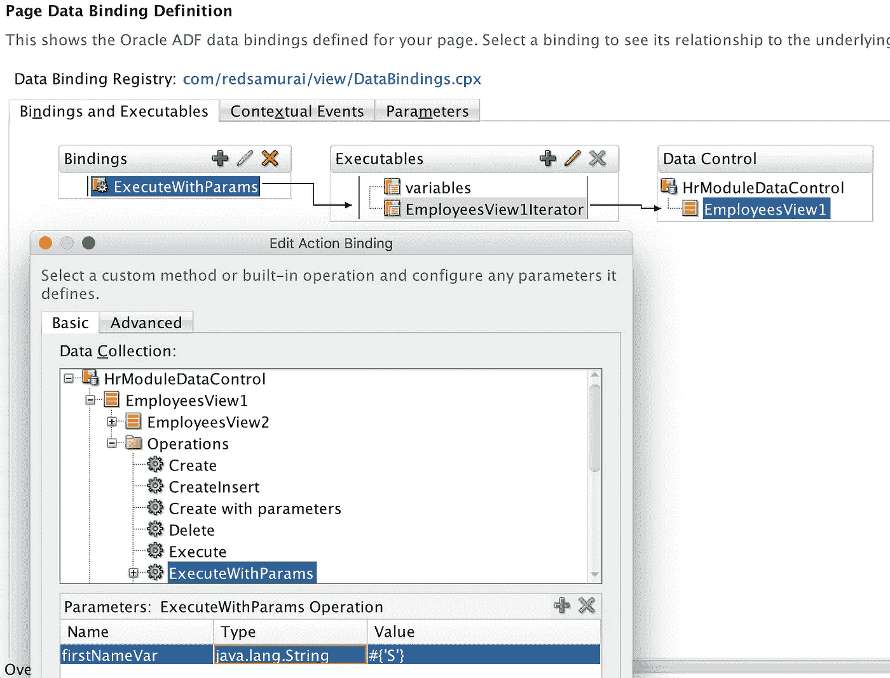
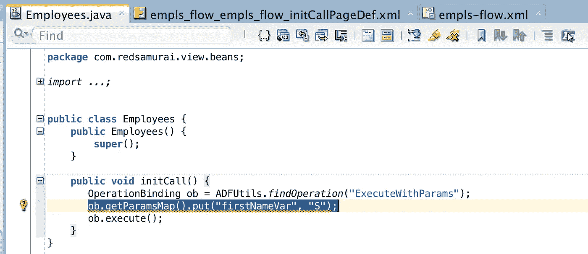
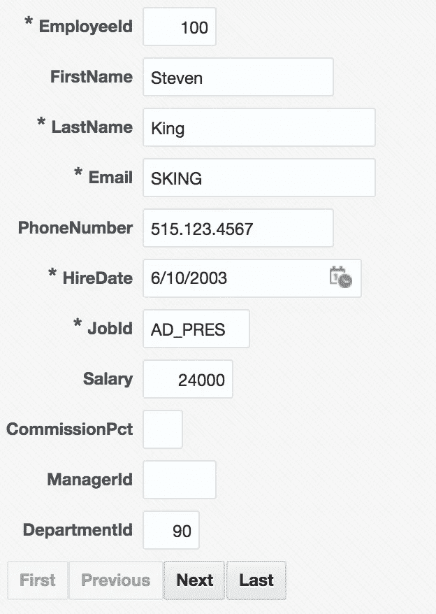
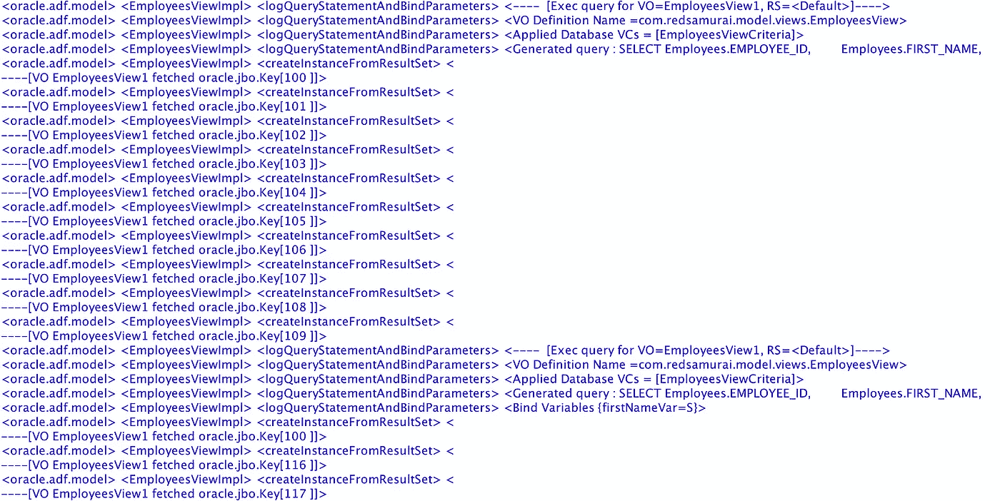
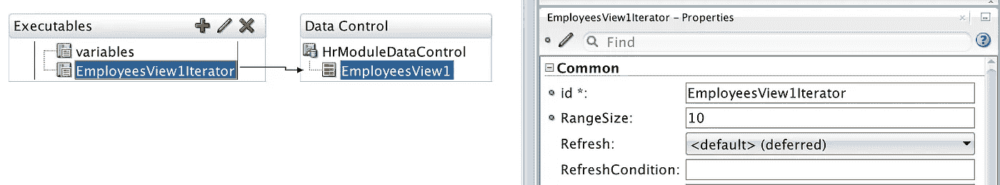
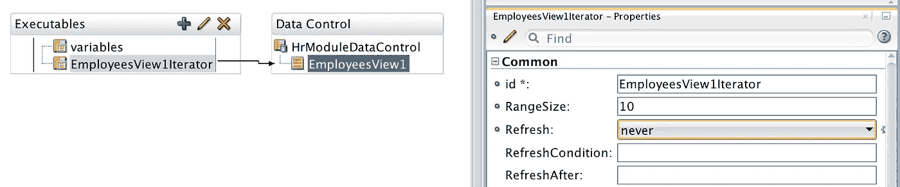
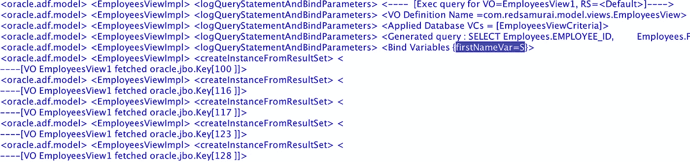

# 避免 ADF 任务流方法的盲目 SQL 调用

> 原文：<https://medium.com/oracledevs/avoid-blind-sql-call-from-adf-task-flow-method-68ae154260f?source=collection_archive---------0----------------------->

密切关注 ADF 任务流方法调用活动，其中调用了来自 ADF 绑定的方法。JDEV 12c 为与 TF 方法调用活动相关的 ADF 绑定迭代器设置了延迟刷新，这会导致执行盲目 SQL。盲 SQL —没有绑定变量的查询。

我来解释一下用例，这样会更清楚我在说什么。

常见示例—准备数据的 TF 初始化方法调用。通常，这涉及到使用绑定变量的 VO 执行:

这种方法调用可以直接调用绑定操作(注意，绑定变量值已设置):

或者通过使用 API 的 Java bean 方法:

我的示例在调用 TF 方法调用后，在片段中呈现基本的 UI 表单:

如果您记录在表单呈现期间执行的 SQL 查询，您将看到两个查询，而不是预期的一个。第一个查询在没有绑定变量的情况下执行，而第二个查询获得正确的绑定变量分配:

第一次查询没有绑定变量的原因是什么？结果是——用 TF 方法调用映射的页面定义中的迭代器(设置为 **Refresh = deferred** )导致了这种情况。不知何故，迭代器未在正确的时间初始化，绑定变量尚未赋值，这导致盲目的 SQL 调用:

解决方法是设置**刷新=从不**:

使用 **Refresh = never** ，只有一个查询按预期执行，并分配了绑定变量:

这可能看起来微不足道，但是请相信我——对于复杂的查询，这样的修复对于性能调优会有很大的帮助。避免执行没有绑定变量的 SQL 查询。

下载示例应用程序—[adftfcallbindingapp . zip](https://docs.google.com/uc?export=download&id=1hNDNOaPqc3TvWVXmPlFVctxyE2Radqtg)。

*原载于 2018 年 1 月 29 日*[*andrejusb.blogspot.com*](https://andrejusb.blogspot.lt/2018/01/avoid-blind-sql-call-from-adf-task-flow.html)*。*