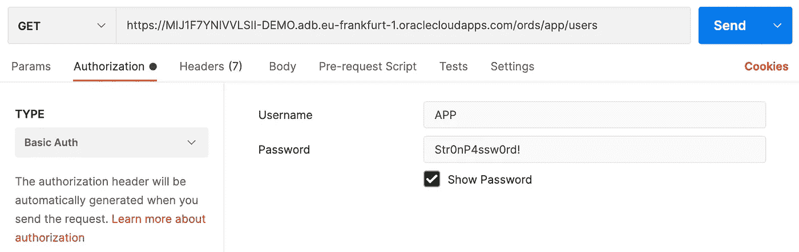

# 在您的数据所在的位置避免数据泄露

> 原文：<https://medium.com/oracledevs/avoid-data-breaches-right-where-your-data-lives-87a98918e922?source=collection_archive---------6----------------------->


This is how a data leak happens :)

数据泄露吓死我了。他们变得越来越大，越来越大胆。数据泄露的名单正在不断增加。在这个数据驱动的世界里，以下规则仍然适用吗？

> 仅存储您开展业务所需的信息。

这是一条重要的规则。是啊，好吧！但是数据就是力量。这是一个艰难的权衡。您现在读到的是数据泄露，因为它们会发生，会影响像我们这样的人。

思考这三个方面:

*   我的数据库配置安全吗？
*   **我有哪些敏感数据？**
*   谁有权访问数据和数据库？

有很多工具可以帮助你解决这些问题。但是，请简要思考一下关于敏感数据的第二个问题。

最完美的例子就是**的信用卡号码**。只有你的支付系统可以使用这些信息。请记住，您可能还希望将生产数据库中的数据复制到 ***测试*和*开发*环境**中，用于新功能开发、测试和错误调试。问题是在幕后产生的。

# 欢迎来到数据编辑

一个好的方法是，数据库引擎知道敏感数据并设置策略，这样特定的数据就不会未经处理就离开引擎。

您的信用卡数据将会是

> xxxx-xxxx-xxxx-5100

代替

> 5105–1051–0510-5100

这只是数据库中的一个变化。无需更改您的应用程序代码。

# 尝试一下

您可以在几分钟内试用它—无需在您的计算机上安装或配置任何东西。在 Oracle Cloud 上免费创建一个 **Oracle 自治数据库**。您可以使用 **SQL Developer Web** 执行所有 SQL 语句。

**您有甲骨文云账户吗？**如果没有，您可以在这里创建一个:

> *请记住，除非您明确要求按需付费升级，否则 Oracle Cloud 不会向您收取任何费用。没问题。*
> 
> [*甲骨文云免费报名*](http://bit.ly/34TzwGf)

按照本视频中的步骤创建数据库并打开 SQL Developer Web:

Create an Autonomous DB and start SQL Developer Web

第一个 PL/SQL 脚本将创建一个新的`APP`模式和一个新的表`USERS`。我们将向新行(用户)中插入虚构的信用卡号。最后一点将启用 Oracle REST 数据服务(ORDS ),允许我们使用 Postman 或 cURL 来查询表，就像我们的应用程序(源代码)一样。

运行 SQL Developer Web 上的语句:

可以使用 ***Postman*** 或者 ***cURL*** 来获取表的内容作为 RESTful 服务。

在下一个视频中，我将向您展示在自治数据库中运行的 ORDS 的网址:

Find the ORDS URL to use

复制 URL 后，必须在 URL 的末尾追加`app/users/`，为模式追加`app/`,为表追加`users/`。下面的 cURL 命令将为您提供表中的项目。

```
curl -u APP:Str0nP4ssw0rd! <[<ords_uri>>/app/users/](https://MIJ1F7YNIVVLSII-DEMO.adb.eu-frankfurt-1.oraclecloudapps.com/ords/app/users/)
```

Postman 上的对等词应该是这样的:



Postman configuration

结果显示了信用卡号码，这太糟糕了。您可以选择确保后端没有读取数据并将其发送到某个地方的代码。但是有一种更好的编程方式可以直接在数据库上实现。要检查的代码更少，对离开数据库的信息的控制更多。

运行以下 PL/SQL 代码，在`USERS`表和`CARD_NUMBER`列上添加编校策略。

运行相同的 cURL/Postman 命令，检查信用卡号这次是什么样子:

```
"id": 1,
"name": "John",
"card_number": "****-****-****-8765"
```

酷！你直接在数据库里编辑了高度敏感的数据。

如果你想分解这个例子，不要忘记清理模式。

# 想了解更多？

如果您喜欢您正在阅读的内容，并有兴趣与我们的团队一起迎接这些挑战，请查看我们关于许多主题的免费培训课程，如空间和图形、文档数据库、APEX、数字助理等。下一个项目是

> [*检查下一次训练。*](https://bit.ly/3ub8mr4)

专家和甲骨文云倡导者定期举办免费培训，时长约 1 小时。这些是教师指导的培训。您可以跟随我们的团队现场解决您的问题。

敬请关注更多关于 Oracle 云的精彩文章。

> 我是维克多·马丁，一名软件开发人员。我部署在 Oracle 云基础架构上。
> 
> *随时在*[*LinkedIn*](https://bit.ly/3bRk83W)*上与我联系。*
> 
> 我也对潜水和太空工程感兴趣。乐意帮忙，一切都比火箭科学容易！