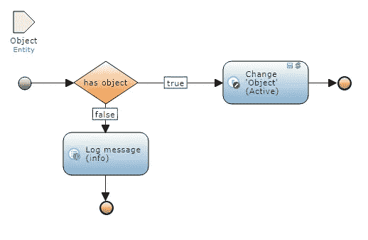
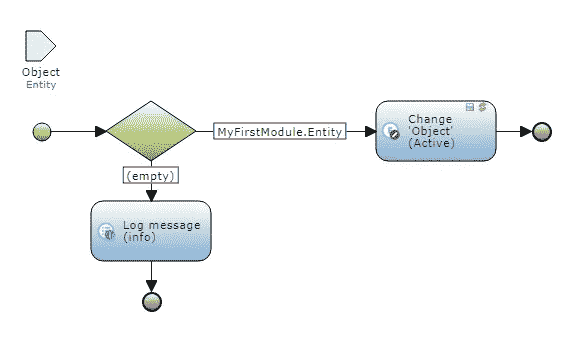

# 用这个简单的技巧避免 Mendix 中的空指针异常

> 原文：<https://medium.com/mendix/avoid-null-pointer-exceptions-in-mendix-with-this-simple-trick-d15b20312d20?source=collection_archive---------5----------------------->

这将是一个简短的帖子，我想与你分享我最近了解到的一个生活帮。让我们从检查这个问题开始。

根据 java 文档，当应用程序试图在需要值的情况下使用空值时，会抛出空指针异常(NPE)。例如，试图`trim`一个空值，或者试图[改变一个空对象](https://docs.mendix.com/refguide/change-object)都会抛出一个 NPE。事实上，如果使用空对象，大多数活动和表达式都会抛出 NPE。据我所知，只有以下情况不会抛出 NPE:

*   相等比较，例如`$Entity/Attribute = empty`(但不与`not`结合)
*   检索期间的 XPath 约束，例如`[Module.Associaiton < $Entity/Attribute]`
*   字符串连接，例如`'value is '+$Entity/Attribute` → *值为空*
*   通过关联检索→将返回空

为了避免 npe，建议在抛出异常的任何活动或表达式中使用变量之前，检查变量是否为空。作为 Mendix 的[自动代码评审器](https://content.mansystems.com/application-code-reviewer)的开发人员，我分析了许多真实的 Mendix 项目，以找出最常见的错误。正如您可能猜到的那样，许多错误都围绕着空指针异常。

有趣的是，根据数据，大多数 npe 的发生不是因为没有对空值进行检查，而是因为检查没有正确执行。你会问，像一张空白支票这样简单的东西怎么会执行错误呢？试着找出下面微流中的错误

[https://modelshare.mendix.com/models/a2146fb1-a5ef-4b35-8add-e7a11d2240de/act-object-set-to-empty?embed=true](https://modelshare.mendix.com/models/a2146fb1-a5ef-4b35-8add-e7a11d2240de/act-object-set-to-empty?embed=true')

乍一看，这个流程看起来是正确的。这就是为什么很难发现这些错误的原因。仔细观察可以发现，独占拆分中的表达式是`$Object = empty`。这与独家拆分的标题“有对象”*相矛盾。*要修复这个错误，可以将表达式改为`$Object != empty`。但是如果我告诉你有一个更好，更安全的方法:

[https://modelshare.mendix.com/models/154402e7-e903-4528-b8ab-8d93f9cb0af1/act-object-set-to-empty-safe?embed=true](https://modelshare.mendix.com/models/154402e7-e903-4528-b8ab-8d93f9cb0af1/act-object-set-to-empty-safe?embed=true)

有了这个结构，就不可能重复上面的错误，即标题和表达是矛盾的。那是一个巧妙的诡计，你不同意吗！？

我希望你喜欢这篇文章，它能帮助你构建更好的 Mendix 应用。

# Mendix 的自动代码审查程序

Mendix 的自动代码审查程序检查 100 多条不同类别的规则，如*安全性*、*性能*和*可维护性*。还有大约 [40 *可靠性*规则](https://sdf-docs.mansystems.com/docs/acr-rules/reliability/)它们的目标是在你的应用程序中发现如上所述的错误。