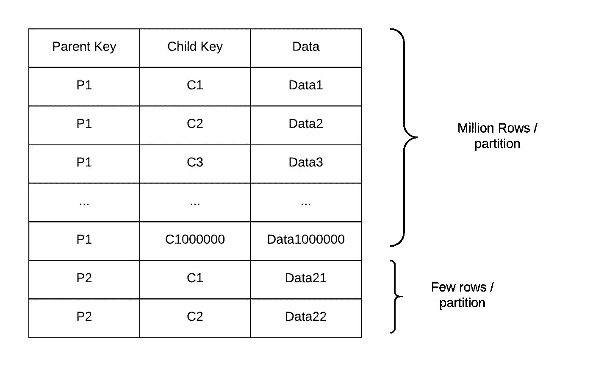
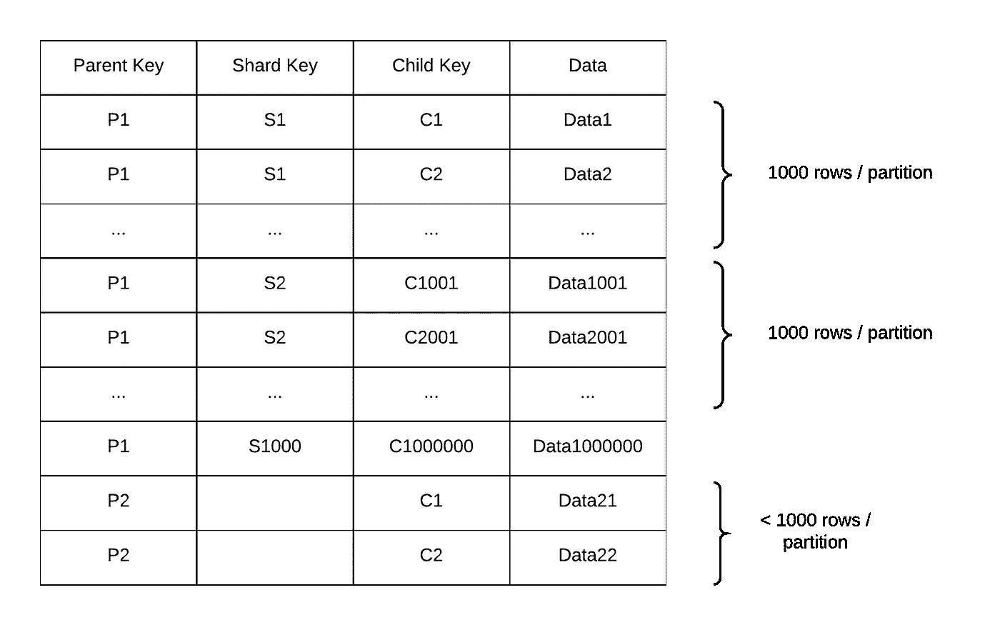
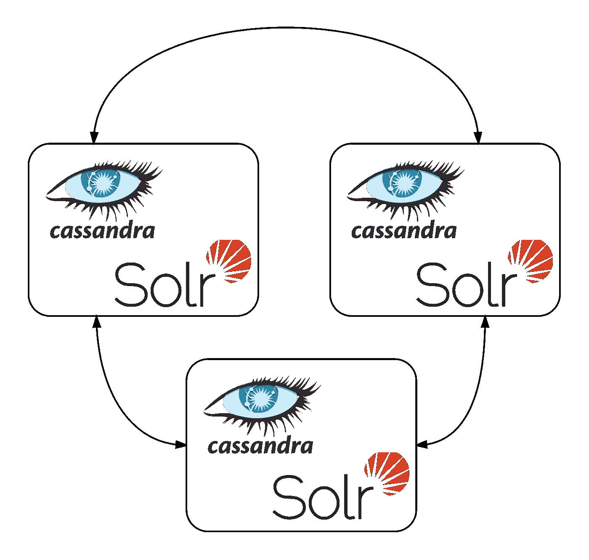

# 避免扩展 Cassandra 集群时的陷阱:教训和补救措施

> 原文：<https://medium.com/walmartglobaltech/avoid-pitfalls-in-scaling-your-cassandra-cluster-lessons-and-remedies-a71ca01f8c04?source=collection_archive---------0----------------------->


Photo credit: [Pexels](https://pixabay.com/en/blur-close-up-cobweb-dew-halloween-1868997/)

## 介绍

沃尔玛的几个团队大量使用 Cassandra 作为他们的主要数据源之一。除了出色的性能之外，他们中的许多人还依赖 Cassandra 提供的高可用性和可调一致性保证。我们已经在生产环境中部署了几个基于 Cassandra 的应用程序，读写操作始终保持在每秒 10 次甚至 100 次的水平。

达到这种状态并不容易。我们不得不“取消学习”RDBMS 世界的许多技巧，创建看起来“怪异”但结果证明更具性能的模式，并考虑各种策略来“删除”数据。在本文中，我们将讨论我们在扩展 Cassandra 集群时观察到的一些陷阱，以及我们如何避免它们。

## 陷阱 1:正确划分分区

在交付了几个基于 Cassandra 的成功项目后，有一个模式总是很突出

> 在所有可以应用于 Cassandra 以提高性能的调整、策略和技巧中，设计最佳模式对集群的延迟、稳定性和可用性的影响最大。

不均匀的分区是不确定的读/写性能和查询超时的最大原因之一。它还会导致压缩周期的压力不均匀，因为有些分区可能很大，可能需要很长时间才能压缩，而较小的分区可能会很快压缩。

在我们的一个用例中，我们需要维护亲子关系。维护 parent 键作为分区键，child 键作为聚集键似乎是合理的，这样所有的 child 都可以和 parent 在一起。设计上的一个问题是孩子的数量变化很大；有些父母只有一个孩子，而其他人可以有一百万！这导致了分区热点、大量丢弃的突变，以及集群中某些节点的总体压力过大。



Fig 1 — Uneven partitions in a parent child relation

为了解决这个问题，我们应用了分片的概念。我们切分了父项，并引入了切分键作为分区键的一部分。碎片大小保持在 *1000* 的固定大小，这样整体分区大小可以保持在 *10 MB* 以下。(每行有~ *10 KB* 的数据)。



Fig2 — Almost even sized partitions

这导致了几乎相等大小的分区，并且集群上的负载也得到了分布。作为奖励，我们在读取查询期间免费获得了数据分页！每个分片都很好地映射到一个数据页，现在可以用一个简单的分片查询获取第 n 页，如下所示

```
SELECT * FROM table WHERE parent_key = 'p1' AND shard_key = n
```

## 陷阱 2:确保概念的分离

Cassandra 对二级索引的支持有限。在我们的一个项目中，我们需要创建许多二级索引，并决定使用 Solr 和 Cassandra 来卸载索引管理，同时保持数据局部性。

随着数据量的增长，集群开始出现稳定性问题。随着集群负载的增加，我们开始看到很多超时。深入研究后，我们发现一个主要原因是，对于 Cassandra 行上的每一个突变，Solr 都会获取内存中的整个分区进行索引。由于每个分区都承载了 *MB 的*数据，这导致了大量的内存数据读取。



Fig 3 — Cassandra + Solr nodes ring — bad performance for wide rows

我们把 Cassandra 和 Solr 集群分开，开始通过一个卡夫卡的话题给 Solr 写信。虽然纯 Cassandra 集群的延迟显著改善(几乎没有超时)，但 Cassandra + Solr 集群的表现仍然很差。我们最终用 [SolrCloud](https://lucene.apache.org/solr/guide/6_6/solrcloud.html) 替换了 Cassandra + Solr 组合，切换后性能非常出色，吞吐量显著提高！


Fig 4 — Separate Cassandra and Solr rings — better performance for wide rows

## 陷阱 3:避免完全读/写

卡珊德拉通过使用“最后写入获胜”策略解决了*突变冲突*。如果稍后将相同的数据写回一列，即使数据没有改变 *，也认为是*突变* **。***突变在读取时会产生沉重的代价，因为读取必须参考多个*表*以确保总是返回最新的更新。在压缩过程中，突变被压缩/丢弃，但是，如果实际内容没有变化，这会给集群带来很大的负载。

几乎所有用于 Cassandra 的 Java 对象映射器框架都提供了基于代理的机制来跟踪变更(即哪些属性/列需要写回)，这是最应该使用的。然而，读语义有点不太好理解。通常，每次触发读取查询时，都会读取整个**行(参见下面的代码*，这增加了读取的成本。更好的方法是尽可能有选择地阅读。***

```
//writes: 
connection.proxyForUpdate(MyBean.class) // the proxy would keep track of which fields were changed
connection.save(myBeanObject) // only changed fields would be written// reads:
MyBean myBeanObject = connection.find(MyBean.class, myBeanId) 
/* 
this would typically read all the columns, which is cheaper for row-oriented data bases, but costlier for Cassandra
*/
```

## 陷阱 4:小心收藏

Cassandra 支持集合、映射和列表集合作为列类型。一个常见的错误是读取应用程序中的集合，修改它，然后写回它，如下面的代码所示

```
List<Object> c = cassandraDO.getList();
c.delete(obj1);
c.add(obj2);
cassandraDO.setList(c); // BAD: re-writes the entire list.
cassandraDO.save();
```

这将导致重新编写整个集合，从而产生大量的墓碑并影响性能。此外，集合应该优先于列表，因为集合(和映射)避免了更新和删除的*写前读*模式。列表中的更新或删除可能会再次读取内存(服务器端)中的整个列表，因为没有'*数据唯一性'。*

集合的另一个问题是集合是整体读取的，不支持选择性读取。例如，如果一个映射集合有 10，000 个条目，而一个查询想要读取 5 个键的值，那么所有 10，000 个条目都将被 Cassandra 读取。这是不必要的，多余的。

## 陷阱 5:驱动程序调整

驱动程序调优对查询的执行方式有很大影响。我们在这里找到了一篇由 DataStax [撰写的优秀文章，它描述了许多导致更好的整体性能和更少超时的设置。因为我们只使用本地数据中心，所以我们将远程主机连接设置为 0。此外，将 *shuffleAmongReplica* 设置为 true 给了我们更好的负载分配(缺点是更多的本地读取修复发生在服务器端)](http://docs.datastax.com/en/developer/java-driver/2.1/manual/pooling/)

## 摘要

如果使用得当，卡桑德拉是一个伟大的系统。影响查询性能的一些关键因素包括正确的数据分区、避免热点、避免完全读/写，以及针对预期的查询负载适当地调优驱动程序。通过改变我们面向 *RDBMS 的思维方式*，我们学到了很多东西，我们很高兴在过去几年里在沃尔玛使用 Cassandra 作为主要数据源之一。