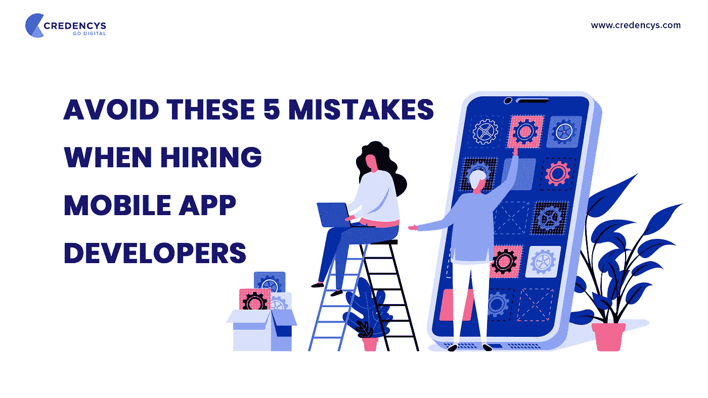

# 雇佣移动应用开发者时避免这 5 个错误

> 原文：<https://medium.com/quick-code/avoid-these-5-mistakes-when-hiring-mobile-app-developers-244c16456647?source=collection_archive---------1----------------------->

否则会危及你的移动应用的成功。毫无疑问。

Image Credit: [Credencys](https://www.credencys.com/)

想象一下这个…

你有一个绝妙的手机应用程序创意。你想在世界上留下印记。

那很好。我们理解你的激动。

但是如果你是第一次开发移动应用，那么你肯定会犯一些错误。

你看，发布一个成功的移动应用的旅程是从雇佣合适的移动应用开发者开始的。如果你犯了我们将在本文中讨论的错误，那么你的移动应用肯定会在发布前失败。

**为什么？**

这是因为只有合适的开发团队才能帮助您在成功之旅中迈出正确的一步。

如果你雇佣了错误的团队，那么你将会浪费大量的时间和金钱。

**最糟糕的部分？** —你不会得到你想象中想要的应用程序，你所有的努力都会化为灰烬。

所以，如果你打算[雇佣移动应用开发者](https://www.credencys.com/mobile-app-developers/)，避免以下 5 个错误，让你的移动应用成功。

# **雇佣移动应用开发者时要避免的 5 个错误**

如今，几乎所有的小型到大型企业都在开发自己的移动应用程序，原因显而易见。

让我们深入了解一下你应该不惜一切代价避免的致命错误。

# **1 —不在你的城市之外寻找开发商**

大多数企业家和企业犯的第一个错误是只在当地寻找移动应用开发者。

虽然能够与开发人员面对面交流绝对是一种特权。

但是当你选择走这条路的时候，你的选择就变得非常有限。

例如，假设你住在澳大利亚的悉尼，你想雇用来自这个城市的移动应用程序开发人员。

现在，如果你幸运的话，你可能会找到一个好的开发商，但你仍然会错过你所在城市以外的优秀开发商，仅仅因为你限制了你的选择。

关键是，在当今的数字世界，位置对于移动应用开发者来说并不重要。

事实上，许多企业和品牌，如阿里巴巴、苹果和其他公司，已经接受了将他们的移动应用程序开发项目外包到城市或国家以外的想法。

# **2 —没有对候选人进行适当的面试**

许多企业犯了一个错误，没有对移动应用开发者进行彻底的面试。

他们经常从朋友、以前的同事或家庭成员那里找到开发人员的参考资料，然后看一看他们的简历和投资组合，并在此基础上进行招聘。

现在，想一分钟。你可能要投资数千美元来开发你的应用程序。

> 你真的打算仅凭信任就做出雇佣决定吗？

我们真的希望你不要！

或者，它可能会导致您处于这样一种情况，即开发人员没有经常或足够好地沟通，您可能无法采取适当的行动。

因此，安排一次与合格候选人的面试，看看他们是否有能力将你的愿景转化为有用的移动应用。

# **3 —完全根据经验雇佣开发人员**

当然可以。经验很重要。

但是在做招聘决定的时候，还有一个不应该被忽视的方面。

专业知识。

当你雇佣移动应用开发者时，专业知识同样重要。

你看，没有必要雇佣最有经验的开发者来开发你的移动应用。

这就是专业知识发挥作用的地方。

当你面试合格的候选人时，看看他们过去的工作，看看他们是否开发过类似的应用程序，以及他们的应用程序结果如何。

这就把我们带到了下一个错误。

# **4 —不分析自己过去的工作**

如果你正在为你的餐馆业务开发一个点餐应用程序，建议你去找过去开发过类似应用程序的开发者。

彻底检查过去的工作对体验同样重要。

事实上，你还应该下载开发者在过去开发的所有应用程序。

虽然下载和注册可能需要一些时间，但这个练习将帮助你评估他们以前做过的工作，并了解他们的质量。

# **5 —根据价格雇佣开发人员**

当你是一个小企业或企业家时，雇佣最便宜或最实惠的选择是正确的。

当你不得不坚持预算时尤其如此。我们非常理解这一点。

但是，犯这个错误实际上会花费你更多的钱。

而且，除非是静态的移动 app，否则根本不可能开发出质量高、价格非常低的移动 app。

因此，避免开发商或公司承诺以低价完成这项工作。相反，找一个过去开发过成功应用程序的可靠的开发者，并迅速雇佣他们，因为这些开发者总是需求量很大。

# **总结**

总结这篇文章，你需要做的是:

*   寻找你所在城市以外的开发商
*   彻底面试合格的候选人
*   通过检查他们过去的工作来核实他们的资格
*   并聘请有开发类似应用程序经验的开发人员。

如果你对你的项目还有任何疑问，请随时联系或[聘请 Credencys 的移动应用开发者](https://www.credencys.com/mobile-app-developers/)。