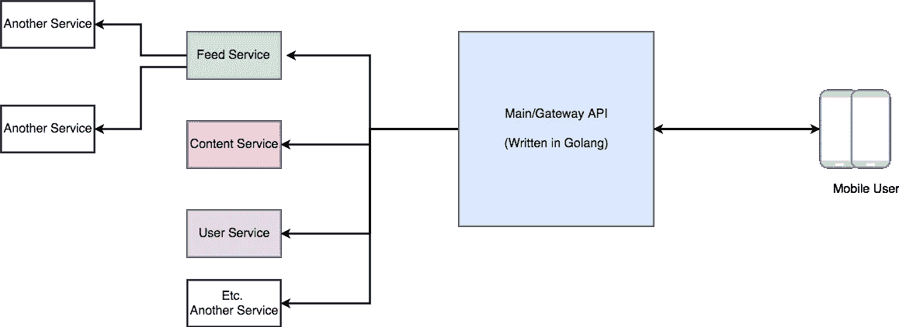
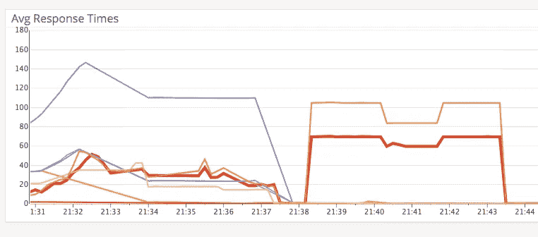

# 在 Golang API 中避免内存泄漏

> 原文：<https://medium.easyread.co/avoiding-memory-leak-in-golang-api-1843ef45fca8?source=collection_archive---------0----------------------->

## 在将 Golang API 发布到产品中之前，您必须阅读这篇文章。基于我们在 Kurio 的真实故事，我们如何努力争取每一个版本，因为我们没有以正确的方式做它。


laptop on fire taken from google image search

几周前，我们在 [Kurio](https://kurio.co) 修复我们主要服务中奇怪且未被发现的错误。我们已经尝试了很多方法来调试和修复它。问题不在于业务逻辑。因为它已经在生产中运行了几个星期。但我们总是通过我们的自动缩放机制来节省，所以它就像运行良好。

直到后来，我们想通了，是因为我们的代码，我们没有做好。

## 体系结构

仅供参考，我们正在我们的架构中使用微服务模式。我们有一个网关 API——我们称之为`main API`——为我们的用户(移动和网络)提供 API。由于它的角色类似于 API 网关，所以它的任务只是处理来自用户的请求，然后调用所需的服务，并构建对用户的响应。这个`main API`，完全用 Golang 写的。选择 golang 的原因是另一个故事，我在这里就不说了。

如果画在一张图上，我们的系统看起来会更像这样。



Kurio architecture

# 问题是

我们已经为我们的主要 API 奋斗了很长时间，它总是关闭，并对我们的移动应用程序返回很长的响应，有时会导致我们的 API 无法访问。我们的 API 仪表板监视器变成红色——老实说，当我们的 API 仪表板监视器变成红色时，这是一件危险的事情，会给我们工程师带来压力、恐慌和疯狂😈。

其他事情是，我们的 CPU 和内存使用率越来越高。如果发生这种情况，我们只需手动重启，等待它再次运行。


Our API response time up-to 86 seconds for a single request.



graph our API response time, and doing restart manually for safety.

这个 bug 真的让我们很沮丧，因为我们没有任何关于这个 bug 的日志。我们只是知道响应时间太长了。CPU 和内存使用量不断增加。这就像一场噩梦。

# 阶段 1:使用定制的 http。客户

我们在开发这项服务时学到的一件事是，不要相信默认配置。

我们使用一个定制的`http.Client`，而不是使用 http 包中的缺省值，

```
client:=http.Client{} //default
```

我们根据需要添加一些配置。因为我们需要重用连接，所以我们在传输中进行一些配置，并控制最大空闲可重用连接。

```
keepAliveTimeout:= 600 * time.Second
timeout:= 2 * time.Second
defaultTransport := &http.Transport{
    Dial: (&net.Dialer{
                     KeepAlive: keepAliveTimeout,}
           ).Dial,
    MaxIdleConns: 100,
    MaxIdleConnsPerHost: 100,}client:= &http.Client{
           Transport: defaultTransport,
           Timeout:   timeout,
}
```

这种配置可以帮助我们减少用于调用另一个服务的最大时间。

# 阶段 2:避免未关闭响应体的内存泄漏

我们从这个阶段学到的是:如果我们想将我们的连接池重用到另一个服务，我们必须读取响应体，并关闭它。

因为我们的`main API`只是调用另一个服务，所以我们犯了一个致命的错误。我们的`main API` 假设重用来自`http.Client`的可用连接，所以无论发生什么，我们必须读取响应体，即使我们不需要它。我们还必须关闭响应体。这两者都用来避免我们的服务器内存泄漏。

我们忘记了在代码中关闭响应体。这可能会给我们的生产带来巨大的灾难。

解决方案是:我们关闭响应体并读取它，即使我们不需要数据。

```
req, err:= http.NewRequest("GET","http://example.com?q=one",nil)
if err != nil {
  return err
}resp, err:= client.Do(req)
//=================================================
// CLOSE THE RESPONSE BODY
//=================================================
if resp != nil {
    defer resp.Body.Close() // MUST CLOSED THIS 
}
if err != nil {
  return err
}//=================================================
// READ THE BODY EVEN THE DATA IS NOT IMPORTANT
// THIS MUST TO DO, TO AVOID MEMORY LEAK WHEN REUSING HTTP 
// CONNECTION
//=================================================
_, err = io.Copy(ioutil.Discard, resp.Body) // WE READ THE BODYif err != nil { 
   return err
}
```

我们在这里阅读了一篇很棒的文章后修复了这个问题:[http://devs . cloud immunity . com/gotchas-and-common-errors-in-go-golang/](http://devs.cloudimmunity.com/gotchas-and-common-mistakes-in-go-golang/)还有这里:[http://tleyden . github . io/blog/2016/11/21/tuning-the-go-http-client-library-for-load-testing/](http://tleyden.github.io/blog/2016/11/21/tuning-the-go-http-client-library-for-load-testing/)

第一阶段和第二阶段，并借助自动伸缩成功地减少了这个 bug。好吧，老实说，从 2017 年开始，这种情况再也不会发生了，哪怕是 3 个月。

# 阶段 Golang 通道中的超时控制

运行几个月后，这个 bug 再次出现。2018 年 1 月的第一周，我们的`main API`打来的一个服务，let 说:宕机了。由于某些原因，无法访问。

所以当我们的`content service`停机时，我们的`main API`又会被解雇。API 仪表板再次变红，API 响应时间变得越来越长，越来越慢。即使使用自动缩放，我们的 CPU 和内存使用率也会非常高。

我们再次试图找到问题的根源。嗯，重新运行`content service`后，我们再次运行良好。

对于这种情况，我们很好奇，为什么会发生这种情况。因为我们认为，我们已经在`http.Client`中设置了超时期限，所以那样的话，这种情况永远不会发生。

搜索我们代码中的潜在问题，然后我们发现了一些危险的代码。

为了更简单，代码看起来更像这个
* ps:这个函数只是一个例子，但在模式上与我们的相似

our code before fixed

如果我们看上面的代码，它就像没有错。但是这个函数是我们`main API`中被访问次数最多、调用次数最多的函数。因为这个函数会做 3 个 API 调用，处理量很大。

为了改善这一点，我们提出了一种新的方法，在通道上使用超时控制。因为使用上面的样式代码——使用`WaitGroup`会等到所有的过程都完成——我们必须等待所有的 API 调用都完成，这样我们才能处理并向用户返回响应。

这是我们的一个大错误。当我们的一个服务终止时，这个代码会造成巨大的灾难。因为要等到死掉的服务恢复过来会有很长的等待。用 5K 通话/秒，当然这是灾难。

**第一次尝试解决方案:**

我们通过添加超时来修改它。所以我们的用户不会等太久，他们只会得到一个内部服务器错误。

trying to add timeout

# 阶段 4:使用上下文的超时控制

在做了**第三阶段之后，**我们的问题仍然没有完全解决。我们的 `main API`还是很消耗 CPU 和内存的。

这是因为，即使我们已经把`Internal Server Error`还给我们的用户，但是我们的 goroutine 仍然存在。我们想要的是，如果我们已经返回了响应，那么所有的资源也被清除，没有例外，包括在后台运行的 goroutine 和 API 调用。

后来看完这篇文章:
[http://daher nan . github . io/2015/02/04/context-and-cancellation-of-goroutines/](http://dahernan.github.io/2015/02/04/context-and-cancellation-of-goroutines/)

我们在 golang 中发现了一些我们还没有意识到的有趣特征。在围棋程序中使用`Context`帮助取消。

我们没有使用`time.After`来使用超时，而是转移到`context.Context`。有了这种新方法，我们的服务更加可靠。

然后，我们通过向相关函数添加上下文来再次改变我们的代码结构。

final fixed code. using context

所以我们在代码中对每个 goroutine 调用使用`Context`。这有助于我们释放内存并取消 goroutine 调用。

此外，为了更加可控和可靠，我们还将上下文传递给我们的 HTTP 请求。

using context on HTTP request

有了所有这些设置和超时控制，我们的系统更加安全和可控。

## 吸取的教训:

*   从未在生产中使用默认选项。
    只是从来没有使用过默认选项。如果您正在构建一个大的并发 A，就不要使用默认选项。
*   读了很多，尝试了很多，失败了很多，收获了很多。
    我们从这次经历中学到了很多，这种经历只有在真实的案例和真实的用户中才能获得。我很高兴能参与修复这个 bug。

* *最后更新时间:2018 年 1 月 18 日:修复部分错别字*

如果你认为这本书值得一读，给我一个👏
也在你的 twitter、facebook 等网站上分享，这样其他人也可以阅读。如果你有什么问题，你可以在下面回复或者发邮件给我。