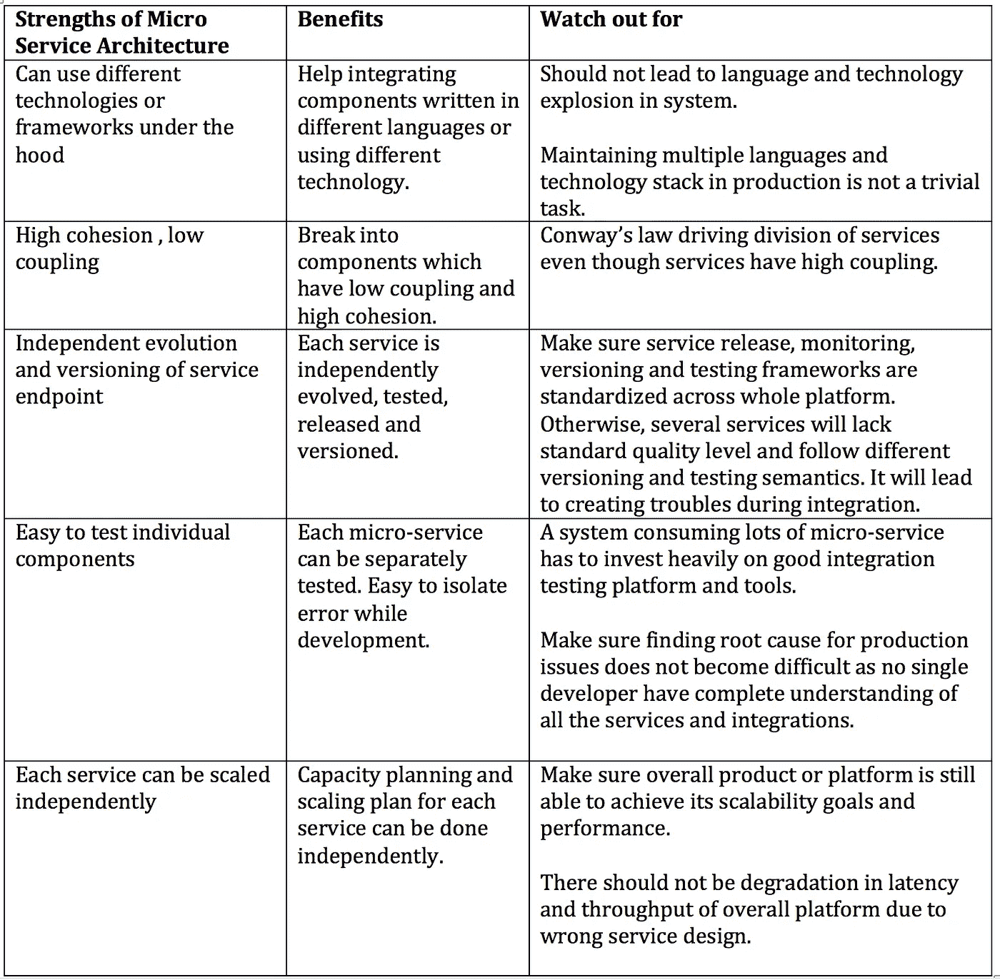

# 避免微服务架构中的陷阱

> 原文：<https://medium.com/walmartglobaltech/avoiding-pitfalls-in-microservice-architecture-ba038340f8c1?source=collection_archive---------2----------------------->

Photo credit: [Bella67](https://pixabay.com/en/tiny-people-core-apple-apple-half-700921/)

在开发复杂的 web 应用程序时，工程师总是需要独立地计划系统的每个组件的扩展和发展。与此同时，他们还需要确保最终产品按预期工作，并且易于调试。

微服务的主要优势包括:

a)服务的独立发展和版本控制

b)可以使用不同的技术和框架

c)易于测试单个组件

d)每项服务都可以独立扩展

e)服务可以独立部署、监控和发布

有一句话是这样说的:“过度发挥优势可能会成为一个弱点。”这也适用于建筑。

在推进微服务架构时，您需要注意以下陷阱:

为了避免微服务架构带来的缺陷，请回顾以下几点:

**启动单片**

在启动平台时，很容易过度设计微服务并做出错误的假设。

微服务在以下方面是一项重大投资:

a)采购调试微服务的工具

b)创建测试集成解决方案的环境

c)采购开发运维工具来部署、监控和管理服务

对于沃尔玛的搜索，类似于网飞、脸书和耐克等。我们从单片应用程序开始，只有在很好地理解了业务需求和功能之后，才开始使用微服务架构。

**划分权利**

a)服务具有低耦合和高内聚

b)服务可以独立发展——不应该要求同时升级服务。每次服务升级都应该是向后兼容的。

c)团队结构支持服务部门—确保服务所有权与团队结构同步。[康威定律](https://en.wikipedia.org/wiki/Conway%27s_law)站在你这边。

d)确保记录源设计与微服务部门同步。服务之间不共享数据库，导致复杂的同步和分布式事务问题。

**工具**

拥有合适的工具来部署、测试、监控和发布微服务集成环境。

**集成所有权**

大多数情况下，团队最终拥有各自的服务，集成最终会受到影响。确保集成层和架构有明确的归属。每个人都应该清楚集成的职责和责任。如果你有跨团队的架构师或高级工程师，那么建议让他们成为集成和架构的所有者，因为这对我们很有效。

**性能&可扩展性**

a)确保产品服务的整体延迟和吞吐量不会因集成问题而降低。

b)每个服务都可以伸缩，以实现系统的整体可伸缩性承诺。

c)关注平台的整体 CPU、内存、网络和磁盘资源消耗。确保由于服务的激增，大量的重复计算和数据处理不会显著增加平台的资源消耗。

**使用的技术**

微服务不是将多种技术引入一个平台的借口。

每项新技术或语言投入生产都需要:

1)开发工具

2)测试、监控和部署框架

3)技术和语言堆栈的升级和维护

因此，在平台中添加新的技术栈或语言，非线性地增加了复杂性并提高了系统的维护成本。

深入探究为什么平台中需要两三种以上的技术或语言来解决类似的问题。

如果需要新的技术体系，在添加新的技术体系之前，看看旧的技术体系是否可以淘汰。

**结论**

微服务架构在扩展和构建复杂系统方面有很多好处。但是在设计服务的时候，我建议记住所讨论的要点。

这里有几篇文章可以帮助你做出正确的选择。如果我能帮助回答你可能有的任何问题，请留下评论。感谢阅读。

 [## 不要建造一个分布式的整体| Microservices.com

### 所以我今天的目标是说服你们所有人不要用二进制依赖来耦合你们的系统。

www.microservices.com](https://www.microservices.com/talks/dont-build-a-distributed-monolith/)  [## 定位常见的微服务性能反模式

### 在上一篇文章中，我们讨论了如何在 Java 代码中诊断常见的数据库性能热点。在…

www.infoq.com](https://www.infoq.com/articles/Diagnose-Microservice-Performance-Anti-Patterns)  [## a16z 播客:关于微服务的一切

### “渐进式变革可能是个不错的理论，但在实践中，你必须有一根足够大的棍子来打击每个人…

a16z.com](http://a16z.com/2016/09/01/microservices/)