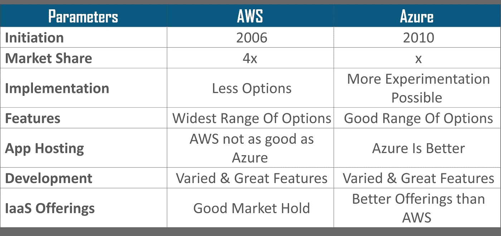
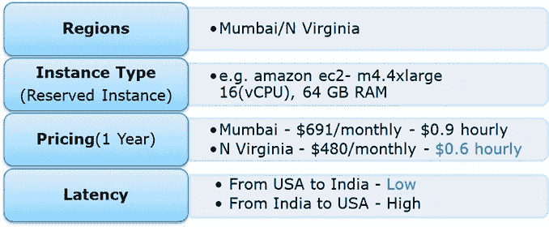

# 2021 年顶级 AWS 架构师面试问题

> 原文：<https://medium.com/edureka/aws-architect-interview-questions-5bb705c6b660?source=collection_archive---------2----------------------->


AWS Interview Questions — Edureka

# 为什么 AWS 架构师面试提问？

Gartner 连续第七年将亚马逊网络服务列入“领导者”象限。此外，据《福布斯》报道，AWS 认证解决方案架构师在薪酬最高的 15 项 IT 认证中遥遥领先。毫无疑问，AWS 解决方案架构师职位是 IT 工作中最受欢迎的职位之一。

我已经创建了一个 AWS 架构师面试问题和答案的列表，这些问题和答案很可能会在你的面试中被问到，并且会帮助你提升你的职业生涯。

**AWS 解决方案架构师角色:**关于 AWS，解决方案架构师将为现有系统设计和定义 AWS 架构，将它们迁移到云架构，并为未来的 AWS 云实施制定技术路线图。因此，通过这篇文章，我将为您带来一些常见的 AWS 面试问题。

现在，在每一部分中，我们将从 aws 基本面试问题开始，然后转向 AWS 针对有经验人员的面试问题和答案，这些问题和答案在技术上更具挑战性。

# 第一部分:基本问题

***什么是云计算。你能谈论和比较任何两个受欢迎的云服务提供商吗？***

以下是两个最受欢迎的云服务提供商之间的比较:



## Q1。试试这个基于 AWS 场景的面试问题。我在自己的场所有一些私有服务器，我还在公共云上分配了一些工作负载，这种架构叫什么？

**A .虚拟专用网**

**B .私有云**

**C .虚拟私有云**

**D .混合云**

***答案 B***

**解释:**这种类型的架构是混合云。为什么？因为我们同时使用公共云和您的本地服务器，即私有云。为了使这种混合架构易于使用，如果您的私有云和公共云都在同一个网络上(虚拟地)不是更好吗？这是通过将您的公共云服务器包含在虚拟私有云中，并使用 VPN(虚拟专用网络)将该虚拟云与您的本地服务器连接起来而实现的。

# 第 2 部分:亚马逊 EC2 面试问题

## Q2。以下命令对 Amazon EC2 安全组有什么作用？

```
ec2-create-group CreateSecurityGroup
```

**A .将用户创建的安全组分组到一个新的组中，以便于访问。**

b .创建一个新的安全组供您的帐户使用。

c .在安全组内创建一个新组。

d .在安全组内部创建一个新规则。

***答案 B.***

**解释:**安全组就像防火墙，它控制进出实例的流量。在 AWS 术语中，入站和出站流量。提到的命令非常简单，它说创建安全组，并做同样的事情。接下来，一旦创建了安全组，就可以在其中添加不同的规则。例如，您有一个 RDS 实例，要访问它，您必须在它的安全组中添加您想要从中访问该实例的机器的公共 IP 地址。

## **Q3。这是基于 aws 场景的面试问题。你有一个视频转换编码应用程序。根据队列处理视频。如果视频的处理在一个实例中被中断，则在另一个实例中继续。目前有大量积压的视频需要处理，为此你需要添加更多的实例，但你只需要这些实例，直到你的积压减少。以下哪一个是有效的方法？**

你应该使用一个**随需应变**实例。为什么？首先，现在必须处理工作量，这意味着它是紧急的，其次，一旦您的积压被清除，您就不需要它们了，因此保留的实例是不可能的，并且由于工作是紧急的，您不能仅仅因为现货价格飙升就停止您的实例上的工作，因此也不应使用现货实例。因此，在这种情况下，按需实例应该是正确的选择。

## **Q4。您有一个跨多个 Amazon EC2 实例定期处理大量数据的分布式应用程序。该应用程序旨在从 Amazon EC2 实例故障中正常恢复。你需要以最具成本效益的方式完成这项任务。**

**以下哪一项符合您的要求？**

**A. Spot 实例**

**B .保留实例**

**C .专用实例**

**D .按需实例**

***答:***

**解释:**由于我们在这里处理的工作不是连续的，所以保留的实例有时会空闲，按需实例也是如此。此外，每当工作开始时就启动一个随需应变的实例是没有意义的，因为它是昂贵的。因此，现货实例将是合适的，因为它们的低利率和没有长期承诺。

## **Q5。停止和终止实例有何不同？**

开始、停止和终止是 EC2 实例中的三种状态，让我们详细讨论它们:

*   **停止和启动**一个实例:当一个实例被停止时，该实例执行正常关机，然后转换到停止状态。它的所有 Amazon EBS 卷都保持连接状态，您可以在以后再次启动该实例。当实例处于停止状态时，不会对额外的实例小时数收费。
*   **终止**一个实例:当一个实例被终止时，该实例执行正常关闭，然后附加的 Amazon EBS 卷被删除，除非卷的 *deleteOnTermination* 属性被设置为 false。实例本身也会被删除，以后您不能再次启动该实例。

## **Q6。如果我希望我的实例在单租户硬件上运行，我必须将实例的租户属性设置为哪个值？**

**A .专用**

**B .隔离**

**C .一个**

**D .预留**

***答一.***

**说明:**实例租用属性应该设置为专用实例。其余值无效。

## **Q7。弹性 IP 地址(EIP)何时会产生成本？**

**答:分配 EIP 时。**

**B .当它被分配并与一个正在运行的实例相关联时。**

**C .当它被分配并与一个停止的实例相关联时。**

**D .无论 EIP 是否与正在运行的实例相关联，都会产生成本。**

***答 C.***

**解释:**如果您的运行实例只附带一个弹性 IP 地址，您将不会被收费。但是在下列情况下你会被起诉:

*   当您对实例使用多个弹性 IPs 时。
*   当您的弹性 IP 连接到停止的实例时。
*   当您的弹性 IP 没有连接到任何实例时。

## Q8。Spot 实例与按需实例或保留实例有何不同？

首先我们要明白，现货实例、按需实例、预约实例都是定价的模型。随着时间的推移，spot 实例使客户能够购买计算能力，而无需预先承诺，每小时的费用通常低于每个地区的按需费用。现货就像竞价一样，竞价的价格叫做现货价格。举例来说，现货价格会根据供给和需求而波动，但客户永远不会支付超过他们指定的最高价格。如果现货价格高于客户的最高价格，客户的 EC2 实例将自动关闭。但是反过来是不正确的，如果现货价格再次下降，您的 EC2 实例将不会自动启动，必须手动启动。在即时和按需的情况下，用户方对持续时间没有承诺，但是在预约的情况下，用户必须坚持他所选择的时间段。

## Q9。保留的实例可用于多 AZ 部署吗？

**答:多 AZ 部署仅适用于集群计算实例类型**

**B .可用于所有实例类型**

**C .仅适用于 M3 实例类型**

**D .不可用于保留实例**

***答案 B.***

**说明:**预留实例是一种定价模型，适用于 EC2 中的所有实例类型。

## Q10。如何使用 c4.8xlarge 实例上可用的处理器状态控制功能？

处理器状态控制包括两种状态:

*   C 状态——睡眠状态从 c0 变化到 c6。C6 是处理器的最深睡眠状态
*   P 状态——性能状态 p0 为最高频率，p15 为最低频率。

为什么是 C 州和 P 州？处理器有内核，这些内核需要散热空间来提升性能。现在，由于所有内核都在处理器上，温度应该保持在最佳状态，以便所有内核都能以最高性能运行。

现在，这些州将如何对此有所帮助呢？如果一个内核进入睡眠状态，它将降低处理器的整体温度，因此其他内核可以执行得更好。现在，它可以与其他内核同步，因此处理器可以通过及时让其他内核休眠来提升尽可能多的内核，从而获得整体性能提升。

最后，C 和 P 状态可以在一些 EC2 实例中定制，如 c4.8xlarge 实例，因此您可以根据您的工作负载定制处理器。

## Q11。当您在集群放置组中启动实例时，您可以预期哪种网络性能参数？

网络性能取决于实例类型和网络性能规格，如果在放置组中启动，您最多可以预期

*   单流中 10 Gbps，
*   20 Gbps 多流模式，即全双工模式
*   放置组之外的网络流量将被限制在 5 Gbps(全双工)。

## Q12。要在 AWS 中部署 4 节点 Hadoop 集群，可以使用哪种实例类型？

首先，让我们了解 Hadoop 集群中的实际情况，Hadoop 集群遵循主从概念。主机处理所有数据，从机存储数据并充当数据节点。因为所有的存储都发生在从设备上，所以推荐使用更高容量的硬盘，因为主设备完成所有的处理，所以需要更高的 RAM 和更好的 CPU。因此，您可以根据您的工作负载选择机器的配置。例如，在这种情况下，c4.8xlarge 将是主机的首选，而对于从机，我们可以选择 i2.large 实例。如果您不想手动配置实例和安装 hadoop 集群，您可以直接启动 Amazon EMR (Elastic Map Reduce)实例，它会自动为您配置服务器。您将数据转储到 S3 进行处理，EMR 从那里提取数据，进行处理，然后转储回 S3。

## Q13。当你为一个解决方案设计一个架构时，你认为 AMI 适合哪里？

AMI(Amazon 机器映像)就像虚拟机的模板，一个实例来自 AMI。AWS 提供预烘焙的 ami，您可以在启动实例时选择，有些 ami 不是免费的，因此可以从 AWS 市场购买。您还可以选择创建自己的自定义 AMI，这将有助于您节省 AWS 上的空间。例如，如果您的安装不需要一套软件，您可以定制您的 AMI 来完成这项工作。这使得成本效益，因为你是删除不需要的东西。

## Q14。您如何选择可用性区域？

让我们通过一个例子来理解这一点，假设有一家公司在印度和美国都有用户群。

让我们看看我们将如何为该使用案例选择区域:



所以，参考上图，可以选择的地区是孟买和北弗吉尼亚。现在让我们先比较一下价格，你有每小时的价格，可以转换成你每月的数字。在这里，北弗吉尼亚成为了赢家。但是，定价不能是唯一要考虑的参数。性能也应该牢记在心，因此，让我们看看延迟。延迟基本上是服务器响应你的请求的时间，即响应时间。北弗吉尼亚又赢了！

因此，总结来说，北弗吉尼亚应该被选作这个用例。

## Q15。对于我正在运行的每个实例，一个弹性 IP 地址是否足够？

看情况！每个实例都有自己的私有和公有地址。私有地址只与实例相关联，并且只有在实例停止或终止时才返回给 Amazon EC2。类似地，公共地址只与实例相关联，直到它被停止或终止。然而，这可以由弹性 IP 地址来代替，只要用户没有手动分离它，它就和实例在一起。但是，如果您在 EC2 服务器上托管多个网站，在这种情况下，您可能需要不止一个弹性 IP 地址。

## Q16。Amazon EC2 中的安全最佳实践是什么？

有几个保护 Amazon EC2 的最佳实践。下面是其中的一些例子:

*   使用 AWS 身份和访问管理(IAM)来控制对 AWS 资源的访问。
*   通过仅允许受信任的主机或网络访问实例上的端口来限制访问。
*   定期检查安全组中的规则，并确保应用最少原则
*   权限—仅开放您需要的权限。
*   对从 AMI 启动的实例禁用基于密码的登录。密码可以被发现或破解，这是一个安全风险。

# 第 3 部分:亚马逊存储面试问题

## Q17。另一个基于场景的面试问题。您需要配置一个亚马逊 S3 存储桶来为面向公众的 web 应用程序提供静态资产。哪种方法可以确保上传到 bucket 的所有对象都设置为公共读取？

**A .在上传期间将对象的权限设置为公共读取。**

**B .配置存储桶策略，将所有对象设置为公共读取。**

**C .使用 AWS 身份和访问管理角色将存储桶设置为公共读取。**

**D .亚马逊 S3 对象默认为公共读取，因此不需要任何操作。**

***答案 B.***

**解释:**与其对每个对象进行更改，不如为整个存储桶设置策略。IAM 用于提供更细粒度的权限，因为这是一个网站，所有对象在默认情况下都是公开的。

## Q18。一个客户希望利用亚马逊简单存储服务(S3)和亚马逊冰川作为其备份和归档基础架构的一部分。客户计划使用第三方软件来支持这种集成。哪种方法会将第三方软件的访问仅限于名为“公司备份”的亚马逊 S3 存储桶？

**A .一个自定义桶策略仅限于亚马逊 S3 API 中的三个亚马逊冰川档案“公司-备份”**

**B .仅限于“公司-备份”中的亚马逊 S3 API 的自定义存储桶策略**

**C .自定义 IAM 用户策略仅限于亚马逊冰川档案“公司备份”的亚马逊 S3 API。**

**D .自定义 IAM 用户策略仅限于“公司-备份”中的亚马逊 S3 API。**

***答 D.***

**解释:**根据前面的问题，这个用例涉及更细粒度的权限，因此这里将使用 IAM。

## Q19。S3 可以与 EC2 实例一起使用吗？如果可以，如何使用？

是的，它可用于具有由本地实例存储支持的根设备的实例。通过使用亚马逊 S3，开发人员可以访问亚马逊用来运行其全球网站网络的高度可扩展、可靠、快速、廉价的数据存储基础设施。为了在亚马逊 EC2 环境中执行系统，开发人员使用提供的工具将他们的亚马逊机器映像(AMIs)加载到亚马逊 S3，并在亚马逊 S3 和亚马逊 EC2 之间移动它们。

另一个用例是托管在 EC2 上的网站从 S3 加载静态内容。

## 问题 20。一家客户在其主办公室实施了 AWS 存储网关，其中包含网关缓存卷。一个事件使主办公室和分支办公室之间的链接脱机。哪种方法可以让分支机构访问他们的数据？

A.通过在亚马逊 S3 存储桶上实施生命周期策略进行恢复。

B.调用 Amazon Glacier Restore API，在 4 到 6 个小时内将文件加载到另一个 Amazon S3 存储桶中。

C.在 Amazon EC2 中启动一个新的 AWS 存储网关实例 AMI，并从网关快照进行恢复。

D.从网关快照创建一个 Amazon EBS 卷，并将其挂载到 Amazon EC2 实例。

***答 C.***

**解释:**最快的方法是启动一个新的存储网关实例。为什么？由于时间是推动每项业务的关键因素，因此解决此问题需要更多时间。而不是仅仅在新的实例上恢复存储网关以前的工作状态。

## 问题 21。当您需要使用互联网远距离移动数据时，例如跨国家或跨大陆移动到您的亚马逊 S3 存储桶，您会使用哪种方法或服务？

**A .亚马逊冰川**

**B .亚马逊 CloudFront**

**C .亚马逊转账加速**

**D .亚马逊雪球**

***答案 C.***

**解释:**您不会使用雪球，因为目前雪球服务不支持跨地区数据传输，而且由于我们是跨国传输，雪球无法使用。传输加速应该是正确的选择，因为它通过使用优化的网络路径和亚马逊的内容交付网络，将您的数据传输速度提高到正常数据传输速度的 300%。

## 问题 22。如何在雪球中加快数据传输速度？

可以通过以下方式增加数据传输:

*   通过一次执行多个复制操作，即如果工作站足够强大，您可以在同一个雪球设备上从不同的终端启动多个 cp 命令。
*   从多个工作站复制到同一个雪球。
*   传输大文件或通过创建一批小文件，这将减少加密开销。
*   消除不必要的跳跃，即设置源机器和雪球是正在使用的交换机上仅有的活动机器，这可以极大地提高性能。

# 第 4 部分:AWS VPC 面试问题

## 问题 23。如果您想要启动 Amazon 弹性计算云(EC2)实例，并为每个实例分配一个预先确定的私有 IP 地址，您应该:

**A .从私有的 Amazon 机器映像(AMI)启动实例。**

**B .给实例分配一组连续的弹性 IP 地址。**

**C .在亚马逊虚拟私有云(VPC)中启动实例。**

**D .启动放置组中的实例。**

**答 C.**

**解释:**从您自己的数据中心(例如私有云)连接到您的云资源(例如 ex- ec2 实例)的最佳方式是 VPC。将数据中心连接到实例所在的 VPC 后，每个实例都会被分配一个私有 IP 地址，您可以从数据中心访问该地址。因此，您可以访问您的公共云资源，就像它们在您自己的网络上一样。

## 问题 24。我可以将我的企业数据中心连接到亚马逊云吗？

是的，您可以通过在您公司的网络和您的 VPC(虚拟专用云)之间建立 VPN(虚拟专用网络)连接来做到这一点，这将允许您与您的 EC2 实例进行交互，就像它们在您现有的网络中一样。

## 问题 25。当 EC2 在 VPC 中运行/停止时，可以更改它的私有 IP 地址吗？

主专用 IP 地址在实例的整个生命周期中都与实例相关联，并且不能更改，但是可以随时取消分配、分配或在接口或实例之间移动辅助专用地址。

## 问题 26。为什么要做子网？

**答:因为网络短缺**

**B .有效利用拥有大量主机的网络。**

**C .因为宿主短缺。**

**D .有效利用主机数量少的网络。**

***答案 B.***

**解释:**如果一个网络有大量的主机，管理所有这些主机可能是一项单调乏味的工作。因此，我们将该网络划分为子网，以便管理这些主机变得更加简单。

## Q27。以下哪一项是正确的？

**答:您可以将多个路由表连接到一个子网**

**B .您可以将多个子网连接到路由表**

**C .甲乙双方**

**D .这些都不是。**

***答案 B.***

**解释:**路由表用于路由网络数据包，因此在一个子网中有多个路由表会导致混淆数据包的目的地。因此，一个子网中只有一个路由表，而且由于路由表可以包含任意数量的记录或信息，因此可以将多个子网连接到路由表。

## 问题 28。在 CloudFront 中，当内容不在边缘位置时会发生什么？

**A .返回错误“404 未找到”**

**B. CloudFront 直接从源服务器交付内容，并将其存储在边缘位置的缓存中**

**C .请求被保持，直到内容被传送到边缘位置**

**D .请求被路由到下一个最近的边缘位置**

***答案 B.***

**解释:** CloudFront 是一个内容交付系统，它将数据缓存到离用户最近的边缘位置，以减少延迟。如果数据不在边缘位置，第一次数据可能从原始服务器传输，但从下一次开始，它将从缓存的边缘提供服务。

## 问题 29。如果我正在使用 Amazon CloudFront，我可以使用 Direct Connect 从我自己的数据中心传输对象吗？

是的。Amazon CloudFront 支持自定义来源，包括来自 AWS 之外的来源。使用 AWS Direct Connect，您将需要支付相应的数据传输速率。

## Q30。如果我的 AWS 直连失败，我会失去连接吗？

如果已经配置了备份 AWS Direct connect，在出现故障时，它将切换到第二个。建议在配置连接时启用双向转发检测(BFD ),以确保更快的检测和故障转移。另一方面，如果您配置了备用 IPsec VPN 连接，所有 VPC 流量将自动故障转移到备用 VPN 连接。来往于亚马逊 S3 等公共资源的流量将通过互联网路由。如果您没有备用的 AWS Direct Connect 链接或 IPsec VPN 链接，那么亚马逊 VPC 流量将在出现故障时被丢弃。

# 第 5 部分:亚马逊数据库面试问题

## Q31。如果我启动一个备用 RDS 实例，它会和我的主实例在同一个可用性区域吗？

**答:仅适用于 Oracle RDS 类型**

**B .是**

**C .仅在启动时配置**

**D. No**

***答 D.***

**解释:**不，因为拥有备用实例的目的是避免基础设施故障(如果发生的话)，所以备用实例存储在不同的可用性区域中，这是物理上不同的独立基础设施。

## Q32。什么时候我会更喜欢调配的 IOPS 存储而不是标准 RDS 存储？

**答:如果您有面向批处理的工作负载**

**B .如果您使用生产在线事务处理(OLTP)工作负载。**

**C .如果您的工作负载对一致的性能不敏感**

**D .以上所有**

***答一.***

**解释:**调配的 IOPS 提供高 IO 率，但另一方面也很昂贵。批处理工作负载不需要手动干预，它们能够充分利用系统，因此面向批处理的工作负载将首选调配的 IOPS。

## Q33。亚马逊 RDS，DynamoDB，Redshift 有什么不同？

*   Amazon RDS 是一个用于关系数据库的数据库管理服务，它管理数据的修补、升级、备份等。在没有你干预的情况下。RDS 是仅用于结构化数据的数据库管理服务。
*   另一方面，DynamoDB 是 NoSQL 的数据库服务，NoSQL 处理非结构化数据。
*   Redshift 是一种完全不同的服务，它是一种数据仓库产品，用于数据分析。

## Q34。如果我将数据库实例作为多 AZ 部署运行，我可以将备用数据库实例与主数据库实例一起用于读或写操作吗？

**答:是**

**B .仅适用于基于 MySQL 的 RDS**

**C .仅适用于 Oracle RDS 实例**

**D. No**

***答 D.***

**说明:**否，备用数据库实例不能与主数据库实例并行使用，因为前者仅用于备用目的，除非主实例关闭，否则不能使用。

## Q35。贵公司的分支机构遍布全球，他们在 AWS 上使用一个多区域部署的软件，他们使用 MySQL 5.6 进行数据持久化。

## **任务是运行每小时一次的批处理，并从每个区域读取数据，以计算跨区域报告，这些报告将分发到所有分支机构。这项工作应该在尽可能短的时间内完成。为了满足需求，您将如何构建数据库架构？**

A.对于每个区域部署，使用 RDS MySQL，主服务器在该区域，读取副本在 HQ 区域

B.对于每个区域部署，在 EC2 上使用 MySQL，该区域有一个主服务器，每小时向总部区域发送一次 EBS 快照

C.对于每个区域部署，使用 RDS MySQL 和该区域的主服务器，并每小时向总部区域发送 RDS 快照

D.对于每个区域部署，使用 EC2 上的 MySQL 和该区域的主服务器，并使用 S3 每小时将数据文件复制到 HQ 区域

***答一.***

**解释:**为此，我们将一个 RDS 实例作为主实例，因为它将为我们管理数据库，并且因为我们必须从每个区域读取数据，所以我们将在必须读取数据的每个区域放置该实例的读取副本。选项 C 不正确，因为放置读取复制副本比放置快照更有效，如果需要，可以将读取复制副本提升到独立的数据库实例，但是对于数据库快照，必须启动单独的数据库实例。

## Q36。我可以免费为 Amazon RDS 运行多个 DB 实例吗？

是的。您可以运行多个单 AZ 微数据库实例，这也是免费的！但是，任何超过 750 个实例小时的使用，在所有亚马逊 RDS Single-AZ Micro DB 实例中，在所有合格的数据库引擎和地区中，将按照标准亚马逊 RDS 价格计费。例如:如果您在一个月内运行两个单 AZ 微型数据库实例，每个实例运行 400 小时，那么您将累积 800 个实例使用小时，其中 750 个小时是免费的。剩下的 50 个小时将按照标准的亚马逊 RDS 价格向您收费。

## Q37。您将使用哪些 AWS 服务来收集和处理电子商务数据以进行近乎实时的分析？

A.亚马逊弹性缓存

B.亚马逊 DynamoDB

C.亚马逊红移

D.亚马逊弹性 MapReduce

***答案 B，答案 c***

**解释:** DynamoDB 是一个完全托管的 NoSQL 数据库服务。因此，DynamoDB 可以接收任何类型的非结构化数据，也可以是来自电子商务网站的数据，稍后，可以使用 Amazon Redshift 对这些数据进行分析。我们没有使用弹性 MapReduce，因为需要近实时的分析。

## Q38。如果我在 DynamoDB 中有一个嵌套的 JSON 数据，我可以只检索数据的特定元素吗？

是的。使用 GetItem、BatchGetItem、Query 或 Scan APIs 时，可以定义一个投影表达式来确定应该从表中检索哪些属性。这些属性可以包括标量、集合或 JSON 文档的元素。

## Q39。一家公司正在 AWS 中部署一个新的双层 web 应用程序。该公司人员有限，需要高可用性，应用程序需要复杂的查询和表连接。哪种配置为公司的需求提供了解决方案？

**答:MySQL 安装在单个可用性区域中的两个 Amazon EC2 实例上**

**b . Amazon RDS for MySQL with Multi-AZ**

**C .亚马逊 elastic cache**

**D .亚马逊 DynamoDB**

***答 D.***

**解释:** DynamoDB 比 RDS 或任何其他关系数据库服务具有更大的伸缩能力，因此 DynamoDB 是合适的选择。

## Q40。如果删除我的数据库实例，我的备份和数据库快照会怎么样？

删除数据库实例时，可以选择创建最终数据库快照，如果这样做，可以从该快照恢复数据库。删除实例后，RDS 会保留此用户创建的数据库快照以及所有其他手动创建的数据库快照，同时会删除自动备份，仅保留手动创建的数据库快照。

## Q41。以下哪些用例适合 Amazon DynamoDB？选择 2 个答案

**答:管理网络会话。**

**B .存储 JSON 文档。**

存储亚马逊 S3 对象的元数据。

**D .运行关系连接和复杂更新。**

***答案 C，D.***

**解释:**如果你所有的 JSON 数据都有相同的字段，比如[id，name，age],那么最好将它存储在关系数据库中，另一方面，元数据是非结构化的，运行关系连接或复杂更新也可以在 DynamoDB 上运行。

## Q42。如何将我的数据从 Amazon RDS、Amazon DynamoDB 和 Amazon EC2 等不同数据源加载到 Amazon Redshift？

您可以通过以下两种方式加载数据:

*   您可以使用 COPY 命令将数据从 Amazon EMR、Amazon DynamoDB 或任何支持 SSH 的主机直接并行加载到 Amazon Redshift。
*   AWS 数据管道提供了一个高性能、可靠、容错的解决方案来加载来自各种 AWS 数据源的数据。您可以使用 AWS 数据管道来指定数据源、所需的数据转换，然后执行预先编写的导入脚本，将数据加载到 Amazon Redshift 中。

## Q43。您的应用程序必须每隔 5 分钟从用户的手机中检索数据，并将数据存储在 DynamoDB 中，之后在每天的特定时间，将数据提取到每个用户的 S3 中，然后您的应用程序将用于向用户显示数据。您被要求优化后端系统的架构以降低成本，您会有什么建议？

**A .创建一个新的 Amazon DynamoDB(能够每天运行，并在其数据在亚马逊 S3 上之后删除前一天的数据。**

**B .引入一个 Amazon SQS 队列来缓冲对 Amazon DynamoDB 表的写入，并减少配置的写入吞吐量。**

**C .引入 Amazon Elasticache 来缓存来自 Amazon DynamoDB 表的读取，并减少预配的读取吞吐量。**

d .将数据直接写入亚马逊红移集群，取代亚马逊 DynamoDB 和亚马逊 S3。

***答 C.***

**解释:**由于我们的工作需要提取和分析数据，因此为了优化这一过程，人们会使用调配的 IO，但由于成本高昂，使用 ElastiCache 内存读取将结果缓存在内存中可以减少调配的读取吞吐量，从而降低成本，同时不影响性能。

## Q44。您正在运行一个基于 EC2 实例的网站，这些实例通过一个多 AZ RDS MySQL 特大数据库实例跨多个可用性区域部署。该站点每秒执行大量的小型读写操作，并依赖于最终的一致性模型。经过全面的测试后，您发现 RDS MySQL 上存在读取争用。满足这些要求的最佳方法是什么？(选择 2 个答案)

**A .部署在每个可用区域运行的 ElastiCache 内存缓存**

**B .实现分片，将负载分配给多个 RDS MySQL 实例**

**C .增加 RDS MySQL 实例的大小，并实现预配的 IOPS**

**D .在每个可用性分区中添加一个 RDS MySQL 读取副本**

***答案 A，C.***

**解释:**由于 IO 会执行大量读写操作，因此调配的 IO 可能会变得非常昂贵。但是我们也需要高性能，因此可以使用 ElastiCache 来缓存数据，ElastiCache 可用于频繁读取数据。至于 RDS，由于正在发生读取争用，因此应该增加实例大小，并且应该引入调配的 IO 来提高性能。

## Q45。一家初创公司正在对大约 100 个传感器进行为期 3 个月的试点部署，以测量城市地区的街道噪音和空气质量。我们注意到，每个月都会产生大约 4GB 的传感器数据。该公司使用 EC2 实例的负载平衡自动扩展层和具有 500 GB 标准存储的 RDS 数据库。试点取得了成功，现在他们希望部署至少 10 万个需要后端支持的传感器。你需要存储数据至少 2 年才能进行分析。您更喜欢以下哪种设置？

1.  **向摄取层添加 SQS 队列，以缓冲对 RDS 实例的写入**
2.  **将数据接收到 DynamoDB 表中，并将旧数据移动到红移集群中**
3.  **将 RDS 实例替换为具有 96TB 存储的 6 节点红移集群**
4.  **保留当前架构，但将 RDS 存储升级到 3TB，并且 10K 配置了 IOPS**

**答案 C.**
**解释:**红移集群是首选，因为它易于扩展，而且工作将通过节点并行完成，因此非常适合像我们的用例这样的较大工作负载。由于每个月都会生成 4 GB 的数据，因此在 2 年后，应该会达到 96 GB 左右。由于服务器数量将增加到 100K，96 GB 将大约变成 96TB。因此，选项 C 是正确的答案。

# 第 6 部分:AWS 自动扩展，AWS 负载平衡器面试问题

## Q46。假设您有一个应用程序，其中您必须渲染图像并进行一些常规计算。从以下服务中，哪项服务最符合您的需求？

1.  **经典负载均衡器**
2.  **应用负载平衡器**
3.  **他们俩**
4.  **这些都不是**

***答案 B.***

**解释:**您将选择一个应用负载平衡器，因为它支持基于路径的路由，这意味着它可以根据 URL 做出决定，因此，如果您的任务需要图像渲染，它会将其路由到不同的实例，对于一般计算，它会将其路由到不同的实例。

## Q47。可伸缩性和弹性有什么区别？

**可扩展性**是系统增加其硬件资源以应对需求增长的能力。这可以通过增加硬件规格或增加处理节点来实现。

**弹性**是系统通过在需求增加时添加额外的硬件资源(与扩展相同)以及在不再需要资源时回滚扩展的资源来应对工作负载增加的能力。这在遵循按使用付费模式的云环境中尤其有用。

## Q48。您将如何为在您的应用程序层中运行并使用自动伸缩的实例更改实例类型。你会从以下哪些方面改变它？

**A .自动缩放策略配置**

**B .自动缩放组**

**C .自动缩放标签配置**

**D .自动缩放启动配置**

***答 D.***

**解释:**自动缩放标签配置，用于将元数据附加到你的实例中，要改变实例类型你必须使用自动缩放启动配置。

## Q49。您有一个运行在 Amazon EC2 实例上的内容管理系统，它的 CPU 利用率接近 100%。哪个选项将减少 Amazon EC2 实例的负载？

**A .创建一个负载平衡器，并用它注册 Amazon EC2 实例**

**B .创建一个 CloudFront 发行版，并将 Amazon EC2 实例配置为 origin**

**C .使用 CreateAutoScalingGroup 动作从实例创建一个自动缩放组**

**D .使用 CreateLaunchConfiguration 动作从实例创建一个启动配置**

***答一.***

**解释:**单独创建一个自动扩展组并不能解决问题，除非您给它附加一个负载平衡器。一旦将负载平衡器附加到自动扩展组，它将在所有实例之间有效地分配负载。选项 B——CloudFront 是一个 CDN，它是一个数据传输工具，因此不会帮助减少 EC2 实例上的负载。类似地，另一个选项—启动配置是一个与减少负载无关的配置模板。

## Q50。什么时候应该使用传统负载平衡器，什么时候应该使用应用程序负载平衡器？

传统负载平衡器非常适合在多个 EC2 实例之间进行简单的流量负载平衡，而应用负载平衡器非常适合需要将流量路由到多个服务或在同一 EC2 实例的多个端口之间进行负载平衡的微服务或基于容器的架构。

## Q51。连接排水有什么作用？

**A .终止不使用的实例。**

**B .重新路由来自将被更新或健康检查失败的实例的流量。**

**C .将流量从具有较多工作负载的实例重新路由到具有较少工作负载的实例。**

**D .从一个实例中清空所有连接，只需一次点击。**

***答案 B.***

**解释:**连接排空是 ELB 下的一项服务，它持续监控实例的健康状况。如果任何实例未能通过健康检查，或者任何实例必须使用软件更新进行修补，它会从该实例中提取所有流量，并将它们重新路由到其他实例。

## Q52。当一个实例不正常时，它会被终止并替换为一个新实例，以下哪项服务会这样做？

**答:棘手的会议**

**B .容错**

**C .连接排水**

**D .监控**

***答案 B.***

**解释:**当 ELB 检测到一个实例不正常时，它开始将传入流量路由到该区域中其他正常的实例。如果一个区域中的所有实例都变得不健康，并且如果您在其他可用性区域/区域中有实例，您的流量将被定向到这些实例。一旦实例恢复正常，它们将被重新路由回原始实例。

## Q53。生命周期挂钩在自动缩放中有什么用途？

**答:它们用于对实例进行健康检查**

**B .它们用于为放大或缩小事件增加额外的等待时间。**

**C .它们用于缩短放大或缩小事件的等待时间**

**D .这些都不是**

***答案 B.***

**解释:**生命周期挂钩用于在任何生命周期操作(即启动或终止实例)发生之前设置等待时间。等待时间的目的可以是在终止实例之前提取日志文件，或者在启动实例之前在实例中安装必要的软件。

## Q54。用户设置了自动缩放组。由于某些问题，该组已有超过 24 小时未能启动单个实例。在这种情况下，自动缩放会发生什么情况？

**答:自动缩放将持续 72 小时尝试启动实例**

**B .自动缩放将暂停缩放过程**

**C .自动缩放将在单独的区域启动一个实例**

**D .自动缩放组将自动终止**

***答案 B.***

**说明:**自动缩放允许您暂停然后恢复自动缩放组中的一个或多个自动缩放过程。当您想要调查 web 应用程序的配置问题或其他问题，然后在不触发自动缩放过程的情况下对应用程序进行更改时，这非常有用。

# 第 7 节:53 号公路 CloudTrail 面试问题

## Q55。您有一个 EC2 安全组，其中有几个正在运行的 EC2 实例。您更改了安全组规则，允许新端口和协议上的入站流量，然后在同一个安全组中启动了几个新实例。新规则适用于:

**A .立即发送给安全组中的所有实例。**

**B .只立即到新实例。**

**C .立即应用到新实例，但是旧实例必须在新规则应用之前停止并重新启动。**

**D .适用于所有实例，但旧实例可能需要几分钟才能看到更改。**

***答一.***

**解释:**EC2 安全组中指定的任何规则都会立即应用于所有实例，而不管它们是在添加规则之前还是之后启动的。

## Q56。要在另一个区域创建您的环境的镜像以用于灾难恢复，下列哪些 AWS 资源不需要在第二个区域重新创建？(选择 2 个答案)

**a . 53 号公路记录集**

**B .弹性 IP 地址(EIP)**

**C. EC2 密钥对**

**D .启动配置**

**E .安全组**

***答一.***

**解释:**53 号公路记录集是公共资产，因此没有必要复制它们，因为 53 号公路跨区域有效

## Q57。一位客户希望以 5 分钟的间隔从其负载平衡器捕获所有客户端连接信息，他应该为其应用程序选择以下哪个选项？

**A .为负载平衡器启用 AWS CloudTrail。**

**B .在负载平衡器上启用访问日志。**

**C .在负载均衡器上安装 Amazon CloudWatch 日志代理。**

**D .在负载均衡器上启用 Amazon CloudWatch 指标。**

***答一.***

**解释:** AWS CloudTrail 为负载平衡器和其他 AWS 资源提供廉价的日志记录信息。这些日志记录信息可用于分析和其他管理工作，因此非常适合这个用例。

## Q58。一位客户希望跟踪对其亚马逊简单存储服务(S3)存储桶的访问，并使用此信息进行内部安全和访问审计。以下哪一项将满足客户要求？

**A .启用 AWS CloudTrail 审计所有亚马逊 S3 存储桶访问。**

**B .为所有必需的亚马逊 S3 存储桶启用服务器访问日志记录。**

**C .启用请求者付费选项，通过 AWS 计费跟踪访问**

**D .为上传和发布启用亚马逊 S3 事件通知。**

***答一.***

**解释:** AWS CloudTrail 被设计用于记录和跟踪 API 调用。此外，此服务可用于存储，因此应该在此使用案例中使用。

## Q59。关于 AWS CloudTrail，以下哪些说法是正确的？(选择 2 个答案)

1.  CloudTrail 全球启用
2.  CloudTrail 是基于每个地区和服务来启用的
3.  日志可以被交付到一个单独的亚马逊 S3 桶中进行聚合。
4.  CloudTrail 支持一个地区内所有可用的服务。

**答案 B，c**

**说明:** Cloudtrail 并非所有服务都启用，也并非所有地区都可用。因此，选项 B 是正确的，日志也可以交付到您的 S3 时段，因此 C 也是正确的。

## Q60。如果我的帐户启用了 CloudTrail，但我的亚马逊 S3 桶没有配置正确的策略，会发生什么情况？

CloudTrail 文件是根据 S3 存储桶策略交付的。如果 bucket 没有配置或者配置错误，CloudTrail 可能无法交付日志文件。

## Q61。如何在不中断现有网络流量的情况下，将现有域名注册转移到 Amazon Route 53？

您需要首先获得您的域名的 DNS 记录数据列表，它通常以“区域文件”的形式提供，您可以从现有的 DNS 提供商那里获得。一旦您收到 DNS 记录数据，您可以使用 Route 53 的管理控制台或简单的 web 服务界面来创建一个托管区域，该区域将存储您的域名的 DNS 记录并跟踪其传输过程。它还包括将您的域名的名称服务器更新为与您的托管区域相关联的名称服务器等步骤。为了完成这一过程，您必须联系注册您的域名的注册商，并遵循转让过程。一旦您的注册服务商传播了新的域名服务器授权，您的 DNS 查询将开始得到答复。

# 第 8 部分:AWS SQS、AWS SNS、AWS SES、AWS ElasticBeanstalk 面试问题

## Q62。您不会使用以下哪些服务来部署应用程序？

**A .弹性豆茎**

**B .拉姆达**

**C. Opsworks**

**D .云的形成**

***答案 B.***

**说明:** Lambda 用于运行无服务器应用。它可用于部署由事件触发的功能。当我们说无服务器时，我们的意思是您不用担心后台运行的计算资源。它不是为创建公开访问的应用程序而设计的。

## Q63。Elastic Beanstalk 如何应用更新？

**A .通过在交换之前准备好带有更新的副本。**

**B .通过在实例运行时对其进行更新**

**C .通过在维护窗口中取下实例**

**D .更新应该手动安装**

***答一.***

**解释:**在更新原始实例之前，Elastic Beanstalk 会准备一个实例的副本，并将您的流量路由到副本实例，这样，如果您更新的应用程序失败，它会切换回原始实例，并且使用您的应用程序的用户不会经历停机。

## Q64。AWS 弹性豆茎和 AWS OpsWorks 有什么不同？

AWS Elastic Beanstalk 是一个应用管理平台，而 OpsWorks 是一个配置管理平台。BeanStalk 是一个易于使用的服务，用于部署和扩展用 Java 开发的 web 应用程序。Net，PHP，Node.js，Python，Ruby，Go 和 Docker。客户上传他们的代码，Elastic Beanstalk 自动处理部署。该应用程序无需任何基础设施或资源配置即可使用。

相比之下，AWS Opsworks 是一个集成的配置管理平台，适用于希望高度定制和控制运营的 IT 管理员或 DevOps 工程师。

## Q65。如果我的应用程序停止响应 beanstalk 中的请求，会发生什么？

AWS Beanstalk 应用程序有一个系统来避免底层基础设施中的故障。如果 Amazon EC2 实例由于任何原因失败，Beanstalk 将使用自动缩放来自动启动一个新实例。Beanstalk 还可以检测您的应用程序是否在自定义链接上没有响应，即使基础架构看起来很健康，它也会被记录为环境事件(例如部署了错误的版本)，以便您可以采取适当的措施。

# 第 9 部分:AWS OpsWorks，AWS KMS 面试问题

## Q66。AWS OpsWorks 与 AWS CloudFormation 有何不同？

OpsWorks 和 CloudFormation 都支持应用程序建模、部署、配置、管理和相关活动。两者都支持各种各样的架构模式，从简单的 web 应用程序到高度复杂的应用程序。AWS OpsWorks 和 AWS CloudFormation 在抽象层次和关注领域上有所不同。

AWS CloudFormation 是一个构造块服务，使客户能够通过基于 JSON 的领域特定语言管理几乎任何 AWS 资源。它为 AWS 的所有方面提供了基础功能，而没有为开发和运营指定特定的模型。客户定义模板，并使用它们来供应和管理 AWS 资源、操作系统和应用程序代码。

相比之下，AWS OpsWorks 是一种更高级别的服务，专注于为 IT 管理员和注重运营的开发人员提供高效、可靠的 DevOps 体验。为此，AWS OpsWorks 采用了基于堆栈和层等概念的配置管理模型，并为部署、监控、自动扩展和自动化等关键活动提供了集成体验。与 AWS CloudFormation 相比，AWS OpsWorks 支持的面向应用的 AWS 资源类型范围更窄，包括 Amazon EC2 实例、Amazon EBS 卷、Elastic IPs 和 Amazon CloudWatch 指标。

## Q67。为了安全起见，我在俄勒冈州创建了一个密钥来加密我在北弗吉尼亚的数据。我向密钥添加了两个用户和一个外部 AWS 帐户。我想在 S3 加密一个对象，所以当我尝试时，我刚刚创建的密钥不在列表中。原因可能是什么？

**答:不支持外部 aws 帐户。**

**S3 不能整合 KMS。**

**C .键应该在同一个区域。**

**D .新键需要一段时间才能反映在列表中。**

***答案 C.***

**说明:**创建的密钥和要加密的数据应该在同一个区域。因此，这里采取的保护数据的方法是不正确的。

## Q68。一家公司需要监控其 AWS MySQL RDS 实例的读写 IOPS，并向其运营团队发送实时警报。哪些 AWS 服务可以做到这一点？

**答:亚马逊简单电子邮件服务**

**B .亚马逊云观察**

**C .亚马逊简单队列服务**

**D .亚马逊 53 号公路**

***答案 B.***

**解释:** Amazon CloudWatch 是一个云监控工具，因此这是上述用例的正确服务。这里列出的其他选项用于其他目的，例如 route 53 用于 DNS 服务，因此 CloudWatch 将是合适的选择。

## Q69。当在 AWS OpsWorks 中无法成功创建堆栈中的某个资源时，会发生什么情况？

当类似这样的事件发生时，将启用“出错时自动回滚”功能，这将导致在错误发生之前成功创建的所有 AWS 资源被删除。这是很有帮助的，因为它不会留下任何错误的数据，它确保堆栈要么完全创建，要么根本不创建。这在您可能意外超出弹性 IP 地址数量的限制，或者您可能无法访问您正在尝试运行的 EC2 AMI 等情况下非常有用。

## Q70。您可以使用哪些自动化工具来启动服务器？

可以使用以下任何工具:

*   开发自己的脚本，并使用 AWS API 工具。这种脚本可以用 bash、perl 或您选择的其他语言编写。
*   使用配置管理和供应工具，如 puppet 或它的后继产品 Opscode Chef。也可以使用 Scalr 这样的工具。
*   使用 Rightscale 等托管解决方案。

我希望你喜欢这些 AWS 面试问题。如果你想查看更多关于人工智能、DevOps、道德黑客等市场最热门技术的文章，你可以参考 Edureka 的官方网站。

请留意本系列中的其他文章，它们将解释 AWS 的各个方面。

> *1。* [*AWS 教程*](/edureka/amazon-aws-tutorial-4af6fefa9941)
> 
> *2。*[*AWS EC2*](/edureka/aws-ec2-tutorial-16583cc7798e)
> 
> (T6) 3。 [*AWS Lambda*](/edureka/aws-lambda-tutorial-cadd47fbd39b)
> 
> (T12) 4。[*AWS Elastic Beanstalk*](/edureka/aws-elastic-beanstalk-647ae1d35e2)
> 
> (T18) 5。 [*AWS S3*](/edureka/s3-aws-amazon-simple-storage-service-aa71c664b465)
> 
> (T24) 6。 [*AWS 主控台*](/edureka/aws-console-fd768626c7d4)
> 
> (T30)7。[*AWS RDS*](/edureka/rds-aws-tutorial-for-aws-solution-architects-eec7217774dd)
> 
> (T36) 8。[*AWS 迁移*](/edureka/aws-migration-e701057f48fe)
> 
> (T42)9。[*【AWS Fargate】*](/edureka/aws-fargate-85a0e256cb03)
> 
> (T48)10。 [*亚马逊 Lex*](/edureka/how-to-develop-a-chat-bot-using-amazon-lex-a570beac969e)
> 
> (T54)11。[*【亚马逊闪电战】*](/edureka/amazon-lightsail-tutorial-c2ccc800c4b7)
> 
> (T60) 12。 [*AWS 定价*](/edureka/aws-pricing-91e1137280a9)
> 
> (T66) 13。[*【亚马逊雅典娜】*](/edureka/amazon-athena-tutorial-c7583053495f)
> 
> (T72) 14。[*【AWS CLI】*](/edureka/aws-cli-9614bf69292d)
> 
> [78] 15。[*Amazon VPC 教程*](/edureka/amazon-vpc-tutorial-45b7467bcf1d)
> 
> (T84)15。[*AWS vs Azure*](/edureka/aws-vs-azure-1a882339f127)
> 
> (T90) 17。[*内部部署与云计算(T94)*](/edureka/on-premise-vs-cloud-computing-f9aee3b05f50)
> 
> (T96)18。 [*Amazon Dynamo DB 教程*](/edureka/amazon-dynamodb-tutorial-74d032bde759)
> 
> (T102)19。[*如何从快照中还原 EC2?(T106)(T107)*](/edureka/restore-ec2-from-snapshot-ddf36f396a6e)
> 
> (T108)20。[*AWS CodeCommit*](/edureka/aws-codecommit-31ef5a801fcf)
> 
> ”(T114)21。 [*AWS 总结*](/edureka/aws-resume-7453d9477c74)
> 
> *22。* [*如何从快照恢复 EC2？*](/edureka/restore-ec2-from-snapshot-ddf36f396a6e)
> 
> 23。 [*使用 AWS 创建网站*](/edureka/create-websites-using-aws-1577a255ea36)
> 
> *24。* [*亚马逊路线 53*](/edureka/amazon-route-53-c22c470c22f1)
> 
> *25。* [*用 AWS WAF 保护 Web 应用*](/edureka/secure-web-applications-with-aws-waf-cf0a543fd0ab)

*原载于 2019 年 6 月 20 日*https://www.edureka.co