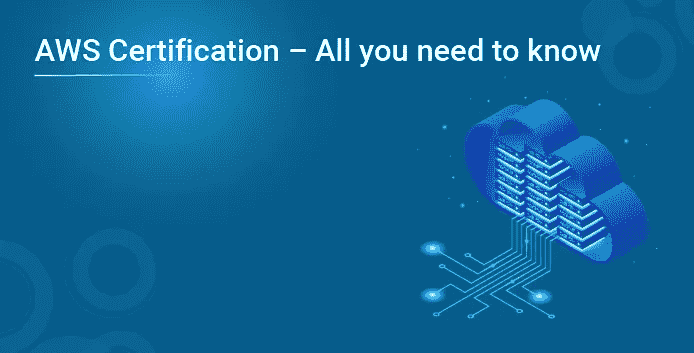
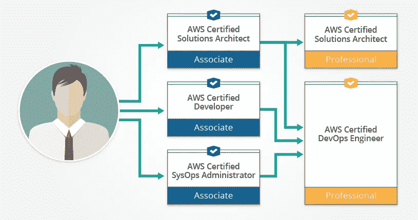

# AWS 认证—您需要知道的一切

> 原文：<https://medium.com/edureka/aws-certification-4b4baead9696?source=collection_archive---------3----------------------->

“5 个 AWS 认证中的每一个都有超过 10 万美元的薪水——福布斯”

受欢迎的云平台亚马逊网络服务(AWS)提供了一系列云计算服务，这些服务在云计算领域开辟了热门的职业前景。有五种不同的认证，每一种都打开了提升职业机会的闸门。在本文中，我们将按以下顺序讨论不同的认证:

*   AWS 认证学习路径
*   AWS 认证的好处
*   AWS 工作前景
*   AWS 认证的类型

# AWS 认证学习路径

AWS 认证有多种基于角色的学习途径。它有助于培养云技能，并以正确的方式向 AWS 认证迈进。一些基于角色的学习途径包括:

*   **云从业者学习路径** —该学习路径专为希望构建和验证对 AWS 云的整体理解的个人而构建。这对于使用 AWS 云的技术、管理、销售、采购或财务人员非常有用。
*   **架构师学习路径** —该学习路径是为解决方案架构师、解决方案设计工程师以及任何想要学习如何在 AWS 上设计应用和系统的人设计的。它将帮助你在 AWS 认证的道路上建立技术技能。
*   **开发者学习路径** —它是为那些想要学习如何在 AWS 上开发云应用的软件开发者而设计的。此外，它有助于建立技术技能。
*   **运营学习路径** —该学习路径专为 SysOps 管理员、系统管理员和 DevOps 角色的人员设计。您可以学习如何在 AWS 平台上创建应用程序、网络和系统的自动化和可重复部署。

这些是不同的基于角色的 AWS 认证学习途径。现在，让我们继续了解这些认证的好处。

# AWS 认证的好处

一些好处包括:

*   你可以按照自己的进度学习。选择任何与您的角色、解决方案领域和专业知识水平相关的按需培训。
*   你将接受 AWS 专家的培训。它有助于通过现场或虚拟课程培养认证讲师的技能。
*   选择您的学习路径，培养您的云技能，并向 AWS 认证迈进。
*   通过行业认可的证书验证您的 AWS 云技能并提高您的可信度。

这些是 AWS 认证的一些优势。现在，我们来看看不同的工作前景。

# AWS 认证工作前景

据《福布斯》报道，AWS 认证解决方案架构师助理是排名第一的认证计划。在 2021 年全球调查中，薪酬中位数为 139，529 美元的解决方案架构师是薪酬最高的认证。此外，AWS 的所有认证将帮助你获得超过 10 万美元的薪水。招聘人员寻求的特定解决方案架构师技能包括 AWS 设计、为您的企业选择合适的 AWS 服务、AWS 数据的输入和输出、估计 AWS 成本以及为您的组织确定成本控制措施。

在全球范围内，IT 行业本身就有超过 38 万个云计算工作岗位。随着云计算渗透到几乎每一个垂直业务领域，对合格的认证云专业人员的需求也在不断增长。AWS 目前领先于大多数已经投资或计划投资 AWS 工具和服务的公司。这是一个清晰的信号，表明如果你致力于 AWS，美好的时光将会到来。

# AWS 认证的类型

AWS 认证提供了一些最受欢迎的技能，这些技能得到了云计算领域最知名的实体之一的验证。在企业中，认证展示了对平台的共同理解、共同的术语和一定水平的云专业知识。AWS 继续引领公共云的采用，目前它提供各种认证，涵盖基础和专业云计算主题。

AWS 允许你将它的认证套件打包成三个模块——**解决方案架构师**、**开发人员**和**系统操作员**。虽然解决方案架构师本身是一个独立的流，但是开发人员和/或 SysOps 助理认证可以引导您获得 DevOps 工程师认证。

根据你的兴趣、职业目标和经验，你可以决定参加哪种认证。值得注意的是，助理级认证不要求之前有任何 AWS 经验。然而，专家认为，使用任何 AWS 工具大约一年的经验将对更快地破解考试有很大帮助。这三项专业考试要求你有两年或两年以上的 AWS 实践经验，但亚马逊相信你的话，不要求你提供任何经验证明。现在，让我们详细了解这些认证中的每一项:

## AWS 认证解决方案架构师助理

AWS 认证解决方案架构师助理考试是为那些在设计分布式应用程序方面有一定经验的人设计的。候选人需要能够证明他们有能力使用 AWS 平台上的工具和服务来设计、管理和实现应用程序。该考试在 2018 年 2 月进行了更新，以包括更多 AWS 服务和最佳实践。

**考试详情:**

形式:多项选择，多项回答
时间:130 分钟(基于新考试)
费用:150 美元

**覆盖区域:**

*   网络技术及其在 AWS 中的工作方式
*   基于 AWS 的应用程序如何工作，以及客户端接口如何连接到 AWS 平台
*   如何在 AWS 平台上构建安全可靠的应用程序
*   部署混合系统—具有内部数据中心和 AWS 组件的系统
*   考试领域包括高可用性和可伸缩性系统的设计(要求熟悉 AWS 基础设施和概念)、AWS 的实施和部署、AWS 相关的数据安全实践、灾难恢复技术和故障排除

## AWS 认证开发人员-助理

AWS 认证开发人员助理考试是关于开发和维护基于 AWS 的应用程序。您需要知道如何编写使用 AWS 软件从您的定制业务应用程序中访问 AWS 应用程序的实际代码。

**考试详情:**

形式:多项选择，多项回答
时间:80 分钟
费用:150 美元

**涵盖的领域:**

*   了解基本 AWS 架构和核心 AWS 服务
*   设计、开发、部署和维护应用程序的实践经验
*   利用关键 AWS 服务的应用程序的工作知识，如 AWS 数据库、通知、工作流服务以及存储和变更管理服务

## AWS 认证系统运行管理员—助理

AWS 认证系统管理员助理考试是唯一一项完全面向系统管理员的认证。通过这项考试需要 AWS 平台操作方面的技术专业知识和概念知识。有 Linux 或 Windows 管理员经验者优先。

**考试详情:**

形式:多项选择，多项回答
时间:80 分钟
费用:150 美元

**涵盖的领域:**

*   将应用程序部署到 AWS 平台
*   在数据中心和自动气象站之间发送和接收数据
*   选择合适的 AWS 服务来满足组织的需求
*   在 AWS 环境中供应、管理和保护系统

## AWS 认证解决方案架构师-专业

专业的 AWS 架构师能够评估组织的需求，并为在 AWS 上实现和部署应用程序提出架构建议。认证解决方案架构师专业认证要求高度的技术技能和设计基于 AWS 的应用程序的经验。

**先决条件:**

*   作为 AWS 认证解决方案架构师助理。
*   两年在 AWS 上设计和部署云架构的实践经验，以及多应用架构设计的最佳实践知识。

**考试详情:**

形式:多项选择，多项回答
时间:170 分钟
费用:300 美元

**覆盖区域:**

*   在 AWS 上构建设计应用程序的最佳实践
*   根据应用程序的要求选择正确的 AWS 服务
*   复杂应用系统向 AWS 的迁移
*   成本优化策略的知识

## AWS 认证 DevOps 工程师-专业

DevOps 工程师认证完全是关于在 AWS 平台上供应、操作和管理应用程序。该考试重点关注持续交付(CD)和流程自动化，这是 DevOps 运动的两个基本概念。

**先决条件:**

*   作为 AWS 认证开发人员助理或 AWS 认证系统运行管理员助理的身份。
*   具有供应和管理基于 AWS 的应用程序的经验，以及对现代应用程序开发(如敏捷开发方法)的深刻理解。

**考试详情:**

形式:多项选择，多个答案
时间:170 分钟
费用:300 美元

**涵盖的领域:**

*   现代 CD 方法论的基础
*   如何实现光盘系统
*   在 AWS 上设置、监控和记录系统
*   如何在 AWS 上实现高可用性和可伸缩性的系统
*   如何设计和管理能够实现生产操作自动化的工具

至此，我们已经完成了 AWS 认证。我希望你了解不同类型的 AWS 认证，这将有助于你的职业发展。我希望你喜欢这些 Azure 面试问题。如果你想查看更多关于 Python、DevOps、Ethical Hacking 等市场最热门技术的文章，那么你可以参考 [Edureka 的官方网站。](https://www.edureka.co/blog/?utm_source=medium&utm_medium=content-link&utm_campaign=aws-certification-careers)

请留意本系列中解释 Azure 其他方面的其他文章。

> *1。* [*蔚蓝教程*](/edureka/azure-tutorial-5a97e30ee9a7)
> 
> *2。* [*蔚蓝门户*](/edureka/azure-portal-all-you-need-to-know-about-the-azure-console-8ade1effa474)
> 
> *3。* [*Azure 存储教程*](/edureka/azure-storage-tutorial-an-introduction-to-azure-storage-dae8fd8f555c)
> 
> *4。* [*蔚蓝专用网*](/edureka/azure-virtual-network-securing-your-applications-using-vpc-744eba3aa5b1)
> 
> *5。* [*Azure DevOps 教程*](/edureka/azure-devops-cf755fb334ae)
> 
> *6。* [*蔚蓝色棋盘*](/edureka/azure-boards-ce093b2688bb)

*原载于 2021 年 1 月 21 日 https://www.edureka.co**[*。*](https://www.edureka.co/blog/aws-certification-careers/)*