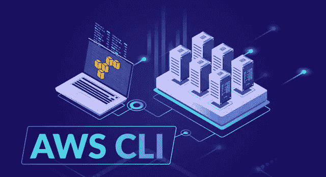

# AWS CLI—了解其应用和优势

> 原文：<https://medium.com/edureka/aws-cli-9614bf69292d?source=collection_archive---------0----------------------->



AWS CLI — Edureka

亚马逊网络服务(AWS)是云计算领域的市场领导者和顶级创新者。它可以帮助公司处理各种工作负载，如游戏开发、数据处理、仓储、存档、开发等。但是，AWS 不仅仅是引人注目的浏览器控制台。是时候看看 Amazon 的命令行界面了——AWS CLI。

在深入研究之前，让我们先来看看本文涉及的主题。

*   什么是 AWS CLI？
*   AWS CLI 的使用
*   安装 AWS CLI
*   如何使用 AWS CLI？

# **什么是 AWS CLI？**

*AWS 命令行界面(AWS CLI)是一个统一的工具，使用它，您可以从客户端的终端会话管理和监控您的所有 AWS 服务。*

尽管大多数 AWS 服务都可以通过 AWS 管理控制台或 API 来管理，但还有第三种方式非常有用:命令行界面(AWS CLI)。AWS 使得 Linux、MacOS 和 Windows 用户可以从本地终端会话的命令行管理主要的 AWS 服务。因此，只需一步安装和最少的配置，您就可以使用终端程序开始使用 AWS 管理控制台提供的所有功能。那就是:

*   **Linux shell:**您可以使用 bash、tsch 和 zsh 等命令 shell 程序在 Linux、macOS 或 Unix 等操作系统中运行命令
*   **Windows 命令行:**在 Windows 上，您可以在 PowerShell 或 Windows 命令提示符下运行命令
*   **远程:**您可以通过 PuTTY 或 SSH 等远程终端在 Amazon EC2 实例上运行命令。您甚至可以使用 AWS Systems Manager 跨您的 AWS 资源自动执行操作任务

除此之外，它还提供对 AWS 服务公共 API 的直接访问。除了低级 API 等效命令之外，AWS CLI 还提供了对多种服务的定制。

本文将告诉您开始使用 AWS 命令行界面并在日常操作中熟练使用它所需要知道的一切。

# AWS CLI 的使用

下面列出的几个理由足以让您开始使用 AWS 命令行界面。

## **安装简便**


在 AWS CLI 引入之前，像旧的 AWS API 这样的工具包的安装涉及太多复杂的步骤。用户必须设置多个环境变量。但是 AWS 命令行界面的安装是快速、简单和标准化的。

## **节省时间**


尽管用户友好，AWS 管理控制台有时相当麻烦。假设你想找一个大的

亚马逊 S3 文件夹。你必须登录你的帐户，搜索正确的 S3 桶，找到正确的文件夹，寻找正确的文件。但是使用 AWS CLI，如果您知道正确的命令，整个任务只需几秒钟。

## **自动化流程**


AWS CLI 使您能够通过脚本自动化控制和管理 AWS 服务的整个过程。这些脚本使用户可以轻松地完全自动化云基础架构。

## **支持所有亚马逊网络服务**


在 AWS CLI 出现之前，用户需要一个专用的 CLI 工具来提供 EC2 服务。它工作正常，但它不允许用户控制其他亚马逊网络服务，例如 AWS RDS(关系数据库服务)。但是，AWS CLI 让你从一个简单的工具控制*所有的*服务。

现在我们已经了解了什么是 AWS CLI，让我们开始安装过程。

# 安装 AWS CLI

AWS 命令行界面有三种安装方式:

*   使用画中画
*   使用虚拟环境
*   使用捆绑的安装程序

在本文中，我们将了解如何使用 pip 安装 AWS CLI。

**先决条件**

1.  Python 2 版本 2.6.5 以上或 Python 3 版本 3.3 以上
2.  Windows、Linux、macOS 或 Unix 操作系统

# 使用 pip 安装 AWS CLI

安装 AWS CLI 的常用方法是使用 pip。pip 是一个软件包管理系统，用于安装和管理用 Python 编写的软件包。

**第一步:**安装 pip(在 Ubuntu OS 上)

```
$ sudo apt install python3-pip
```

第 2 步:安装 CLI

```
$ pip install awscli --upgrade --user
```

**步骤 3:** 检查安装

```
$ aws --version
```

一旦您确定 AWS CLI 已成功安装，您需要对其进行配置，以开始通过 AWS CLI 访问您的 AWS 服务。

## 配置 AWS CLI

步骤 4:使用以下命令配置 AWS CLI

```
$ aws configure
AWS Access Key ID [None]: AKI************
AWS Secret Access Key [None]: wJalr********
Default region name [None]: us-west-2
Default output format [None]: json
```

作为上述命令*，*的结果，AWS CLI 将提示您输入四条信息。前两项是必需的。这些是您的 AWS 访问密钥 ID 和 AWS 秘密访问密钥，它们充当您的帐户凭证。您需要的其他信息是区域和输出格式，您可以暂时将它们保留为默认值。

**注意:**如果您还没有凭据，可以在 AWS 身份和访问管理(IAM)中生成新凭据。

一切就绪！您现在可以开始使用 AWS CLI 了。让我们借助几个基本示例来看看 AWS CLI 有多强大。

# 如何使用 AWS CLI？

假设您已经在 AWS 上运行了一些服务，并使用 AWS 管理控制台实现了这些服务。完全相同的工作可以完成，但是使用 Amazon 命令行界面要简单得多。

这是一个演示，

假设您想从 EC2 启动一个 Amazon Linux 实例。

如果您希望使用 AWS 管理控制台来启动实例，您需要:

*   加载 EC2 仪表板
*   点击*启动实例*
*   选择 AMI 和实例类型
*   在“配置实例详细信息”页面上设置网络、生命周期行为、IAM 和用户数据设置
*   在“添加存储”页面上选择存储卷
*   在“添加标签”页面上添加标签
*   在“配置安全组”页面上配置安全组
*   最后，检查并启动实例

另外，不要忘记弹出窗口，在那里您将确认您的密钥对，然后返回 EC2 实例仪表板以获取您的实例数据。这听起来没那么糟糕，但是想象一下，当使用慢速互联网连接工作时，或者如果您必须多次启动不同变体的多个实例时，都要这样做。这要花很多时间和精力，不是吗？

现在，让我们看看如何使用 AWS CLI 完成同样的任务。

***步骤 1:使用 AWS CLI* 创建新的 IAM 用户**

***让我们看看如何创建一个新的 IAM 组和一个新的 IAM 用户&，然后使用 AWS 命令行界面*** 将用户添加到组中

*   首先，使用 *create-group* 创建一个新的 IAM 组

```
$ aws iam create-group --group-name *mygroup*
```

*   使用*创建用户*创建一个新用户

```
$ aws iam create-user --user-name *myuser*
```

*   然后使用*添加用户到组*命令将用户添加到组

```
$ aws iam add-user-to-group --user-name *myuser* --group-name *myiamgroup*
```

*   最后，使用命令 *put-user-policy* 将策略(保存在文件中)分配给用户

```
$ aws iam put-user-policy --user-name *myuser* --policy-name *mypoweruserole* --policy-document file://MyPolicyFile.jso
```

*   如果您想为 IAM 用户创建一组访问密钥，使用命令 *create-access-key*

```
$ aws iam create-access-key --user-name *myuser*
```

***步骤 2:使用 AWS CLI 启动 Amazon Linux 实例***

***就像使用 AWS 管理控制台启动 EC2 实例一样，您需要在启动实例之前创建一个密钥对和安全组***

*   使用 create-key-pair 命令创建一个密钥对，并使用–query 选项将您的密钥直接传送到文件中

```
$ aws ec2 create-key-pair --key-name *mykeypair* --query 'KeyMaterial' --output text > mykeypair.pem
```

*   然后创建一个安全组，并向该安全组添加规则

```
$ aws ec2 create-security-group --group-name *mysecurityg* --description "My security group"$ aws ec2 authorize-security-group-ingress --group-id *sg-903004f8* --protocol tcp --port 3389 --cidr 203.0.113.0/24
```

*   最后，使用 run-instance 命令启动您选择的 EC2 实例

```
$ aws ec2 run-instances --image-id ami-09ae83da98a52eedf --count 1 --instance-type t2.micro --key-name *MyKeyPair* --security-group-ids sg-903004f8
```

看起来有很多命令，但是您可以通过将所有这些命令组合成一个命令，然后将其保存为脚本来获得相同的结果。这样，您可以在任何需要的时候修改和运行代码，而不是像使用 AWS 管理控制台那样从第一步开始。这可以将五分钟的过程缩短到几秒钟。

现在，您知道了如何使用 AWS CLI 创建 IAM 用户并启动您选择的 EC2 实例。但是 AWS CLI 可以做得更多。

各位，关于 AWS CLI 的这篇文章到此结束。如果你想查看更多关于人工智能、DevOps、道德黑客等市场最热门技术的文章，那么你可以参考 [Edureka 的官方网站。](https://www.edureka.co/blog/?utm_source=medium&utm_medium=content-link&utm_campaign=aws-cli)

请留意本系列中的其他文章，它们将解释 AWS 的各个方面。

> *1。* [*AWS 教程*](/edureka/amazon-aws-tutorial-4af6fefa9941)
> 
> *2。* [*AWS EC2*](/edureka/aws-ec2-tutorial-16583cc7798e)
> 
> *3。*[*AWSλ*](/edureka/aws-lambda-tutorial-cadd47fbd39b)
> 
> *4。* [*AWS 弹性豆茎*](/edureka/aws-elastic-beanstalk-647ae1d35e2)
> 
> *5。* [*AWS S3*](/edureka/s3-aws-amazon-simple-storage-service-aa71c664b465)
> 
> *6。* [*AWS 控制台*](/edureka/aws-console-fd768626c7d4)
> 
> *7。* [*AWS RDS*](/edureka/rds-aws-tutorial-for-aws-solution-architects-eec7217774dd)
> 
> *8。* [*AWS 迁移*](/edureka/aws-migration-e701057f48fe)
> 
> *9。* [*AWS 法盖特*](/edureka/aws-fargate-85a0e256cb03)
> 
> *10。* [*亚马逊 Lex*](/edureka/how-to-develop-a-chat-bot-using-amazon-lex-a570beac969e)
> 
> *11。* [*亚马逊光帆*](/edureka/amazon-lightsail-tutorial-c2ccc800c4b7)
> 
> *12。* [*AWS 定价*](/edureka/aws-pricing-91e1137280a9)
> 
> *13。* [*亚马逊雅典娜*](/edureka/amazon-athena-tutorial-c7583053495f)
> 
> *14。* [*AWS 简历*](/edureka/aws-resume-7453d9477c74)
> 
> *15。* [*亚马逊 VPC 教程*](/edureka/amazon-vpc-tutorial-45b7467bcf1d)
> 
> *15。*T86*AWS vs Azure*
> 
> *17。* [*内部部署 vs 云计算*](/edureka/on-premise-vs-cloud-computing-f9aee3b05f50)
> 
> *18。* [*亚马逊迪纳摩 DB 教程*](/edureka/amazon-dynamodb-tutorial-74d032bde759)
> 
> *19。* [*如何从快照恢复 EC2？*](/edureka/restore-ec2-from-snapshot-ddf36f396a6e)
> 
> *20。* [*AWS 代码提交*](/edureka/aws-codecommit-31ef5a801fcf)
> 
> *21。* [*顶级 AWS 架构师面试问题*](/edureka/aws-architect-interview-questions-5bb705c6b660)
> 
> *22。* [*如何从快照恢复 EC2？*](/edureka/restore-ec2-from-snapshot-ddf36f396a6e)
> 
> 23。 [*使用 AWS 创建网站*](/edureka/create-websites-using-aws-1577a255ea36)
> 
> *24。* [*亚马逊路线 53*](/edureka/amazon-route-53-c22c470c22f1)
> 
> *25。* [*用 AWS WAF 保护 Web 应用*](/edureka/secure-web-applications-with-aws-waf-cf0a543fd0ab)

*原载于 2019 年 2 月 9 日*[*www.edureka.co*](https://www.edureka.co/blog/aws-cli/)*。*