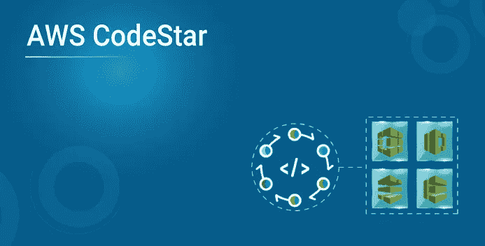
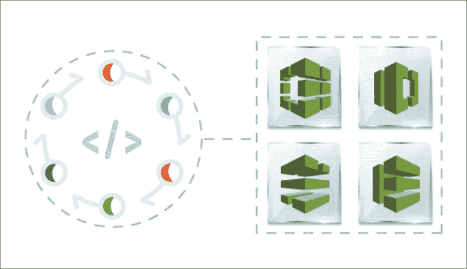

# AWS CodeStar 教程:AWS CodeStar 一瞥

> 原文：<https://medium.com/edureka/aws-codestar-5cfa0dc6728b?source=collection_archive---------1----------------------->

随着 AWS 上 DevOps 服务需求的增长，AWS 提供了许多服务来满足不断增长的 DevOps 需求。AWS 还推出了一项名为 AWS CodeStar 的服务，将所有 AWS DevOps 服务整合在一起。在本文中，我们将详细讨论 AWS CodeStar。

以下是这篇 AWS CodeStar 文章中将要讨论的要点:

1.  什么是 AWS CodeStar？
2.  我可以用这项服务做什么？
3.  重要组件

所以，让我们开始吧，

# 什么是 AWS CodeStar？

AWS CodeStar 帮助您在 Amazon Web Services 上创建、管理和使用软件开发项目。该服务帮助您完成各种 DevOps 操作，以便您可以在 AWS 上开发、构建和部署应用程序。如前所述，它有助于简化 DevOps 流程，为此，它将流行的 AWS DevOps 服务整合在一起。这些服务是:

*   为了构建代码，你有 **AWS 代码构建**
*   部署由 **AWS CodeDeploy** 负责
*   对于版本控制，我们有 **AWS 代码提交**
*   **AWS 代码管道**用于构建 CI/CD 管道

项目允许您为软件开发工具链创建和集成 AWS 服务。项目模板可能包括源代码管理、构建、部署、虚拟服务器或无服务器资源等等。

那么这是关于什么是 AWS CodeStar，让我们现在了解它能做什么？

# 我可以用这项服务做什么？

AWS CodeStar 提供了以下功能:

## 在几分钟内开始新项目

AWS CodeStar 为您提供不同的平台和工具来创建和托管您的应用程序。因为它负责设置您的项目资源，所以您可以协作并使不同的工具一起工作。这反过来帮助你在更短的时间内非常容易地启动新项目。

## 可视化、操作和协作您的项目

协作过程变得更加容易，因为该服务的仪表板让您可以可视化项目开发过程中执行的所有操作。

## 使用所需工具进行快速迭代

AWS CodeStar 为您的项目配备了集成开发工具链。您可以推送代码，更改可以自动部署。与问题跟踪的集成允许您跟踪下一步需要做什么。
您和您的团队可以在代码交付的所有阶段更快、更有效地合作。

现在，让我们来看看这项服务的一些重要组成部分:

# 重要组件

该服务有四个组成部分，它们是:

*   项目模板
*   组
*   仪表板
*   扩展ˌ扩张

让我们试着一个一个地理解这一点:

## 项目模板

这些确保您有样本模板可以使用。

该模板确保您花费很少的时间来配置资源，而将更多的时间放在业务目标上。它允许您选择以下选项进行自动配置，

*   应用类型
*   程序设计语言
*   计算平台

如果需要，以后您可以选择用其他应用程序替换您的示例应用程序。

## 组

一旦模板和项目需求完全满足，您就需要专注于授予适当的访问权限和管理将要参与项目的团队。在 AWS CodeStar 中，每个项目都有一个*项目团队*。一个用户可以属于多个 AWS CodeStar 项目，并在每个项目中拥有不同的 AWS CodeStar 角色(因此拥有不同的权限)。

在 AWS CodeStar 中，团队成员可以选择别名。他们还可以添加电子邮件地址，以便其他团队成员可以联系他们。不是所有者的团队成员不能更改他们在项目中的 AWS CodeStar 角色。

## 仪表盘

AWS CodeStar 为您提供了一个仪表板，它非常具有交互性和直观性，允许您执行以下操作:

*   添加、移除或移动仪表板上的互动程序
*   向仪表板添加项目扩展
*   自定义团队 Wiki 互动程序

## 扩展ˌ扩张

该服务还为您提供了一些扩展，让您可以向仪表板添加图块和功能。为此，选择**扩展**。在扩展旁边，你有一个选项叫做**显示在仪表板上**。您必须选择它。要设置显示在仪表板上的分机，请选择分机上的“连接”按钮或命令，然后按照说明完成设置。

扩展是非常重要的，这项服务也让你可以自由地添加 JIRA 扩展，这是目前的中心，特别是当它涉及到 CI/CD 项目。

这就是这篇文章的结尾。如果你想查看更多关于人工智能、DevOps、道德黑客等市场最热门技术的文章，你可以参考 Edureka 的官方网站。

请留意本系列中解释 AWS 各个方面的其他文章。

> *1。* [*AWS 教程*](/edureka/amazon-aws-tutorial-4af6fefa9941)
> 
> *2。* [*AWS EC2*](/edureka/aws-ec2-tutorial-16583cc7798e)
> 
> *3。*[*AWSλ*](/edureka/aws-lambda-tutorial-cadd47fbd39b)
> 
> *4。* [*AWS 弹性豆茎*](/edureka/aws-elastic-beanstalk-647ae1d35e2)
> 
> *5。*[*AWS*](/edureka/s3-aws-amazon-simple-storage-service-aa71c664b465)
> 
> *6。* [*AWS 控制台*](/edureka/aws-console-fd768626c7d4)
> 
> *7。* [*AWS RDS*](/edureka/rds-aws-tutorial-for-aws-solution-architects-eec7217774dd)
> 
> *8。* [*AWS 迁移*](/edureka/aws-migration-e701057f48fe)
> 
> 9。[*AWS Fargate*](/edureka/aws-fargate-85a0e256cb03)
> 
> *10。* [*亚马逊 Lex*](/edureka/how-to-develop-a-chat-bot-using-amazon-lex-a570beac969e)
> 
> *11。* [*亚马逊光帆*](/edureka/amazon-lightsail-tutorial-c2ccc800c4b7)
> 
> *12。* [*AWS 定价*](/edureka/aws-pricing-91e1137280a9)
> 
> *13。* [*亚马逊雅典娜*](/edureka/amazon-athena-tutorial-c7583053495f)
> 
> *14。* [*AWS CLI*](/edureka/aws-cli-9614bf69292d)
> 
> *15。* [*亚马逊 VPC 教程*](/edureka/amazon-vpc-tutorial-45b7467bcf1d)
> 
> *15。*[*AWS vs Azure*](/edureka/aws-vs-azure-1a882339f127)
> 
> *17。* [*内部部署 vs 云计算*](/edureka/on-premise-vs-cloud-computing-f9aee3b05f50)
> 
> *18。* [*亚马逊迪纳摩 DB 教程*](/edureka/amazon-dynamodb-tutorial-74d032bde759)
> 
> *19。* [*如何从快照恢复 EC2？*](/edureka/restore-ec2-from-snapshot-ddf36f396a6e)
> 
> *20。* [*AWS 代码提交*](/edureka/aws-codecommit-31ef5a801fcf)
> 
> *21。* [*顶级 AWS 架构师面试问题*](/edureka/aws-architect-interview-questions-5bb705c6b660)
> 
> *22。* [*如何从快照恢复 EC2？*](/edureka/restore-ec2-from-snapshot-ddf36f396a6e)
> 
> *23。* [*使用 AWS 创建网站*](/edureka/create-websites-using-aws-1577a255ea36)
> 
> *24。* [*亚马逊路线 53*](/edureka/amazon-route-53-c22c470c22f1)
> 
> *25。* [*AWS 简历*](/edureka/aws-resume-7453d9477c74)

*原载于 2019 年 4 月 8 日*[*https://www.edureka.co*](https://www.edureka.co/blog/aws-codestar/)*。*