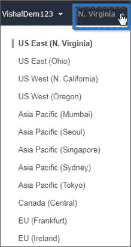

# AWS 管理控制台- AWS 控制台界面

> 原文：<https://medium.com/edureka/aws-console-fd768626c7d4?source=collection_archive---------1----------------------->

AWS Management Console - Edureka

不可否认， **AWS** 是市场上领先的云服务提供商之一。 **AWS** 发现自己是云计算事务的掌舵人的主要原因之一是你可以轻松访问**亚马逊网络服务**。那要怎么做呢？嗯，我们有 **AWS 控制台**或 **AWS 管理控制台**来帮助我们做同样的事情。在这篇关于 **AWS 控制台**的博客中，我将写下并演示你可以用 ***AWS*** 做的所有很酷的事情。

在我们开始之前，让我记下你可以在这个博客中看到的要点:

1.  什么是 AWS？
2.  什么是 AWS 控制台？
3.  AWS 控制台入门

因此，没有任何进一步的拖延，让我们跳转到这个 **AWS 控制台**博客的第一个主题:

# 什么是 AWS？

**亚马逊网络服务(AWS)** 是来自亚马逊的云服务提供商，它以构建块的形式提供服务，这些构建块可以用来在云中创建和部署任何类型的应用程序。这些服务或构建块被设计为彼此协同工作，并产生复杂且高度可伸缩的应用程序。

AWS 有大约 70 种不同的服务，这些服务隶属于特定的领域。下图显示了 **AWS** 中的一些主要服务领域:

AWS Services Domains - AWS Console

现在，让我们继续这个博客，试着理解什么是 **AWS 控制台**:

# 什么是 AWS 控制台？

**AWS 控制台**或 **AWS 管理控制台**是一个 web 应用程序，可让您管理 **AWS** 。它有各种服务可供选择。该控制台支持各种活动，如为您提供指标详细信息或帐户账单等。控制台的内置用户界面让你可以使用 **S3 桶**、**启动实例**等

简而言之，你可以通过一个简单而直观的基于网络的用户界面来访问和管理亚马逊网络服务。如果您关心的是使用手机访问一些功能，那么 **AWS 控制台移动应用**可以让您在旅途中快速查看资源。

以下是 **AWS** 控制台的一些特性列表:

*   管理您的 **AWS** 账户
*   在 **AWS** 控制台中查找服务
*   了解关于 **AWS** 的更多信息
*   Pin 服务快捷方式
*   标签编辑器
*   从您的移动设备管理 **AWS** 资源

下面是 AWS 控制台的快照:

既然介绍已经结束了，让我们继续这个 **AWS 控制台**博客，看看我们能做些什么。

# AWS 控制台入门

在我们开始探索这款游戏机的功能之前，你需要在 **AWS** 上创建一个账户。没有账户的人可以访问 **AWS 的**网站并**创建一个免费账户。**您必须输入您的信用卡/借记卡详细信息。 **AWS** 在免费订阅期间，只要您按照指定的限制使用服务，就不会向您收费。

一旦你有了账户，你就可以开始了。那么你能用 **AWS 控制台**做什么呢？

# 访问 AWS 服务:

有两种方法可以做到。第一，您可以点击控制台左上角的**服务**选项卡，所有服务的列表就会显示出来。二、使用**搜索**选项卡查找所需服务。

# 将服务固定到控制台

您可以轻松地将常用服务的快捷方式固定到控制台。只需点击控制台左上角的 **Pin** 图标，然后点击 hold 将您想要的服务固定到控制台。

接下来，将所需的服务拖放到**图钉**图标上，您的快捷方式就创建好了。

如果您想删除这些图标，可以将它们拖放回来。

# 帐户下拉菜单

右上角有一个标签，上面有您的帐户名称。如果您点击它，您将可以使用以下功能:

您可以浏览帐户详情、组织详情、检查您的账单仪表板、更改密码等。该选项卡的右侧是“**地区**”选项卡，它会告诉您当前在哪个地区运营，您可以继续选择其他地区。

使用 **AWS 控制台**可以做更多的事情。每个服务都有自己的功能。

这让我们在 AWS 控制台上结束了这篇博客。如果你想查看更多关于人工智能、DevOps、道德黑客等市场最热门技术的文章，你可以参考 Edureka 的官方网站。

请留意本系列中的其他文章，它们将解释 AWS 的各个方面。

> *1。* [*AWS 教程*](/edureka/amazon-aws-tutorial-4af6fefa9941)
> 
> *2。* [*AWS EC2*](/edureka/aws-ec2-tutorial-16583cc7798e)
> 
> *3。*[*AWSλ*](/edureka/aws-lambda-tutorial-cadd47fbd39b)
> 
> *4。* [*AWS 弹性豆茎*](/edureka/aws-elastic-beanstalk-647ae1d35e2)
> 
> *5。* [*AWS S3*](/edureka/s3-aws-amazon-simple-storage-service-aa71c664b465)
> 
> *6。* [*AWS 简历*](/edureka/aws-resume-7453d9477c74)
> 
> 7。 [*AWS RDS*](/edureka/rds-aws-tutorial-for-aws-solution-architects-eec7217774dd)
> 
> *8。* [*AWS 迁移*](/edureka/aws-migration-e701057f48fe)
> 
> *9。*[*AWS Fargate*](/edureka/aws-fargate-85a0e256cb03)
> 
> *10。* [*亚马逊 Lex*](/edureka/how-to-develop-a-chat-bot-using-amazon-lex-a570beac969e)
> 
> *11。* [*亚马逊光帆*](/edureka/amazon-lightsail-tutorial-c2ccc800c4b7)
> 
> *12。* [*AWS 定价*](/edureka/aws-pricing-91e1137280a9)
> 
> *13。* [*亚马逊雅典娜*](/edureka/amazon-athena-tutorial-c7583053495f)
> 
> *14。* [*AWS CLI*](/edureka/aws-cli-9614bf69292d)
> 
> *15。* [*亚马逊 VPC 教程*](/edureka/amazon-vpc-tutorial-45b7467bcf1d)
> 
> *15。*T80*AWS vs Azure*
> 
> *17。* [*内部部署 vs 云计算*](/edureka/on-premise-vs-cloud-computing-f9aee3b05f50)
> 
> *18。* [*亚马逊迪纳摩 DB 教程*](/edureka/amazon-dynamodb-tutorial-74d032bde759)
> 
> *19。* [*如何从快照恢复 EC2？*](/edureka/restore-ec2-from-snapshot-ddf36f396a6e)
> 
> *20。* [*AWS 代码提交*](/edureka/aws-codecommit-31ef5a801fcf)
> 
> *21。* [*顶级 AWS 架构师面试问题*](/edureka/aws-architect-interview-questions-5bb705c6b660)
> 
> *22。* [*如何从快照恢复 EC2？*](/edureka/restore-ec2-from-snapshot-ddf36f396a6e)
> 
> *23。* [*使用 AWS 创建网站*](/edureka/create-websites-using-aws-1577a255ea36)
> 
> 24。 [*亚马逊路线 53*](/edureka/amazon-route-53-c22c470c22f1)
> 
> *25。* [*用 AWS WAF 保护 Web 应用*](/edureka/secure-web-applications-with-aws-waf-cf0a543fd0ab)

*原载于 2018 年 9 月 7 日 www.edureka.co**T21*[。](https://www.edureka.co/blog/aws-console/)