# AWS 跨帐户 S3 自动桶复制与詹金斯。

> 原文：<https://medium.com/globant/aws-cross-account-s3-automated-bucket-replication-with-jenkin-5b5e0d3b3356?source=collection_archive---------0----------------------->

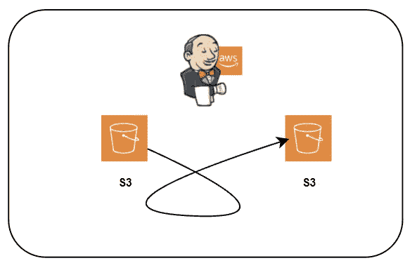

# 介绍

在针对 S3 服务执行的日常操作中，最常见的任务之一实际上是在本地或外部 AWS 帐户之间启用 S3 存储桶复制。这种任务可以成为常规操作，因此可以设置自动化策略来满足该服务的需求。

在本帖中，我将与您分享如何在 S3 复制配置方面将设置这些存储桶配置的时间缩短到几秒钟。

# 关键特征

*   存储桶之间的自动化复制。
*   用于存储桶复制的自动化粒度 IAM 权限集。
*   存储桶复制的自动化规则配置。
*   桶复制的自动 S3 规则策略注入。
*   正在退出 S3 存储桶策略验证，以避免删除旧策略权限。
*   现有存储桶验证。
*   详细的日志操作。
*   自动化复制删除(清理)。
*   供应链管理的管道战略。
*   资源和策略被动态标记以被识别为自动化集成。
*   管道生成中对空参数的错误控制。
*   不存在桶的错误控制。

# 图表

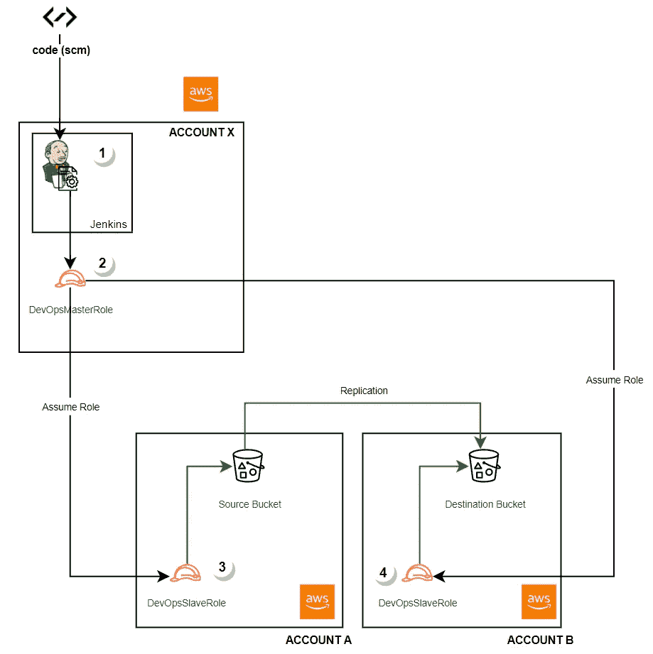

# 工作流程

1.  Jenkins 从源代码(SCM)获得一个 Jenkins 文件，并为自动化设置管道和 bash 脚本。
2.  Jenkins 使用存储桶名称作为参数来触发作业。
3.  Jenkins 使用其 AWS 角色来承担帐户 A 中的角色，以在源桶中设置复制。
4.  Jenkins 使用其 AWS 角色来承担帐户 B 中的角色，以在目标存储桶中授予复制权限。
5.  Jenkins 登录到操作成功或失败的屏幕。

# 秘诀

*   来自 SCM 提供商的代码(Github、bitbucket 等)。
*   詹金斯的例子。
*   詹金斯管道
*   詹金斯 Git 插件。
*   跨客户战略的 AWS 角色。
*   AWS S3 现有铲斗。

*注意:虽然这个 Jenkins 管道计划实际按需创建存储桶，但是由于一些组织在创建存储桶时必须遵守额外的安全措施，因此该功能已经过时。因为这些措施不在本文的讨论范围内，所以这个特性被忽略了。*

# 步骤:

# AWS DevopsMasterRole

AWS DevOpsMaster 角色将充当能够在本地或外部帐户中承担所谓的 DevOpsSlaveRoles 的角色。因此，您必须:

1.  在所谓的 AWS **帐户 X** 中部署 DevOpsMaster 角色，使用 AWS web 控制台或部署此处[提供的 cloudformation 模板](https://github.com/bvsdark/cloudops/blob/main/s3replication/roles/cloudformation/DevOpsMasterRole.yaml):

> 请注意注释掉的行，这些行应该进行更改以匹配您的 AWS 外部帐户 id。仅出于测试目的使用资源**arn:AWS:iam::*:role/devopslaverole**。

2.在您的 Jenkins 实例(EC2、EKS、ECS 等)中附加 DevOpsMaster 角色。

*注意:如 cloudformation 模板中所示，DevOpsMasterRole 将从一个* ***ec2*** *实例中使用，因为允许承担角色的服务是****【ec2.amazonaws.com】****。确保将此权限授予正确的主体(AWS 服务、我是等)。)根据下面引用的 AWS 指南。*

请参考 AWS 指南，根据使用的环境在 Jenkins 实例中附加角色:

*   [将 IAM 角色附加到实例](https://docs.aws.amazon.com/AWSEC2/latest/UserGuide/iam-roles-for-amazon-ec2.html#attach-iam-role) (ec2)
*   [Pod 执行角色](https://docs.aws.amazon.com/eks/latest/userguide/pod-execution-role.html)
*   [任务的 IAM 角色(EC)](https://docs.aws.amazon.com/eks/latest/userguide/pod-execution-role.html)

# AWS DevopsSlaveRole

AWS DevOpsSlaveRole 角色将充当在**帐户 X** 中设置的 Jenkins 实例中承担的角色，它将能够执行 AWS 外部帐户中的任务，即所谓的 **AWS 帐户 A** 、 **AWS 帐户 B** 等。话虽如此，你必须:

1.  使用 AWS web 控制台或此处提供的 cloudformation 模板[在每个外部帐户中部署 DevOpsSlaveRole 角色](https://github.com/bvsdark/cloudops/blob/main/s3replication/roles/cloudformation/DevOpsSlaveRole.yaml):

> 请注意注释掉的行，这些行应该被更改以匹配您的 AWS 粒度权限。仅出于测试目的使用策略**arn:AWS:iam::AWS:policy/administrator access**。

# Jenkins 插件

安装 **GitHub 插件。**请参考插件安装指南[了解更多详情。](https://plugins.jenkins.io/github/)

# 詹金斯管道创建

1.  从[这里](https://github.com/bvsdark/cloudops)([**S3 复制**](https://github.com/bvsdark/cloudops/tree/main/s3replication) **文件夹**下载自动化所需的文件。
2.  浏览路径/[S3 replication](https://github.com/bvsdark/cloudops/tree/main/s3replication)/[scripts](https://github.com/bvsdark/cloudops/tree/main/s3replication/scripts)/**envawscounts . sh**中的**envawscounts . sh**脚本，并查找以下行:
    **export awsaccountids = " accounta accountb "**
    用与本地或外部帐户对应的实际 AWS 帐户 id 替换" **accounta accountb** "。它应该如下所示:
    **export awsaccountids = " 111111111111 2222222222 "**
    *注意:这些 AWS 帐户 id 必须与您在上一步中包含在 DevOpsMasterRole 中的 id 相匹配。*
3.  将修改后的代码上传到 SCM 系统。
4.  创建一个 Jenkins 管道:
    ——浏览您的 Jenkins 安装。
    ——新物品。
    -提供项目名称
    -选择管道，点击确定。

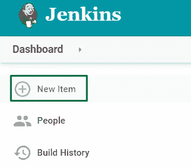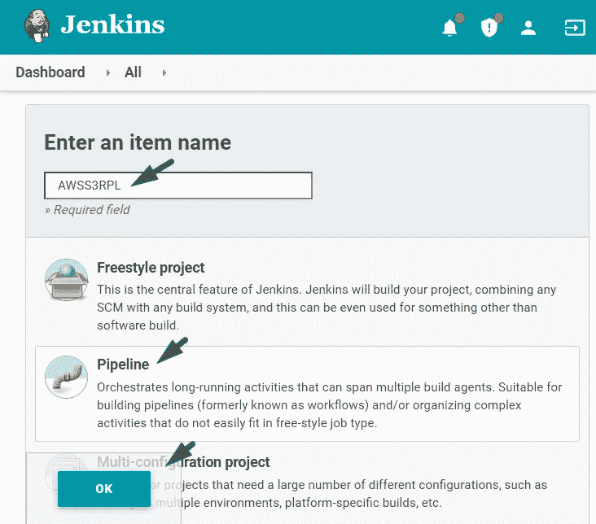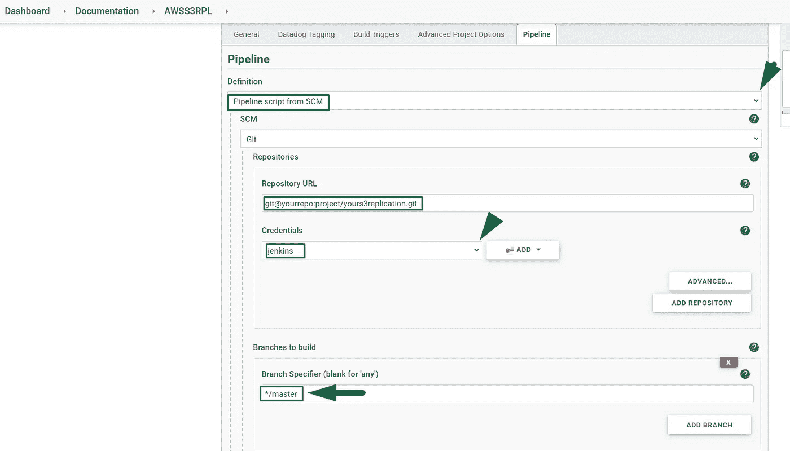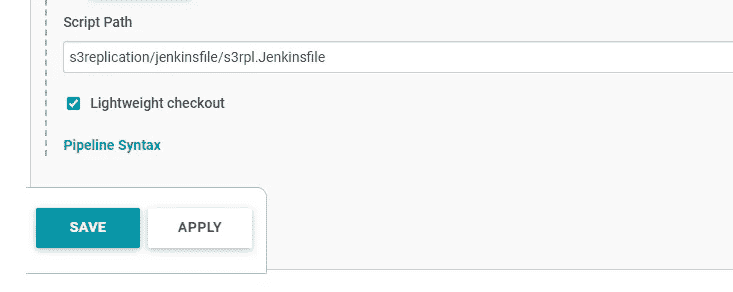

5.在作业屏幕内:

*   向下滚动到
    -在**定义**中，从 SCM 选项中选择*管道脚本。
    -在**存储库 URL** 中，提供您的存储库 URL。
    -在**凭证**中，提供或配置您的存储库凭证。
    -在**分支说明符**中，提供上传代码的分支。
    -在**脚本路径**中，提供路径**S3 replication/Jenkins file/s3r pl。Jenkins file**
    ——点击**保存**按钮。*

6.建立詹金斯工作:

*   在**源桶**参数中，提供您现有的 S3 桶的名称。
*   在 **DestBucket** 参数中，提供您现有的 S3 铲斗的名称。
*   在**终止**参数中，保留默认值，除非您想要禁用桶复制。
*   点击**构建**按钮。
*   在**构建历史**中，将鼠标指针滚动到构建编号上，一个小箭头将展开一个下拉列表。从列表中选择**控制台输出**。
    在 Jenkins 控制台中查看日志输出，或者向下滚动此页面查看 Jenkins 附加的日志。

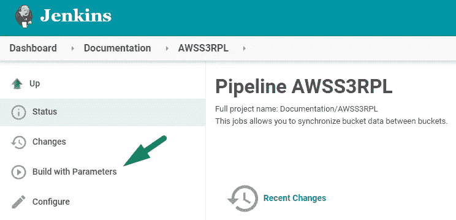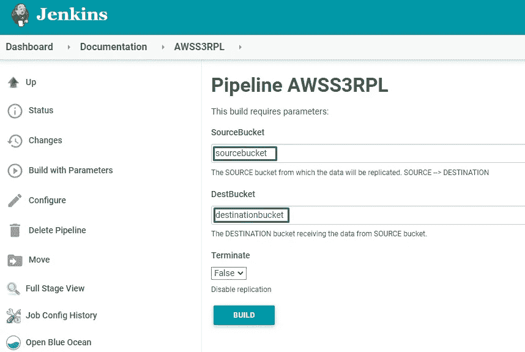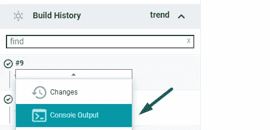

详细的 Jenkins 工作日志:

```
#########################
Validating buckets existence.
##########################

SOURCE BUCKET sourcebucket FOUND
DESTINATION BUCKET destinationbucket FOUND

############################################################################################################################################
ALL BUCKETS FOUND - SUMMARY
SOURCE BUCKET INFO: NAME: sourcebucket ACCOUNT: AWSACCOUNTA - 1111111111
DESTINATION BUCKET INFO: NAME: destinationbucket ACCOUNT: AWSACCOUNTB - 2222222222

############################################################################################################################################

#################################################################
Preparing destinationbucket bucket policy for replication.
###################################################################

An error occurred (NoSuchBucketPolicy) when calling the GetBucketPolicy operation: The bucket policy does not exist

###############################################################################################################################
The destination destinationbucket bucket does not contain an S3 Replication policy. Creating S3 Replication Policy...
#################################################################################################################################

#######################################################
The destinationbucket bucket S3 Replication policy is now set.
#########################################################

########################################################
Checking versioning status at Destination bucket destinationbucket.
##########################################################

###############################################################
Versioning successfully enabled at Destination Bucket destinationbucket.
#################################################################

########################################################
Checking versioning status at source bucket sourcebucket .
##########################################################

###############################################################
Versioning successfully enabled at Source Bucket sourcebucket.
#################################################################

########################################################
Checking IAM Role for replication from sourcebucket.
##########################################################

############################################################
Creating IAM Role sourcebucket-S3ReplicationRoleAUT.
#############################################################

{
    "Role": {
        "AssumeRolePolicyDocument": {
            "Version": "2012-10-17", 
            "Statement": [
                {
                    "Action": "sts:AssumeRole", 
                    "Effect": "Allow", 
                    "Principal": {
                        "Service": "s3.amazonaws.com"
                    }
                }
            ]
        }, 
        "RoleId": "YOURAROAROLEID", 
        "CreateDate": "2021-10-21T21:39:58Z", 
        "RoleName": "sourcebucket-S3ReplicationRoleAUT", 
        "Path": "/", 
        "Arn": "arn:aws:iam::11111111111:role/sourcebucket-S3ReplicationRoleAUT"
    }
}

An error occurred (ReplicationConfigurationNotFoundError) when calling the GetBucketReplication operation: The replication configuration was not found

########################################################
Checking S3 replication rule for bucket sourcebucket.
##########################################################

#################################################################
Creating replication rule ReplicateTo-destinationbucket-AWSACCOUNTB for bucket sourcebucket.
###################################################################

###############################################################
The replication S3 rule ReplicateTo-destinationbucket-AWSACCOUNTB was created with success
#################################################################

[Pipeline] }
[Pipeline] // script
[Pipeline] }
[Pipeline] // stage
[Pipeline] }
[Pipeline] // withEnv
[Pipeline] }
[Pipeline] // withEnv
[Pipeline] }
[Pipeline] // node
[Pipeline] End of Pipeline
Finished: SUCCESS
```

# 决赛成绩

让我们看看资源是如何命名的，以及在 AWS 中是什么样子的:

**AWS 账户 A /源桶。**

对象选项卡:

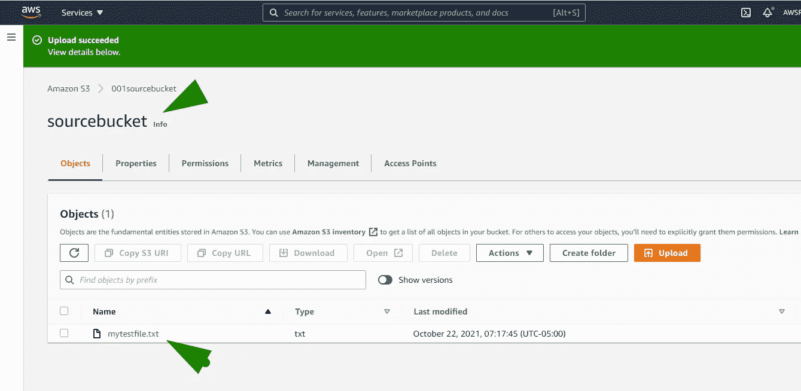

管理选项卡:

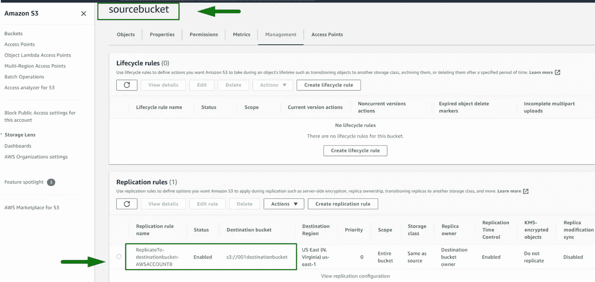

复制规则:

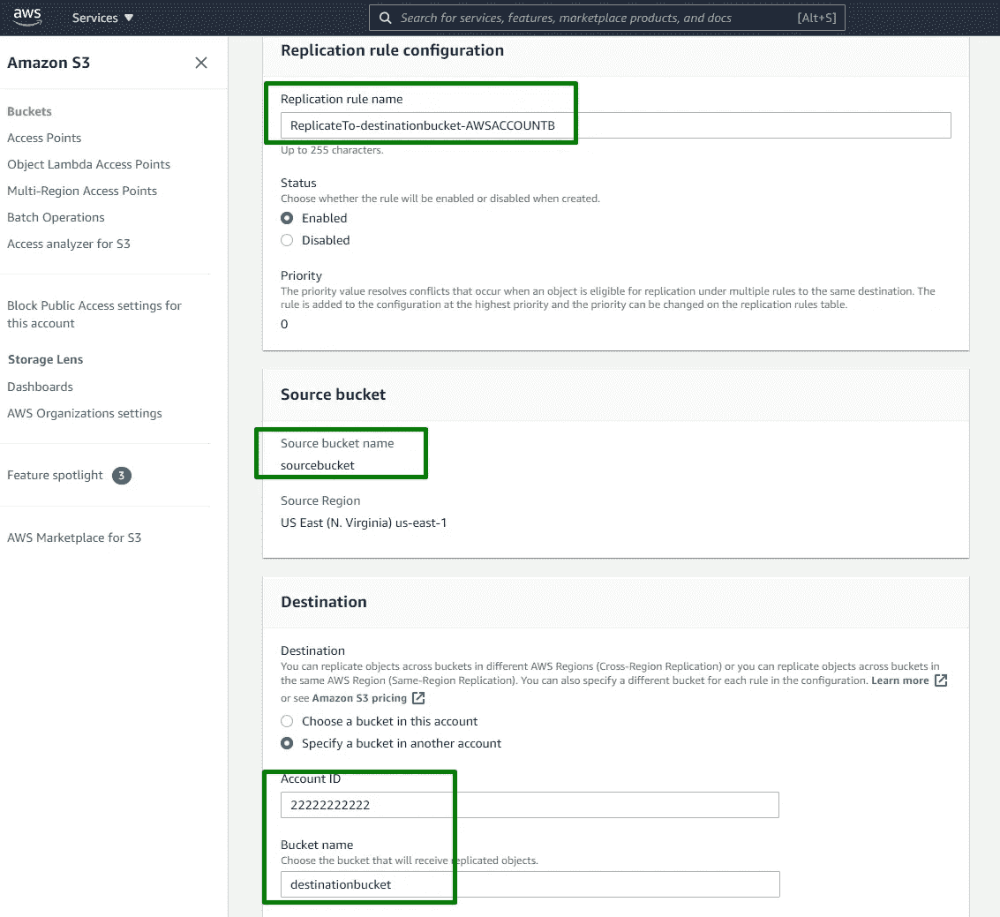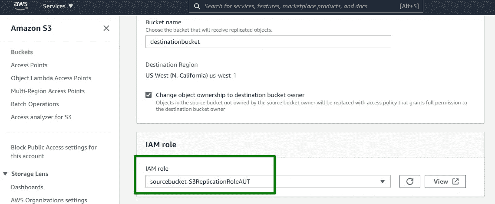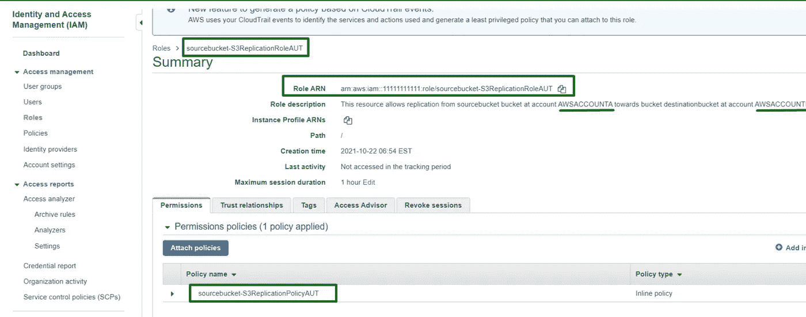

IAM 角色/策略:

```
{
    "Version": "2012-10-17",
    "Statement": [
        {
            "Action": [
                "s3:ListBucket",
                "s3:GetReplicationConfiguration",
                "s3:GetObjectVersionForReplication",
                "s3:GetObjectVersionAcl",
                "s3:GetObjectVersionTagging",
                "s3:GetObjectRetention",
                "s3:GetObjectLegalHold"
            ],
            "Effect": "Allow",
            "Resource": [
                "arn:aws:s3:::sourcebucket",
                "arn:aws:s3:::sourcebucket/*",
                "arn:aws:s3:::destinationbucket",
                "arn:aws:s3:::destinationbucket/*"
            ]
        },
        {
            "Action": [
                "s3:ReplicateObject",
                "s3:ReplicateDelete",
                "s3:ReplicateTags",
                "s3:ObjectOwnerOverrideToBucketOwner"
            ],
            "Effect": "Allow",
            "Resource": [
                "arn:aws:s3:::sourcebucket/*",
                "arn:aws:s3:::destinationbucket/*"
            ]
        }
    ]
}
```

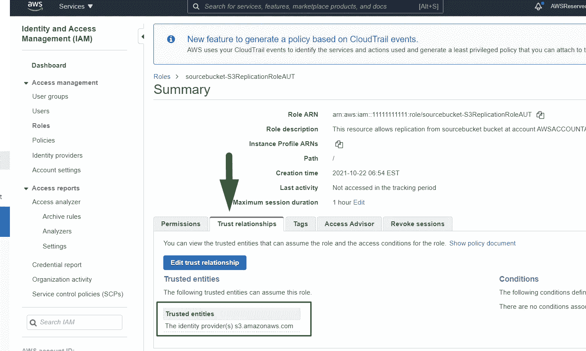

**AWS 账户 B/目的地时段。**

对象选项卡:

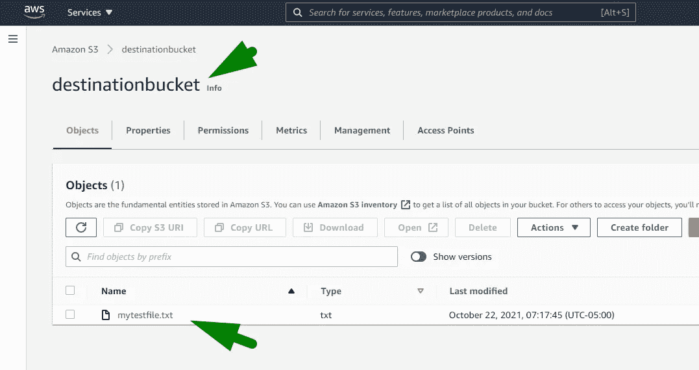

权限选项卡/桶策略:

```
{
    "Version": "2012-10-17",
    "Statement": [
        {
            "Sid": "S3RPLFrom-AWSACCOUNTA-sourcebucket",
            "Effect": "Allow",
            "Principal": {
                "AWS": "arn:aws:iam::11111111111:root"
            },
            "Action": [
                "s3:ListBucket",
                "s3:GetReplicationConfiguration",
                "s3:GetObjectVersionForReplication",
                "s3:GetObjectVersionAcl",
                "s3:GetObjectVersionTagging",
                "s3:GetObjectRetention",
                "s3:GetObjectLegalHold",
                "s3:GetBucketVersioning",
                "s3:PutBucketVersioning",
                "s3:ReplicateObject",
                "s3:ReplicateDelete",
                "s3:ObjectOwnerOverrideToBucketOwner"
            ],
            "Resource": [
                "arn:aws:s3:::destinationbucket",
                "arn:aws:s3:::destinationbucket/*"
            ]
        }
    ]
}
```

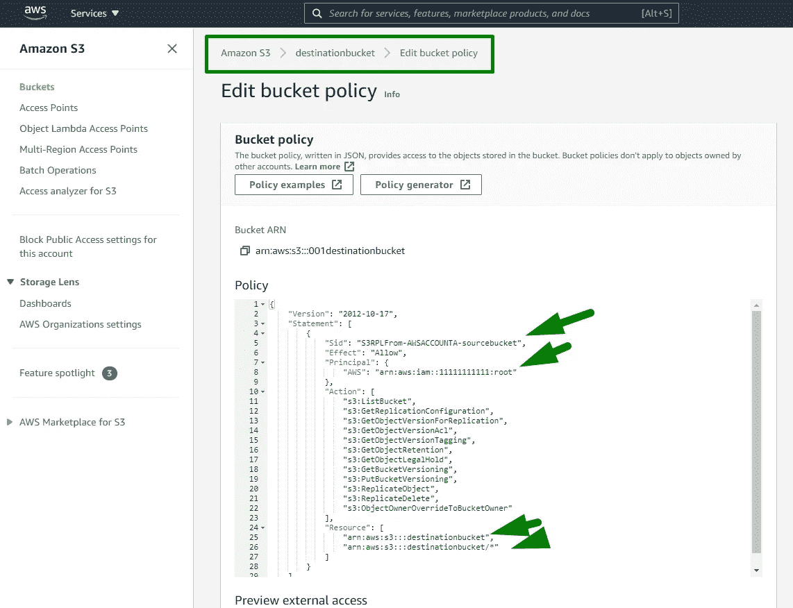

# 结论

正如我们所看到的，自动化解决方案有如下主要优势:

*   运行作业时的快速配置。每次执行大约 13 秒。

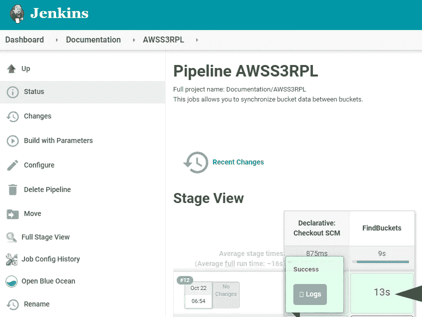

*   自动 S3 复制配置，无需在 AWS 控制台中进行人工干预。
*   授予对整体操作的验证。
*   由自动化修改的每个资源的友好名称/描述。
*   需要时，方便的回滚/禁用复制按钮。

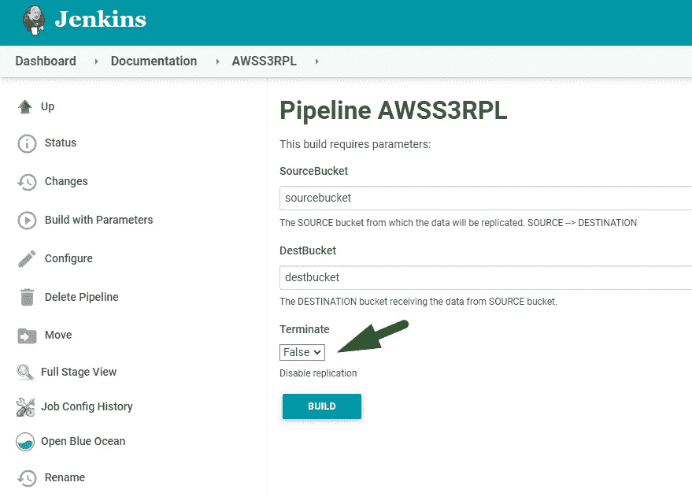

我希望该解决方案能够帮助您利用 AWS 改善云/DevOps S3 运营。

# 参考

[AWS 跨账户访问](https://aws.amazon.com/blogs/security/how-to-enable-cross-account-access-to-the-aws-management-console/)
[S3 授予跨账户权限](https://docs.aws.amazon.com/AmazonS3/latest/userguide/example-walkthroughs-managing-access-example2.html)
[詹金斯 AWS 跨账户 STS 服务](/@rajeevpmr/aws-cross-account-deployment-using-jenkins-9e71d79f50cf)
[AWS 命令行界面](https://aws.amazon.com/cli/)


Visit us at [https://www.globant.com/studio/cloud-ops](https://www.globant.com/studio/cloud-ops)