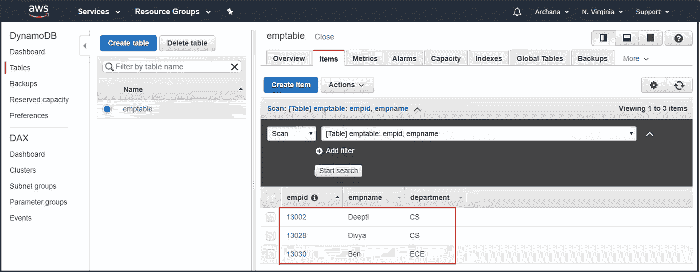

# AWS 数据管道 101—数据工作流程编排服务简要指南

> 原文：<https://medium.com/edureka/aws-data-pipeline-tutorial-f11add0925f7?source=collection_archive---------0----------------------->

随着技术的进步和连接的便利，生成的数据量正在飞速增长。在这座数据之山的深处埋藏着“被控制的情报”，公司可以用它来扩展和改善他们的业务。公司需要移动、排序、过滤、重新格式化、分析和报告数据，以便从中获取价值。为了在市场中保持稳定，他们可能不得不重复并快速地这样做。亚马逊的 AWS 数据管道服务是完美的解决方案。

让我们来看看这个 AWS 数据管道教程中涵盖的主题:

*   需要 AWS 数据管道
*   什么是 AWS 数据管道？
*   AWS 数据管道的优势
*   AWS 数据管道组件
*   演示—从 DynamoDb 导出数据

# 需要 AWS 数据管道

数据呈指数级增长，而且还在以更快的速度增长。各种规模的公司都意识到，管理、处理、存储和迁移数据变得比过去更加复杂和耗时。因此，下面列出的是公司面临的一些问题不断增加的数据:

**数据量大:**有很多原始的&未处理的数据。还有日志文件、人口统计数据、从传感器收集的数据、交易历史&等等。

**多种格式:**数据有多种格式。将非结构化数据转换成兼容的格式是一项复杂而耗时的任务。

**不同的数据存储:**有多种数据存储选项。公司有自己的数据仓库，像亚马逊 S3 这样的基于云的存储，亚马逊关系数据库服务(RDS) &在 EC2 实例上运行的数据库服务器。

**耗时&成本高:**管理大量数据耗时&成本非常高。大量资金将用于转换、存储过程数据。

所有这些因素都使得公司自行管理数据变得更加复杂和具有挑战性。这就是 **AWS 数据管道**有用的地方。它使用户更容易集成分布在多个 AWS 服务中的数据，并从一个位置对其进行分析。因此，通过这个 AWS 数据管道教程，让我们探索数据管道及其组件

**数据量大:**有很多原始的&未处理的数据。还有日志文件、人口统计数据、从传感器收集的数据、交易历史等等。

**多种格式:**数据有多种格式。将非结构化数据转换成兼容的格式是一项复杂耗时的任务。

**不同的数据存储:**有多种数据存储选项。公司有自己的数据仓库，像亚马逊 S3 这样的基于云的存储，亚马逊关系数据库服务(RDS) &在 EC2 实例上运行的数据库服务器。

**耗时&成本高昂:**管理大量数据耗时&成本高昂。大量资金将用于转换、存储&过程数据。

所有这些因素都使得公司自行管理数据变得更加复杂和具有挑战性。这就是 **AWS 数据管道**有用的地方。它使用户更容易集成分布在多个 AWS 服务中的数据，并从一个位置对其进行分析。因此，通过这个 AWS 数据管道教程，让我们探索数据管道及其组件。

Edureka 制作的“AWS 数据管道教程”视频将帮助您了解如何使用 AWS 数据管道轻松处理、存储和分析同一位置的数据。

# 什么是 AWS 数据管道？

***AWS 数据管道*** *是一种 web 服务，可帮助您以指定的时间间隔在不同的 AWS 计算和存储服务以及内部数据源之间可靠地处理和移动数据。*

借助 AWS Data Pipeline，您可以轻松地从存储位置访问数据，大规模转换和处理数据，并高效地将结果传输到亚马逊 S3、亚马逊 RDS、亚马逊 DynamoDB 和亚马逊 EMR 等 AWS 服务。它允许您创建容错、可重复和高度可用的复杂数据处理工作负载。

现在为什么选择 AWS 数据管道？

# AWS 数据管道的优势

*   在 AWS 界面中提供一个拖放控制台
*   AWS 数据管道建立在分布式、高可用性基础设施之上，旨在为您的活动提供容错执行
*   它提供了各种各样的特性，比如调度、依赖性跟踪和错误处理
*   AWS 数据管道使得将工作以串行或并行方式分派给一台或多台机器变得同样容易
*   AWS 数据管道使用起来并不昂贵，而且每月收费很低
*   提供对执行数据管道逻辑的计算资源的完全控制

因此，先不说好处，让我们来看看 AWS 数据管道的不同组件&它们如何协同工作来管理您的数据。

# AWS 数据管道的组件

AWS 数据管道是一个 web 服务，您可以使用它来自动移动和转换数据。您可以定义数据驱动的工作流，以便任务可以依赖于先前任务的成功完成。您定义数据转换的参数，AWS 数据管道执行您设置的逻辑。

基本上，你总是通过选择 ***数据节点*** *来开始设计管道。*然后，数据管道与计算服务一起转换数据。大多数情况下，这个步骤会产生大量额外数据。因此，可选地，您可以有输出数据节点，其中可以存储转换数据的结果。

**数据节点**:在 AWS 数据管道中，数据节点定义了管道活动用作输入或输出的数据的位置和类型。它支持以下数据节点:

*   DynamoDBDataNode
*   SqlDataNode
*   红移数据节点
*   S3 数据节点

# 现在，让我们考虑一个实时示例来理解其他组件。

用例:从不同的数据源收集数据，执行 Amazon Elastic MapReduce(EMR)分析并生成每周报告。

在这个用例中，我们设计了一个管道，从亚马逊 S3 & DynamoDB 等*数据源*提取数据，到*每天执行 EMR 分析* & *生成每周数据报告*。

现在我斜体的字叫做 ***活动*** *。*可选地，为了运行这些活动，我们可以添加**。**

***活动:**活动是一个管道组件，它使用计算*资源*以及典型的输入和输出数据节点来定义要按计划执行的工作。活动的例子有:*

*   *将数据从一个位置移动到另一个位置*
*   *运行配置单元查询*
*   *生成 Amazon EMR 报告*

***前提条件:**前提条件是包含条件语句的管道组件，在活动可以运行之前，这些条件语句必须为真。*

*   *在管道活动尝试复制源数据之前，检查源数据是否存在*
*   *如果相应的数据库表是否存在*

***资源:**资源是执行管道活动指定的工作的计算资源。*

*   *执行由管道活动定义的工作的 EC2 实例*
*   *Amazon EMR 集群执行由管道活动定义的工作*

*最后，我们有一个叫做*动作的组件。**

***动作:**动作是管道组件在某些事件发生时采取的步骤，例如成功、失败或后期活动。*

*   *根据成功、失败或后期活动向主题发送 SNS 通知*
*   *触发取消待定或未完成的活动、资源或数据节点*

*现在您已经对 AWS 数据管道及其组件有了基本的了解，让我们看看它是如何工作的。*

# *AWS 数据管道演示*

*在 AWS 数据管道教程文章的演示部分，我们将看到如何 ***将 DynamoDB 表的内容复制到 S3 桶*** 。AWS 数据管道触发一个动作来启动一个具有多个 EC2 实例的 EMR 集群(确保在完成后终止它们以避免费用)。EMR 集群从 dynamo DB 获取数据，并将其写入 S3 存储桶。*

# *创建 AWS 数据管道*

***步骤 1:** 用样本测试数据创建一个 DynamoDB 表。*

**

***步骤 2:** 为要复制的 DynamoDB 表的数据创建一个 S3 桶。*

**

***步骤 3:** 从 AWS 管理控制台访问 AWS 数据管道控制台&点击*开始*创建数据管道。*

**

***步骤 4:** 创建数据管道。给你的管道一个合适的名字&合适的描述。指定源&目的数据节点路径。安排您的数据管道&点击激活。*

**

## *监控和测试*

***步骤 5:** 在*列表管道*中可以看到状态为“等待流道”。*

**

***步骤 6:** 几分钟后，您可以看到状态再次变为“正在运行”。此时，如果您转到 EC2 控制台，您可以看到两个自动创建的新实例。这是因为管道触发的 EMR 集群。*

**

*第七步:完成后，你可以访问 S3 桶，并找出是否。txt 文件已创建。它包含 DynamoDB 表的内容。下载并在文本编辑器中打开它。*

***那么，现在你知道如何使用 AWS 数据管道从 DynamoDB 导出数据了。**同样，通过反转 source & destination，您可以将数据从 S3 导入 DynamoDB。*

*继续探索吧！如果你想查看更多关于人工智能、DevOps、道德黑客等市场最热门技术的文章，你可以参考 Edureka 的官方网站。*

*请留意本系列中解释 AWS 各个方面的其他文章。*

> **1。* [*AWS 教程*](/edureka/amazon-aws-tutorial-4af6fefa9941)*
> 
> **2。* [*AWS EC2*](/edureka/aws-ec2-tutorial-16583cc7798e)*
> 
> **3。*[*AWSλ*](/edureka/aws-lambda-tutorial-cadd47fbd39b)*
> 
> **4。* [*AWS 弹性豆茎*](/edureka/aws-elastic-beanstalk-647ae1d35e2)*
> 
> **5。*[*AWS*](/edureka/s3-aws-amazon-simple-storage-service-aa71c664b465)*
> 
> **6。* [*AWS 控制台*](/edureka/aws-console-fd768626c7d4)*
> 
> **7。* [*AWS RDS*](/edureka/rds-aws-tutorial-for-aws-solution-architects-eec7217774dd)*
> 
> **8。* [*AWS 迁移*](/edureka/aws-migration-e701057f48fe)*
> 
> *9。[*AWS Fargate*](/edureka/aws-fargate-85a0e256cb03)*
> 
> **10。* [*亚马逊 Lex*](/edureka/how-to-develop-a-chat-bot-using-amazon-lex-a570beac969e)*
> 
> **11。* [*亚马逊光帆*](/edureka/amazon-lightsail-tutorial-c2ccc800c4b7)*
> 
> **12。* [*AWS 定价*](/edureka/aws-pricing-91e1137280a9)*
> 
> **13。* [*亚马逊雅典娜*](/edureka/amazon-athena-tutorial-c7583053495f)*
> 
> **14。* [*AWS CLI*](/edureka/aws-cli-9614bf69292d)*
> 
> **15。* [*亚马逊 VPC 教程*](/edureka/amazon-vpc-tutorial-45b7467bcf1d)*
> 
> **15。*[*AWS vs Azure*](/edureka/aws-vs-azure-1a882339f127)*
> 
> **17。* [*内部部署 vs 云计算*](/edureka/on-premise-vs-cloud-computing-f9aee3b05f50)*
> 
> **18。* [*亚马逊迪纳摩 DB 教程*](/edureka/amazon-dynamodb-tutorial-74d032bde759)*
> 
> **19。* [*如何从快照恢复 EC2？*](/edureka/restore-ec2-from-snapshot-ddf36f396a6e)*
> 
> **20。* [*AWS 代码提交*](/edureka/aws-codecommit-31ef5a801fcf)*
> 
> **21。* [*使用亚马逊 ECS*](/edureka/docker-container-in-production-amazon-ecs-19857ce96f25) 在生产中运行 Docker*

**原载于 2018 年 11 月 30 日*[*https://www.edureka.co*](https://www.edureka.co/blog/aws-data-pipeline-tutorial/)*。**