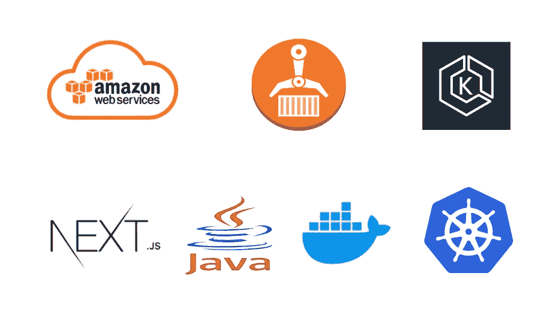

# AWS —在 EKS 上部署带有 Java 后端的 Next.js 应用程序

> 原文：<https://medium.com/bb-tutorials-and-thoughts/aws-deploying-next-js-app-with-java-backend-on-eks-76f12a575989?source=collection_archive---------0----------------------->

## 包含示例项目的逐步指南

AWS 提供 100 多种服务，了解您应该根据自己的需求选择哪种服务非常重要。亚马逊弹性 Kubernetes 服务(亚马逊 EKS)是一项托管服务，使您可以轻松地在 AWS 上运行 Kubernetes，而无需建立或维护自己的 Kubernetes…