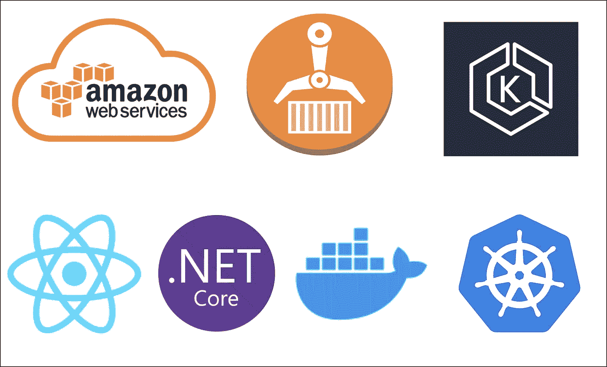

# AWS —部署 React 应用程序。EKS 上的. NET Web API

> 原文：<https://medium.com/bb-tutorials-and-thoughts/aws-deploying-react-app-with-net-web-api-on-eks-dad794a103de?source=collection_archive---------0----------------------->

## 包含示例项目的逐步指南

AWS 提供了 100 多种服务，知道应该根据自己的需求选择哪种服务非常重要。亚马逊弹性 Kubernetes 服务(亚马逊 EKS)是一项托管服务，使您可以轻松地在 AWS 上运行 Kubernetes，而无需建立或维护您自己的 Kubernetes 控制…