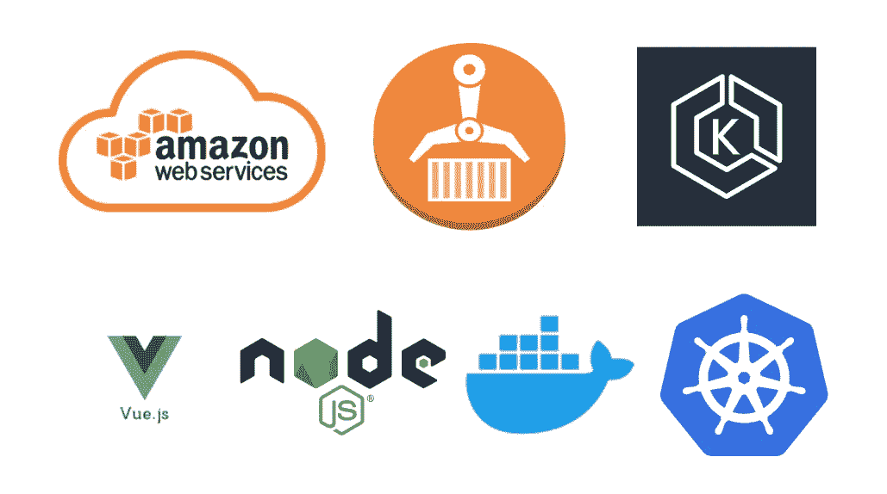

# AWS —在 EKS 部署带有 NodeJS 后端的 Vue 应用程序

> 原文：<https://medium.com/bb-tutorials-and-thoughts/aws-deploying-vue-app-with-nodejs-backend-on-eks-223048867eb5?source=collection_archive---------0----------------------->

## 示例项目的分步指南

AWS 提供 100 多种服务，了解您应该根据自己的需要选择哪种服务非常重要。亚马逊弹性库本内特服务(亚马逊 EKS)是一项托管服务，使您无需站起来或保持自己对库本内特的控制，就可以很容易地在 AWS 上运行库本内特…