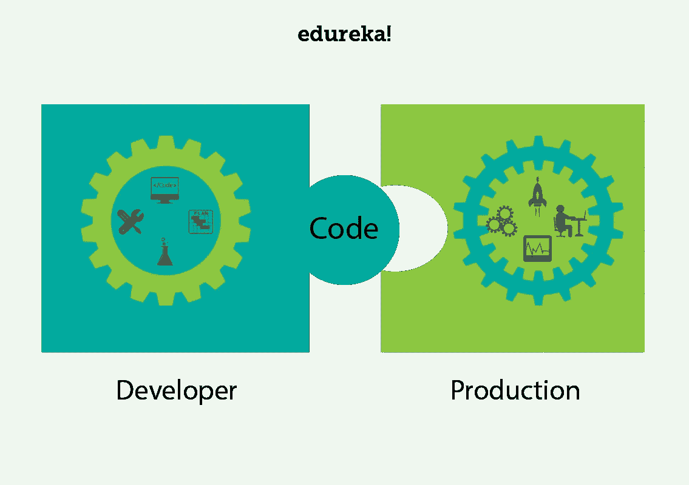

# AWS DevOps:AWS 上的 devo PS 简介

> 原文：<https://medium.com/edureka/aws-devops-7d4bd5f6bd8f?source=collection_archive---------7----------------------->

技术随着时间而发展。随着技术的发展，处理技术的方式和需求也发生了变化。过去的二十年见证了计算和软件开发生命周期的巨大转变。今天的博客重点关注一种被称为 **DevOps** 和 **AWS DevOps** 的方法。

本博客主要关注以下几点:

1.  DevOps 是什么？
2.  什么是 AWS？
3.  AWS DevOps

那么让我们开始吧，好吗？

# DevOps 是什么？

在这个快节奏的时代，我们看到更多的重点放在软件部署的更快交付上。因为为了在市场上保持竞争力，公司被期望在规定的时间内部署高质量的软件。因此，软件开发人员和系统管理员的角色变得非常重要。这两个团队之间发生了许多职责的转换。让我们来看看这些人是如何对部署过程做出贡献的。

程序员或软件开发人员负责开发软件。简单地说，他应该开发一个软件，该软件具有:

*   新功能
*   安全升级
*   错误修复

但是开发者可能需要等待数周的时间来部署产品，这在商业术语中也被称为**【上市时间】**。因此，这种延迟可能会给开发人员带来压力，因为他被迫重新调整他的依赖活动，例如:

*   待定代码
*   旧代码
*   新产品
*   新功能

此外，当产品投入生产环境时，产品可能会出现一些不可预见的错误。这是因为开发人员在可能不同于生产环境的开发环境中编写代码。

让我们从操作的角度来看一下这个过程。现在，运营团队或系统管理员团队负责维护和确保生产环境的正常运行时间。现在，随着公司在更多的产品和服务上投入了时间和资金，管理员需要管理的服务器数量也在不断增长。

这带来了更多的挑战，因为用于管理早期数量的服务器的工具可能不足以满足未来和不断增长的服务器数量的需求。运营团队还需要对代码进行细微的修改，以使其适应生产环境。因此，相应地安排这些部署的需求也在增长，这导致了时间延迟。

部署代码时，运营团队还负责处理代码更改或代码的小错误。有时，运营团队可能会感到压力，看起来好像开发人员已经将他们的责任推到了责任墙的运营一边。正如你可能会意识到没有一方可以举行，罪魁祸首。

如果这两个团队可以合作呢？如果他们:

*   可以打破筒仓
*   分担责任
*   开始有相同的想法
*   团队合作

嗯，这就是 DevOps 所做的，它帮助你让软件开发人员和运营同步，以提高生产力。用行话术语简单定义一下。DevOps 是整合开发人员和运营团队以提高协作和生产力的过程。这是通过工作流和生产力的自动化以及对应用程序性能的持续测量来实现的。

DevOps 专注于自动化一切，让他们编写可以在几小时内测试、监控和部署的小块代码，这不同于编写需要几周才能部署的大块代码。所以这和德沃普斯有关。让我们继续前进，了解什么是 AWS，以及它如何与 DevOps 形成重要的配对，为您提供 AWS DevOps。

# 什么是 AWS？

如果回到十年前，处理或更精确地存储数据的场景是不同的。公司更喜欢使用他们的私人服务器存储数据。然而，随着互联网越来越好的使用，趋势已经看到了公司的范式转变，因为他们正在将他们的数据转移到云。这使得公司能够更加专注于核心竞争力，不再担心存储和计算。下面这两点说说云的意义:

***事实:*** 网飞是当今全世界都在使用的流行视频流媒体服务，早在 2008 年，网飞就遭遇了严重的数据库损坏，他们的运营暂停了三天。当他们意识到云中需要高度可靠、可水平扩展的分布式系统时，问题就出现了。从那时起，他们的增长就一落千丈。

因为每个公司都开始采用云服务。可以说，云是人们谈论的话题。特别是 AWS，它是市场上领先的云服务提供商。让我们对它有更多的了解。

# 自动警报系统

AWS 代表亚马逊网络服务，是 Amazon.com 的子公司，以非常低廉的价格提供云计算服务，因此它的客户群从 Pinterest(只有 5 名员工)这样的小公司到 D-Link 这样的大企业都很强大。

## 什么是云计算？

它使用互联网上的远程服务器来存储、管理和处理数据，而不是本地服务器或个人电脑。

云计算基本上有 3 个类别:

## IaaS(基础设施即服务)

*   IaaS 在云中给你一个**服务器**，你可以完全控制它。
*   在 Iaas 中，您负责管理从操作系统到您正在运行的应用程序的一切。

## 平台即服务

*   有了 PaaS，您就拥有了灵活性和简单性的结合。
*   灵活，因为它可以根据应用程序的需求进行定制。
*   简单到不需要操作系统维护、版本、补丁。

## SaaS(软件即服务)

*   第三方提供商托管应用程序的软件分发模式。
*   您只需通过互联网访问软件，而不是安装和维护软件。
*   自动更新减轻了内部 IT 人员的负担。

# AWS DevOps

AWS 是最好的云服务提供商之一，而 DevOps 则是软件开发生命周期的'*当务之急'*。以下原因使得 AWS DevOps 成为非常受欢迎的合并:

## 自动气象站云形成

DevOps 团队需要比传统开发团队更频繁地创建和发布云实例和服务。AWS CloudFormation 能让你做到这一点。像 EC2 实例、ECS 容器和 S3 存储桶这样的 AWS 资源的模板让您可以设置整个堆栈，而不必自己将所有的东西放在一起。

## AWS EC2

AWS EC2 不言自明。您可以在 EC2 实例中运行容器。因此，您可以利用 AWS 安全和管理特性。AWS DevOps 是致命组合的另一个原因。

## AWS 云观察

这个监控工具让您可以跟踪 AWS 必须提供的每一项资源。此外，它使得使用第三方工具进行监控变得非常容易，如 Sumo Logic 等

## AWS 代码管道

CodePipeline 是 AWS 的一个流行特性，它极大地简化了管理 CI/CD 工具集的方式。它允许您与 GitHub、Jenkins 和 CodeDeploy 等工具集成，使您能够直观地控制从构建到生产的应用程序更新流程。

## AWS 中的实例

AWS 经常创建新的实例并添加到它们的列表中，这些实例的定制级别允许您轻松地一起使用 AWS DevOps。

所有这些原因使 AWS 成为 DevOps 的最佳平台之一。这差不多把我们带到了 AWS DevOps 博客的结尾。请在下面的评论区告诉我，你是否喜欢这个博客。

我希望你喜欢这个什么是云计算教程。如果你想查看更多关于人工智能、DevOps、道德黑客等市场最热门技术的文章，那么你可以参考 [Edureka 的官方网站。](https://www.edureka.co/blog/?utm_source=medium&utm_medium=content-link&utm_campaign=aws-devops-a-new-approach-to-software-deployment)

请留意本系列中解释云的各个方面的其他文章。

> *1。* [*AWS 教程*](/edureka/amazon-aws-tutorial-4af6fefa9941)
> 
> *2。* [*AWS EC2*](/edureka/aws-ec2-tutorial-16583cc7798e)
> 
> *3。*[*AWS Lambda*](/edureka/aws-lambda-tutorial-cadd47fbd39b)
> 
> *4。*[*AWS*弹性豆茎](/edureka/aws-elastic-beanstalk-647ae1d35e2)
> 
> *5。* [*AWS S3*](/edureka/s3-aws-amazon-simple-storage-service-aa71c664b465)
> 
> *6。* [*AWS 控制台*](/edureka/aws-console-fd768626c7d4)
> 
> *7。* [*AWS RDS*](/edureka/rds-aws-tutorial-for-aws-solution-architects-eec7217774dd)
> 
> 8。 [*AWS 迁移*](/edureka/aws-migration-e701057f48fe)
> 
> *9。*[*AWS Fargate*](/edureka/aws-fargate-85a0e256cb03)
> 
> *10。* [*亚马逊 Lex*](/edureka/how-to-develop-a-chat-bot-using-amazon-lex-a570beac969e)
> 
> *11。* [*亚马逊*](/edureka/amazon-lightsail-tutorial-c2ccc800c4b7)
> 
> *12。* [*AWS 定价*](/edureka/aws-pricing-91e1137280a9)
> 
> *13。* [*亚马逊雅典娜*](/edureka/amazon-athena-tutorial-c7583053495f)
> 
> *14。* [*AWS CLI*](/edureka/aws-cli-9614bf69292d)
> 
> *15。* [*亚马逊 VPC 教程*](/edureka/amazon-vpc-tutorial-45b7467bcf1d)
> 
> *15。*[*AWS vs Azure*](/edureka/aws-vs-azure-1a882339f127)
> 
> *17。* [*内部部署 vs 云计算*](/edureka/on-premise-vs-cloud-computing-f9aee3b05f50)
> 
> *18。* [*亚马逊迪纳摩 DB 教程*](/edureka/amazon-dynamodb-tutorial-74d032bde759)
> 
> *19。* [*如何从快照恢复 EC2？*](/edureka/restore-ec2-from-snapshot-ddf36f396a6e)
> 
> *20。* [*AWS 代码提交*](/edureka/aws-codecommit-31ef5a801fcf)
> 
> *21。* [*使用亚马逊 ECS*](/edureka/docker-container-in-production-amazon-ecs-19857ce96f25) 在生产中运行 Docker

*原载于 2018 年 1 月 30 日*[*https://www.edureka.co*](https://www.edureka.co/blog/aws-devops-a-new-approach-to-software-deployment/)*。*