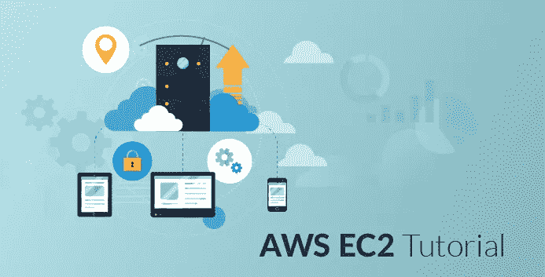

# AWS EC2 教程——亚马逊 EC2 初学者指南

> 原文：<https://medium.com/edureka/aws-ec2-tutorial-16583cc7798e?source=collection_archive---------0----------------------->

AWS EC2 Tutorial - Edureka

很难预测一个刚刚启动的应用程序需要多少计算能力。可能有两种情况，您可能高估了需求，购买了一堆没有任何用处的服务器，或者您可能低估了使用情况，这将导致您的应用程序崩溃。在本 ***AWS EC2 教程*** 中，我们将通过示例了解所有关键概念，并动手启动 Ubuntu 实例。

# 什么是 AWS EC2？

亚马逊弹性计算云 EC2 是亚马逊的一项网络服务，它在云中提供**可调整的**计算服务。

## 如何调整它们的大小？

它们是可调整的，因为如果您的计算需求发生变化，您可以快速增加或减少正在使用的服务器实例的数量。

这就引出了我们的下一个问题。

## **什么是实例？**

实例是在 Amazon 的 EC2 上运行应用程序的虚拟服务器。它也可以被理解为大型计算机的一个微小部分，一个拥有自己的硬盘、网络连接、操作系统等的微小部分。但其实都是虚拟的。您可以在一台物理机上拥有多台“微型”计算机，所有这些微型计算机都称为实例。

## **服务和实例的区别？**

让我们这样理解:

*   EC2 是和其他亚马逊网络服务如 S3 等一起的服务。
*   当我们使用 EC2 或任何其他服务时，我们通过一个实例来使用它，例如在 EC2 等中的 t2.micro 实例。

# 为什么选择 AWS EC2？

为什么不自己买一堆服务器独立工作呢？因为，假设你是一名开发人员，由于你想独立工作，你购买了一些服务器，你估计了正确的容量，计算能力足够了。现在，您必须每天更新安全补丁，必须解决服务器后端可能出现的任何问题，等等。这些都是你要做的额外的杂务，或者你会雇佣其他人来帮你做这些事情。

但是如果你买了一个 EC2 实例，你不必担心这些事情，因为它们都将由 Amazon 管理；你只需要专注于你的应用。这也是你之前花费的一小部分！那不是很有趣吗？

***让我们用一个例子来理解成本节约。***

假设我们不采用 AWS EC2，而是考虑采用一组专用服务器，那么，我们可能不得不面对的是:

*   现在，为了使用这些服务器，我们必须雇佣一个能够处理它们的 IT 团队。
*   此外，系统出现故障是不可避免的，因此我们必须承担修复故障的成本，如果您不想牺牲正常运行时间，您必须保持系统对其他服务器的冗余，这可能会变得更加昂贵。
*   您自己购买的资产会在一段时间内贬值，但是，事实上，在改进处理器类型和速度的同时，一个实例的成本在 3 年内下降了 50%以上。所以最终，人们更倾向于迁移到云。
*   对于纵向扩展，我们必须添加更多的服务器，如果您的应用程序是新的，并且您遇到突发流量，那么快速纵向扩展可能会成为一个问题。

这只是几个问题，还有许多其他的场景让 EC2 更有说服力！

***我们来了解一下 EC2 计算实例的类型:***

计算是一个非常宽泛的术语，您任务的性质决定了您需要哪种计算。

因此，AWS EC2 提供了以下 5 种类型的实例:

1.  ***一般实例***

适用于需要平衡性能和成本的应用。

例如，电子邮件回复系统，在这种系统中，你需要一个及时的回复，并且它应该是有成本效益的，因为它不需要太多的处理。

***2。计算实例***

对于需要 CPU 进行大量处理的应用程序。

例如，从像 Twitter 流这样的数据流中分析数据

***3。内存实例***

因此，对于本质上很重的应用程序，需要大量的 RAM。

例如，当您的系统需要在后台运行大量应用程序时，即多任务处理。

***4。存储实例***

适用于大型应用程序或数据集占用大量空间的应用程序。

例如，当你的应用程序非常大的时候。

***5。GPU 实例***

适用于需要大量图形渲染的应用程序。

例如 3D 建模等。

***现在，每种实例类型都有一组针对不同工作负载优化的实例:***

1.  *一般实例*

*   t2
*   m4
*   m3

*2。计算实例*

*   补体第四成份缺乏
*   c3

*3。内存实例*

*   r3
*   x1

*4。存储实例*

*   i2
*   d2

*5。GPU 实例*

*   栅级Ⅱ

*现在，让我们在 AWS EC2 教程中了解每个实例针对哪种工作进行了优化。*

# **可突发的性能实例**

*T2 实例*是可突发的实例，这意味着 CPU 在基线上执行，比如说其能力的 20%。当您的应用程序需要超过 20%的 CPU 性能时，CPU 会进入突发模式，在有限的时间内提供更高的性能，因此工作进行得更快。

*   当你的 CPU 空闲时，你得到这些积分。
*   每个 CPU 信用给 CPU 一个 1 分钟的突发。
*   如果你的 CPU 信用没有被使用，它们会被记入你的帐户，并在那里停留 24 小时。
*   根据您的信用余额，您可以决定 t2 实例应该扩大还是缩小。
*   这些突发事件的发生是有代价的，每次 CPU 中发生突发事件，都会使用 CPU 信用。

# EBS 优化的实例

*C4、M4 和 D2 实例*默认为 EBS 优化，EBS 意为弹性块存储，是 AWS 提供的一种存储选项，其中 IOPS*率相当高。因此，当 EBS 卷连接到优化实例时，可以实现个位数毫秒延迟。

* *IOPS(每秒输入/输出操作数，读作 eye-ops)* 是一种用于表征计算机存储设备的性能测量。

# **集群联网实例**

*X1、M4、C4、C3、I2、G2 和 D2 实例*支持集群联网。进入公共放置组的实例被放在一个逻辑组中，该逻辑组在该组中的所有实例之间提供高带宽、低延迟。

*   放置组基本上是一个逻辑集群，其中作为该组一部分的一些选定 EC2 实例可以在每个方向上利用高达 10Gbps 的单流流量和 20Gbps 的多流流量。
*   不属于该组的实例在多流流量中的速度限制为 5 Gbps。集群网络是高性能分析系统的理想选择。

# **专用实例**

*   它们是在专用于单个客户的单租户硬件上运行的实例。
*   它们非常适合公司政策或行业法规要求您的实例应该与任何其他客户的实例隔离的工作负载，因此它们使用自己单独的机器，并且它们的实例在硬件级别隔离。

*我们通过一个例子来理解这一点。假设在一家公司中，他们必须遵循以下任务:*

1.  *客户数据分析*

客户的网站活动等。都应该被实时监控。有时网站上的流量会很小，因此不应该考虑使用非常强大的处理器，因为它不会在一天的每个小时都使用，所以对公司来说会变得很昂贵。因此，对于此任务，我们可能会采用 **t2 实例**，因为它们为**提供了可突发的 CPU 性能**，即当流量增加时，CPU 性能会相应提高以满足需求。

*2。我们的自动回复邮件系统*

它应该是快速的，因此我们需要响应时间尽可能短的系统。这可以通过使用 **EBS 优化实例**来实现，因为它们提供高 IOPS，从而降低延迟。

*3。我们网站上的搜索引擎*

它应该能够排序的关键字，并返回相关的结果，因此，我们可能有 2 个服务器。一个是数据库，另一个是用于处理关键字的服务器。因此，这些服务器之间的通信应该以最大可能的速率进行。为此，我们可以将它们放在一个位置组中，为此，我们必须使用**集群网络实例。**

*4。每个组织中的一些流程都是高度机密的*

因为这些流程让我们比其他公司更有优势，不管服务器有多安全，可能还是会制定一些政策来确保万无一失。因此，对于这些类型的流程，我们可能会使用**专用实例**。

*我们现在知道了实例，让我们学习如何启动这些实例？*

# 如何在 EC2 中运行系统？

*   登录到您的 AWS 帐户，然后单击 AWS EC2。
*   在创建实例下，单击启动实例。

现在您必须选择一个 **Amazon 机器映像(AMI)，**AMI 是操作系统的模板，它们提供启动实例所需的信息。

当我们想要启动一个实例时，我们必须指定我们想要使用哪个 AMI。可能是 Ubuntu，windows server 等。

1.  ami 可以预先配置，或者您可以根据自己的需求自行配置。

*   对于预先配置的 ami，您必须从 AWS marketplace 中选择它。
*   要设置您自己的，请转到快速入门并选择一个。

2.配置时，您将需要选择一个 **EBS** 存储选项。

**弹性块存储(EBS)** 是与 EC2 一起使用的永久块级存储卷。这里每个块充当一个硬盘驱动器。

***但是我们为什么需要带 EC2 的 EBS 呢？***

就像您的计算机需要一个硬盘驱动器一样，AWS EC2 需要一个存储卷来存储您的实例将要指定的 OS。EBS 的选项有:

1.  **调配的 IOPS** :此类别适用于任务关键型工作负载，它提供高 IOPS 率。

**2。一般用途:**它适用于需要平衡性能和成本的工作负载。

**3。磁性:**用于访问频率较低的数据，检索时间也较长。

*   在 EBS 中选择一个合适的选项后，我们给实例一个名称，然后创建一个**安全组**。
*   安全组充当防火墙来控制入站和出站流量。每个安全组都有管理流量的规则。
*   每个实例最多可以分配 5 个安全组。
*   最后，在最后一步中，控制台显示您已经完成的所有设置，您可以验证并启动它。

现在，在这个 AWS EC2 教程中，当您启动实例时，它需要您进行一些身份验证；否则，任何人都可以访问您的实例！为了在 AWS EC2 教程中解决这个问题，让我们深入了解 EC2 的安全方面，

# AWS EC2 中的安全性

为了对用户的实例进行身份验证，AWS 采用了一种**密钥对**方法。

**什么是密钥对？**

Amazon EC2 使用公钥加密来加密和解密登录信息。公钥加密使用公钥来加密数据，如密码，然后接收方使用私钥来解密数据。公钥和私钥被称为*密钥对*。

**额外好处:**亚马逊的每项服务都是以顾客为中心设计的。他们自称是地球上最痴迷于客户的公司。说了这么多，我们来了解一下 EC2 的其他一些好处。

# 自动缩放

*Auto Scaling* 是 AWS EC2 设计的一项服务，它根据用户定义的策略、计划和健康检查自动启动或终止 EC2 的实例。

**弹性负载均衡**

*弹性负载平衡* (ELB)在多个可用性区域的多个 EC2 实例中自动分配传入的应用流量。

可用性区域基本上是亚马逊设置服务器的地方。因为他们拥有来自全球的客户，所以他们建立了多个可用性区域来减少延迟。

*弹性 IP 地址*

# AWS EC2 定价

这个 AWS EC2 教程，先从免费的东西说起吧！

AWS EC2 免费层允许每月使用 750 小时的 t2.micro 实例！

EC2 的免费等级有效期为 1 年，从注册您的 AWS 帐户开始计算。

EC2 中基本上有 3 种定价选项:

*   定点实例
*   按需实例
*   保留实例

***Spot Instances***是一个定价选项，使您能够对未使用的 EC2 实例进行投标。Spot 实例的每小时价格由 AWS EC2 设定，它根据特定可用性区域中实例的可用性而波动。

*   基本上，你会为一个实例设定一个你不希望被收取的价格。
*   您设置的价格是基于每小时的，因此当该实例的价格高于您设置的价格时，该实例会自动关闭。

***按需实例*** 在你想按小时付费时使用，没有长期承诺和预付。它们对于工作负载不可预测的应用程序或首次部署的测试应用程序非常有用。

***预约实例*** 为您提供比按需实例更大的折扣。使用保留实例，您可以使用三种付款选项为特定时间段保留实例:

*   没有预付款
*   部分预付
*   全额预付

和两个任期长度:

*   一年期限
*   三年期限

预付款越高，您节省的钱就越多。

# AWS EC2 使用案例

接下来，在这个 AWS EC2 教程中，让我们通过一个用例来理解整个 EC2 实例创建过程，在这个用例中，我们将为一个测试环境创建一个 Ubuntu 实例。

1.  **登录 AWS 管理控制台。**

**2。选择您喜欢的地区。**从下拉框中选择一个区域，区域的选择可以根据博客前面讨论的标准来完成。

**3。选择 EC2 服务**点击计算部分下的 EC2。这将带您到 EC2 仪表板。

**4** 。点击**启动实例**。

**5。选择一个 AMI:** 因为您需要一个 Linux 实例，所以在 basic 64 位 Ubuntu AMI 所在的行中，单击 Select。

6。选择一个实例

选择 t2.micro 实例，它符合自由层条件。

7。配置实例详细信息。
配置所有细节然后点击添加存储

8。添加存储器

9。标记实例

在值框中键入 AWS EC2 实例的名称。这个名称，更确切地说是标记，将在实例启动时出现在控制台中。它使得在复杂的环境中跟踪运行的机器变得容易。使用一个容易识别和记忆的名称。

10。创建安全组

**11。查看并启动一个实例**

验证您为启动实例而配置的详细信息。

**12。创建密钥对&启动实例**

接下来，在这个 AWS EC2 教程中，选择“创建新的密钥对”选项，并给出一个密钥对的名称。之后，将其下载到您的系统中，并保存以备将来使用。

**13。检查已启动实例的详细资料。**

**14。使用 PuTTYgen** 转换您的私钥

PuTTY 本身不支持私钥格式(。pem)由亚马逊 EC2 生成。PuTTY 有一个工具叫 PuTTYgen，可以把密钥转换成需要的 PuTTY 格式(。ppk)。您必须将您的私钥转换成以下格式(。ppk)，然后尝试使用 PuTTY 连接到您的实例。

*   单击加载。默认情况下，PuTTYgen 只显示扩展名为. ppk .的文件。pem 文件，选择该选项以显示所有类型的文件。

*   选择您的。pem 启动实例时指定的密钥对文件，然后单击打开。单击确定关闭确认对话框。
*   单击 Save private key 以 PuTTY 可以使用的格式保存密钥。PuTTYgen 显示一条关于保存没有密码的密钥的警告。单击是。
*   为密钥指定与密钥对相同的名称(例如，my-key-pair)。PuTTY 会自动添加。ppk 文件扩展名。

15。使用 SSH 和 PuTTY 连接到 EC2 实例

*   打开 PuTTY.exe
*   在主机名框中，输入实例的公共 IP。
*   在类别列表中，展开 SSH。
*   点击 Auth(不要展开)。
*   在“用于身份验证的私钥文件”框中，浏览到您下载的 PPK 文件并双击它。
*   单击打开。

*   当提示输入登录 ID 时，输入 Ubuntu。

**祝贺你！您已经成功启动了一个 Ubuntu 实例。**

我希望你喜欢这个深入 AWS EC2 教程。这是招聘人员在 AWS 解决方案架构师专业人员中寻找的最受欢迎的技能之一。

如果你想查看更多关于人工智能、DevOps、道德黑客等市场最热门技术的文章，你可以参考 Edureka 的官方网站。

请留意本系列中的其他文章，它们将解释 AWS 的各个方面。

> *1。* [*AWS 教程*](/edureka/amazon-aws-tutorial-4af6fefa9941)
> 
> *2。* [*AWS 简历*](/edureka/aws-resume-7453d9477c74)
> 
> *3。*[*AWS Lambda*](/edureka/aws-lambda-tutorial-cadd47fbd39b)
> 
> *4。* [*AWS 弹性豆茎*](/edureka/aws-elastic-beanstalk-647ae1d35e2)
> 
> *5。* [*AWS S3*](/edureka/s3-aws-amazon-simple-storage-service-aa71c664b465)
> 
> *6。* [*AWS 控制台*](/edureka/aws-console-fd768626c7d4)
> 
> *7。* [*AWS RDS*](/edureka/rds-aws-tutorial-for-aws-solution-architects-eec7217774dd)
> 
> *8。* [*AWS 迁移*](/edureka/aws-migration-e701057f48fe)
> 
> *9。* [*AWS Fargate*](/edureka/aws-fargate-85a0e256cb03)
> 
> 10。 [*亚马逊 Lex*](/edureka/how-to-develop-a-chat-bot-using-amazon-lex-a570beac969e)
> 
> *11。* [*亚马逊光帆*](/edureka/amazon-lightsail-tutorial-c2ccc800c4b7)
> 
> *12。* [*AWS 定价*](/edureka/aws-pricing-91e1137280a9)
> 
> 13。 [*亚马逊雅典娜*](/edureka/amazon-athena-tutorial-c7583053495f)
> 
> *14。* [*AWS CLI*](/edureka/aws-cli-9614bf69292d)
> 
> 15。 [*亚马逊 VPC 教程*](/edureka/amazon-vpc-tutorial-45b7467bcf1d)
> 
> *15。*T44*AWS vs Azure*
> 
> *17。* [*内部部署 vs 云计算*](/edureka/on-premise-vs-cloud-computing-f9aee3b05f50)
> 
> *18。* [*亚马逊迪纳摩 DB 教程*](/edureka/amazon-dynamodb-tutorial-74d032bde759)
> 
> *19。* [*如何从快照恢复 EC2？*](/edureka/restore-ec2-from-snapshot-ddf36f396a6e)
> 
> *20。* [*AWS 代码提交*](/edureka/aws-codecommit-31ef5a801fcf)
> 
> *21。* [*顶级 AWS 架构师面试问题*](/edureka/aws-architect-interview-questions-5bb705c6b660)
> 
> *22。* [*如何从快照恢复 EC2？*](/edureka/restore-ec2-from-snapshot-ddf36f396a6e)
> 
> *23。* [*使用 AWS 创建网站*](/edureka/create-websites-using-aws-1577a255ea36)
> 
> *24。* [*亚马逊路线 53*](/edureka/amazon-route-53-c22c470c22f1)
> 
> *25。* [*用 AWS WAF 保护 Web 应用*](/edureka/secure-web-applications-with-aws-waf-cf0a543fd0ab)

*原载于 2016 年 10 月 14 日*[*www.edureka.co*](https://www.edureka.co/blog/ec2-aws-tutorial-elastic-compute-cloud/)*。*