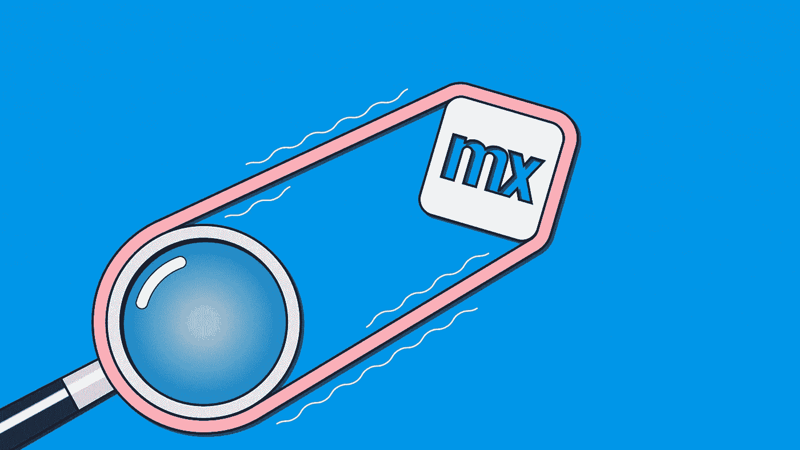

# Mendix 中的 AWS 弹性搜索

> 原文：<https://medium.com/mendix/aws-elastic-search-in-mendix-3d70898dbd8e?source=collection_archive---------3----------------------->



AWS Elastic Search in Mendix

# 如今，大多数人对一切都有即时的期待，从送咖啡到最新的股票价格。人们不愿意等待哪怕是最基本的信息，这种情况已经持续了一段时间。用户是否期望与他们互动的每个应用都能快速响应？是的，当然！

# 全球任何终端用户在使用应用程序时的最大期望是快速、轻松地完成工作。

全球疫情极大地促使人们在日常生活中依赖多种形式的应用程序。这是因为无论他们在哪里，在方便的时候完成任务都是安全和舒适的。其他因素(除了支持这种变化的技术发展之外)已经驱使大多数商业组织使用他们的软件作为进行商业交易的主要工具，并取得了良好的结果。

## **绩效相关指标**

成功衡量客户对应用程序的满意度所需的指标之一是**平均响应时间**，它扮演着重要的角色，因为它会显著影响用户的整体使用体验。

通常在创建搜索功能时，您必须创建几个流和按钮以及其他页面元素，然后才创建逻辑来处理搜索结果。大部分时间都在检索和循环所有数据库项，直到找到匹配项，并隐藏那些与搜索查询不匹配的项。

但是，如果我们想比仅仅通过数据检索更快地减少响应时间，需要做些什么呢？

令人高兴的是 **Mendix 现已在 AWS 市场**上市，集成了开发者体验和部署。下面我将讨论如何通过整合 **AWS 弹性搜索**在你的 Mendix 应用中解决我上面概述的问题。

## **弹性搜索？**

弹性搜索是一个开源的分布式搜索和分析引擎。用 **Java 编写，**它支持多种数据类型，包括文本、数字、地理空间、结构化、非结构化等等

> 弹性搜索是一个为高性能搜索而设计的分布式搜索引擎。

事实上，它是一个面向文档的数据库，针对各种搜索操作进行了优化。理解了这一点，并对基于 doc 的数据存储方法背后的概念有了基本的理解，理解这个工具就变得容易一些了。

在市场上多年来(第一个版本于 2010 年发布)，弹性搜索已经成为弹性生态系统的核心: **ELK Stack** 。ELK 是 Elastic 的三个产品的首字母缩写: **Elastic Search** (一个搜索和分析引擎) **Logstash** (一个数据处理管道) **Kibana** (一个数据可视化的接口)。

今天，弹性搜索有两个流行的用例:

*   全文搜索引擎
*   ELK 堆栈中日志和指标的存储

创建 Elastic Search 的想法是通过一个简单易懂的面向所有人的接口向其他语言的用户提供 Apache Lucene 全文搜索库 Java 的功能: **JSON over HTTP** 。

这意味着所有的请求都是 JSON，并且通过 HTTP 发送。要执行示例中的请求，您可以使用任何 HTTP 客户端，无论是 Postman 还是 curl。但是我个人建议您应该使用 Kibana 中的**开发工具，哪怕只是因为有一个**自动完成查询和语法高亮显示。****

## **弹性搜索的特点**

主要特点是

*   非常强大的搜索(使用 Lucene 索引)
*   分布式(数据可以分布到数千个节点)
*   实时(数据几乎在插入后立即可用)
*   易于扩展(可以轻松扩展到数千个节点)
*   有些人把 Elasticsearch 和 NoSQL 数据库混为一谈，但它们并不相同。ES 确实提供了 NoSQL 的一些特性，但它主要是一个搜索和分析引擎。

## **其他一些 Mendix 支持的 AWS 资源**

Mendix 支持的 AWS 资源包括亚马逊简单存储服务(亚马逊 S3)、亚马逊关系数据库服务(亚马逊 RDS)、亚马逊简单通知服务(亚马逊 SNS)。

Mendix 开发人员可以根据他们在组织的 AWS 帐户中的访问权限来选择 AWS 资源。应用程序在组织的 AWS 设置中运行，并利用来自公司 AWS 帐户的服务。

## 为什么要弹性搜索？

快速检索数据——elastic search 基于一个 **Lucene 标准分析器**。这是一个半结构化/面向文档的数据库，数据以 JSON 文档的形式存储。

与通用数据库 Mongo DB 不同，ES 是一个分布式文本搜索引擎，用于实时处理大型数据集。

当处理大量数据时，es 依赖于碎片。碎片是由 ES 管理的单个 Lucene 实例。它们有两种类型——首先被索引的**主碎片**，以及随后被索引的**副本碎片**

默认情况下，每个索引有 5 个关联的碎片。这有助于在搜索大量数据时保持高水平的性能

在实践中，Logstash、Kibana 和 Elasticsearch 结合使用，Logstash 收集、解析和存储 es 的日志。然后使用 Kibana 来搜索和可视化被索引的日志。这三人组通常被称为**麋鹿群**。ES 经常与其他 SQL & NoSQL 数据库配对使用。这就是 AWS 弹性搜索服务如何通过减少响应时间来帮助实现应用程序的更好性能。

## **将 AWS 弹性搜索与 Mendix 整合**

让我们看一下组织如何订阅具有特定资源的 AWS 帐户。

开发人员可以根据符合其组织需求的资源来利用 AWS 资源。将您的应用程序链接到弹性搜索服务后，您可以通过 Kibana 管理与您的应用程序相关的索引和对象。

现在让我们用逻辑来创建搜索查询，因为字符串是由用户决定的。例如，当您需要使用该服务对特定过滤器进行自定义搜索时，您可以在构建查询时使用**必须/应该/范围关键字**。

下面是一个如何构造发送给弹性搜索的查询的例子。下面的代码显示了一个查询，用于检索国家/地区值为“UK”、名称为“Johnson”、要求日期在“2021–08–01”和“2021–08–31”之间的对象的记录(这里 gte 表示大于或等于，lte 表示小于或等于)

```
{
   "size":3000,
   "query":{
      "bool":{
         "must":[
            {
               "query_string":{
                  "query":"UK",
                  "fields":[
                     "country"
                  ]
               }
            },
            {
               "query_string":{
                  "query":"Ronaldo",
                  "fields":[
                     "Name"
                  ]
               }
            },
            {
               "bool":{
                  "should":[
                     {
                        "bool":{
                           "must":[
                              {
                                 "bool":{
                                    "should":[
                                       {
                                          "range":{
                                             "RequiredDate":{
                                                "gte":"2021–08–01",
                                                "lte":"2021–08–31"
                                             }
                                          }
                                       }
                                    ]
                                 }
                              }
                           ]
                        }
                     }
                  ]
               }
            }
         ]
      }
   }
}
```

在将查询构建为字符串之后，可以使用**授权密钥**和必需的参数将它发送给 AWS 网关的相应 API。

在 AWS 弹性搜索端，应用程序需要被集成，每当你发送这个查询，它点击服务，它以 JSON 形式给出结果(在这种情况下，它提供过滤的对象)。然后，在导入映射和消息定义的帮助下，可以将 JSON 映射到一个列表中。

## **结论**

我们已经看到了 Mendix 与 AWS 的结合使用，以及这将如何帮助您的应用程序实现更好的性能。这只是利用服务来调优性能的一个场景，但是有很多情况可以改善您的整体用户体验。这完全取决于你的项目的用例和需求。希望这有帮助！！

## 阅读更多

[](https://aws.amazon.com/opensearch-service/the-elk-stack/what-is-elasticsearch/) [## 什么是 Elasticsearch？-亚马逊网络服务

### Elasticsearch 是一个基于 Apache Lucene 的分布式搜索和分析引擎。

aws.amazon.com](https://aws.amazon.com/opensearch-service/the-elk-stack/what-is-elasticsearch/) [](https://aws.amazon.com/opensearch-service/the-elk-stack/logstash/) [## 什么是 Logstash？-亚马逊网络服务

### Logstash 是一个轻量级、开源的服务器端数据处理管道，它允许您从一个…

aws.amazon.com](https://aws.amazon.com/opensearch-service/the-elk-stack/logstash/) [](https://aws.amazon.com/opensearch-service/the-elk-stack/kibana/) [## 什么是基巴纳？-亚马逊网络服务

### Kibana 是一个数据可视化和探索工具，用于日志和时间序列分析、应用程序监控和…

aws.amazon.com](https://aws.amazon.com/opensearch-service/the-elk-stack/kibana/) [](https://aws.amazon.com/free/?all-free-tier.sort-by=item.additionalFields.SortRank&all-free-tier.sort-order=asc&awsf.Free%20Tier%20Types=*all&awsf.Free%20Tier%20Categories=*all) [## 免费云计算服务- AWS 免费层

### 获得免费的 AWS 平台、产品和服务实践经验初创公司可获得高达 100，000 美元的 AWS 积分…

aws.amazon.com](https://aws.amazon.com/free/?all-free-tier.sort-by=item.additionalFields.SortRank&all-free-tier.sort-order=asc&awsf.Free%20Tier%20Types=*all&awsf.Free%20Tier%20Categories=*all) [](https://aws.amazon.com/marketplace/seller-profile?id=35f3fca6-04fd-45d2-8025-a9473b806bdc) [## 门迪克斯

### Mendix 是西门子的一项业务，也是企业低代码领域的全球领导者，它从根本上重塑了…

aws.amazon.com](https://aws.amazon.com/marketplace/seller-profile?id=35f3fca6-04fd-45d2-8025-a9473b806bdc) 

*来自发布者-*

*如果你喜欢这篇文章，你可以在我们的* [*中页*](https://medium.com/mendix) *找到更多喜欢的。对于精彩的视频和直播会话，您可以前往*[*MxLive*](https://www.mendix.com/live/)*或我们的社区*[*Youtube PAG*](https://www.youtube.com/c/MendixCommunity/community)*e .*

*希望入门的创客，可以注册一个* [*免费账号*](https://signup.mendix.com/link/signup/?source=direct) *，通过我们的* [*学苑*](https://academy.mendix.com/link/home) *获得即时学习。*

有兴趣加入我们的社区吗？加入我们的 [*松弛社区频道*](https://join.slack.com/t/mendixcommunity/shared_invite/zt-hwhwkcxu-~59ywyjqHlUHXmrw5heqpQ) *。*