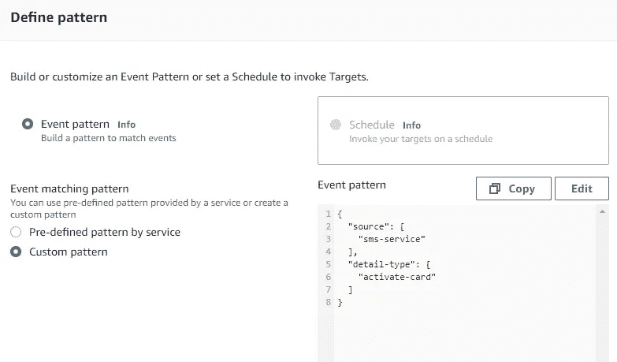
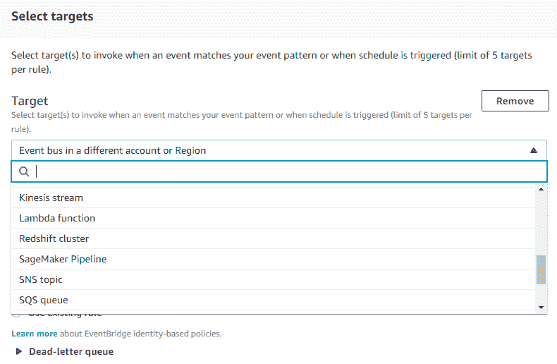
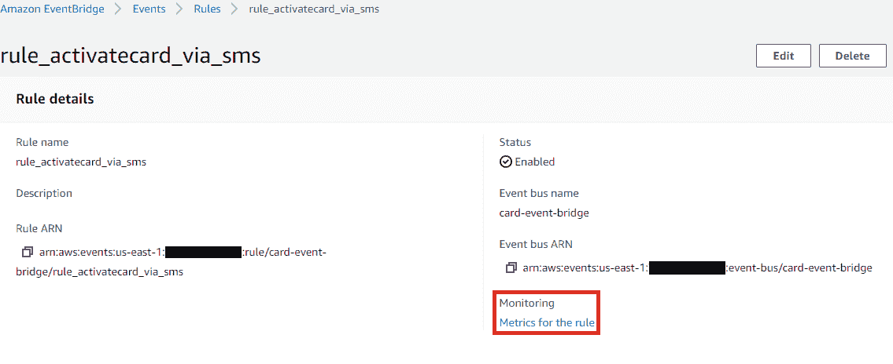
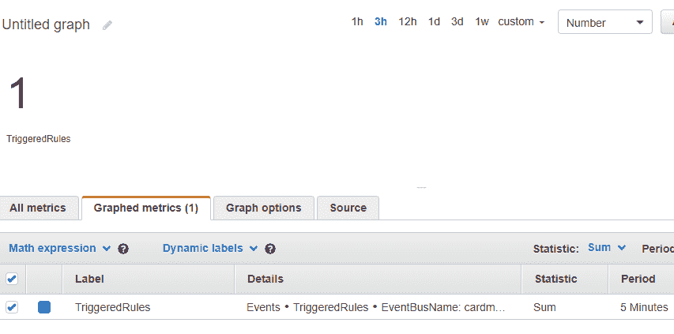
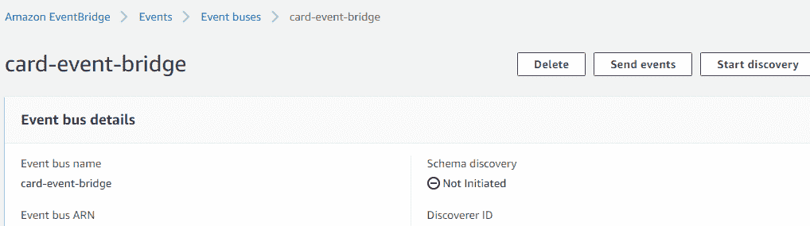
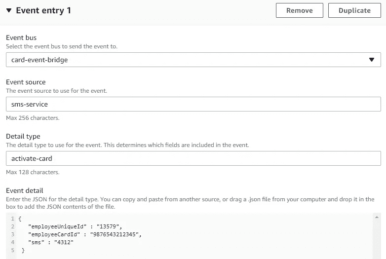

# AWS event bridge——离构建事件驱动的应用程序又近了一步。

> 原文：<https://medium.com/globant/aws-eventbridge-one-step-closer-to-build-an-event-driven-application-e1f49a8737fc?source=collection_archive---------1----------------------->

2019 年，AWS 推出了一项新的无服务器服务， **Amazon EventBridge** ，通过无服务器架构正式确定了事件流。而这项服务被认为是继[**AWSλ**](https://aws.amazon.com/lambda/)之后最大的无服务器服务。

最初，当 AWS 第一次开始为事件驱动架构提供工具时，是通过它的监控服务，即 AWS Cloudwatch。和[cloud watch Events](https://docs.aws.amazon.com/AmazonCloudWatch/latest/events/WhatIsCloudWatchEvents.html)&event bridge 的主要区别在于， **Cloudwatch Events** 只能支持 AWS 服务作为事件源。它只使用默认事件总线，该总线接受来自 AWS 服务的事件，而 **EventBridge** 提供了一个选项来创建自定义事件总线和基于默认总线的 SaaS 事件总线。

## 那么，到底什么是 AWS EventBridge 呢？

Amazon EventBridge 是一项连接不同应用程序并向您的预定目标发送实时数据的服务。事件发布者应用可以是(例如，传统)应用、SaaS 提供商或内部 AWS 服务，并且目标应用可以是 Lambda 函数、Amazon EC2 实例、Amazon Kinesis 数据流、SNS、SQS、Step 函数等。有关目标列表，请访问[此处](https://docs.aws.amazon.com/eventbridge/latest/userguide/eb-targets.html)。

现在我们知道了什么是 AWS EventBridge(要了解关于 EventBridge 的更多信息，请访问此处的),让我们来了解一下围绕 EventBridge 的一些关键术语。

## 与 EventBridge 相关的术语

*   **事件:**事件表示环境中的**变化**。例如，将 EC2 实例从挂起更改为运行。
*   **规则:**只有当传入事件与指定的规则匹配时，它们才会被路由到目标。
*   **目标:**目标可以是 Lambda 函数、Amazon EC2 实例、Amazon Kinesis 数据流、SNS、SQS、CICD 的管道、Step 函数等接收 json 格式的事件。
*   **事件总线:**事件总线接收事件。当您创建一个规则时，您将它与一个特定的事件总线相关联，并且该规则只与该事件总线接收的事件匹配。

## 现在，让我们跳到一个用例上，

假设有一个应用程序为一个特定的雇员生成一张特定的卡的 OTP wrt。要求是将详细信息(即 sms、employeeUniqueId、employeeCardId)发送到一些其他应用程序，以完成卡的激活。

因此，让我们从 AWS EventBridge 中的配置开始。

## 步骤 1:创建 EventBus:

这很简单，点击创建 EventBus 按钮，并给它一个名字。(*使用 EventBus，它从源应用程序接收事件，并将它们路由到与该事件总线相关联的规则)*

## 步骤 2:创建规则

按照下面定义的模式创建一个新规则，其规则名称如下。



Note : Source is the service that sourced the event. For ex-Order Service . Detail-type is the type of detail that is sent. For ex-New Order, Cancel Order etc

通过规则，事件被过滤，即如果事件的来源是“sms 服务”并且细节类型是“激活卡”，那么只有目标会被触发。

接下来，根据您的需要选择目标(例如 Lambda 函数),然后单击 Create 创建规则。



Define Target

**步骤 3:让我们使用 Java SDK 2** 向 EventBridge 发送一个事件

1.  **假设我有一个详细的 json :**

```
String detailJson = 
 {
   "employeeUniqueId" : "13579",
   "employeeCardId" : "9876543212345",
   "sms" : "4312"
 }
```

**2。创建事件桥客户端:**

```
EventBridgeClient eventBridgeClient = EventBridgeClient.builder().region(Region.of(region)).credentialsProvider(ContainerCredentialsProvider.builder().build()).build();
```

**3。创建 PutEventsRequestEntry :**

```
PutEventsRequestEntry putEventsRequestEntry =  PutEventsRequestEntry.builder().source("sms-service") .resources(resourceArn).detailType("activate-card").detail(detailJson).eventBusName("card-event-bridge").build();
```

**4。创建 PutEventRequest :**

```
PutEventsRequest putEventsRequest =
 PutEventsRequest.builder().entries(putEventsRequestEntry).build();
```

**5。将事件放入 EventBridge :**

```
PutEventsResponse putEventsResponse = eventBridgeClient .putEvents(putEventsRequest);
```

**步骤 4:跟踪接收到的事件**

为了监控满足事件规则的事件，选择您的规则并点击规则的**指标**



Rule details metadata

然后点击复选框触发以**统计为 Sum** & **Type 为 Number** 的事件，计数显示事件被接收的次数。



Event Metrics

## 通过控制台测试规则。

类似于**步骤 3** ，如果您希望测试规则或通过 AWS 控制台发送事件，您可以点击[事件总线](https://console.aws.amazon.com/events/home?region=us-east-1#/eventbuses)，然后选择您的事件总线并点击发送事件。



Event bus details metadata

点击发送事件后，输入来源、详细信息类型、事件详细信息，然后点击发送。



Send Event using Event bus’s Send events

与**步骤 4** 类似，您可以在 AWS 控制台中监控收到的事件。

## 结论

因此，我们看到了一个使用 EventBridge 进行应用程序集成的简单用例。在考虑沟通渠道时，EventBridge 还有其他替代方案，如[](https://aws.amazon.com/sns/)**[**Kinesis stream data**](https://aws.amazon.com/kinesis/data-streams/)等，但它们都有各自的优缺点。因此，明智地选择您的 AWS 服务。**

**您如何在无服务器环境中使用 EventBridge？请在下面的评论中分享你的想法。**