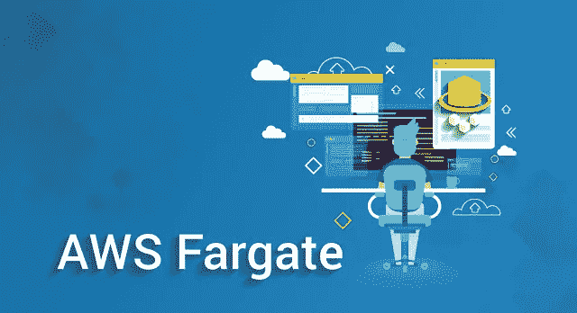

# AWS Fargate——AWS 弹性容器服务初学者指南

> 原文：<https://medium.com/edureka/aws-fargate-85a0e256cb03?source=collection_archive---------0----------------------->

AWS Fargate - Edureka

容器化在过去几年中改变了云架构，使企业能够以更快的速度构建、部署和管理应用。集装箱背后的势头肯定没有显示出任何放缓的迹象。现在有太多的容器和容器编排服务。然而，它们中的大多数仍然需要您为容器的运行配置和管理虚拟机集群。这就是 AWS Fargate 的用武之地。

在本文中，我们将学习 AWS Fargate，一个用于容器的无服务器计算平台。我们将在本文中涉及的主题如下:

1.  需要 AWS Fargate
2.  什么是 AWS Fargate？
3.  法盖特的工作
4.  演示:Fargate 正在运行

我们开始吧！

# 需要 AWS Fargate

当容器服务还不存在时，用户通常在虚拟机上启动他们的应用程序。在 AWS cloud 中，他们在 EC2 实例上部署应用程序。他们将他们的应用与操作系统打包成我们所说的亚马逊机器映像(AMI)，然后在 *AWS EC2 实例*上运行。

然后 docker 引入了容器，人们开始在这些容器上部署他们的应用程序。容器类似于 VM。一个主要的区别是，与 VM 不同，容器与其他容器共享主机系统的内核。下面的图表将使它更加清晰。

因此，随着这些容器开始变得越来越受欢迎，人们开始大规模使用它们。EC2 实例中的容器数量增加了，这反过来又增加了实例的数量。AWS 随后推出了**亚马逊弹性容器服务(ECS)** 。

但是什么是 ECS 服务呢？Amazon Elastic Container Service(Amazon ECS)是一个高度可伸缩、高性能的容器编排服务。**亚马逊 ECS** 减少了一些用户必须管理的开销。然而，用户仍然必须管理托管容器应用程序的底层实例。

这给了 AWS 一个想法，即提供一种服务来处理底层虚拟机，同时用户可以专注于构建他们的应用程序。所述服务是 **AWS Fargate。**

# 什么是 AWS Fargate？

*AWS Fargate 是 Amazon Elastic**Container**Service(ECS)的计算引擎，它允许您运行容器，而不必供应、配置&托管容器应用程序的虚拟机规模集群。*

AWS Fargate 消除了用户自己管理 EC2 实例的需要。实际上，用户根本不需要使用 EC2 实例。Fargate 本身将充当计算引擎。它让您专注于设计和构建应用程序等元素，而不是管理运行它们的基础架构。使用 **Fargate launch type** ，您需要做的就是将您的应用打包到容器中，指定内存和 CPU 需求，定义 IAM 策略&启动您的应用。

AWS Fargate 还可以让您轻松扩展应用程序。一旦定义了所有的应用程序需求，AWS Fargate 就会以高可用性的方式管理运行容器所需的所有伸缩和基础设施。它与亚马逊 ECS & EKS 无缝集成，为您启动和管理您的集装箱。

现在，在不维护底层服务器的情况下，启动容器的整个过程是如何进行的呢？

# AWS Fargate 的工作

在我们看到 AWS Fargate 的工作方式之前，让我们先来看看在处理 AWS Fargate 时经常遇到的一些通用术语。

## **集装箱:**

Docker 容器是软件开发的标准化单元，包含软件应用程序运行代码、运行时、系统工具、系统库等所需的一切。这些容器是从名为容器映像的只读模板创建的。

## **集装箱图像:**

图像通常是从 docker-file 构建的，docker-file 是一个纯文本文件，它指定了容器中包含的所有组件。这些图像存储在注册表中，可以从注册表中下载并在容器中运行。

## **任务定义:**

任务定义是一个 JSON 格式的文本文件，它描述了构成应用程序的一个或多个容器。您可以将它视为您的应用程序的蓝图。

## **任务:**

任务是集群中任务定义的实例化。您可以选择指定将在集群上运行的任务数量。

## **集群:**

集群基本上是应用程序所需资源的逻辑分组。如果您对集群中的任务使用 **Fargate 启动类型**，那么 Amazon ECS 会管理您的集群资源。如果您使用 **EC2 启动类型**，那么您的集群将是您管理的一组 Amazon EC2 容器实例。

现在我们准备冒险前进。下图让您大致了解了如何使用 AWS Fargate 在 ECS 上部署应用程序。

让我们试着去理解上图的内容。首先，您需要构建一个适合您的应用程序的容器映像，然后将它存储在注册表中。然后选择一个容器编排服务，Amazon ECS 或 Amazon EKS，并为应用程序分配资源。完成后，您需要创建一个集群来对所有这些分配的资源进行分组。这是您选择 AWS Fargate 启动类型的时候。现在 AWS Fargate 将启动并运行您的所有容器。它为您管理所有底层基础架构和集群。它还可以无缝扩展您的应用程序需求，而无需您操心。

这不是很简单吗？

现在，让我们使用 AWS Fargaet 启动类型在 Amazon ECS 上部署一个简单的 web 应用程序。

# **AWS Fargate 正在运行**

遵循以下步骤，使用 AWS Fargate 启动类型在 Amazon ECS 上部署一个简单的 web 应用程序。

> **注意**:确保你在 AWS Fargate 可用的 AWS 地区(你可以选择 N.Virginia)。

**第一步:**在亚马逊弹性容器服务控制台点击“开始”选项。

你将被带到一个页面，上面写着“ ***使用 Fargate 开始使用亚马逊弹性容器服务(Amazon ECS)***。

**步骤 2:** 创建一个容器定义。如果你刚刚开始使用 AWS Fargate，你可以选择预装的。

**步骤 3:** 创建任务定义。通过选择**编辑，您可以使用示例任务定义或可选地重命名任务定义并编辑任务使用的资源(例如**任务存储器**和**任务 CPU** 值)。**

**步骤 4:** 配置一个服务，该服务在集群中启动并维护指定数量的任务定义副本。您可以使用预加载的服务定义，或者选择重命名服务，或者通过选择**编辑来查看和编辑详细信息。**

**步骤 5:** 作为最后一步，您需要配置集群。命名您的集群，然后 Amazon ECS 会为您处理网络和 IAM 配置。然后回顾您到目前为止所做的工作，并点击**创建**完成。

***就是这样！您的简单 web 应用程序应该已经启动并运行了。***

现在，如果您的服务是一个基于 web 的应用程序，就像我们刚刚推出的应用程序一样，您可以使用 web 浏览器查看其内容。

**步骤 6** (可选):在服务的网络部分寻找 **IPv4 公共 IP** 地址&在您的网络浏览器中输入该地址。您应该会看到一个显示您刚刚启动的 web 应用程序的网页。

现在您知道如何使用 **AWS Fargate launch type** 在 Amazon Elastic Container Service 上启动容器。去探索吧。

原来就是这样！我希望这篇博客能给你提供信息，增加你的知识。如果你想查看更多关于人工智能、DevOps、道德黑客等市场最热门技术的文章，你可以参考 Edureka 的官方网站。

请留意本系列中的其他文章，它们将解释 AWS 的各个方面。

> 1. [AWS 教程](/edureka/amazon-aws-tutorial-4af6fefa9941)
> 
> 2. [AWS EC2](/edureka/aws-ec2-tutorial-16583cc7798e)
> 
> 3. [AWS Lambda](/edureka/aws-lambda-tutorial-cadd47fbd39b)
> 
> 4. [AWS 弹性豆茎](/edureka/aws-elastic-beanstalk-647ae1d35e2)
> 
> 5. [AWS S3](/edureka/s3-aws-amazon-simple-storage-service-aa71c664b465)
> 
> 6. [AWS 控制台](/edureka/aws-console-fd768626c7d4)
> 
> 7. [AWS RDS](/edureka/rds-aws-tutorial-for-aws-solution-architects-eec7217774dd)
> 
> 8. [AWS 迁移](/edureka/aws-migration-e701057f48fe)
> 
> 9.[亚马逊 Lex](/edureka/how-to-develop-a-chat-bot-using-amazon-lex-a570beac969e)
> 
> 10.[亚马逊光帆](/edureka/amazon-lightsail-tutorial-c2ccc800c4b7)
> 
> 11. [AWS 定价](/edureka/aws-pricing-91e1137280a9)
> 
> 12.[亚马逊雅典娜](/edureka/amazon-athena-tutorial-c7583053495f)
> 
> 13.AWS CLI
> 
> 14.[亚马逊 VPC 教程](/edureka/amazon-vpc-tutorial-45b7467bcf1d)
> 
> 15. [AWS vs Azure](/edureka/aws-vs-azure-1a882339f127)
> 
> 16.[内部部署与云计算](/edureka/on-premise-vs-cloud-computing-f9aee3b05f50)
> 
> 17.[亚马逊迪纳摩 DB 教程](/edureka/amazon-dynamodb-tutorial-74d032bde759)
> 
> 18.[如何从快照恢复 EC2？](/edureka/restore-ec2-from-snapshot-ddf36f396a6e)
> 
> 19. [AWS 代码提交](/edureka/aws-codecommit-31ef5a801fcf)
> 
> 20.[使用 Amazon ECS 在生产中运行 Docker](/edureka/docker-container-in-production-amazon-ecs-19857ce96f25)
> 
> 21. [AWS 架构师面试问题](/edureka/aws-architect-interview-questions-5bb705c6b660)

*原载于 2018 年 11 月 27 日*[*【www.edureka.co】*](https://www.edureka.co/blog/aws-fargate/)*。*