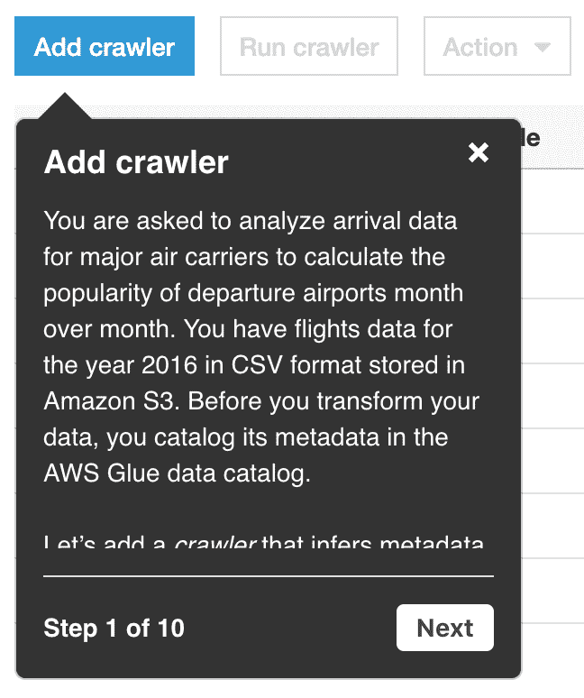

# AWS Glue:潜力巨大的 ETL 解决方案

> 原文：<https://medium.com/capital-one-tech/aws-glue-an-etl-solution-with-huge-potential-91a04a2a0712?source=collection_archive---------0----------------------->

Your new friend, Glue.

[AWS Glue](https://aws.amazon.com/glue/) 是一种相对较新的完全托管的无服务器提取、转换和加载(ETL)服务，对于跨企业组织的团队来说具有巨大的潜力，从工程到数据再到分析。Glue 将 Apache Spark 的速度和功能与 Hive metastores 的轻量级数据组织相结合，以——你猜对了——*将来自 AWS 的不同数据源粘合在一起。虽然 AWS Glue 是两年前[宣布](https://aws.amazon.com/blogs/aws/launch-aws-glue-now-generally-available/)的，但它仍在积极开发中，每隔几个月就会有新的显著特性加入。Glue 不是银弹，它可能不像你希望的那样无缝或可访问，但如果有正确的策略和用例，它会非常适合。我想分享一下我在过去一年里使用 Glue 的经验，帮助你做决定，同时避免一些…棘手的情况。*

# 为什么选择胶水？

作为 Capital One 的后端软件工程师，我的团队选择 Glue 作为无服务器通知服务的解决方案，该服务需要处理来自公司多个来源的数据，包括文件和数据库。虽然我的团队不是专门的数据工程团队，但我们认识到我们的模式本质上是一个 ETL 管道:ETL 作业从源移动数据，将其转换为所需的形式，并将结果数据和模式加载到目标系统中。我们知道，如果可能的话，我们需要一个无服务器的解决方案，当我们发现 AWS 有一个无服务器的 ETL 服务时，我们决定冒险一试，成为公司中第一个在生产中使用 Glue jobs 的团队。

Glue 努力在一个地方用最少的基础设施设置来处理数据设置和处理。粘合数据目录可以使基于文件的和传统的数据源对粘合作业可用，包括通过[爬虫](https://docs.aws.amazon.com/glue/latest/dg/add-crawler.html)的模式检测。Glue 的数据目录可以与 [AWS Athena](https://aws.amazon.com/athena/) 共享一个 [Hive](http://hive.apache.org/) metastore，对于像我们这样的现有 Athena 用户来说，这是一个方便的特性。

要运行处理这些数据的作业，Glue 可以使用 Python shell、Spark 或最近的 Spark Streaming，这是一个必须启用的测试版特性。胶合作业可以用 Python 或 Scala 编写。我的团队在 Python3 中使用了 Spark，所以我将根据我的经历来谈谈。当粘合作业使用 Spark 时，一旦作业运行，Spark 集群就会自动启动。Glue 几乎不需要手动配置和管理 EC2 或 EMR 上的 Spark 集群。

Glue 最有用的一点是它的默认超时是两天——不像 Lambda 的最大超时是 15 分钟。这意味着胶合作业本质上可以像 Lambda 一样用于太长或太不可预测的作业。虽然 Glue 并不打算用于此目的，但 AWS Solutions 架构师已经确认这是一个常见且可接受的用例。

如果你是像我一样的视觉学习者，这个 AWS 视频“AWS Glue ETL 入门”是一个很好的介绍:

# AWS 胶水之旅

Glue 将其主要服务分为**数据目录**和 **ETL** 。由于 Glue 使用了常见的数据术语，但稍微改变了定义，我将在下面翻译它们。

## **AWS 胶水数据目录**

粘合数据目录是粘合作业访问数据时必须存储元数据的地方。当 Athena 和 Glue 连接在一起时(Athena 需要被升级到 T9)，Athena 中存在的任何 Athena 数据库或基于文件的表也可以用于 Glue 作业。

*   **表**不是典型的关系数据库表，而是数据源的元数据表定义，而不是数据本身。这有点像带有预览的链接—粘合表告诉您数据位于何处，以及您应该在那里找到什么数据字段和类型。胶合表可以描述存储在 S3 中的基于文件的数据，比如 Parquet、CSV 或 JSON，以及传统数据存储中的数据，比如 [RDS](https://aws.amazon.com/rds/) 表。后一种来源需要被连接和爬行以便可访问。
*   **数据库**本质上是表格所属的一组数据源。在 Glue 中创建数据库只需要一个名字。
*   **连接**在 Glue 和 RDS (Postgres、MySQL 等)、Redshift 或 JDBC 实例之间创建一个经过验证的链接，并允许 Glue 访问存储在那里的数据。
*   为了使通过连接访问的数据源的元数据可以被粘合到数据库中，您需要设置并运行一个 **Crawler** ，它“连接到一个数据存储，通过一个分类器的优先级列表来确定您的数据的模式，然后在您的数据目录中创建元数据表。”— [AWS 胶水文件。](https://docs.aws.amazon.com/glue/latest/dg/add-crawler.html)爬虫还擅长确定复杂的非结构化或半结构化数据的模式，这可以节省大量时间。众所周知，拼花和 AVRO 文件很难让人读懂，爬虫可以在几分钟内整理出这些模式。

## 抽取、转换、加载至目的端（extract-transform-load 的缩写）

ETL 部分包含脚本和工具，这些脚本和工具使用数据目录中设置的数据来提取、转换和加载到需要的位置。

*   Glue ETL 的核心是**作业**。作业由一个脚本组成，该脚本可以从数据目录中的源加载数据并对其执行转换。Glue 可以自动生成脚本，也可以用 Python (PySpark)或 Scala 编写自己的脚本。Glue 还允许您通过链接到 S3 的 zip 文件，将外部库和自定义代码导入到您的作业中。在 Glue 能够在本地运行之前，我们进行了开发，我们在作业脚本中隔离了特定于 Glue 的代码，然后将我们的 Python 代码的剩余部分转移到一个更典型和可测试的应用程序结构中，我们将它压缩并与脚本一起部署。
*   **ML 转换**是作业的一个子类，它“提供[机器学习能力](https://docs.aws.amazon.com/glue/latest/dg/machine-learning.html)来创建定制转换以清理您的数据。”您可以从目录连接数据存储，并“调整转换”以识别重复数据等。
*   **触发**运行作业。它们可以按计划、按命令或按作业事件运行，并且它们接受 cron 命令。
*   **工作流**是触发器和作业的组合。例如，您可能有一个作业需要在下一个作业运行之前完成。您可以创建一个工作流，其中包含一个启动作业 1 的触发器，以及一个等待作业 1 完成并启动作业 2 的触发器。
*   Glue 也有[开发端点](https://docs.aws.amazon.com/en_pv/glue/latest/dg/dev-endpoint.html)和[笔记本](https://docs.aws.amazon.com/glue/latest/dg/console-notebooks.html)，它们允许人们更有效地开发和测试脚本，因为它们提供了一个专用的 Spark 集群，您可以在其上连续运行作业。在我的开发环境中不可能使用它们，所以我不能谈论它们的功能。

# 胶水入门

首先也是最重要的:为了让 glue 能够将所有东西粘在一起，您需要设置您的 IAM 角色和 S3 存储桶策略，以便可以访问 Glue。为了让您现有的 IAM 角色在 Glue 中可用，您需要将 Glue 添加到该角色的信任关系中。要使用 Athena with Glue，您需要升级并修改现有角色。还有更多特定于环境的问题，您可能会发现更多。

Step-by-step instructions for creating a crawler.

在尝试了一些不同的学习策略后，我推荐首先使用 Glue 左侧栏中的交互式教程。他们指导你制作一个爬虫、一个表格和一个触发器，这有助于比阅读[文档](https://docs.aws.amazon.com/glue/latest/dg/what-is-glue.html)更快地感受 Glue 的能力。

我还推荐探索他们的[自动生成脚本](https://docs.aws.amazon.com/glue/latest/dg/aws-glue-api-etl-script-generation.html)和代码片段。添加一个新任务，选择*“这个任务运行 AWS Glue 生成的脚本。”*最简单的转换之一是用 Glue 改变列名和顺序。

生成脚本后，您还可以添加各种自动生成的转换。

# 胶水粘着点

总的来说，我对胶水有很好的体验。我的团队不需要像使用更传统的解决方案那样配置 Spark 集群或恢复服务器。我们还可以在沙盒风格的环境中运行代码，只需点击“运行作业”即可测试作业

但是，随着繁重的管理而来的是更少的控制，并且有一些重大的挑战可能会影响您的使用情形。当一项服务被管理时，也不总是清楚你需要什么额外的知识来从产品中获得最大的收益——或者避免重大问题。

## 发展速度:抓紧时间等

粘合作业仍然在 Spark 集群上运行，无论您是否亲自管理它们，它们都需要一段时间来加速运转。作业可能需要 20 分钟才能启动，这还不包括运行所需的时间，尤其是在高峰时段。一个令人困惑的因素是，作业可能因为一个错误而无法启动，而 Glue 日志可能无法帮助您解决这个问题。我与 AWS 支持人员讨论过这个问题，很明显，有时他们根本没有任何可用的集群，从而导致“资源不可用”的错误。我的理解是，他们正在努力解决这个问题，但我不确定时间表。

如果您碰巧在现有的集群上运行，那么作业**可以在不到一分钟的时间内开始，但是如果不使用 Dev 端点，就没有一种万无一失的方法来保持集群运行或在运行的集群上保持您的作业，这会显著影响您的 AWS 成本。**

AWS 似乎很重视这个问题——他们最近发布了这个公告，允许用户注册一个测试功能，保证作业在不到一分钟的时间内开始。我已经注册了这项服务，但是还没有获得使用这项功能的权限。

## 测试可能会很艰难

我们早期花了很多时间在 AWS 控制台中反复运行作业，这很慢并且不受版本控制，因为每次保存新的脚本都会删除以前的文件。当时，[不可能在本地](https://stackoverflow.com/questions/48314268/can-i-test-aws-glue-code-locally)运行 Glue，所以我们不能在本地测试组件。我们通过分解特定于 Glue 的代码来解决这个问题，并使用现有的库来测试剩余的代码，例如 [pytest](https://docs.pytest.org/en/latest/) ，最近开始在 Databricks 中开发。

2019 年 8 月底， [AWS 宣布](https://aws.amazon.com/about-aws/whats-new/2019/08/aws-glue-releases-binaries-of-glue-etl-libraries-for-glue-jobs/)“…你现在可以使用 Maven…在本地导入 Glue ETL 库的已发布 Java 二进制文件。”这可能是一个很大的改进，但不幸的是，它在我们特定的开发环境中不可用，尽管它可能对您有用。

## 它一直在变化

由于 Glue 仍然是相当新的，并且正在被积极地研究，你可能会遇到 StackOverflow 和 docs 还没有解决的问题。随着每一个改进，尽管非常值得赞赏，但也带来了需要管理的复杂性。与各种 [Boto3](https://boto3.amazonaws.com/v1/documentation/api/latest/index.html) 客户端和其他 AWS 服务的集成导致了一些棘手的访问和配置问题。我并不认为 Glue 错误消息有所帮助，似乎也没有办法减少详细日志中的噪音，以便更快地识别致命问题。

与任何工具一样，胶水可以按预期使用，但它很容易按预期使用。文档和教程将 Glue 描述为一个易于使用的解决方案，它可以自动生成脚本并消除管理 Spark 集群的麻烦。这种增加的可访问性为不一定遵循预期路径的用户打开了大门，文档也没有为他们准备好(呃…我们)。

# 后见之明是 2020 年

如果我能回到过去，用我现在所知道的一切重新来过，我的建议是:

1.  **要么知道 Spark，要么不用 Spark！**我们认为我们可以写一个普通的 Python 并用 Glue 运行它。不——py spark*看起来*像 Python，但行为不像 Python。为了不耗尽内存，我们花了大量时间追溯性地找出如何重写我们的代码来进行 Spark 优化。事后看来，考虑到我们的团队对 Spark 的了解很少，我们本应该在 Spark **中完成速成课程，或者**使用 Glue 本质上作为一个没有 Spark 的 Athena orchestrator，或者作为一个超时更长的 Lambda。
2.  **使用** [**数据块**](https://databricks.com/) **进行更快的开发。当我们学习如何使用 Glue 时，我们运行的作业通常需要 10 分钟才能启动，然后由于语法错误等原因而失败。为了更快地失败，使用数据块来运行代码片段(或您的整个应用程序)并确认您的语法和逻辑，而不必等待新的集群在 Glue 中启动。Databricks 是由创建 Spark 的同一批人创建的，因此它是一个可靠的沙盒环境。应该注意的是，Glue Spark 和 Spark 之间存在一些语法差异，主要是在初始化上下文时。在本地运行 Glue 是另一个选择，但是在我们的开发期间不可行。**
3.  **设置警报以监控作业状态变化。**考虑到检查一项工作是否完成要花费多少时间，我很高兴我终于通过 [AWS SNS](https://aws.amazon.com/sns/) 设置了一个电子邮件提醒，告诉我我的工作何时成功或失败。这使我无需登录 AWS 控制台就可以监视作业，而不是不断地切换上下文。我建议马上设置这个。

# 胶水和你

尽管存在这些挑战，AWS Glue 仍然是一个高效而有用的工具，非常适合需要移动或转换数据的许多用例。我的团队向 Glue 的过渡极大地减少了基础设施和复杂性，我期待看到 Glue 在未来的应用。我希望这篇关于胶水的介绍能让你开始尝试更少的摩擦，看看胶水是否是你工作的合适工具。

请随时联系我，告诉我你使用胶水的经历。

*披露声明:2020 资本一。观点是作者个人的观点。除非本帖中另有说明，否则 Capital One 不隶属于所提及的任何公司，也不被这些公司认可。使用或展示的所有商标和其他知识产权是其各自所有者的财产。*