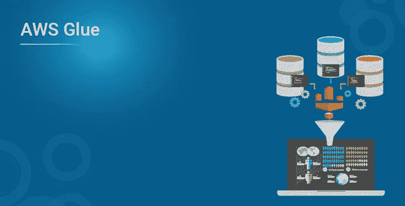
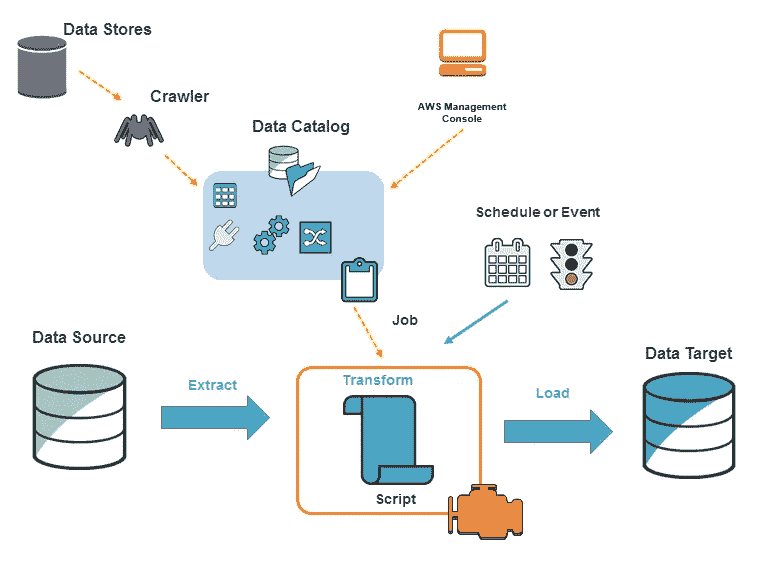
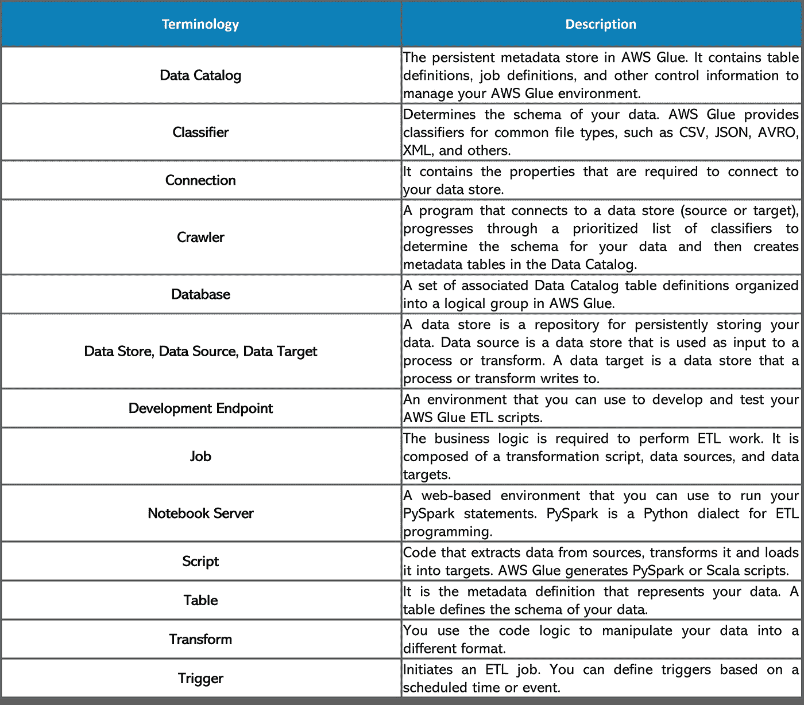
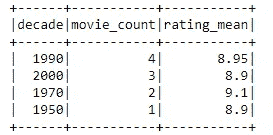

# AWS Glue——简化 ETL 过程所需的一切

> 原文：<https://medium.com/edureka/aws-glue-d142e06ede75?source=collection_archive---------1----------------------->



ETL 过程是专门为将数据从源数据库转移到数据仓库而设计的。然而，ETL 的挑战和复杂性使得它很难成功地实现所有的企业数据。为此，亚马逊推出了 AWS Glue。在本文中，我们将涉及的要点如下:

*   **什么是 AWS 胶水？**
*   **什么时候应该使用 AWS 胶水？**
*   **AWS 胶水的好处**
*   **AWS 胶水概念**
*   **AWS 胶水术语**
*   **AWS 胶水是怎么工作的？**

让我们从第一个话题开始。

# AWS 胶水是什么？


*   AWS Glue 是一个完全托管的 ETL 服务。这项服务使数据分类、清理、丰富以及在各种数据存储之间快速可靠地移动变得简单而经济。
*   它由一些组件组成，如一个称为 AWS Glue Data Catalog 的中央元数据存储库、一个自动生成 Python 或 Scala 代码的 ETL 引擎，以及一个灵活的调度程序，用于处理依赖关系解析、作业监控和重试。
*   AWS Glue 是无服务器的，这意味着不需要设置或管理基础设施。

# 什么时候应该使用 AWS 胶水？

## 1.构建数据仓库来组织、清理、验证和格式化数据。

*   您可以将 AWS 云数据转换并移动到数据存储中。
*   您还可以将不同来源的数据加载到您的数据仓库中，以便进行定期报告和分析。
*   通过将信息存储在数据仓库中，您可以集成来自业务不同部分的信息，并为决策提供一个公共数据源。

## 2.当您对亚马逊 S3 数据湖运行无服务器查询时。

*   AWS Glue 可以对您的亚马逊简单存储服务(亚马逊 S3)数据进行编目，使其可用于使用亚马逊 Athena 和亚马逊 Redshift Spectrum 进行查询。
*   使用爬网程序，您的元数据与底层数据保持同步。Athena 和 Redshift Spectrum 可以在 AWS Glue 数据目录的帮助下直接查询你的[亚马逊 S3](https://www.edureka.co/blog/s3-aws-amazon-simple-storage-service/) 数据湖。
*   借助 AWS Glue，您可以通过一个统一的界面访问和分析数据，而无需将数据加载到多个数据仓库中。

## 3.当您想要创建事件驱动的 ETL 管道时

*   通过从 AWS Lambda 函数调用 AWS Glue ETL 作业，您可以在 Amazon S3 获得新数据后立即运行 ETL 作业。
*   您还可以在 AWS Glue 数据目录中注册这个新数据集，将其视为 ETL 作业的一部分。

## **4。了解您的数据资产。**

*   您可以使用各种 AWS 服务存储数据，并使用 AWS Glue 数据目录维护数据的统一视图
*   查看数据目录以快速搜索和发现您拥有的数据集，并在一个中央存储库中维护相关元数据。
*   数据目录还可以作为外部 Apache Hive Metastore 的替代产品。

# AWS 胶水优势

## 1.更少麻烦

AWS Glue 集成了非常广泛的 AWS 服务。AWS Glue 本机支持存储在亚马逊 Aurora 和所有其他亚马逊 RDS 引擎、亚马逊红移和亚马逊 S3 中的数据，以及运行在亚马逊 EC2 上的虚拟私有云(亚马逊 VPC)中的常见数据库引擎和数据库。

## 2.性价比高

AWS 胶水是无服务器的。没有要供应或管理的基础架构。AWS Glue 处理在完全托管的、可扩展的 Apache Spark 环境上运行 ETL 作业所需的资源的供应、配置和扩展。您只需为作业运行时使用的资源付费。

## 3.更多动力

AWS Glue 自动化了构建、维护和运行 ETL 作业的大量工作。它抓取您的数据源，识别数据格式以及建议模式和转换。AWS Glue 自动生成代码来执行数据转换和加载过程

# AWS 粘合概念

在 AWS Glue 中定义*作业*来完成从数据源提取、转换和加载(ETL)数据到数据目标所需的工作。您通常会执行以下操作:



*   首先，定义一个*爬虫*，用元数据表定义填充 AWS 粘合数据目录。您将爬行器指向数据存储，爬行器在数据目录中创建表定义。除了表定义之外，数据目录还包含定义 ETL 作业所需的其他元数据。当您定义转换数据的作业时，可以使用此元数据。
*   AWS Glue 可以生成一个脚本来转换您的数据，或者您也可以在 AWS Glue 控制台或 API 中提供脚本。
*   您可以按需运行您的作业，也可以将其设置为在指定的*触发*发生时启动。触发器可以是基于时间的计划或事件。
*   当作业运行时，脚本从数据源中提取数据，转换数据，并将其加载到数据目标中。这个脚本在 AWS Glue 中的 Apache Spark 环境中运行。



# AWS 胶水是怎么工作的？

在这里，我将演示一个例子，我将使用 [Python](https://www.edureka.co/blog/whats-new-python-3-8/) 和 Spark 创建一个转换脚本。我还将介绍一些基本的粘合概念，如爬虫、数据库、表和作业。

## **1。为 AWS Glue 创建一个数据源:**

Glue 可以从数据库或 S3 桶中读取数据。例如，我创建了一个名为 *glue-bucket-Edureka* 的 S3 桶。**从 S3 控制台创建两个文件夹**，命名为 *read* 和 *write* 。现在用下面的数据创建一个文本文件，并上传到 S3 桶的 read 文件夹。

1.  排名、电影 _ 片名、年份、评分
    1、肖申克的救赎、1994、9.2
    2、教父、1972、9.2
    3、教父:第二部、1974、9.0
    4、黑暗骑士、2008、9.0
    5、12 愤怒的人、1957、8.9
    6、辛德勒的名单、1993、8.9 【T14

## **2。将数据源爬网到数据目录:**

在这一步中，我们将创建一个爬虫。爬网程序将对指定的 S3 存储桶和前缀中的所有文件进行编目。所有文件应该具有相同的模式。在 Glue crawler 术语中，该文件格式被称为*分类器*。爬虫自动识别最常见的分类器，包括 CSV、json 和 parquet。我们的样本文件是 CSV 格式，将被自动识别。

*   在胶水管理控制台的左面板点击**爬虫**和*。*
*   点击蓝色的**添加爬虫**按钮。
*   给爬虫起个**名字**比如 *glue-demo-edureka-crawler。*
*   在**添加一个数据存储**菜单中选择 S3 并选择你创建的桶。向下钻取选择*读取*文件夹。
*   在**中选择一个 IAM 角色**新建。将角色命名为例如 *glue-demo-edureka-iam-role。*
*   在**配置爬虫的输出中**添加了一个名为*的数据库 glue-demo-edureka-DB。*

当您回到所有爬虫列表中时，勾选您创建的爬虫。点击**运行爬虫**。

## 3.粘合表中的已爬网元数据:

一旦爬取了数据，爬行器就从中创建一个元数据表。您可以在 Glue 控制台的表格部分找到结果。您在 crawler 设置期间创建的*数据库*只是对表进行分组的一种任意方式。粘合表不包含数据，只包含如何访问数据的指令。

## 4.AWS 用于数据转换的粘合作业:

从胶水控制台左侧面板进入**工作**并点击蓝色**添加工作**按钮。按照以下说明创建粘合作业:

*   将作业命名为 *glue-demo-edureka-job。*
*   选择与您为爬虫创建的相同的 **IAM 角色**。它可以读写 S3 桶。
*   **型** : *火花。*
*   **胶水版本** : *Spark 2.4，Python 3。*
*   **该作业运行** : *一个由您创作的新脚本*。
*   **安全配置、脚本库和作业参数**
*   **最大容量** : *2* 。这是最低价格，每次大约 0.15 美元。
*   **作业超时** : *10。*防止作业运行时间超过预期。
*   点击**下一步**，然后**保存作业并编辑脚本**。

## 5.编辑 Glue 脚本以使用 Python 和 Spark 转换数据:

将下面的代码复制到你的 Glue 脚本编辑器中，记住**改变变量 *s3_write_path* 的桶名**。**在编辑器中保存**代码，点击**运行作业**。

```
#########################################
### IMPORT LIBRARIES AND SET VARIABLES
#########################################

#Import python modules
from datetime import datetime

#Import pyspark modules
from pyspark.context import SparkContext
import pyspark.sql.functions as f

#Import glue modules
from awsglue.utils import getResolvedOptions
from awsglue.context import GlueContext
from awsglue.dynamicframe import DynamicFrame
from awsglue.job import Job

#Initialize contexts and session
spark_context = SparkContext.getOrCreate()
glue_context = GlueContext(spark_context)
session = glue_context.spark_session

#Parameters
glue_db = “glue-demo-edureka-db”
glue_tbl = “read”
s3_write_path = “s3://glue-demo-bucket-edureka/write”

#########################################
### EXTRACT (READ DATA)
#########################################

#Log starting time
dt_start = datetime.now().strftime(“%Y-%m-%d %H:%M:%S”)
print(“Start time:”, dt_start)

#Read movie data to Glue dynamic frame
dynamic_frame_read = glue_context.create_dynamic_frame.from_catalog(database = glue_db, table_name = glue_tbl)

#Convert dynamic frame to data frame to use standard pyspark functions
data_frame = dynamic_frame_read.toDF()

#########################################
### TRANSFORM (MODIFY DATA)
#########################################

#Create a decade column from year
decade_col = f.floor(data_frame[“year”]/10)*10
data_frame = data_frame.withColumn(“decade”, decade_col)

#Group by decade: Count movies, get average rating
data_frame_aggregated = data_frame.groupby(“decade”).agg(
f.count(f.col(“movie_title”)).alias(‘movie_count’),
f.mean(f.col(“rating”)).alias(‘rating_mean’),
)

#Sort by the number of movies per the decade
data_frame_aggregated = data_frame_aggregated.orderBy(f.desc(“movie_count”))

#Print result table
#Note: Show function is an action. Actions force the execution of the data frame plan.
#With big data the slowdown would be significant without caching.
data_frame_aggregated.show(10)

#########################################
### LOAD (WRITE DATA)
#########################################

#Create just 1 partition, because there is so little data
data_frame_aggregated = data_frame_aggregated.repartition(1)

#Convert back to dynamic frame
dynamic_frame_write = DynamicFrame.fromDF(data_frame_aggregated, glue_context, “dynamic_frame_write”)

#Write data back to S3
glue_context.write_dynamic_frame.from_options(
frame = dynamic_frame_write,
connection_type = “s3”,
connection_options = {
“path”: s3_write_path,
#Here you could create S3 prefixes according to a values in specified columns
#”partitionKeys”: [“decade”]
},
format = “csv”
)

#Log end time
dt_end = datetime.now().strftime(“%Y-%m-%d %H:%M:%S”)
print(“Start time:”, dt_end)
```

详细的解释在代码中有注释。以下是高层次的描述:

*   从 S3 读取电影数据
*   获得每十年的电影数量和平均评分
*   将聚合数据写回 S3

两个数据处理单元(DPU)的执行时间约为 40 秒。相对较长的持续时间是由启动开销造成的。



数据转换脚本创建汇总的电影数据。例如，2000 年的十年有 3 部电影在 IMDB top 10 中平均评分为 8.9。您可以从 S3 存储桶的 *write* 文件夹中下载结果文件。调查这项工作的另一种方法是查看 CloudWatch 日志。

数据以 CSV 格式存储回 S3 的“写入”前缀中。分区的数量等于输出文件的数量。

至此，关于 AWS Glue 的这篇文章到此结束。我希望你已经理解了我在这里解释的一切。我希望你喜欢这个什么是云计算教程。如果你想查看更多关于人工智能、DevOps、道德黑客等市场最热门技术的文章，那么你可以参考 [Edureka 的官方网站。](https://www.edureka.co/blog/?utm_source=medium&utm_medium=content-link&utm_campaign=aws-glue)

请留意本系列中解释云的各个方面的其他文章。

> *1。* [*AWS 教程*](/edureka/amazon-aws-tutorial-4af6fefa9941)
> 
> *2。* [*AWS EC2*](/edureka/aws-ec2-tutorial-16583cc7798e)
> 
> *3。*[*AWSλ*](/edureka/aws-lambda-tutorial-cadd47fbd39b)
> 
> *4。*[*AWS*弹性豆茎](/edureka/aws-elastic-beanstalk-647ae1d35e2)
> 
> *5。* [*AWS S3*](/edureka/s3-aws-amazon-simple-storage-service-aa71c664b465)
> 
> *6。* [*AWS 控制台*](/edureka/aws-console-fd768626c7d4)
> 
> *7。* [*AWS RDS*](/edureka/rds-aws-tutorial-for-aws-solution-architects-eec7217774dd)
> 
> 8。 [*AWS 迁移*](/edureka/aws-migration-e701057f48fe)
> 
> *9。*[*AWS Fargate*](/edureka/aws-fargate-85a0e256cb03)
> 
> *10。* [*亚马逊 Lex*](/edureka/how-to-develop-a-chat-bot-using-amazon-lex-a570beac969e)
> 
> *11。* [*亚马逊*](/edureka/amazon-lightsail-tutorial-c2ccc800c4b7)
> 
> *12。* [*AWS 定价*](/edureka/aws-pricing-91e1137280a9)
> 
> *13。* [*亚马逊雅典娜*](/edureka/amazon-athena-tutorial-c7583053495f)
> 
> *14。* [*AWS CLI*](/edureka/aws-cli-9614bf69292d)
> 
> *15。* [*亚马逊 VPC 教程*](/edureka/amazon-vpc-tutorial-45b7467bcf1d)
> 
> *15。*[*AWS vs Azure*](/edureka/aws-vs-azure-1a882339f127)
> 
> *17。* [*内部部署 vs 云计算*](/edureka/on-premise-vs-cloud-computing-f9aee3b05f50)
> 
> *18。* [*亚马逊迪纳摩 DB 教程*](/edureka/amazon-dynamodb-tutorial-74d032bde759)
> 
> *19。* [*如何从快照恢复 EC2？*](/edureka/restore-ec2-from-snapshot-ddf36f396a6e)
> 
> *20。* [*AWS 代码提交*](/edureka/aws-codecommit-31ef5a801fcf)
> 
> *21。* [*使用亚马逊 ECS*](/edureka/docker-container-in-production-amazon-ecs-19857ce96f25) 在生产中运行 Docker

*原载于 2018 年 11 月 30 日*[*https://www.edureka.co*](https://www.edureka.co/blog/aws-glue/)*。*

*   点击**下一步**，然后点击**保存作业并编辑脚本**。

# 5.编辑 Glue 脚本以使用 Python 和 Spark 转换数据:

将下面的代码复制到你的粘合脚本编辑器中。**将 *s3_write_path* **的 bucket 名称**更改，在编辑器中保存**代码，点击**运行作业**。