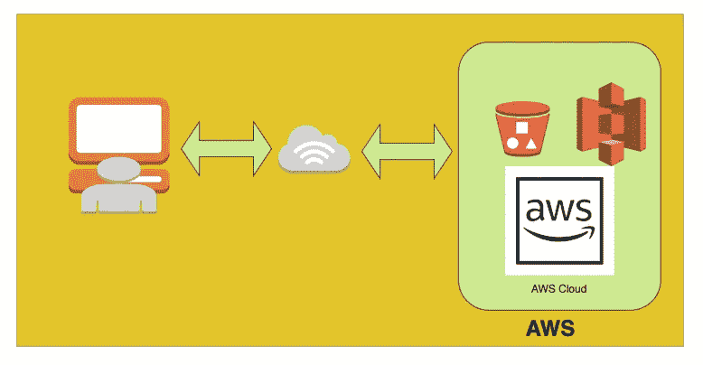

# AWS——如何用 S3 在 5 分钟内建立一个静态网站

> 原文：<https://medium.com/bb-tutorials-and-thoughts/aws-how-to-build-a-static-website-with-s3-2fa0b8c8c417?source=collection_archive---------0----------------------->

在本文中，我们将在 AWS 上构建一个静态网站。我们将使用简单存储服务(s3)来托管静态网站。

**static website hosting on AWS**

这里是使用 S3 在 AWS 上创建静态网站的一步一步的指南。

这个项目有一些先决条件。你需要有

*   AWS 帐户