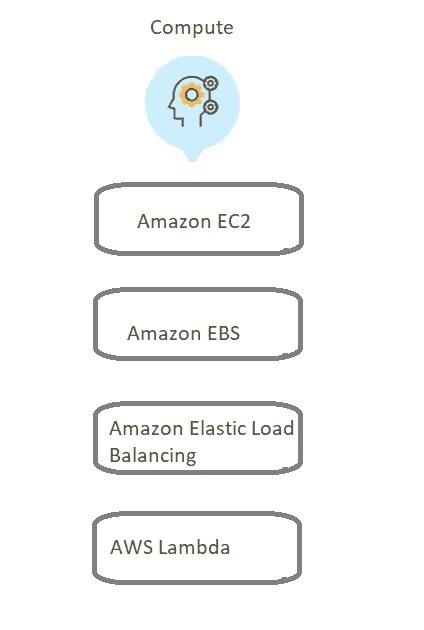
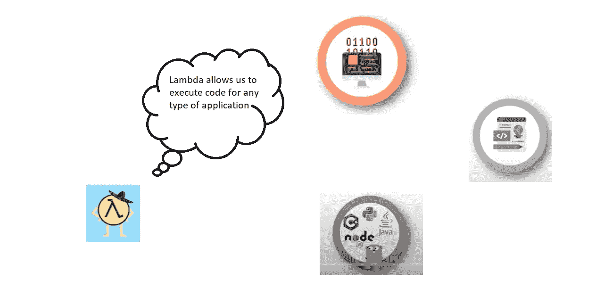
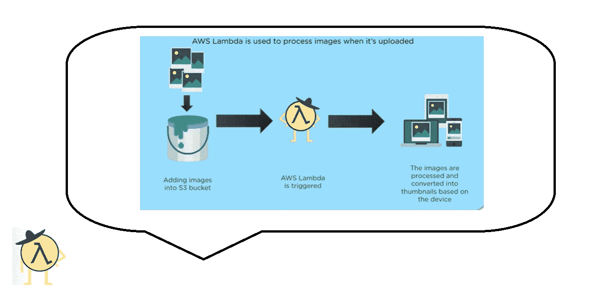
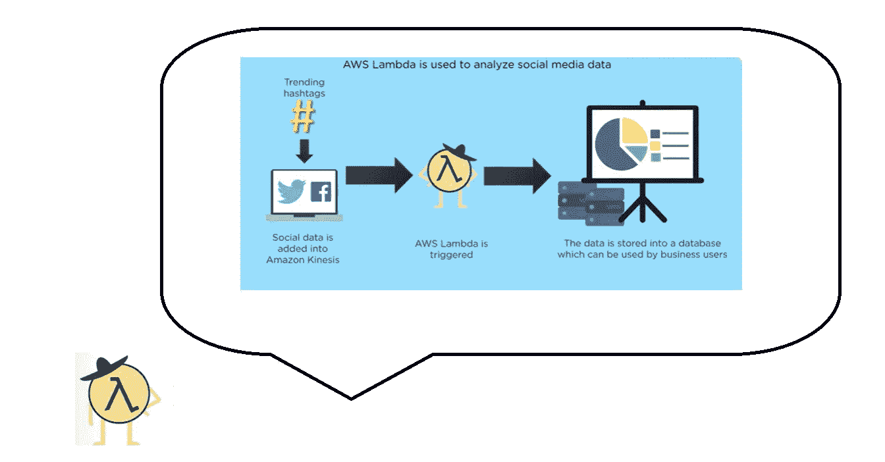
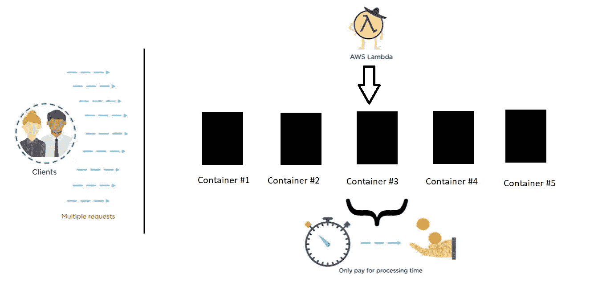
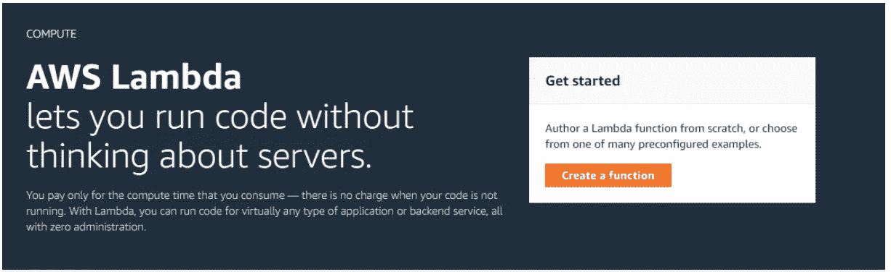
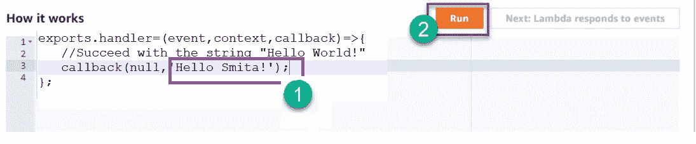
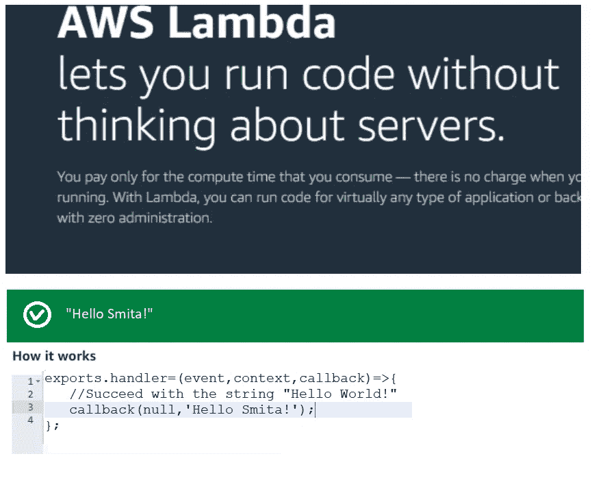

# 自动气象站λ

> 原文：<https://medium.com/globant/aws-lambda-46cb2cba0f6c?source=collection_archive---------1----------------------->

作为亚马逊网络服务的一部分，亚马逊提供的计算平台是事件驱动的，无服务器的。AWS Lambda 只能用于执行后台任务。它提供了一种更简单的方法来减少管理操作系统访问控制、配置、扩展等重复性手动任务。

**一、Lambda 的特点:**

1.  **不用担心服务器**
    我们所要做的就是编写代码并上传到 Lambda。我们不需要担心配置和管理服务器。Lambda 会执行我们的代码。
2.  **自动缩放**
    根据工作负载的大小，进行缩放。为了响应每个触发器，Lambda 会缩放正在运行的应用程序。
3.  **第二次计量**
    我们不需要对任何服务器收费。唯一需要支付的是计算代码的时间量。

**二。什么是 AWS Lambda:**

1.  AWS 提供服务的“计算”领域，AWS Lambda 是属于计算领域的服务之一。

AWS Lambda in Compute Domain

2.Lambda 允许我们执行任何类型的应用程序。

3.Lambda 可用于运行代码，以响应来自其他服务的特定事件。我们需要做的就是用 AWS
Lambda 支持的语言之一编写代码。AWS lambda 支持 Node js、java、c#、GO 和 python 等主流编程语言…

What is AWS Lambda

**三。AWS Lambda 可能的使用案例:**

1.  AWS Lambda 用于处理上传到 S3 桶的图像。

Image Processing

2.来分析社交媒体数据。

Social Media Data Analysis

3.使用 AWS Lambda 的公司包括可口可乐、NORDSTROM、ROBOT 等。

**四。Lambda 如何工作:**

1.客户端向 lambda 发送请求。客户端可以是任何人，包括应用程序或其他 amazon 服务。Lambda 接收请求，并根据数据的大小/数量/容量，在规定数量的容器上运行。

2.Container 是一个轻量级的、独立的、可执行的包和一个运行代码的软件，比如系统工具、系统库和任何其他需要的设置。容器将软件与其周围环境隔离开来，这有助于减少同一基础设施上不同软件之间的冲突。

3。随着请求数量的增加，创建的容器数量也会增加，反之亦然。

AWS Lambda Work

**V. AWS Lambda 术语:**

1.  **函数:**
    AWS Lambda 函数处理调用事件后发送响应。该函数是 AWS lambda 运行的脚本。
2.  **运行时:**
    运行时为来自不同编程语言的函数提供相同的基础执行平台，在运行时进行配置。
3.  **事件源:**
    事件源是一个 AWS 服务，触发 AWS 函数执行逻辑。
4.  **Lambda Layers:**
    AWS 库、函数和运行时都在其中。它提供了开发代码和开发代码的分离。
5.  **日志流:**
    这是一个自定义的函数执行日志机制。

**六。如何使用 AWS Lambda:**
以下是使用 AWS Lambda 的四个基本步骤:

1.在浏览器中输入[https://aws.amazon.com/lambda/](https://aws.amazon.com/lambda/)网址即可开始。
2。需要为新用户登录或创建帐户。

Image via [[https://aws.amazon.com/lambda/](https://aws.amazon.com/lambda/)]

3.编辑代码并运行。

Image via [[https://aws.amazon.com/lambda/](https://aws.amazon.com/lambda/)]

4.检查代码的输出。

Image via [[https://aws.amazon.com/lambda/](https://aws.amazon.com/lambda/)]

**七。自动气象站 Lambda 的优势:**

1.这是一个面向 Visual Studio、Eclipse 等 ide 的插件。

2.它允许我们在不与服务器交互的情况下运行我们的代码。

3.它提供了一个云监视器来监控我们代码的实时性能。

4.为了在一毫秒内获得输出，AWS Lambda 将最适合我们的代码。

5.这是一个可以灵活使用的工具。

**八世。自动气象站λ的限制:**

1.对于小型项目，AWS lambda 并不合适。

2.如果我们的代码要求安装任何额外的软件，那么这将是不可能的，因为 AWS lambda 依赖于 AWS 的基础设施。

3.事件请求应该高达 128 KB。

4.只有在云手表里才能写 lambda 函数日志。