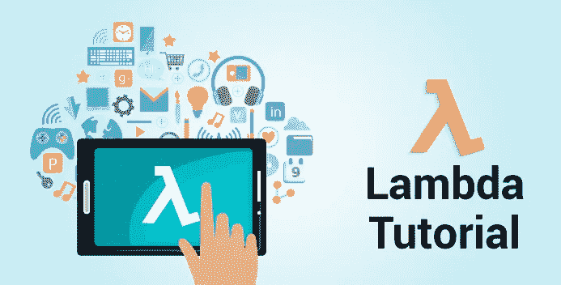
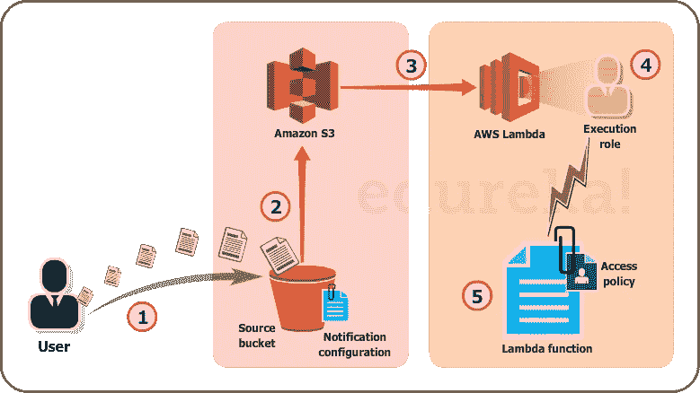
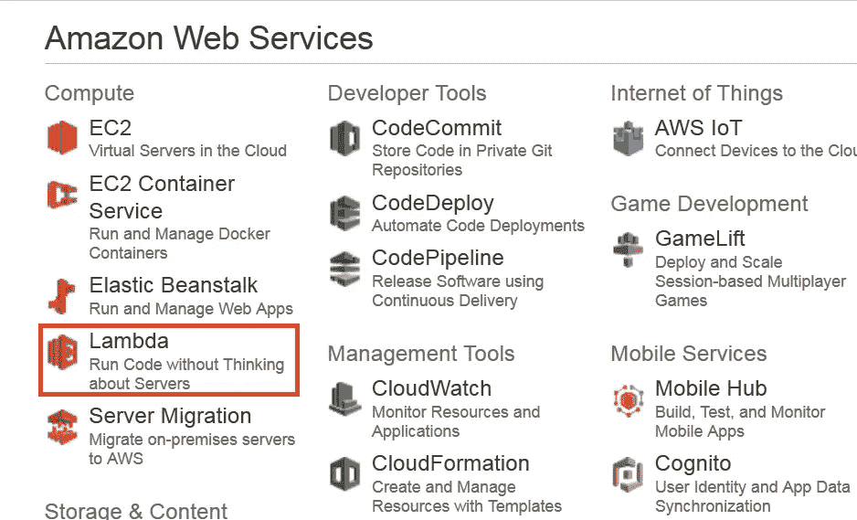
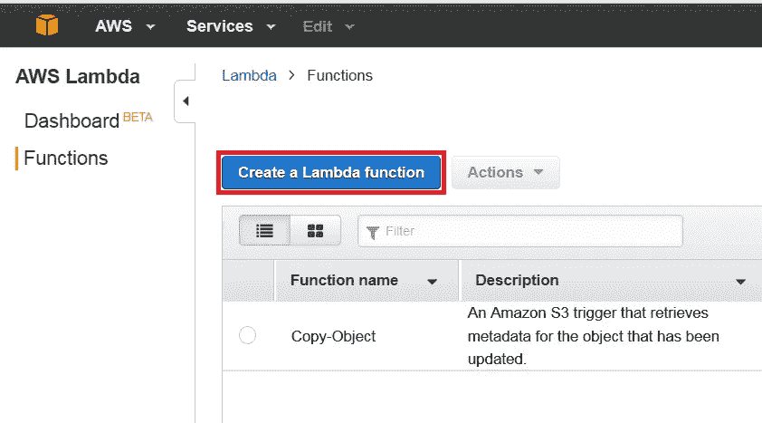
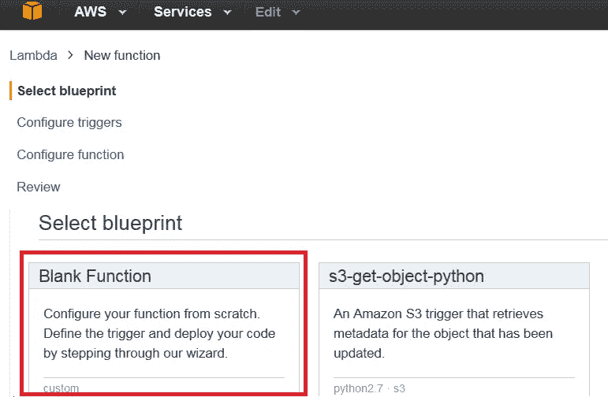
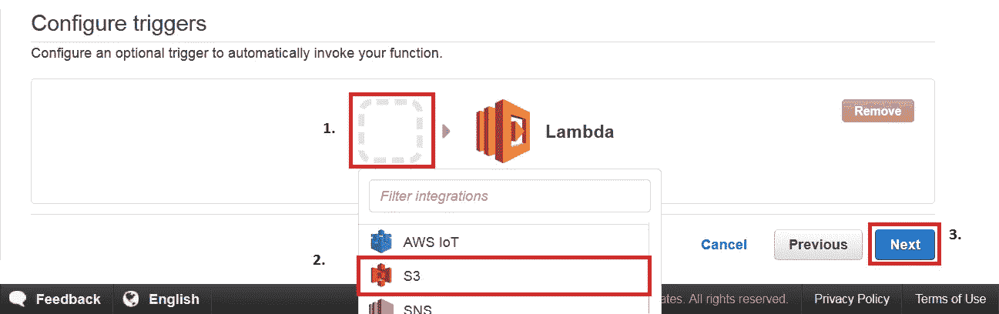
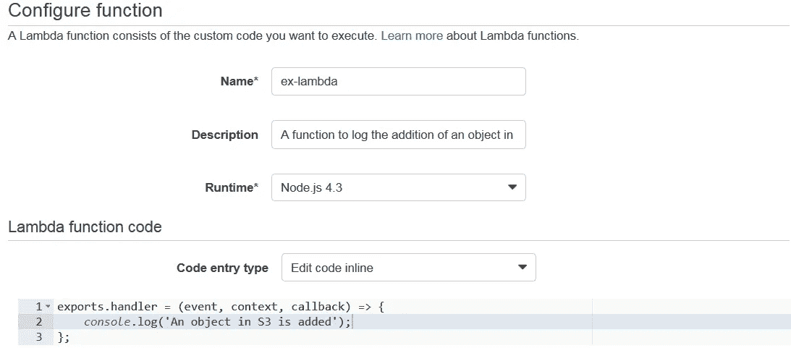
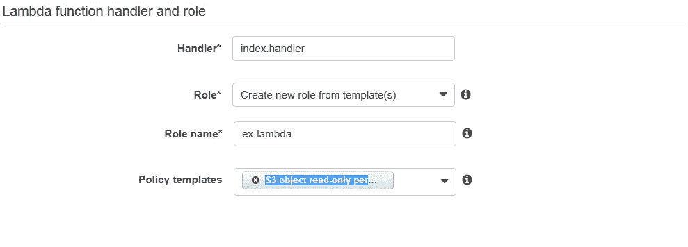
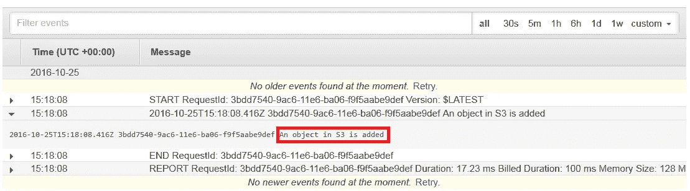

# AWS Lambda 教程—AWS Lambda 初学者指南

> 原文：<https://medium.com/edureka/aws-lambda-tutorial-cadd47fbd39b?source=collection_archive---------0----------------------->

AWS Lambda Tutorial - Edureka

今天我们要谈谈 AWS Lambda。AWS Lambda 是亚马逊提供的一项计算服务。你一定很好奇 AWS 还有其他几个计算服务，比如***AWS EC2******AWS Elastic Beanstalk*****AWS ops works**等等。，那为什么还要另一个计算机服务呢？在本 AWS Lambda 教程中，您将了解什么是 AWS Lambda，为什么使用它，以及在哪些用例中应该考虑使用它。

让我们看看亚马逊是如何定义 AWS Lambda 的，然后我们将深入研究关键概念，最终通过实践来理解一个用例。

# 什么是 AWS Lambda？

亚马逊将 AWS Lambda (λ)解释为“无服务器”计算服务，这意味着开发人员不必担心要启动哪些 AWS 资源，或者他们将如何管理它们，他们只需将代码放在 Lambda 上，它就会运行，就这么简单！它有助于你专注于核心竞争力，即应用构建或代码。

# 我将在哪里使用 AWS Lambda？

AWS Lambda 通过自动管理 AWS 资源来执行您的后端代码。当我们说“管理”时，它包括启动或终止实例、健康检查、自动扩展、更新或修补新的更新等。

# 那么，它是如何工作的呢？

您希望 Lambda 运行的代码被称为 **Lambda 函数**。正如我们所知，函数只有在被调用时才会运行，对吗？这里，**事件源**是触发 Lambda 函数，然后执行任务的实体。

**我们举个例子更清楚地理解一下。**

假设你有一个图片上传的 app。现在，当你上传一张图片时，在存储它之前有很多工作要做，比如调整大小，应用滤镜，压缩等等。

因此，上传图像的任务可以定义为**事件源**或调用 Lambda 函数的“触发器”,然后所有这些任务都可以通过 Lambda 函数执行。

在本例中，开发人员只需定义事件源并上传代码。

现在让我们用真实的 AWS 资源来理解这个例子。

在这里，我们将上传对象形式的图像到 S3 桶。将图像上传到 S3 桶将成为事件源或“触发器”。

正如您在图中看到的，整个过程分为 5 个步骤，让我们了解其中的每一个步骤。

1.  对于 Lambda，用户将图像(对象)上传到 S3 的源存储桶，该存储桶附有通知。
2.  S3 读取该通知，并决定将该通知发送到哪里。
3.  S3 向 lambda 发送通知，该通知充当 Lambda 函数的 invoke 调用。
4.  Lambda 中的执行角色可以通过使用 IAM(身份和访问管理)来定义，以授予对 AWS 资源的访问权限，在此示例中，它将是 S3。
5.  最后，它调用所需的 lambda 函数，该函数作用于已经上传到 S3 存储桶的对象。

*如果你要用传统的方法解决这个场景，在开发的同时，你会雇佣一些人来管理以下任务:*

*   服务器组的规模、供应和纵向扩展
*   管理操作系统更新
*   应用安全补丁并
*   监控所有这些基础设施的性能和可用性。

这将是一项昂贵、乏味和令人厌倦的任务，因此对 AWS Lambda 的需求是合理的。AWS Lambda 与 Node 兼容。JS，Python 和 Java，所以你可以上传你的压缩文件，定义一个事件源，你就设置好了！

*我们现在知道了 Lambda 如何工作，Lambda 做什么*。

现在，让我们明白-

*   **哪里用 Lambda？**
*   Lambda 有什么用途，而其他 AWS 计算服务没有？

如果你要设计一个问题的解决方案，你应该能够确定在哪里使用 Lambda，对吗？

因此，作为一名架构师，您有以下选项来执行任务:

*   AWS EC2
*   AWS 弹性豆茎
*   AWS OpsWorks
*   自动气象站λ

我们以上面的用例为例，理解一下为什么选择 Lambda 来解决。

AWS OpsWorks 和 AWS ElasticBeanstalk 用于部署一个 app，所以我们的用例是**不是**创建一个 app 而是执行一个后端代码。

## **那为什么不是 EC2？**

如果您要使用 EC2，您将不得不设计一切，即负载平衡器、EBS 卷、软件堆栈等。在 lambda 中你什么都不用担心，只需插入你的代码，剩下的就交给 AWS 管理了！

*例如*，在 EC2 中，您将在虚拟机上安装软件包，这些软件包将支持您的代码，但在 Lambda 中，您不必担心任何虚拟机，只需插入普通代码，Lambda 就会为您执行代码。

但是，如果您的代码将运行几个小时，并且您预计会有连续的请求流，那么您可能应该使用 EC2，因为 Lambda 的体系结构是针对一种分散的工作负载，其中会有一些安静的时间，请求数量也会有一些高峰。

*例如*，为一家小公司记录电子邮件活动，白天的活动会比晚上多，也可能有几天需要处理的电子邮件较少，有时整个世界都可能开始给你发电子邮件！在这两种情况下，Lambda 都将为您服务。

考虑到一家大型社交网络公司的这个用例，那里的电子邮件永无止境，因为它拥有庞大的用户群，Lambda 可能不是合适的选择。

# **AWS Lambda 的限制**

有些限制是特定于硬件的，有些是受架构限制的，让我们来讨论所有这些限制。

*硬件限制*包括磁盘大小，限制为 512 MB，内存可以在 128 MB 和 1536 MB 之间变化。还有一些其他的，比如执行超时可以最大化到仅仅 5 分钟，你的请求体有效负载可以不超过 6 MB，你的请求体是 128 KB。请求体有效负载类似于在 HTTP 中用“GET”或“PUT”请求发送的数据，而请求体则是请求的类型、报头等。

实际上，这些不是限制，而是 Lambda 架构中设定的设计界限，因此如果您的用例不符合这些要求，您可以随时使用其他 AWS 计算服务。

我们在这个 AWS Lambda 教程中讨论了如何用 Lambda 执行任务是“不”单调乏味的。现在让我们来看看费用部分。

# AWS Lambda 定价

像大多数 AWS 服务一样，AWS Lambda 也是一种按使用付费的服务，这意味着您只需支付您使用的费用，因此您需要支付以下费用

*   对 lambda 函数的**请求**的数量
*   您的代码执行的**持续时间**。

**请求**

1.  你需要为你所有 lambda 函数的请求数量付费。

2.AWS Lambda 在每次开始执行请求以响应事件源或 invoke 调用时都会对请求进行计数，包括从控制台调用测试。让我们看看现在的价格:

*   每月前 100 万次请求是免费的。
*   此后每百万次请求收取 0.20 美元。

**持续时间**

1.  持续时间的计算是从代码开始执行的时刻开始，直到它返回或终止，它被四舍五入到最接近的 100 毫秒。

2.价格取决于你分配给你的函数的内存量，每使用 GB 秒，你需要支付 0.00001667 美元。

**来源:AWS 官网*

如果你已经到达这里，你就可以在 Lambda 亲自动手了。让我们找点乐子吧！

# 动手操作:AWS Lambda DIY

让我们创建一个 Lambda 函数，一旦您将一个对象添加到 S3 的一个特定桶中，它将记录“一个对象已经被添加”。

**步骤 1:** 从 AWS 管理控制台的“计算”部分，选择 **AWS Lambda** 。

**步骤 2:** 在 AWS Lambda 控制台上，点击“**创建 Lambda 函数**”。

第三步:在下一页，你必须选择一份蓝图。例如，我们将为我们的用例选择空白函数。

**步骤 4:** 在下一页中，您将(1)设置一个触发器，因为我们将在 S3 上工作，(2)选择 S3 触发器，然后(3)单击“下一步”。

**第五步:**在配置页面，**填写详细信息**。你可以放入你自己的代码，或者你可以从这个用例中复制相同的代码。之后，填充**句柄**和**角色**，保留高级设置不变，最后**点击下一步**。

**步骤 6:** 在下一页，查看所有信息，并点击“创建功能”。

**步骤 7:** 现在，既然我们为 S3 存储桶创建了函数，那么当您向 S3 存储桶添加文件时，您应该会在 CloudWatch 中获得相同内容的日志，cloud watch 是 AWS 的一项监控服务。

**恭喜你！您已经成功执行了 Lambda 函数。**

我希望你喜欢深入研究 AWS Lambda 教程。这是 AWS 生态系统中解决方案架构师、云工程师、开发运维工程师等职位最需要的知识领域之一。

如果你想查看更多关于人工智能、DevOps、道德黑客等市场最热门技术的文章，你可以参考 Edureka 的官方网站。

请留意本系列中的其他文章，它们将解释 AWS 的各个方面。

> *1。* [*AWS 教程*](/edureka/amazon-aws-tutorial-4af6fefa9941)
> 
> *2。* [*AWS EC2*](/edureka/aws-ec2-tutorial-16583cc7798e)
> 
> *3。* [*AWS 简历*](/edureka/aws-resume-7453d9477c74)
> 
> *4。* [*AWS 弹性豆茎*](/edureka/aws-elastic-beanstalk-647ae1d35e2)
> 
> *5。*T42*AWS S3*
> 
> *6。* [*AWS 控制台*](/edureka/aws-console-fd768626c7d4)
> 
> *7。* [*AWS RDS*](/edureka/rds-aws-tutorial-for-aws-solution-architects-eec7217774dd)
> 
> *8。* [*AWS 迁移*](/edureka/aws-migration-e701057f48fe)
> 
> *9。*[*AWS Fargate*](/edureka/aws-fargate-85a0e256cb03)
> 
> *10。* [*亚马逊 Lex*](/edureka/how-to-develop-a-chat-bot-using-amazon-lex-a570beac969e)
> 
> *11。* [*亚马逊*](/edureka/amazon-lightsail-tutorial-c2ccc800c4b7)
> 
> *12。* [*AWS 定价*](/edureka/aws-pricing-91e1137280a9)
> 
> 13。 [*亚马逊雅典娜*](/edureka/amazon-athena-tutorial-c7583053495f)
> 
> *14。* [*AWS CLI*](/edureka/aws-cli-9614bf69292d)
> 
> *15。* [*亚马逊 VPC 教程*](/edureka/amazon-vpc-tutorial-45b7467bcf1d)
> 
> 15。[*AWS vs Azure*](/edureka/aws-vs-azure-1a882339f127)
> 
> 17。 [*内部部署 vs 云计算*](/edureka/on-premise-vs-cloud-computing-f9aee3b05f50)
> 
> 18。 [*亚马逊迪纳摩 DB 教程*](/edureka/amazon-dynamodb-tutorial-74d032bde759)
> 
> *19。* [*如何从快照恢复 EC2？*](/edureka/restore-ec2-from-snapshot-ddf36f396a6e)
> 
> *20。* [*AWS 代码提交*](/edureka/aws-codecommit-31ef5a801fcf)
> 
> *21。* [*顶级 AWS 架构师面试问题*](/edureka/aws-architect-interview-questions-5bb705c6b660)
> 
> *22。* [*如何从快照恢复 EC2？*](/edureka/restore-ec2-from-snapshot-ddf36f396a6e)
> 
> *23。* [*使用 AWS 创建网站*](/edureka/create-websites-using-aws-1577a255ea36)
> 
> *24。* [*亚马逊路线 53*](/edureka/amazon-route-53-c22c470c22f1)
> 
> *25。* [*用 AWS WAF 保护 Web 应用*](/edureka/secure-web-applications-with-aws-waf-cf0a543fd0ab)

*原载于 2016 年 10 月 28 日*[*www.edureka.co*](https://www.edureka.co/blog/aws-lambda-tutorial)*。*