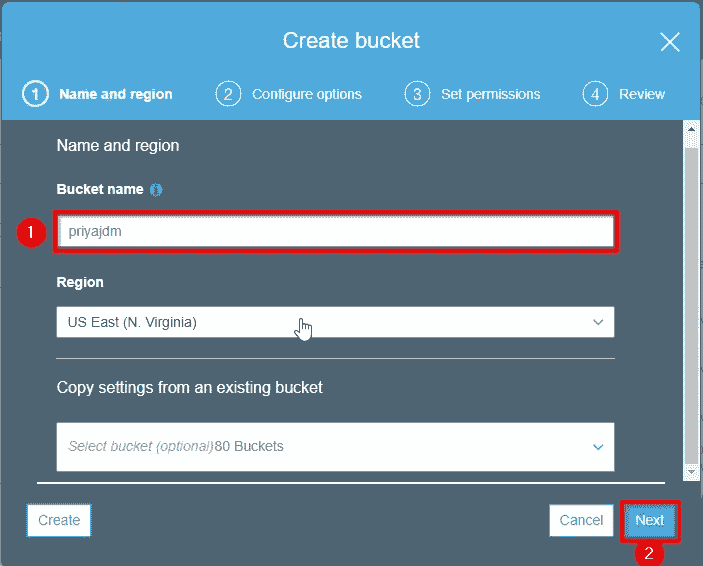

# AWS 迁移——将本地应用程序迁移到云

> 原文：<https://medium.com/edureka/aws-migration-e701057f48fe?source=collection_archive---------3----------------------->

AWS Migration - Edureka

不管业务是什么，组织总是会经历竞争。因此，与市场需求保持同步就成了必须,“时间”就成了不可或缺的组成部分。如果有一种方法，企业可以专注于他们的业务目标，并将他们的维护和监控任务外包到其他地方，那会怎么样。这是否有助于节省时间并更高效地满足市场需求？迁移到云让你做完全一样的事情。这篇 *AWS 迁移*文章将带您了解在您计划迁移到云之前需要考虑的所有必要要点。

首先，让我为您定义一下迁移:

> **“将您的数据从内部数据中心转移到云上称为迁移”。**

现在定义已经出来了，让我们来看看这篇文章关注的要点:

1.  迁移的需要
2.  什么是迁移？
3.  什么是 AWS？
4.  *AWS 迁移阶段*
5.  应用程序迁移策略' 6 R '
6.  *AWS 迁移的优势*
7.  *AWS 迁移服务*
8.  演示:使用导入/导出方法实施迁移

让我们从理解迁移的必要性开始。

# 迁移的需要

当涉及到处理诸如安全性、扩大或缩小规模等情况时，业务并不是一件容易的事情。让我们来看几个场景，其中 *AWS 迁移*可能是更好的选择。

1.  您的项目在一夜之间开始接收大量流量
2.  您的客户希望快速实施和部署应用程序
3.  管理不断增长的数据库需求变得越来越昂贵
4.  您对数据中心宕机的不幸事件保持谨慎

如果您迁移到云，那么上面提到的问题将会自动得到处理。让我们进一步了解什么是迁移。

# 什么是迁移？

迁移您的项目意味着将您的数据从本地数据中心迁移到云中。仅供参考，我们不是指天空中的云。在这种情况下，云是在数据中心上使用的虚拟化，使功能更加灵活。许多公司如 GoDaddy、Expedia 等。最近将业务转移到了云。
定义了迁移之后，让我告诉你在哪里、如何以及谁将帮助你迁移数据。实现是由 Amazon Web Services (AWS)提供的。那么，我们来了解一下 AWS 是什么？

# 什么是 AWS？

亚马逊网络服务(AWS)是 Amazon.com 的子公司，提供按需云服务。AWS 在 2006 年推出了一些服务。然后，在 2012 年推出了 AWS Marketplace，其中包含了 AWS 提供的大量服务。

同样，迁移是一项大任务，AWS 分阶段促进迁移。那么，让我带您了解一下数据迁移的不同阶段。

# AWS 迁移的阶段

数据迁移似乎是一个简单的过程，因为通俗地说，它意味着将数据从一个位置移动到另一个位置。然而，由于该过程涉及不同的阶段，因此更加复杂。现在让我谈谈移民的各个阶段:

## 阶段 1:发现—可以迁移到云的应用程序？

有时候你不需要将整个企业迁移到云中。这就是种族隔离的重要性。您需要确定哪些应用程序可以迁移，哪些不可以。

现在，让我们进入第 2 阶段，即选择 *AWS 迁移*的方法。

## 阶段 2:评估—选择您的迁移方法

根据不同的数据，AWS 提供不同的方法来迁移您的应用程序，例如 AWS 雪球、AWS Snowmobile、AWS Direct Connect 等。一旦你选择了一种合适的方式来移动你的数据，也要寻找你需要的资源。现在让我们探索在第 3 阶段中在 AWS 云上存储数据的不同方式。

## 第 3 阶段:AWS 存储的概念验证(POC)

一旦您知道了如何迁移和迁移什么，接下来，您必须弄清楚如何以及在哪里存储它。迁移到 AWS 的全部动机是为了最小化开支。在此阶段，您将测试您的工作负载，并了解 AWS 存储服务、其优势、局限性以及必要的安全控制。

## 阶段 4:应用程序向 AWS 的迁移

现在，您已经具备了所有先决条件，如蓝图、迁移工具、任务列表、备份及其与本地数据存储库的同步。您最终可以将您的项目迁移到 AWS Cloud。一旦您将项目迁移到云中，可靠性和持久性就是您获得的额外好处。

让我们看看 AWS 在第 5 阶段给你的架构带来的变化。

## 第 5 阶段:企业云运营

此时，您已经迁移到 AWS，AWS 将带来更新，您需要将这些更新合并到您现有的架构中。因此，您必须确保有一个 24×7 的支持团队来跟踪迁移后的系统维护和升级。

这是关于 *AWS 迁移*的不同阶段以及如何实施。让我们探索一下 *AWS 迁移*的策略。

# 应用程序迁移策略' 6 R '

迁移现有应用程序的复杂性因架构而异，Amazon 提出了不同的策略，通常称为 6 R。让我们逐一了解一下:

1.  **重新托管:-** 您已经准备好了您的应用程序，然后您可以简单地在 AWS 上重新托管它。亦称*。您将您的服务和应用从您的托管环境中提升出来，并使用第三方导出工具将它们转移到云中。*
2.  ***Replatform:-** 您的托管环境中运行的应用程序版本已经过时，因此您必须修改您的应用程序，然后重新托管它。Replatform 是对“ ***升降移*** ”的修改。它包括优化云架构，以在不改变应用程序核心架构的情况下实现优势。*
3.  ***回购:-** 某些应用程序可能与新架构不兼容。在这种情况下，您需要为新的架构购买新的应用程序。AWS Marketplace 提供了广泛的服务，也采用了“ ***随用随付*** ”的模式。*回购*也称为****弃购****在这里您升级、轻松实施并接受新架构，对现有模式进行更改。***
4.  *****重构:-** 您想要添加新功能，提升现有业务模式的极限和现有环境难以实现的性能。您重新考虑您的需求，尽管解决方案有点贵。从长远来看，通过转向面向服务的架构(SOA)来改善业务将使您的业务受益。***
5.  *****退役:-** 在 *AWS 迁移*之后，您可以区分有用的和使用较少的资源。因此，你砍掉了所有对业务不再有用的资源，并围绕新资源建立了一个战略。这将减少额外的费用。由于担心的事情较少，现在您可以专注于维护新业务模型所使用的资源。***
6.  **保留:- 如您所知，您需要迁移的项目部分。你可以简单地使用上述任何一种策略。然后，构建一个策略来保留这些应用程序，根据您的业务模型，这些应用程序尚未准备好迁移到云或最近升级的应用程序。**

**我们看到了不同的策略，统称为 6 R，在 *AWS 迁移*时应该明智地选择。现在让我们看看实现 *AWS 迁移*后的更大图景。**

# **AWS 迁移的优势**

**AWS 迁移为您的组织带来无限的好处。让我们简单地研究一下主要的问题。**

****

1.  ****弹性** :- *随时根据需要增加和移除容量是弹性最大的好处。***
2.  ****灾难恢复** :- *有了 99.95%的保证正常运行时间，企业可以确信他们的数据将始终可用。***
3.  ****增强的成本管理**:-*IaaS 平台提供了两大优势。首先，Amazon Web Services 这样的 IaaS 是按月提供的服务。其次，它消除了继续购买和维护物理硬件的需要。***

**这些就是 AWS 迁移的好处。让我们直接进入 AWS 提供的服务来简化迁移过程。**

# **AWS 迁移服务**

**在 Amazon 提供的众多自动化数据迁移工具中，我将讨论一些更常用的工具。**

****

## **AWS 迁移中心:**

**AWS 提供了跟踪迁移过程的单一位置。Migration Hub 让您可以自由选择符合您需求的迁移合作伙伴和工具。**

****

## **AWS 服务器迁移服务(SMS):**

**AWS SMS 是一种无代理服务，有助于更轻松、更快速地将内部工作负载迁移到 AWS。它允许您自动迁移和跟踪服务器的复制。它使与您的大规模服务器迁移的协调变得容易。**

****

## **亚马逊 S3 传输加速:**

**这使得远程文件传输到 AWS S3 桶更快，更安全。**

****

## **AWS 雪球:**

**一种 Pb 级数据传输解决方案，使用安全设备将大量数据传入和传出 AWS。**

****

## **AWS 雪地车:**

**一种 EB 级数据传输解决方案，可将大量数据转移到 AWS。这使得大量数据的传输更加容易。**

****

## **亚马逊 Kinesis 消防软管:**

**所有方法中最简单的。它可以捕捉并自动加载流媒体数据到亚马逊 S3。您可以分析实时数据，及时了解迁移情况。**

**现在你已经了解了 AWS 和 *AWS 迁移*的一切，让我向你展示一个用例，你将把一个虚拟操作系统从我的本地机器迁移到 AWS 云。**

# **演示:使用导入/导出方法实施迁移**

**您将使用导入/导出(AWS 直接连接)方法将运行在 VMWare 上的本地虚拟操作系统迁移到 AWS。**

## ****先决条件****

1.  **安装在本地计算机上的 VMware 工作站**
2.  **运行 AWS 帐户**
3.  **在 AWS 上创建了 IAM 用户**
4.  **在本地计算机上配置的 AWS CLI**
5.  **在 AWS 上创建了 S3 桶**

## **1.创造一个**。vmdk** 为 Ubuntu 14.04 导出文件。**

****

## **2.下载并配置 AWS CLI。**

****

## **3.创建一个 IAM 用户。**

****

**现在点击“添加用户”。**

****

**接下来，选择一个唯一的用户名。**

****

**现在给管理员权限。**

****

**点击创建用户。**

****

## **4.创建一个 S3 桶并添加文件(操作系统的映像文件)。**

****

**选择一个唯一的用户名。**

****

**查看并创建存储桶。**

****

**添加导出的。vmdk 文件。**

****

**点击上传。**

****

**等到图像反映在列表上。**

****

## **5.您也可以使用 AWS CLI 上传文件。**

****

## **6.文件上传后，为导入的图像文件创建一个 AMI。**

****

**您的映像现在可以作为 AMI 使用。**

****

## **7.您可以通过两种方式运行创建的 AMI**

**第 7 条(a)款。使用 CMDER :
复制连接字符串并粘贴到 CMDER 控制台，这将需要几分钟的时间来连接，然后将打开您的 Ubuntu 14.04。**

**第 7 条(b)款。使用 Putty :
配置。pem 文件，并提供用户名和连接字符串。它将显示正在初始化，几分钟后你将登陆 Ubuntu 14.04。**

**这样，我们就成功地在 AWS 上迁移了一个虚拟操作系统。我希望您喜欢阅读这篇 AWS 迁移文章。**

**原来就是这样！我希望这篇博客能给你提供信息，增加你的知识。如果你想查看更多关于人工智能、DevOps、道德黑客等市场最热门技术的文章，你可以参考 Edureka 的官方网站。**

**请留意本系列中的其他文章，它们将解释 AWS 的各个方面。**

> ***1。*T3*AWS 教程***
> 
> ***2。* [*AWS EC2*](/edureka/aws-ec2-tutorial-16583cc7798e)**
> 
> ***3。*[*AWS Lambda*](/edureka/aws-lambda-tutorial-cadd47fbd39b)**
> 
> ***4。*[T22【AWS】弹性豆茎 ](/edureka/aws-elastic-beanstalk-647ae1d35e2)**
> 
> ***5。* [*AWS S3*](/edureka/s3-aws-amazon-simple-storage-service-aa71c664b465)**
> 
> ***6。* [*AWS 控制台*](/edureka/aws-console-fd768626c7d4)**
> 
> ***7。*[*AWS RDS*](/edureka/rds-aws-tutorial-for-aws-solution-architects-eec7217774dd)**
> 
> ***8。* [*AWS 简历*](/edureka/aws-resume-7453d9477c74)**
> 
> ***9。*[*AWS Fargate*](/edureka/aws-fargate-85a0e256cb03)**
> 
> ***10。* [*亚马逊 Lex*](/edureka/how-to-develop-a-chat-bot-using-amazon-lex-a570beac969e)**
> 
> ***11。* [*亚马逊*](/edureka/amazon-lightsail-tutorial-c2ccc800c4b7)**
> 
> ***12。* [*AWS 定价*](/edureka/aws-pricing-91e1137280a9)**
> 
> ***13。* [*亚马逊雅典娜*](/edureka/amazon-athena-tutorial-c7583053495f)**
> 
> ***14。* [*AWS CLI*](/edureka/aws-cli-9614bf69292d)**
> 
> ***15。* [*亚马逊 VPC 教程*](/edureka/amazon-vpc-tutorial-45b7467bcf1d)**
> 
> ***15。*[*AWS vs Azure*](/edureka/aws-vs-azure-1a882339f127)**
> 
> ***17。* [*内部部署 vs 云计算*](/edureka/on-premise-vs-cloud-computing-f9aee3b05f50)**
> 
> **18。 [*亚马逊迪纳摩 DB 教程*](/edureka/amazon-dynamodb-tutorial-74d032bde759)**
> 
> ***19。* [*如何从快照恢复 EC2？*](/edureka/restore-ec2-from-snapshot-ddf36f396a6e)**
> 
> **20。[*AWS code commit*](/edureka/aws-codecommit-31ef5a801fcf)**
> 
> **21。 [*顶级 AWS 架构师面试问题*](/edureka/aws-architect-interview-questions-5bb705c6b660)**
> 
> ***22。* [*如何从快照恢复 EC2？*](/edureka/restore-ec2-from-snapshot-ddf36f396a6e)**
> 
> ***23。* [*使用 AWS*](/edureka/create-websites-using-aws-1577a255ea36) 创建网站**
> 
> ***24。* [*亚马逊路线 53*](/edureka/amazon-route-53-c22c470c22f1)**
> 
> ***25。* [*用 AWS WAF 保护 Web 应用*](/edureka/secure-web-applications-with-aws-waf-cf0a543fd0ab)**

***原载于 2018 年 12 月 7 日*[*www.edureka.co*](https://www.edureka.co/blog/aws-migration/)*。***