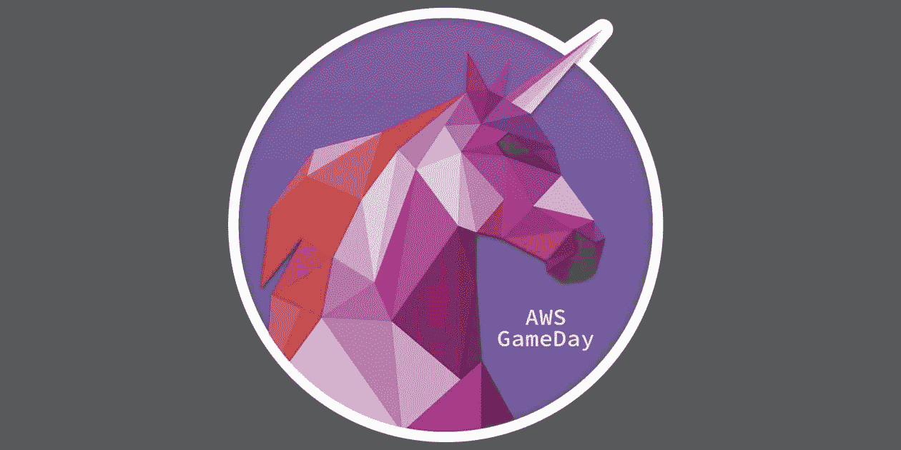
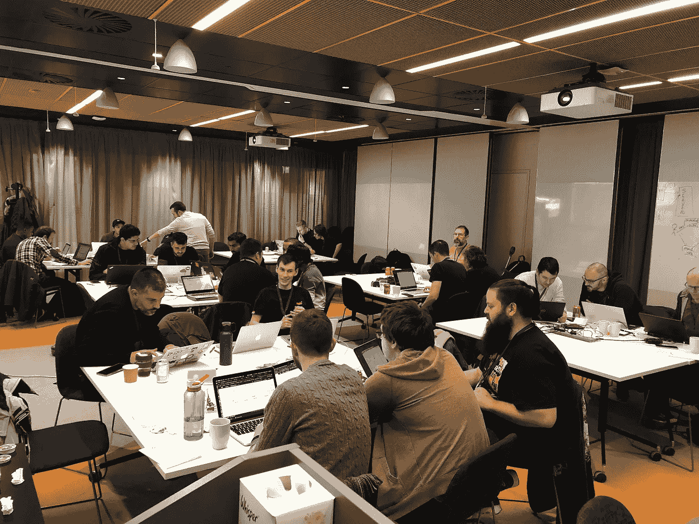

# 什么是 AWS 迁移比赛日？

> 原文：<https://medium.com/version-1/aws-migration-gamedays-92e7654d4b9b?source=collection_archive---------0----------------------->

# 通过游戏日教授云迁移

去年，版本 1 与 AWS 合作运行了几个云迁移游戏日。这些是为期一天的研讨会，我们通过一个有点难度的云迁移场景来运行，您被放在一个团队中，与其他团队竞争，以在一天中获得最高分。

您很快就会发现，率先迁移您的应用程序并不总是最好的事情。良好的架构、安全性、可扩展性和性能始终是关键，因为我们会帮助指导和教授您各种工具来执行迁移。

# 什么是 AWS 比赛日？

Unicorn Rentals — the fictional company that forms the basis for GameDays

AWS GameDays 是一个基于团队的互动学习练习，旨在让玩家有机会在真实世界、游戏化、无风险的环境中测试他们的 AWS 技能。最重要的是，这是一种非常有趣的方式来了解更多关于 AWS 的潜力，而不需要研讨会或课堂式会议中提供的分步指导。如果你正在寻找一种开放式的，有时模糊的训练方式，那么 GameDay 就是对你的完美挑战。

> 游戏化是让人们兴奋并参与学习云和迁移的好方法

挑战取决于游戏日的类型——有迁移、开发运维、微服务等等。在后端，AWS GameDay 团队开发了一个非常聪明的引擎，每个不同的游戏都可以插入这个引擎。

这是学习 AWS 最佳实践、AWS 服务、AWS 架构模式和团队解决问题的一个完全实践的机会。每个参与者将被分成一个 4 人小组，因此你们必须有效地相互沟通，以便作为一个迷你 DevOps 团队最有效地运作。您可以联系 AWS 专家，他们将在您处理各种情况时为您提供支持。

几年来，AWS 已经在 re:Invent、summits 和类似的活动中运行游戏日。去年，版本 1 与 AWS 合作举办了迁移和应用程序现代化日。到目前为止，我们已经在都柏林、伦敦、伯明翰和贝尔法斯特举办过。

# 在那一天…

你只需要一台笔记本电脑和充电器(没有平板电脑)、一个网络浏览器、AWS CLI 和一个预先安装在你的机器上的 SSH 客户端。我们提供了一个免费的 AWS 帐户，您可以全天使用。

对于比赛日本身，每个团队都可以访问“*本地*”WordPress、数据库和 windows 管理器。然后，他们必须设计和设置他们的 AWS 架构，并开始迁移。我们给 cloud bearing 许可证，也鼓励使用 DMS。一旦上线，鼓励团队开始考虑优化他们新迁移的应用程序。基于 AWS 架构良好的支柱，有许多点可用于实现最佳实践。

一整天都有会意外增加流量的营销活动，也有一些潜在的混乱猴子在后台造成一些破坏。关键是在及时处理交易的同时保持网站在线，以确保不丢失任何积分。

Teams Working Hard

# 为什么？

我们有各种经验水平的人，从这些活动中得到了很好的反馈。对于对 AWS 感兴趣的人来说，这是一个很好的学习练习，它可以向业务所有者展示迁移工作负载是什么样的，以及需要注意哪些挑战，对于那些对 AWS 很有经验的人来说，还有一些偷偷摸摸的挑战。

奖杯和其他奖品在一天结束时颁发给各个获奖类别，如最佳建筑、最低成本和总赢家。

要了解更多关于版本 1 将在下一个游戏日运行的信息，请访问[version1.com/events.](http://version1.com/events)

*如果你觉得这很有趣或者有任何反馈，请在评论中告诉我或者联系上* [*推特*](https://twitter.com/deconduino) *或者* [*领英*](https://www.linkedin.com/in/oisindeconduin/)