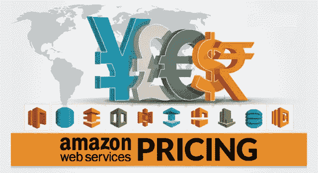
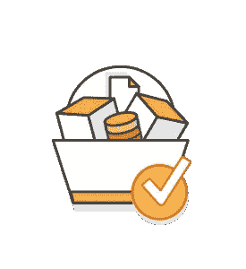
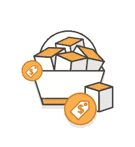
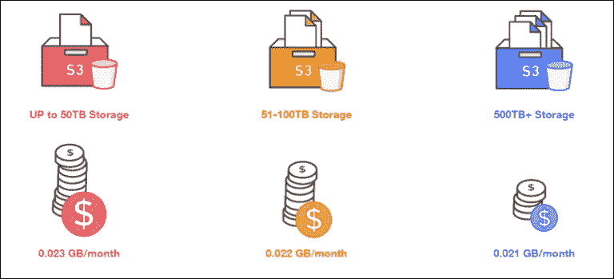
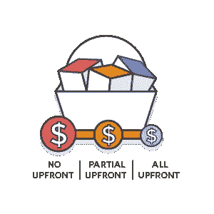
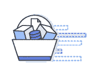
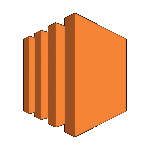
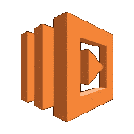

# 了解 AWS 定价工作原理的全面指南

> 原文：<https://medium.com/edureka/aws-pricing-91e1137280a9?source=collection_archive---------5----------------------->

AWS Pricing - Edureka

今天，在这个 AWS 定价博客中，我们将较少讨论 AWS 是什么，而更多地讨论它如何成为云计算行业的赢家和领导者。

你有没有想过为什么某项服务比其他服务更成功？让我们反过来想一想。你什么时候会选择一种服务而不是另一种？

我能想到几个原因，比如

*   客户友好度
*   口袋不要太重
*   如果我可以不用先付钱就能看到一切是如何运作的。

可能还有很多，但我肯定这些是最重要的。

说了这么多，你能猜出云提供商中哪种服务最成功吗？

这就是亚马逊网络服务。

有多成功？据估计，AWS 的容量大约是其 14 个最接近的竞争对手加起来的 10 倍！

哇哦。那是一些数字，不是吗？现在，你认为它为什么如此成功？让我们看看他们是否涵盖了我们的遗愿清单。

*   **顾客友好度**

亚马逊声称它是世界上最痴迷于顾客的公司，如果你曾经在亚马逊上购物，你也会知道这一点。

*   **不重的放在口袋里**

AWS 定价提供了最惊人的选择，您可以以低至每月 5 美元的价格租赁服务器！

*   **先试玩，后付费**

AWS 在这方面非常慷慨，它提供了这个令人难以置信的免费层选项，称之为演示将是一种侮辱，为什么？请耐心，我们已经涵盖了一切。

所以，为什么它如此成功是相当清楚的，AWS 不遗余力地让他们的客户满意，这反映在 AWS 的定价，让我们看看如何。

## 即现即付制度

AWS 提供按需付费模式，即您只需支付您所使用的费用。

让我们举个例子来理解这一点:

假设您在 AWS 基础架构上使用 10GB 的空间，现在通常会发生的情况是，您估计您的使用量为 40GB，保留它，并每月支付 40GB 的费用。但是，如果您没有使用全部 40GB 呢？就像在我们的例子中，您只有 10GB 的数据，所以如果您使用 AWS，您只需为这 10GB 付费，并且您可以随时随着需求的增长存储更多数据，没有任何限制！

## 通过多使用少付费

迷惑？但这是真的。AWS 按小时计费。你使用的 AWS 资源越多，小时费率就越低。

## **预订时省钱**

虽然 AWS 有按需实例，但在 AWS EC2 和 RDS 等服务中，您也可以选择在特定的时间范围内保留实例。你为什么要预订？与按需实例相比，使用保留实例可以降低高达 75%的成本。

## 定价模型

话虽如此，当您使用保留实例时，有 3 种不同的支付模式:

*   没有预付款
*   部分预付
*   全额预付

让我们来讨论其中的每一项:

**无预付款**

*   不需要预先付款，在保留实例之前您不需要支付任何费用，但是由于没有预付款，所以成本比其他两个选项都要高。

**部分预付**

*   在部分预付中，您在保留实例时支付部分金额，这种模式下的成本比无预付低，但仍比全额预付贵。

**全额预付**

*   在全额预付中，您在预订实例时支付全部金额，在这种情况下价格是最低的，因为您支付了全部金额。

## 计算你的储蓄

AWS 提供了两种类型的计算器供您预测您的开支:

*   AWS 计算器
*   TCO 计算器

**AWS 计算器**

AWS 计算器用于计算您每月的支出，它可以用来预见，如果您使用某一组资源，您的支出将是多少，它还为您提供了评估完整解决方案的模板。

**TCO 计算器**

TCO(总拥有成本)计算器用于比较一种服务与另一种服务的价格，或者一种基础架构解决方案与另一种基础架构解决方案的价格，它将您当前的基础架构与最经济高效的 AWS 产品相匹配。

# AWS 自由层

让我们先来谈谈 AWS 定价中最激动人心的部分，那就是 AWS 免费层。它们是由 AWS 提供给客户的，这样他们就可以亲自体验 AWS 服务，从而知道他们将支付什么费用。

AWS 的免费层提供两种免费服务

*   介绍的
*   不过期

**介绍性免费层**在所有 AWS 客户注册时提供给他们，自他们在 AWS 上注册之日起 12 个月内有效。

以下是免费层中包含的服务及其功能:

## 亚马逊 EC2

*   它提供每月 750 小时的免费 Windows 或 Linux t2.micro 实例使用。
*   因此，您可以在一个月内运行一个 750 小时的实例，也可以在半个月内运行两个实例。

## 亚马逊 S3

*   它在 S3 上提供 5GB 的标准存储空间
*   20，000 个 Get 请求
*   2，000 个卖出请求

## 亚马逊 RDS

*   750 小时的免费 db.t2.micro 实例
*   20 GB 数据库存储:固态硬盘或磁盘的任意组合
*   使用 RDS 磁性存储的 20GB 备份
*   1000 万 IOs

## 亚马逊云锋

*   50GB 数据输出，
*   CloudFront 的 200 万次 HTTP 和 HTTPS 请求。

## 数据传送

*   从所有 AWS 服务中聚合出 15GB 的数据传输。

**非过期免费层**即使在 12 个月后也不会过期，包括以下服务:

## 自动气象站λ

*   每月 100 万次免费请求
*   每月 320 万秒的计算时间

## AWS KMS

*   每月 20，000 次免费请求

## 亚马逊 SES

*   当您致电 Amazon SES 时，每个月会有 62，000 条向外发送的消息发送给任何收件人。
*   每月 1000 条入站消息。

## 亚马逊云观察

*   10 个亚马逊 CloudWatch 自定义指标，1，000，000 个 API 请求。
*   5GB 的日志数据接收。
*   5GB 的日志数据归档。
*   3 个仪表板，每个每月多达 50 个指标。

## DynamoDB

*   25GB 存储空间
*   25 个单位的读取容量和 25 个单位的写入容量

由于 AWS 资源的价格经常变化，您可以从 AWS 的[定价](https://aws.amazon.com/pricing/services/)页面获得所有 AWS 资源或服务的最新价格。

就这样了，伙计们！我希望你喜欢这个 AWS 定价博客。任何 AWS 解决方案架构师专业人员都必须了解 AWS 定价的工作原理。

如果你想查看更多关于人工智能、DevOps、道德黑客等市场最热门技术的文章，那么你可以参考 [Edureka 的官方网站。](https://www.edureka.co/blog/?utm_source=medium&utm_medium=content-link&utm_campaign=aws-pricing)

请留意本系列中的其他文章，它们将解释 AWS 的各个方面。

> *1。* [*AWS 教程*](/edureka/amazon-aws-tutorial-4af6fefa9941)
> 
> *2。* [*AWS EC2*](/edureka/aws-ec2-tutorial-16583cc7798e)
> 
> *3。*[*AWS Lambda*](/edureka/aws-lambda-tutorial-cadd47fbd39b)
> 
> *4。* [*AWS 弹性豆茎*](/edureka/aws-elastic-beanstalk-647ae1d35e2)
> 
> *5。* [*AWS S3*](/edureka/s3-aws-amazon-simple-storage-service-aa71c664b465)
> 
> *6。* [*AWS 控制台*](/edureka/aws-console-fd768626c7d4)
> 
> *7。* [*AWS RDS*](/edureka/rds-aws-tutorial-for-aws-solution-architects-eec7217774dd)
> 
> *8。* [*AWS 迁移*](/edureka/aws-migration-e701057f48fe)
> 
> *9。*[*AWS Fargate*](/edureka/aws-fargate-85a0e256cb03)
> 
> *10。* [*亚马逊 Lex*](/edureka/how-to-develop-a-chat-bot-using-amazon-lex-a570beac969e)
> 
> *11。* [*亚马逊*](/edureka/amazon-lightsail-tutorial-c2ccc800c4b7)
> 
> *12。* [*AWS 简历*](/edureka/aws-resume-7453d9477c74)
> 
> *13。* [*亚马逊雅典娜*](/edureka/amazon-athena-tutorial-c7583053495f)
> 
> *14。* [*AWS CLI*](/edureka/aws-cli-9614bf69292d)
> 
> 15。 [*亚马逊 VPC 教程*](/edureka/amazon-vpc-tutorial-45b7467bcf1d)
> 
> 15。 [*AWS vs Azure*](/edureka/aws-vs-azure-1a882339f127)
> 
> *17。* [*内部部署 vs 云计算*](/edureka/on-premise-vs-cloud-computing-f9aee3b05f50)
> 
> *18。* [*亚马逊迪纳摩 DB 教程*](/edureka/amazon-dynamodb-tutorial-74d032bde759)
> 
> 19。 [*如何从快照恢复 EC2？*](/edureka/restore-ec2-from-snapshot-ddf36f396a6e)
> 
> 20。 [*AWS 代码提交*](/edureka/aws-codecommit-31ef5a801fcf)
> 
> *21。* [*顶级 AWS 架构师面试问题*](/edureka/aws-architect-interview-questions-5bb705c6b660)
> 
> *22。* [*如何从快照恢复 EC2？*](/edureka/restore-ec2-from-snapshot-ddf36f396a6e)
> 
> *23。* [*使用 AWS 创建网站*](/edureka/create-websites-using-aws-1577a255ea36)
> 
> *24。* [*亚马逊路线 53*](/edureka/amazon-route-53-c22c470c22f1)
> 
> *25。* [*用 AWS WAF 保护 Web 应用*](/edureka/secure-web-applications-with-aws-waf-cf0a543fd0ab)

*原载于 2016 年 12 月 19 日*[*www.edureka.co*](https://www.edureka.co/blog/aws-pricing/)*。*