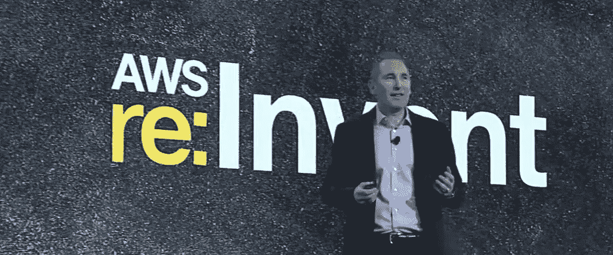
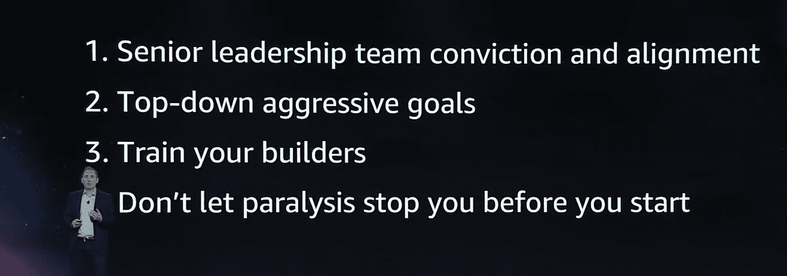
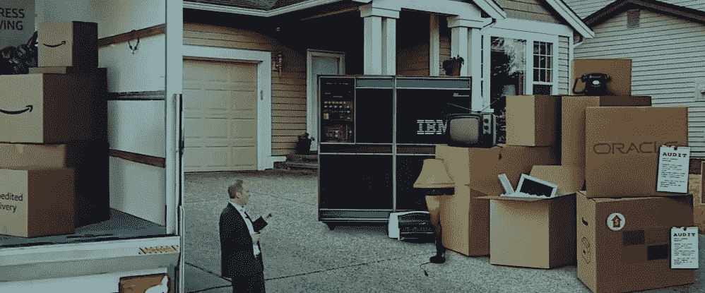
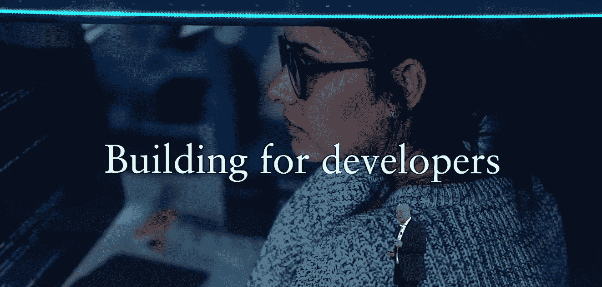

# 推动业务转型——Andy Jassy 的 re:Invent 主题演讲

> 原文：<https://medium.com/version-1/aws-re-invent-andy-jassys-keynote-9a2a121bc2f0?source=collection_archive---------3----------------------->

Andy Jassy speaking at re:Invent

虽然今年我没能参加 re:Invent，但我很喜欢看 Andy Jassy 在都柏林 AWS 办公室的主题演讲。这是由[爱尔兰 AWS 用户组](https://www.meetup.com/AWS-Ireland-Usergroup/)组织的，他们还计划在 12 月 11 日举行一次特别的发布会，讨论新的公告和服务。

# 关键主题:转型

Andy 在主题演讲中传达的主要信息是转型。公司需要转型以保持领先地位，保持市场份额，在竞争环境中成长。97%的 IT 支出仍在内部，因此有一个巨大的市场可供利用。

然而，你不能坐等转变发生。拖延不会让事情变得更容易，最终，推动它的是商业领导的角色。

然后，他指出了转型中的 4 个优势:

Andy’s most critical differentiators in transformation

1.  高级团队必须在转型目标上保持一致，并且必须坚定地领导。惰性在组织中是一种非常强大的东西，很容易阻碍变革。
2.  你需要积极的自上而下的目标，迫使组织以比正常情况下更快的速度前进。不要只是把脚趾浸在水里！制定一个计划，然后马上付诸行动。
3.  培养人！如果没有一个有能力、受过训练和训练的建设者团队，你就无法完成任务。一旦开始了云之旅，开发人员不想被束缚或阻碍。
4.  不要陷入分析麻痹的陷阱。看看所有需要转变的工作负载数量，最简单的！把它做完，然后让学习经历告诉更难的工作。

## 现代化和转型

他讲话的下一部分集中在当你全面考虑时，现代化的成本效益有多高。安全性、许可、可伸缩性、员工成本、弹性方面的改进都有助于提升业务价值和效率。

人们正在远离 Oracle 和 SQL Server，因为它们是专有的、昂贵的，并且有禁止性的许可条款。甚至在今年，微软也效仿甲骨文，改变了 SQL Server 的许可协议，使其在 AWS 上运行更加困难和昂贵——这不是一种客户至上的态度，只会让微软受益。

A moving house analogy with some subtle audit logo placement

因此，AWS 现在有几个程序来帮助从 Windows 迁移到 Linux。由于巨大的开源社区，Linux 有几个优点:更便宜，更多的特性和安全性。它还消除了许可条款被意外更改的担忧。

## 客户故事

与往常一样，主题演讲穿插了各种客户故事。高盛首席执行官大卫·所罗门(David Solomon)谈到了他们建立的信用卡平台，该平台支撑了苹果卡的推出。很明显，金融科技领域正在发生一场大变革，AWS 服务正在引领这场变革

David Solomon talking about building for developers

Cerner 首席执行官 Brent Shafer 谈到了他们拥有的大量客户数据和健康信息，以及 AWS 如何帮助他们管理这些数据和信息。

最后，威瑞森首席执行官汉斯·维斯帕(Hans Vesper)在台上谈论 5G，以及在 5G 网络上推出新的 AWS edge 服务， [AWS 波长](https://aws.amazon.com/about-aws/whats-new/2019/12/announcing-aws-wavelength-delivering-ultra-low-latency-applications-5g)。主要用例是向移动和物联网客户交付 5G 上的超低延迟应用。

## 数据的重要性

马特·伍德也像往常一样露面，谈论各种数据服务日益增长的重要性。每年，来自机器学习、人工智能和数据分析领域的新服务的比例越来越大。这一基调也不例外。

他讨论了亚马逊 SageMaker 的 [8 新服务和功能的发布，以及这个领域对 AWS 有多重要。](https://aws.amazon.com/#Machine_Learning)

## 新服务公告

在主题演讲中，还发布了几项其他新服务:

*   2 去年宣布的服务全面上市— [AWS 前哨站](https://aws.amazon.com/about-aws/whats-new/2019/12/announcing-general-availability-of-aws-outposts/)和 Kubernetes on [AWS Fargate](https://aws.amazon.com/about-aws/whats-new/2019/12/run-serverless-kubernetes-pods-using-amazon-eks-and-aws-fargate/) 。 *(* [*版本 1 是前哨*](https://www.version1.com/news-aws-outposts-services/) *的一个启动伙伴。在这里阅读，或联系以获取更多信息！)*
*   与[亚马逊代码专家](https://aws.amazon.com/about-aws/whats-new/2019/12/aws-announces-amazon-codeguru-for-automated-code-reviews-and-application-performance-recommendations/)一起进行自动化代码审查和应用性能建议
*   [亚马逊侦探](https://aws.amazon.com/about-aws/whats-new/2019/12/introducing-amazon-detective/):一种新的安全服务，结合了守卫职责和一些机器学习，对安全事件进行根本原因分析——在预览版中发布
*   新的[托管 Cassandra 服务](https://aws.amazon.com/about-aws/whats-new/2019/12/announcing-amazon-managed-apache-cassandra-service-now-in-preview)——在预览版中发布

# 摘要

总的来说，主题演讲没有什么太出人意料的地方。几年来，推动商业价值的转型一直是一个常见的主题。越来越多的人工智能和大数据服务，一些很好的安全自动化工具，以及对开发人员能力的持续关注。

我期待着沃纳在周四的讲话，并将在随后的文章中对其进行分析！

如果你对此感兴趣或有任何反馈，请在评论中告诉我，或在[推特](https://twitter.com/deconduino)或 [LinkedIn](https://www.linkedin.com/in/oisindeconduin/) 上联系我