# AWS S3 教程:深入了解亚马逊简单存储服务

> 原文：<https://medium.com/edureka/aws-s3-tutorial-d883e5cc2cf5?source=collection_archive---------0----------------------->

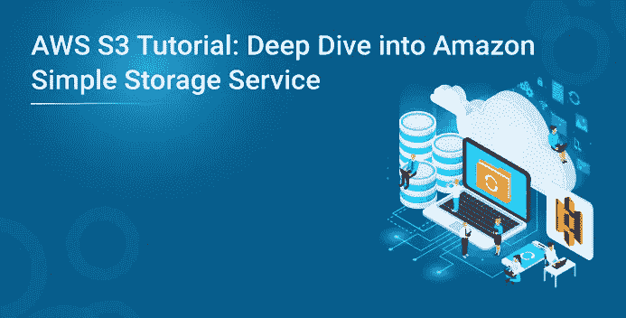

AWS S3 教程将让您清楚地了解这些服务以及一些您可以连接到的示例。

对**存储**的需求每天都在增加，因此，构建和维护您自己的存储库成为一项单调乏味的工作，因为知道您未来可能需要的容量是很难预测的。您可能会因为没有足够的空间而过度利用 it 导致应用程序故障，或者您可能最终会购买大量未得到充分利用的存储。

考虑到所有这些麻烦，亚马逊推出了名为 *AWS S3 的互联网存储服务。*我们将在 AWS S3 教程博客中带您了解这项服务。

# 什么是 AWS S3？

亚马逊简单存储服务(S3)是一个互联网存储。它旨在跨多个地理区域提供大容量、低成本的存储。亚马逊 S3 为开发者和 IT 团队提供**安全**、**耐用**和**高度可扩展**的对象存储。

S3 是安全的，因为 AWS 提供:

*   对您存储的数据进行加密。这可能以两种方式发生:
*   客户端加密
*   服务器端加密
*   维护多个副本，以便在数据损坏时能够重新生成数据
*   *版本化，*其中每个编辑被存档用于潜在的检索。

S3 经久耐用是因为:

*   它使用校验和定期验证存储数据的完整性，例如，如果 S3 检测到数据中有任何损坏，它会立即在复制数据的帮助下进行修复。
*   即使在存储或检索数据时，它也会检查传入的网络流量中是否有任何损坏的数据包。

S3 是高度可扩展的，因为它会根据您的需求自动扩展您的存储，并且您只需为您使用的存储付费。

*我们想到的下一个问题是，*

在自动气象站 S3 站可以存储什么样的数据和多少数据？

在 S3，你几乎可以存储任何格式的任何类型的数据，当我们谈到容量时，我们可以在 S3 存储的对象的容量和数量是无限的。

* *一个对象*是 S3 的基本实体。它由数据、键和元数据组成。

当我们谈论数据时，它可以有两种类型

*   经常被访问的数据。
*   不经常访问的数据。

因此，Amazon 推出了 3 个存储类别，以经济实惠的价格为客户提供最佳体验。

**让我们通过一个“医疗保健”使用案例来了解 3 个存储类别:**

*1。用于频繁数据访问的亚马逊 S3 标准*


这适用于性能敏感的用例，在这些用例中，延迟应该保持较低。例如，在医院中，频繁访问的数据将是入院病人的数据，应该快速检索这些数据。

*2。针对非频繁数据访问的亚马逊 S3 标准*

这适用于数据寿命较长且访问频率较低的使用情形，即数据归档但仍期望高性能。例如，在同一医院中，已经出院的人，他们的记录/数据不是每天都需要的，但是如果他们带着任何并发症回来，他们的出院总结应该被快速检索。

*3。亚马逊冰川*


适用于需要归档数据且不需要高性能的使用情形，其成本低于其他两种服务，例如医院、患者测试报告、处方、MRI、X 射线、扫描文档等。在日常运行中不需要超过一年的，即使需要，也不需要更低的延迟。

**规格快照:**存储类

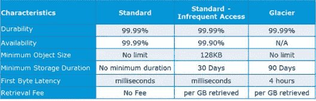

# S3 的数据是如何组织的？

S3 的数据以桶的形式组织。

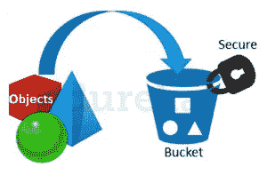

*   在 S3，桶是存储的逻辑单位。
*   一个桶包含包含数据和元数据的对象。

在 S3 中添加任何数据之前，用户必须创建一个用于存储对象的桶。

# 您的数据在地理位置上存储在哪里？

您可以自行选择数据存储的位置或区域。为该地区做决定是很重要的，因此应该好好计划。

这是选择最佳区域的 4 个参数

*   定价
*   用户/客户位置
*   潜伏
*   服务可用性

**我们通过一个例子来理解这个:**

*假设有一家公司必须启动这些存储实例来为美国和印度的客户托管网站。*

*为了提供最佳体验，公司必须选择一个最符合其要求的地区。*

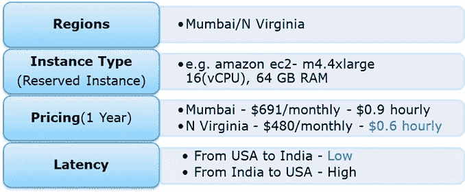

现在看一下上面的参数，我们可以清楚地确定，N Virginia 将是该公司的最佳地区，因为它的延迟低、价格低。无论您在哪里，您都可以选择符合您要求的任何地区，因为您可以从任何地方访问您的 S3 存储桶。

说到区域，我们来看看在其他可用性区域进行备份的可能性，或者您可能希望将数据移动到其他区域。令人欣慰的是，这个功能最近已经被添加到自动气象站 S3 系统中，而且非常容易使用。

# 跨区域复制

顾名思义，跨区域复制使用户能够毫不费力地将数据复制或传输到其他位置。

这显然是有代价的，本文将进一步讨论这一点。

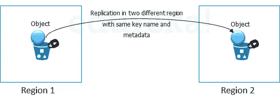

**数据是如何传输的？**

除了通过互联网的传统传输方式之外，AWS 还有另外两种方式来提供安全、快速的数据传输:

*   转移加速度
*   雪球

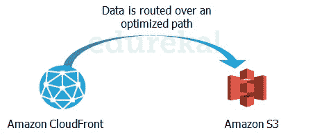

**传输加速**通过利用亚马逊的云前沿技术，实现快速、轻松和安全的长距离传输。

**Cloud Front** 是 AWS 的一项缓存服务，其中来自客户端站点的数据被传输到最近的边缘位置，并从那里通过优化的网络路径路由到您的 AWS S3 存储桶。

**雪球**是一种物理传输数据的方式。在这种情况下，亚马逊发送一个设备到你的住所，你可以在上面加载数据。它附有一个 kindle，当它从亚马逊发货时，上面有你的发货地址。当雪球上的数据传输完成时，


kindle 将发货地址改回 AWS 总部，雪球必须在那里寄出。

雪球是有大量数据移动的客户的理想选择。Snowball 的平均周转时间为 5–7 天，而在同一时间内，传输加速可以在一条 1Gbps 的专用线路上传输多达 75 TB 的数据。因此，根据使用情形，客户可以做出决定。

显然，会有一些成本，让我们看看 S3 的总体成本。

# 定价

**“AWS 上没有免费的吗？”**

***没错！*** 作为 AWS 免费使用层的一部分，您可以免费开始使用 AWS S3。注册后，AWS 新客户在一年内每月会收到 5 GB 的亚马逊 S3 标准存储、20，000 个 Get 请求、2，000 个 Put 请求和 15GB 的数据传输。

超过这个限度，就有附加成本了，让我们来理解一下亚马逊是怎么向你收费的:

# S3 是如何收费的？

虽然有这么多的功能，自动气象站 S3 是负担得起的，其成本是灵活的。它的工作原理是**按使用付费，**意思是，你只需为你使用的东西付费。下表是特定地区 S3 的定价示例:

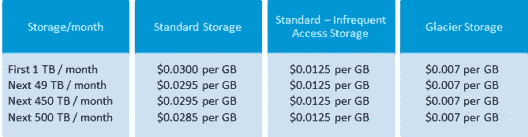

**资料来源:北弗吉尼亚地区的 aws.amazon.com**

**跨区域复制**按以下方式计费:

如果您在区域间复制 1，000 个 1 GB 对象(1，000 GB ),则复制 1，000 个对象将产生 0.005 美元的请求费用(1，000 个请求 x 每 1，000 个请求 0.005 美元),区域间数据传输将产生 20 美元的费用(每传输 GB 0.020 美元 x 1，000 GB)。复制后，1，000 GB 将产生基于目标区域的存储费用。

**雪球，**有 2 个变种:

*   雪球 50 TB : 200 美元
*   雪球 80 TB: 250 美元

这是他们收取的固定服务费。

除此之外，还有现场服务，不包括运输费，运输费是免费的。

前 10 天的现场服务也是免费的，也就是说，从那时起，当雪球到达您的场所，直到它被运回，这 10 天就是现场服务日。它到达的那一天和它被发货的那一天被算作发货日，因此是免费的。

**转账加速**定价如下表所示:

**AWS S3 用例:1**

行业“媒体”

让我们通过一个实时用例来理解它，以吸收我们迄今为止所学的所有知识: *IMDb 互联网电影数据库*是一个著名的电影、电视节目和视频游戏相关信息的在线数据库。

让我们看看他们是如何利用 AWS 服务的:

*   为了获得尽可能低的延迟，对于搜索中的每个字母组合，所有可能的搜索结果都是用文档预先计算的。每个文档都被推送到亚马逊简单存储服务(S3 ),从而被推送到**亚马逊云前端**,让文档离用户更近。要计算的可能搜索的理论数量令人难以置信——一个 20 个字符的搜索有 23 x 1030 种组合
*   但在实践中，利用 IMDb 在电影和名人数据方面的权威，可以将搜索空间减少到大约 15 万份文件，亚马逊 S3 和亚马逊云锋可以在短短几个小时内分发这些文件。

# AWS S3 使用案例:2

**项目陈述—** 在亚马逊 S3 托管一个静态网站

我们先来了解一下:什么是静态网站？

简而言之，它是一个只包含 HTML、CSS 和/或 JavaScript 的网站。这意味着不支持服务器端脚本，所以如果你想托管一个 Rails 或 PHP 应用，你需要去别处看看。

为了更简单的目的，欢迎来到 AWS S3 托管网站的精彩世界！

**第一步:创建一个存储桶**

要创建存储桶，请在 AWS 管理控制台中导航到 S3，然后点击创建存储桶。系统会提示您输入名称和地区。

如果您计划使用自己的域/子域，请使用它作为您的 bucket 名称。对于该地区，选择离您最近的一个，然后点击创建。幸运的话，你会看到你的新桶出现在控制台上。

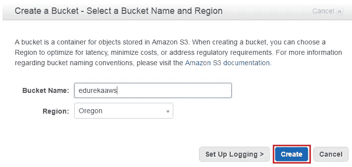

**步骤 2:验证创建的桶**

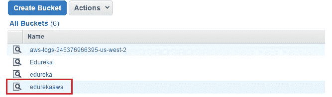

**第三步:启用网站托管**

现在唯一要做的就是，启用静态网站托管。只需从右边的属性面板中选择它。

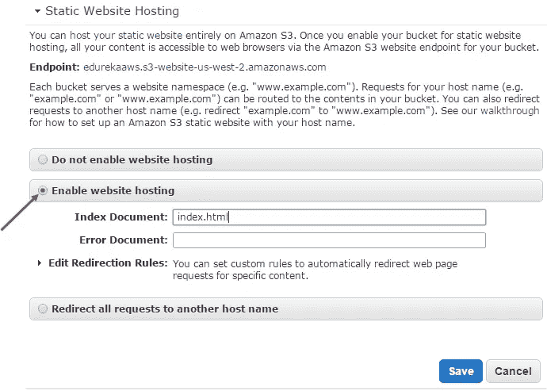

**第四步:创建一个 Html 文件**

确保将索引文档设置为 index.html。如果您愿意，也可以设置一个错误页面。完成后，点击保存。

AWS 管理控制台的一个优点是，您可以直接从浏览器上传文件到您的 bucket。让我们首先创建一个叫做**index.html**的。这将是主页的内容:

```
<!doctype html>
<html>
<head>
<title>
Hello, S3!
</title>
<meta name="description" content="My first S3 website">
<meta charset="utf-8">
</head>
<body>
<h2>My first S3 website</h2>
<p>I can't believe it was that easy!</p>
</body>
</html>
```

**第五步:将文件上传到桶中**

要上传文件，选择您的新存储桶并点击开始上传按钮。

一旦你上传了 index.html，它将出现在你的桶。然而，你还不能在你的浏览器中看到它，因为 AWS S3 的所有内容在默认情况下都是私有的。

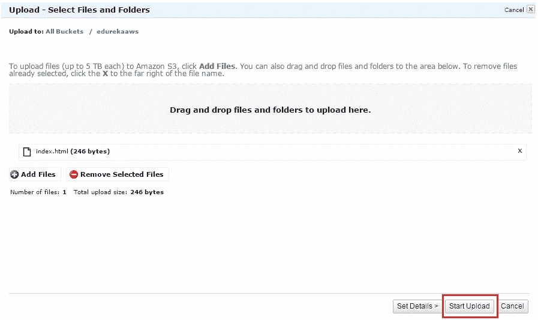

**第六步:公开 Html 文件**

I)要公开 index.html 文件，右键单击 index.html 并选择公开。(请记住，对您上传到网站的任何其他文件也要这样做！)

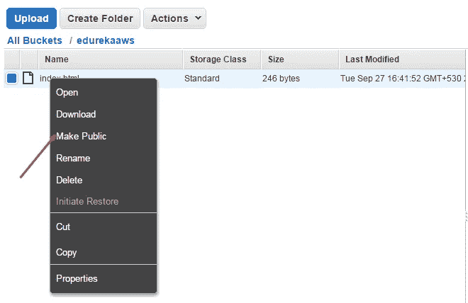

现在你的主页已经向全世界公开了，是时候测试一下了！

ii)现在，在控制台中选择 index.html，然后转到属性选项卡。

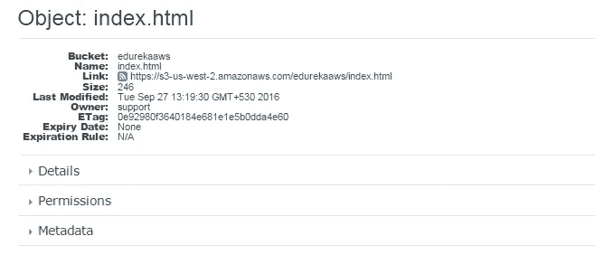

**第七步:验证结果的最后一步**

点击链接将带你到你的新主页。

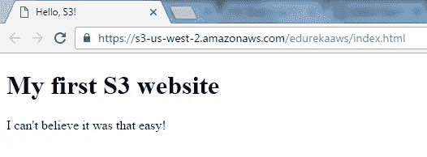

**祝贺你！**您刚刚使用 S3 在 AWS 中托管了一个 html 网站。

这里有一个简短的 AWS S3 教程视频，它解释了:传统存储层、传统存储在云上的缺点、AWS 存储选项:EBS、S3、Glacier、AWS 连接存储:雪球和存储网关、AWS 命令行界面(CLI)、演示等。对于那些想成为 AWS 认证解决方案架构师的人来说，AWS S3 教程是非常重要的服务。我希望你喜欢这个 AWS S3 教程的深入研究。这是招聘人员在 AWS 解决方案架构师专业人员中最受欢迎的技能之一。如果你想查看更多关于 Python、DevOps、Ethical Hacking 等市场最热门技术的文章，你可以参考 Edureka 的官方网站。

请留意本系列中解释 Azure 其他方面的其他文章。

> *1。* [*蔚蓝教程*](/edureka/azure-tutorial-5a97e30ee9a7)
> 
> *2。* [*蔚蓝门户*](/edureka/azure-portal-all-you-need-to-know-about-the-azure-console-8ade1effa474)
> 
> *3。* [*天蓝色收纳教程*](/edureka/azure-storage-tutorial-an-introduction-to-azure-storage-dae8fd8f555c)
> 
> *4。* [*蔚蓝专用网*](/edureka/azure-virtual-network-securing-your-applications-using-vpc-744eba3aa5b1)
> 
> *5。* [*Azure DevOps 教程*](/edureka/azure-devops-cf755fb334ae)
> 
> *6。* [*天蓝色棋盘*](/edureka/azure-boards-ce093b2688bb)

*原载于 2018 年 6 月 18 日*[*【https://www.edureka.co】*](https://www.edureka.co/blog/how-to-become-a-cloud-engineer/)*。*