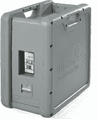

# 什么是 AWS 雪球和雪地车？

> 原文：<https://medium.com/edureka/aws-snowball-and-snowmobile-tutorial-f8159ae8294e?source=collection_archive---------0----------------------->

本文将向您介绍数据迁移如何在 Amazon Web Services Cloud 上工作。本文将涉及以下几点:

*   数据迁移的使用案例
*   AWS 雪球
*   使用雪球将数据迁移到 AWS 云的步骤
*   雪球 vs 雪地车

那么让我们开始吧，

# 数据迁移的使用案例

随着高速互联网、卫星和智能手机的快速普及，产生的数据量与日俱增。为了前任。一家卫星图像公司可能已经存储了数十亿字节的地球信息，并定期更新。不断增加存储容量对他们来说是一个巨大的挑战，不仅在成本方面，而且在空间、电源、安全等后勤方面也是如此。这就是像 AWS 这样的云提供商的用武之地。公司拥有大量数据的其他几个用例是用于存储视频库、基因组序列和地震数据。

卫星图像公司和其他公司希望将其应用程序和数据迁移到云中，并让云提供商负责存储方面的工作，如安全性、备份、额外存储等。这样，卫星图像公司可以专注于其核心业务，以寻找更多的客户，为客户提供更多的价值，为客户提供更多的互动方式，等等。

但是，在互联网上移动数十亿字节的数据有其自身的挑战。根据这里的 AWS 文档:**通过专用的 100 Mbps 连接传输 100 TB 的数据需要超过 100 天的时间**。忘掉移动数十亿字节的数据吧，这需要将近一年的时间。除了所需的时间之外，还有额外的网络带宽成本，我们不要忘记使用公共互联网时的数据窥探。这就是 AWS Snowball 和 AWS Snowmobile 等服务的用武之地。

接下来在这个 AWS 雪球和雪车教程

# AWS 雪球

雪球是一个坚固的设备，也是防爆的，比手提箱大一点点，也可以托运到飞机上。

加速数据中心和 AWS 云之间的数据移动的另一个选择是使用 AWS Direct Connect 服务。使用这项服务，在 AWS 云和您自己的数据中心之间建立了一条专线，以实现稳定的连接和一致的高带宽。

接下来，在这个 AWS 雪球和雪地摩托教程中，我们将看到数据迁移是如何工作的，

# 使用雪球将数据迁移到 AWS 云的步骤

以下是在您自己的数据中心和 AWS 云之间迁移数据的高级步骤。

**步骤 1:** 根据要传输的数据量，向 AWS 请求一个或多个雪球设备。雪球有两个版本，存储容量分别为 50tb 和 80 TB，可以通过管理控制台从 AWS 订购。

**第 2 步:** AWS 将把雪球运送给客户。下一步是将其连接到本地网络，然后使用 AWS 提供的客户端程序将数据传输到雪球中。数据会自动加密并存储。

**第三步:**一旦数据被转移到雪球，它必须被快递到 AWS。雪球有电子墨水来自动填充 AWS 位置的地址。雪球中的数据是加密的(使用 AWS KMS 密钥的 256 位加密)，所以现在雪球有可能被篡改或有人试图从中获取数据。都是受保护的。

**第四步:**一旦 AWS 的人拿到雪球，他们就把它连接到 AWS 云，解密数据，然后把数据转移到 S3。

**第 5 步:**一旦数据被转移到 S3，这个雪球就消失了，没有人能进一步访问它。

**第 6 步:**最后一步是客户在 S3 访问数据。数据可以从那里转移到 EBS、EFS、DynamoDB 和其他各种 AWS 服务。

上述步骤非常类似于我们在没有连接网络的情况下将数据从一台笔记本电脑传输到另一台笔记本电脑。我们将 USB 驱动器插入源笔记本电脑，将数据复制到 USB 驱动器。移除 USB 驱动器并将其插入目标笔记本电脑，然后复制数据。虽然上述步骤是为了将数据从我们自己的数据中心移动到 AWS 云，但是也可以通过相反的顺序按照准确的步骤移动数据。这样就不会锁定数据。

Snowball 不仅用于将现有应用程序的数据移动到 AWS 云，还可以在关闭现有数据中心并将所有数据移动到云的情况下用于数据中心迁移。与通过公共互联网移动数据(有点慢)相比，这种方法使转换更快。

这就把我们带到了 AWS 雪球和雪地摩托教程的最后一点，

# 雪球 vs 雪地车

一个雪球可以存储多达 80 TB 的数据，其中只有 72 TB 的可用空间。当需要移动超过 80 TB 的数据时，可以并行使用多个雪球。

AWS 还提供了一个雪地车，其中存储的数据量远远超过雪球所能存储的数据量。雪球是一个坚固的集装箱，带有一辆半挂卡车。虽然单个雪球可以存储多达 80 TB 的数据，但单个雪地汽车可以存储 100 PB 的数据，这几乎是单个雪球容量的 1250 倍。AWS 建议当要传输的数据少于 10 PB 时使用雪球，否则使用雪地车。除了默认的加密，Snowmobile 还采取了一些额外的措施，如 GPS 跟踪，24/7 视频监控，可选的护送，使数据更加安全。如果你想查看更多关于人工智能、DevOps、道德黑客等市场最热门技术的文章，你可以参考 Edureka 的官方网站。

请留意本系列中解释 AWS 各个方面的其他文章。

> *1。* [*AWS 教程*](/edureka/amazon-aws-tutorial-4af6fefa9941)
> 
> *2。* [*AWS EC2*](/edureka/aws-ec2-tutorial-16583cc7798e)
> 
> *3。*[*AWS Lambda*](/edureka/aws-lambda-tutorial-cadd47fbd39b)
> 
> *4。* [*AWS 弹性豆茎*](/edureka/aws-elastic-beanstalk-647ae1d35e2)
> 
> *5。* [*AWS S3*](/edureka/s3-aws-amazon-simple-storage-service-aa71c664b465)
> 
> *6。* [*AWS 控制台*](/edureka/aws-console-fd768626c7d4)
> 
> *7。* [*AWS RDS*](/edureka/rds-aws-tutorial-for-aws-solution-architects-eec7217774dd)
> 
> *8。* [*AWS 迁移*](/edureka/aws-migration-e701057f48fe)
> 
> *9。*[*AWS Fargate*](/edureka/aws-fargate-85a0e256cb03)
> 
> *10。* [*亚马逊 Lex*](/edureka/how-to-develop-a-chat-bot-using-amazon-lex-a570beac969e)
> 
> *11。* [*亚马逊光帆*](/edureka/amazon-lightsail-tutorial-c2ccc800c4b7)
> 
> *12。* [*AWS 定价*](/edureka/aws-pricing-91e1137280a9)
> 
> *13。* [*亚马逊雅典娜*](/edureka/amazon-athena-tutorial-c7583053495f)
> 
> *14。*[AWS CLI](/edureka/aws-cli-9614bf69292d)
> 
> 15。 [*亚马逊 VPC 教程*](/edureka/amazon-vpc-tutorial-45b7467bcf1d)
> 
> *15。*[*AWS vs Azure*](/edureka/aws-vs-azure-1a882339f127)
> 
> *17。* [*内部部署 vs 云计算*](/edureka/on-premise-vs-cloud-computing-f9aee3b05f50)
> 
> 18。 [*亚马逊迪纳摩 DB 教程*](/edureka/amazon-dynamodb-tutorial-74d032bde759)
> 
> 19。 [*如何从快照恢复 EC2？*](/edureka/restore-ec2-from-snapshot-ddf36f396a6e)
> 
> 20。 [*AWS 代码提交*](/edureka/aws-codecommit-31ef5a801fcf)
> 
> *21。* [*顶级 AWS 架构师面试问题*](/edureka/aws-architect-interview-questions-5bb705c6b660)
> 
> *22。* [*如何从快照恢复 EC2？*](/edureka/restore-ec2-from-snapshot-ddf36f396a6e)
> 
> *23。* [*使用 AWS 创建网站*](/edureka/create-websites-using-aws-1577a255ea36)
> 
> *24。* [*亚马逊路线 53*](/edureka/amazon-route-53-c22c470c22f1)
> 
> *25。* [*AWS 简历*](/edureka/aws-resume-7453d9477c74)

*原载于 2019 年 9 月 20 日*[*https://www.edureka.co*](https://www.edureka.co/blog/aws-snowball-and-snowmobile-tutorial/)*。*