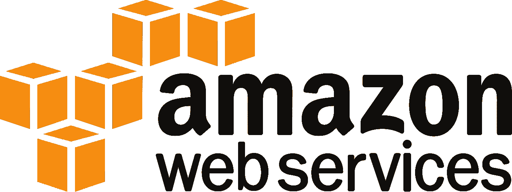
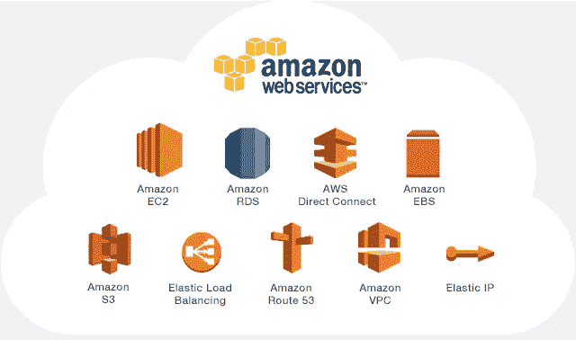

# 所有云服务提供商的王牌——AWS

> 原文：<https://medium.com/quick-code/aws-the-ace-of-all-cloud-service-providers-2aa4fc38f2a8?source=collection_archive---------0----------------------->

亚马逊的云部门亚马逊网络服务(AWS)无疑是云市场上最大、最受欢迎的云服务提供商！

# 使用 AWS 的云计算

AWS 是世界上最全面、最广泛采用的云平台。它提供了近 165 种功能齐全的服务，而且所有这些服务都有更多的功能。凭借这种广泛的受欢迎程度和接受度，以及大量可供选择的服务，AWS 无疑是所有云服务提供商的王牌。(读这篇 [***文章***](https://www.thenewsminute.com/article/microsoft-oracle-join-hands-take-aws-cloud-103108) )

AWS 因其高效、动态的架构迎合了大量潜在、里程碑式的客户。AWS 的主要消费者包括发展最快的初创公司、最大的企业和各种领先的政府机构。

# 是什么让 AWS 成为领先的云平台？

## 多种功能

AWS 授权其用户从大量的*(比任何云服务提供商都多)*功能和特性中进行选择。AWS 为广泛的应用提供服务，包括计算、存储、数据库、网络、分析、机器学习&人工智能(AI)、物联网(IoT)、安全和应用开发、部署&管理。

这种广泛的服务选择和深入的功能使您可以更轻松、更快速、更经济地将现有应用迁移到云中，并构建几乎任何您可以想象的东西。

## 最大的客户和合作伙伴社区

AWS 拥有最大且极具活力的生态系统，在全球拥有数百万活跃客户和数万合作伙伴。客户包括初创企业、企业、公共事业等，他们来自行业的各个领域，在 AWS 上运行着所有可以想象的用例！

## 最安全

AWS 被设计成当今最灵活、最安全的云计算环境。构建核心基础设施是为了满足军队、全球银行和其他高敏感性组织的安全要求。

## 最快的创新速度

AWS 在 2018 年发布了 1，957 项新服务和功能，以无与伦比的速度进行创新，特别是在机器学习和人工智能、物联网和无服务器计算等新领域。借助 AWS，您可以利用最新的技术来创新、区分和快速交付解决方案。

## 最成熟的运营专业知识

AWS 拥有无与伦比的经验、成熟度、可靠性、安全性和性能。12 年来，AWS 一直在为全球数百万运行各种使用案例的客户提供云服务，并且在更大范围内拥有比任何云提供商都多的运营经验。

由此我们可以得出结论，AWS 确实是最受欢迎和最可靠的云平台，初创企业、企业或公共事业可以依赖它，而无需担心任何安全和隐私问题，可以满足大量服务的选择！

欢迎分享您的反馈！

同时按下👏图标，如果你喜欢这个帖子！

快乐阅读！