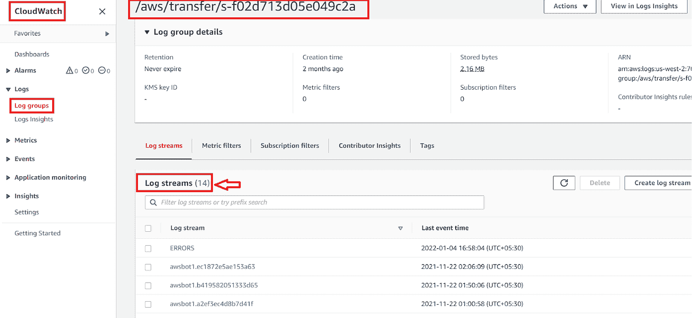
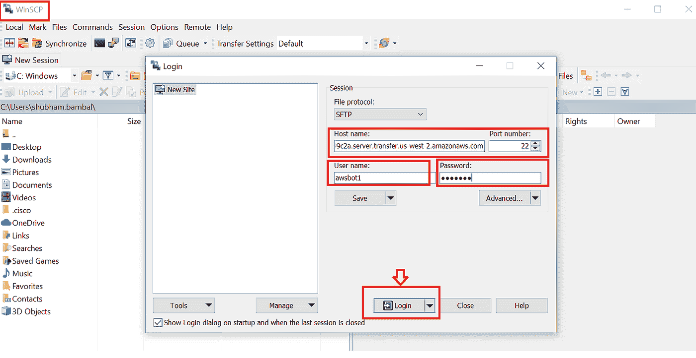

# 用于文件传输的 AWS 传输系列

> 原文：<https://medium.com/globant/aws-transfer-family-for-file-transfers-35323bc0035f?source=collection_archive---------0----------------------->

您是否想过托管、管理 SFTP 服务器，并在团队或第三方供应商之间提供无缝通道来传输文件或数据？你的搜索到此结束！AWS transfer family 是 AWS 的一项托管服务，将帮助您实现这一目标。

# **简介**

AWS Transfer Family 是一项全面管理的 AWS 服务，可用于通过以下协议在亚马逊 S3 或亚马逊 EFS 之间传输文件:

*   安全外壳(SSH)文件传输协议(SFTP)
*   文件传输协议安全(FTPS)
*   文件传输协议(FTP)

AWS 传输系列支持多达 3 个可用性区域，并通过冗余设备群自动扩展来支持连接和传输请求。通过在 AWS 传输系列中创建一个支持文件传输协议的服务器，然后创建用户访问，为用户提供服务。

# **先决条件**

*   AWS 帐户
*   对 AWS Transfer 系列、IAM、S3、EC2、AWS 目录服务和 CloudWatch 的管理权限或读/写访问权限

# **建筑设计**

我们将考虑以下演示使用案例，即 AWS transfer family 和 AWS managed MS Active Directory。

**AWS Transfer Family with AWS Managed MS AD**

# **实现**

> **第一步:登录**AWS 账户

AWS Login Page

> S **tep2:** 创建一个**私有 S3 桶**，我将其命名为“ **s3-sftp-transferfamily** ”，由不同合作伙伴或团队的文件夹组成，我们稍后会用到。

S3 bucket

> **步骤 3:** 创建一个 **IAM 角色**，该角色有权访问在前面步骤中创建的 S3 存储桶以及其中的任何对象。在我的例子中，它被命名为“**Role-S3-sftp-transfer family**”。

IAM Role

IAM policy

> **步骤 4:** 创建 **AWS 托管的微软活动目录**。在如下所示的目录中设置组和用户。

AWS managed Microsoft Active Directory

已经创建了组“ **AWS 传送系列**”和“ **AWS 传送系列 2** ”，并且在前者中添加了**用户 AWS Bot1** 、 **AWSBot3** ，在后者中添加了 **AWSBot2** 。

Active directory users and groups

> **步骤 5:** 在 AWS transfer family 服务中使用默认 DNS 名称创建一个 **SFTP 服务器端点**。

SFTP server endpoint in AWS transfer family

> **步骤 6:** 为 AWS 传输系列内的 AD 用户创建**访问权限，关联步骤 3 中创建的 IAM 角色，并将主目录分配为 S3 存储桶。**为广告组创建访问权限时，需要广告组 SID** 。**

**注意—** *使用下面的* ***Windows PowerShell 命令*** *检索组的 SID，用组名替换****your group name****。*

***Get-ad group-Filter { Sam account name-like " your group name * " }-Properties * | Select Sam account name，ObjectSid***

Creating access in AWS transfer family using AD group SID

AWS 传输系列中为用户新建的访问权限根据其 sid 驻留在 AD 组中，如 **AWS 传输系列**和 **AWS 传输系列 2** ，如下所示。

Newly created access in AWS transfer family for AD groups

> **步骤 7:** 使用新创建的角色**“AWSTransferLoggingAccess**”授予对 **cloudwatch** 服务的访问权限，以管理日志并将其存储到 cloudwatch 日志组中，从而跟踪 SFTP 服务器端点发出的所有请求。

Role for Cloudwatch Logs

Cloudwatch Log Streams

> **第八步:**使用 FTP 客户端如 **WinSCP** 访问服务器。输入**服务器端点详细信息**和 **AD 用户凭证**。一旦你点击**登录**按钮，你将被导航到 S3 桶中用户分配的主目录。

> **第九步**:创建测试文件，我已经使用了“ **bot1.txt** ”和“ **Demo1 SFTP.txt** ”，从你的本地系统文件夹中拖拽到 SFTP 服务器目录下。

之前上传的文件会自动反映到如下所示的 S3 桶中的“ **MS AD bot1** ”目录下，**传输成功..**！！！

# 摘要

> 我们展示了通过 SFTP 协议利用 AWS 传输系列和 AWS 管理的 Microsoft Active directory 将不同用户的文件传输到访问受限的 SFTP 服务器端点。还部署了一个利用 Cloudwatch 的监控机制。AWS transfer 系列将是消除基础设施管理开销并确保成本和时间优化的不错选择。

# 参考

AWS 传输系列[https://docs . AWS . Amazon . com/Transfer/latest/user guide/what-is-AWS-Transfer-Family . html](https://docs.aws.amazon.com/transfer/latest/userguide/what-is-aws-transfer-family.html)