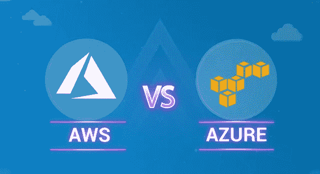
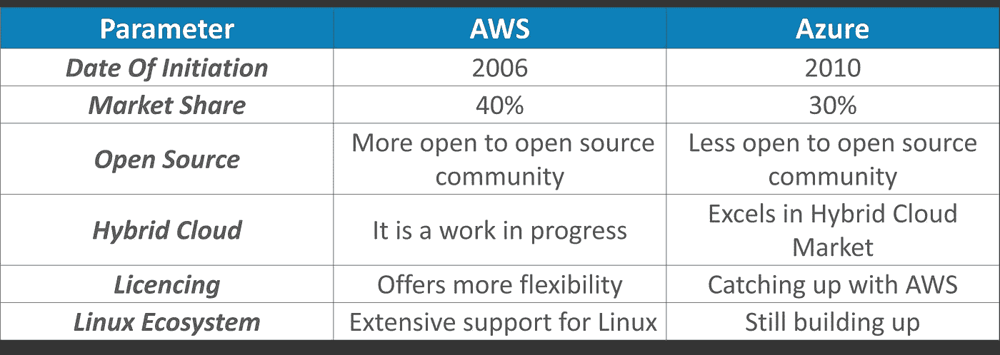
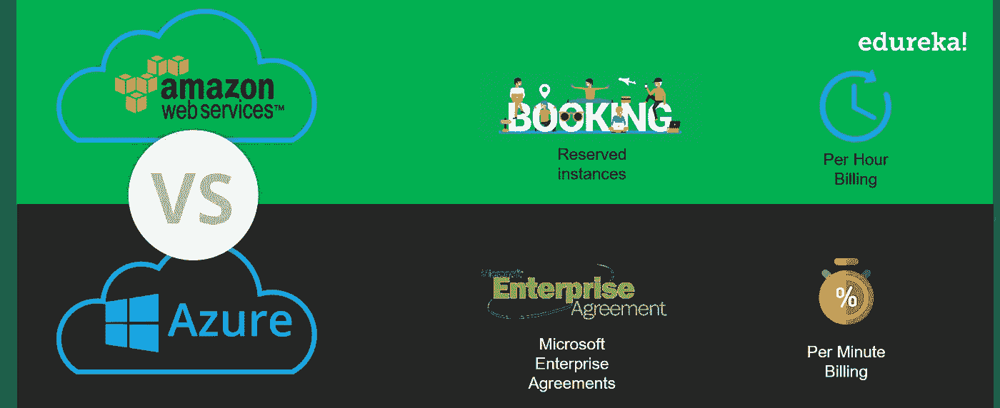
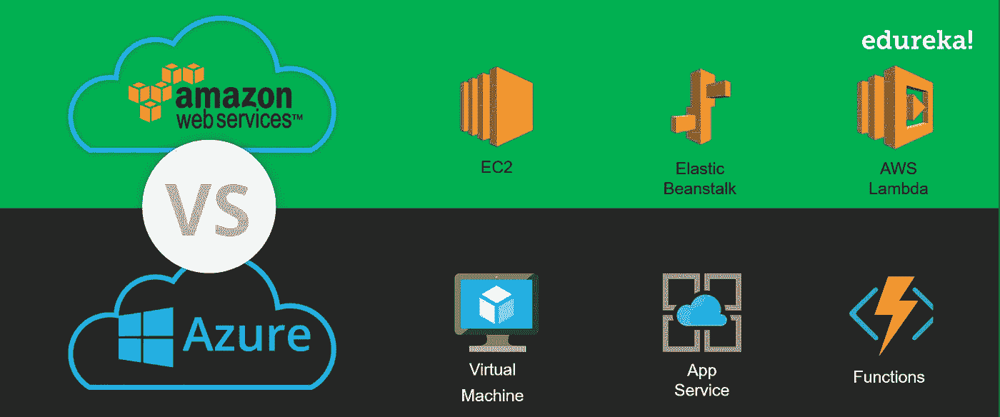
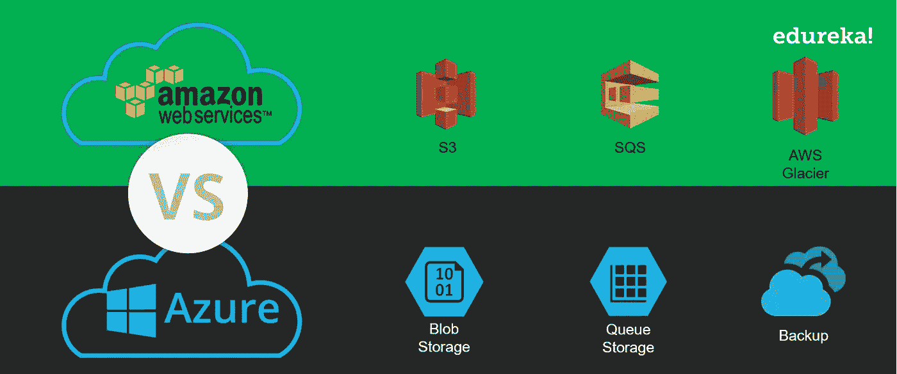
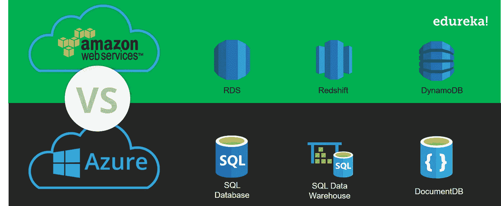

# AWS vs Azure——最佳云计算平台之战

> 原文：<https://medium.com/edureka/aws-vs-azure-1a882339f127?source=collection_archive---------0----------------------->

AWS vs Azure - Edureka

随着云计算的蓬勃发展，各种云服务供应商都在争夺云计算领域的霸主地位。AWS 和 Azure 一直坚持不懈，并暂时占据了最高荣誉。然而，最困扰人们的问题是选择哪家云厂商？在这篇关于 AWS 与 Azure 的文章中，我们将比较这些云巨头，以帮助您找出更适合您的业务需求的产品。

我们将使用以下指标来比较这些服务提供商:

1.  一般特征
2.  定价
3.  计算
4.  储存；储备
5.  数据库
6.  网络服务
7.  容器和编排支持
8.  服从
9.  最终得分

所以让我们从这篇 AWS vs Azure 的文章开始吧，

# AWS 与 Azure:一般特性

该表根据一些一般特征对这些云巨头进行了充分的比较:

既然一般的比较已经过时，让我们来看看这两大巨头的一些定价数据，

# 定价

Azure 和 AWS 定价模式都提供了按需付费的结构。AWS 按小时收费，而 Azure 按分钟收费。当谈到短期订阅计划时，Azure 给你更多的灵活性。在某些服务的情况下，当架构开始扩展时，Azure 往往比 AWS 更昂贵。

# 计算服务

这篇 AWS vs Azure 文章的下一个暂停是计算参数。当谈到云计算时，计算或计算服务是核心服务之一，这是可以理解的，因为我们在术语云计算中有“计算”一词。

随着大量数据的产生，总是需要更快的处理方法。计算服务确保您可以在几分钟内生成实例，并在需要时立即扩展实例。AWS 和 Azure 都有迎合这些需求的服务。

AWS 有 EC2、Elastic Beanstalk、AWS Lambda、ECS 等服务。Azure 也有类似的服务，如 Azure 虚拟机、应用服务、Azure 功能和容器服务等。所以很明显，这些服务是相当齐头并进的。

然而，当你比较成本时， **azure 实例往往会随着大小的增加而变得更加昂贵**。当你考虑一个拥有 256GB 内存和 64vPCU 的实例时，AWS 将收取你 3.20 美元/小时，而 Azure 将收取大约 6.76 美元/小时。

现在我们已经处理了计算，下一个大问题是存储这些数据，让我来解释一下。

# 存储服务

AWS 和 Azure 都提供长期运行且可靠的存储服务。AWS 有像 AWS S3 **、** EBS 和 Glacier 这样的服务，而 Azure 存储服务有 Blob 存储、磁盘存储和标准存档。

AWS S3 确保跨区域的高可用性和自动复制。对于 AWS 中的临时存储，每当实例启动和停止时，它就开始工作。在终止时，它提供类似于硬盘的块存储，可以附加到任何 EC2 实例或保持独立。

对于 Azure，它使用临时存储和页面 blobs 作为虚拟机卷。Azure 有一个块存储选项，作为 AWS 中 S3 的对应项。此外，Azure 还在他们的存储中提供了两种类型，冷存储和热存储。

这是关于存储服务的，现在让我们看看这两者在数据库服务方面的表现。

# 数据库服务

如今生成的数据有不同的格式，因此保存这些数据的数据库也需要发展。AWS 和 Azure 都提供不同的数据库服务来处理结构化和非结构化数据。

如果你在寻找耐用性，AWS 有 Amazon RDS，而 Azure 有 Azure SQL Server 数据库。Amazon RDS 支持不同的数据库引擎，如 MariaDB、Amazon Aurora、MySQL、Microsoft SQL、PostgreSQL 和 Oracle，而说到 Azure，SQL Server 数据库顾名思义是基于 SQL 的。

当你考虑界面时，Azure 有一个更友好或更平滑的界面，而 AWS 提供了更多实例的更好的配置。可以看出，这两种工具都有值得夸耀的特点。如果我们要谈论这些服务的覆盖范围，它们与分析和大数据服务相当。AWS 有 EMR，而 Azure 有同样的 HD 见解。Azure 还提供了 Hadoop、Spark、Storm 和 HBase 附带的 Cortana 智能套件。

在成熟度方面，AWS 尤其为大数据提供了更成熟的环境。

让我们继续这篇 AWS vs Azure 的文章，看看它在网络方面表现如何，

# 网络服务

亚马逊虚拟专用云(VPC)支持在云保护伞下创建隔离网络。这使用户能够创建子网、路由表、私有 IP 地址范围和网络网关。

微软 Azure 虚拟网络是 VPC 的翻版，让你做 VPC 做的所有事情。两家供应商都有将内部数据中心扩展到云和防火墙选项的解决方案。

# 容器和编排支持

我们已经确定 AWS 提供更成熟的大数据和分析产品。它的武库中有各种服务，涵盖物联网、移动应用开发或根据需要创建计算环境等领域。他们也为 Docker 提供支持。

微软在这方面是平等的，可能会更进一步，因为它通过 Azure HDInsight 等服务提供 Hadoop 支持。Azure 认为 Windows Server 2016 为 Windows 容器和 Hyper-V 容器提供了与 Docker 的集成。该平台还运行 Windows 或 Linux 容器。

这篇“AWS vs Azure”文章的最后一点是合规性，让我们试着去理解它，

# 服从

亚马逊与政府机构有着良好的关系，确保提供更好的政府云产品。它们还提供了强大的安全措施，确保个人用户在访问云时的适当访问，当公司处理敏感数据时，这一因素至关重要。

微软提供了 50 多种兼容产品。一些著名的包括 ITAR，DISA，HIPAA，CJIS，FIPS。在安全性方面，它与 AWS 并驾齐驱。

# 最终得分

如上所述，两种云平台都显示出强大的能力，很难选出一个明显的赢家。Azure 在混合云和与微软产品堆栈集成方面非常棒，而 AWS 则有更多的灵活性和额外的功能。这在很大程度上取决于您或您的组织的需求。所以要明智选择。

这就把我们带到了这篇关于‘AWS vs Azure’的文章的结尾。如果你想查看更多关于人工智能、DevOps、道德黑客等市场最热门技术的文章，你可以参考 Edureka 的官方网站。

请留意本系列中的其他文章，它们将解释 AWS 的各个方面。

> *1。* [*AWS 教程*](/edureka/amazon-aws-tutorial-4af6fefa9941)
> 
> *2。* [*AWS EC2*](/edureka/aws-ec2-tutorial-16583cc7798e)
> 
> *3。*[*AWS Lambda*](/edureka/aws-lambda-tutorial-cadd47fbd39b)
> 
> *4。* [*AWS 弹性豆茎*](/edureka/aws-elastic-beanstalk-647ae1d35e2)
> 
> *5。* [*AWS S3*](/edureka/s3-aws-amazon-simple-storage-service-aa71c664b465)
> 
> *6。* [*AWS 控制台*](/edureka/aws-console-fd768626c7d4)
> 
> *7。* [*AWS RDS*](/edureka/rds-aws-tutorial-for-aws-solution-architects-eec7217774dd)
> 
> *8。* [*AWS 迁移*](/edureka/aws-migration-e701057f48fe)
> 
> *9。*[*AWS Fargate*](/edureka/aws-fargate-85a0e256cb03)
> 
> *10。* [*亚马逊 Lex*](/edureka/how-to-develop-a-chat-bot-using-amazon-lex-a570beac969e)
> 
> *11。* [*亚马逊光帆*](/edureka/amazon-lightsail-tutorial-c2ccc800c4b7)
> 
> *12。* [*AWS 定价*](/edureka/aws-pricing-91e1137280a9)
> 
> 13。 [*亚马逊雅典娜*](/edureka/amazon-athena-tutorial-c7583053495f)
> 
> *14。* [*AWS CLI*](/edureka/aws-cli-9614bf69292d)
> 
> *15。* [*亚马逊 VPC 教程*](/edureka/amazon-vpc-tutorial-45b7467bcf1d)
> 
> 15。 [*AWS 简历*](/edureka/aws-resume-7453d9477c74)
> 
> 17。 [*内部部署 vs 云计算*](/edureka/on-premise-vs-cloud-computing-f9aee3b05f50)
> 
> 18。 [*亚马逊迪纳摩 DB 教程*](/edureka/amazon-dynamodb-tutorial-74d032bde759)
> 
> *19。* [*如何从快照恢复 EC2？*](/edureka/restore-ec2-from-snapshot-ddf36f396a6e)
> 
> *20。* [*AWS 代码提交*](/edureka/aws-codecommit-31ef5a801fcf)
> 
> *21。* [*顶级 AWS 架构师面试问题*](/edureka/aws-architect-interview-questions-5bb705c6b660)
> 
> *22。* [*如何从快照恢复 EC2？*](/edureka/restore-ec2-from-snapshot-ddf36f396a6e)
> 
> *23。* [*使用 AWS 创建网站*](/edureka/create-websites-using-aws-1577a255ea36)
> 
> *24。* [*亚马逊路线 53*](/edureka/amazon-route-53-c22c470c22f1)
> 
> *25。* [*用 AWS WAF 保护 Web 应用*](/edureka/secure-web-applications-with-aws-waf-cf0a543fd0ab)

*原载于 2019 年 2 月 20 日*[*www.edureka.co*](https://www.edureka.co/blog/aws-vs-azure/)*。*