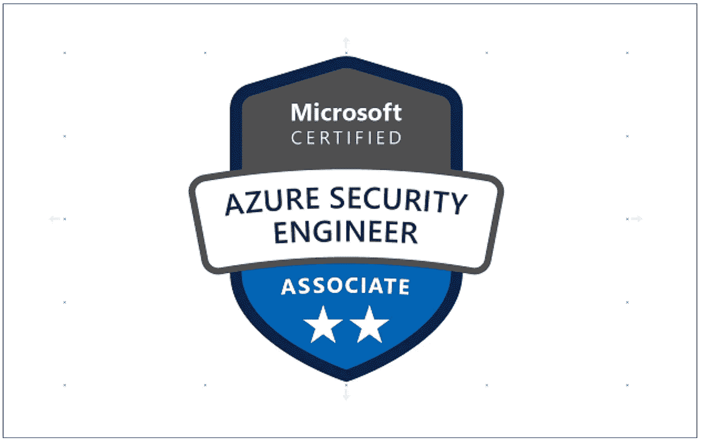

# AZ 500 实验室-1 —微软 Azure 安全技术

> 原文：<https://medium.com/bb-tutorials-and-thoughts/az-500-lab-1-microsoft-azure-security-technologies-d7d74c3c3347?source=collection_archive---------1----------------------->

## 考试的一系列示例实验

Azure Security Associate 考试验证您实施的 Azure 安全控制，这些控制作为端到端基础架构的一部分，在云和混合环境中保护身份、访问、数据、应用程序和网络。