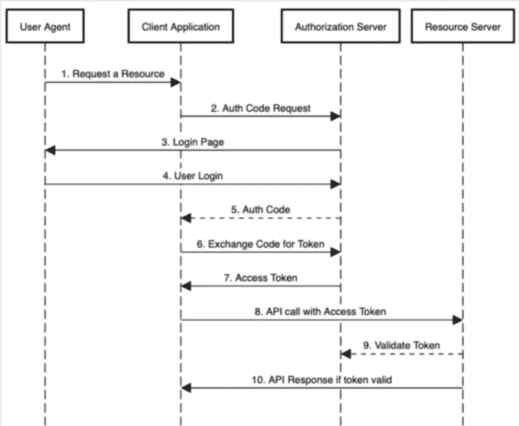
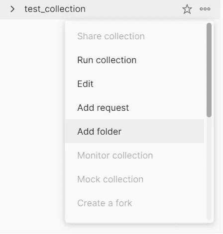
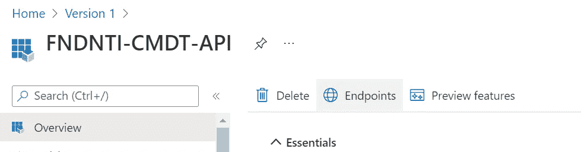
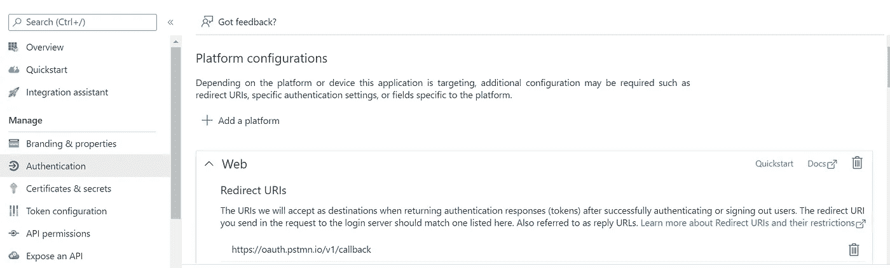
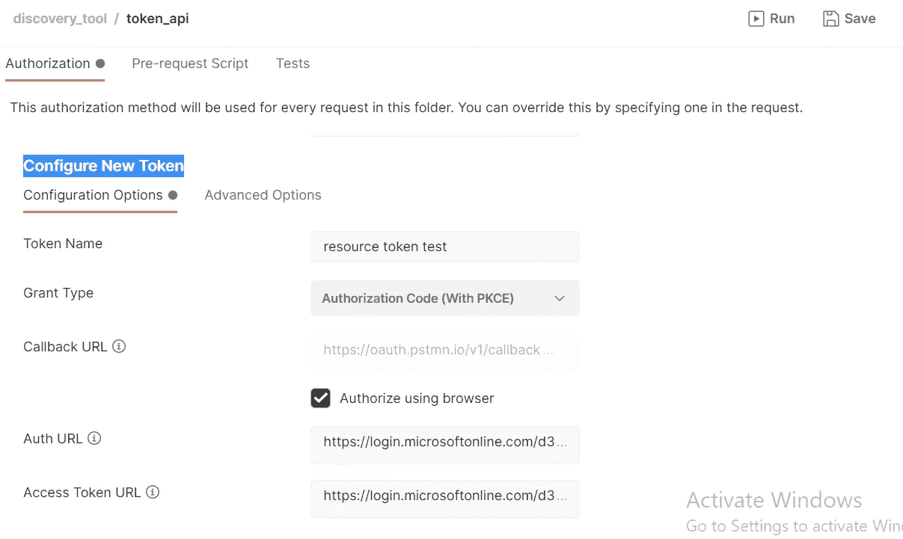
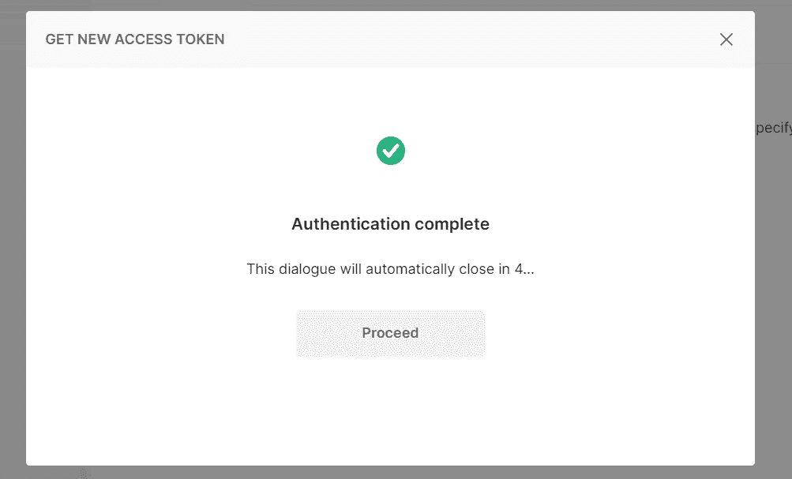

# Spring Boot 应用程序中的 Azure 广告集成

> 原文：<https://medium.com/version-1/azure-ad-integration-in-spring-boot-application-81d66ffd4739?source=collection_archive---------0----------------------->


> 本文档解释了如何使用 Azure Active Directory 作为身份提供者/身份验证服务器(IdP)来启用基于范围和角色的授权，而 Spring boot 将作为资源服务器来验证由 IdP 生成并由客户端应用程序(Angular UI)传递的访问令牌。

***实现这个之前需要的先决条件:*** 1 .Azure 订阅
2。Java JDK 8 或更高版本(本地安装)
3。Apache Maven 3 或更高版本(本地安装)
4。应用程序应该在 Azure portal>Azure Active Directory>应用程序注册下注册(将在文档的后面讨论)

# ***什么是 Azure AD？***

Azure Active Directory (Azure AD)是基于云的身份和访问管理服务。这项服务帮助您的员工访问外部资源，如 Microsoft 365、Azure 门户和数以千计的其他 SaaS 应用程序。Azure Active Directory 还允许他们访问内部资源，如企业内部网网络上的应用程序和为您自己的组织开发的任何云应用程序。

借助 Azure AD，本文将讨论如何使用基于范围的身份验证来保护 Spring Boot 应用程序。这将使用 Azure AD 作为认证服务器& Spring Boot 应用程序充当资源服务器。Spring boot 将验证从客户端应用程序(Angular APP)收到的令牌。

## ***授权代码流程是如何工作的？***



Token flow happens when a user logs into the system.

**用户代理**:访问应用程序的最终用户

**客户端应用程序:**使用来自授权服务器的令牌代表资源所有者访问资源服务器的应用程序。它编排了获取和更新这些令牌的过程

授权服务器:验证你的证书的服务器。为注册的客户端生成令牌，在我们的例子中是 Azure AD

资源服务器:它是我们的 API 所在的服务器，在我们的例子中，它是一个 Spring Boot 应用程序

*资源服务器将有四个主要组件:*

1.  **API** —一个 REST 控制器来公开资源
2.  **安全配置** —为 API 公开的受保护资源定义访问控制的类
3.  **application . properties**—声明属性的配置文件，包括授权服务器的信息
4.  **pom.xml —** 将 Java Spring boot 应用程序关联为资源服务器所需的所有依赖项

## ***如何设置授权服务器？***

要设置 Azure AD 租户，我们需要有一个 Azure 订阅。如果您已经有租户，请按照以下步骤配置应用程序注册:

1.  导航到 Azure 门户中的搜索栏，搜索“Azure Active Directory”
2.  点击“应用注册”,然后点击顶部的“新注册”选项
3.  为注册提供一个唯一的名称，定义您的应用程序做什么，然后单击“注册”按钮
4.  现在让我们添加访问 API 所需的不同作用域，单击“Set”按钮设置“Application ID ”,这将是作用域中使用的基本 URL。然后单击“添加范围”按钮添加新范围>提供“范围名称”(将在后端用于访问范围)，添加同意书作为“管理员和用户”，提供“管理员同意书显示名称”和“管理员同意书描述”详细信息，并单击“添加范围”
5.  就这样，这是配置资源服务器所需的几乎所有东西，它将在授权服务器(Azure active directory)的帮助下验证客户端应用程序(angular application)生成的访问令牌

## ***如何设置资源服务器？***

资源服务器的作用是验证成功登录客户端应用程序后生成的令牌。它还提供了对托管在服务器上的 API 的基于范围/角色的授权访问。

要添加到 pom.xml 文件中的依赖项

```
<dependency><groupId>org.springframework.boot</groupId><artifactId>spring-boot-starter-oauth2-resource-server</artifactId><version>4.0.0</version></dependency><dependency><groupId>com.azure.spring</groupId><artifactId>azure-spring-boot-starter-active-directory</artifactId><version>3.14.0</version></dependency><dependency><groupId>com.azure.spring</groupId><artifactId>spring-cloud-azure-starter-active-directory</artifactId> <version>4.0.0</version></dependency>
```

一旦我们添加了上面的依赖项，让我们创建一个新的配置类，它将为 API 指定安全配置以保护端点。

**AADResourceServerWebSecurityConfigurerAdapter**基类包含资源服务器所需的 web 安全配置。

如果您不提供配置，DefaultAADResourceServerWebSecurityConfigurerAdapter 类会自动配置。
为了提供配置，扩展**AADResourceServerWebSecurityConfigurerAdapter**类，并调用**configure(http security http)**函数中的 **super.configure(http)** 。

```
import com.azure.spring.aad.webapi.AADResourceServerWebSecurityConfigurerAdapter;
import org.springframework.security.config.annotation.method.configuration.EnableGlobalMethodSecurity;
import org.springframework.security.config.annotation.web.builders.HttpSecurity;
import org.springframework.security.config.annotation.web.configuration.EnableWebSecurity;@EnableWebSecurity
@EnableGlobalMethodSecurity(prePostEnabled = true)
public class SecurityConfig extends AADResourceServerWebSecurityConfigurerAdapter {@Override
protected void configure(HttpSecurity http) throws Exception {
super.configure(http);
http.authorizeRequests((requests) -> requests.anyRequest().authenticated());
}
}
```

以上**安全配置。**类要求对 Spring Boot 应用程序中 API 端点的任何调用都必须经过身份验证。

作用域通常在外部应用程序希望通过公开的 API 访问用户数据时使用。它们决定了客户端应用程序可以做什么。因为 API 在特定的作用域下是安全的，所以只有具有这些特定作用域的用户才能访问那些相应的 API。

要使用范围保护 API，请在每个控制器方法签名的顶部添加。

```
@PreAuthorize("hasAuthority('SCOPE_{SCOPE_NAME}')")Public String METHOD_NAME(){----------------------------------------------------------------}
```

{SCOPE_NAME} > >将其替换为在“应用程序注册”下的“公开 API”下创建的实际作用域名称。

角色通常在外部应用程序需要在没有用户在场的情况下调用 API 时使用，在这些情况下，应用程序被分配角色以定义特定应用程序可以访问 API 的哪些端点。

要使用角色保护 API，请在每个控制器方法签名的顶部添加下面一行。

```
@PreAuthorize("hasAuthority(APPROLE_{ROLE_NAME}')")Public String METHOD_NAME(){----------------------------------------------------------------}
```

{ROLE_NAME} > >将其替换为在“应用程序注册”下的“公开 API”下创建的实际作用域名称。

我们需要添加的最后一件事是属性，它将说明我们的应用程序与哪个应用程序注册相关联，这意味着我们需要在 **application.properties** 文件中添加“client-id”和“scope”细节。用于将当前的 Spring Boot 应用与那个**应用注册**关联起来。

```
spring.cloud.azure.active-directory.enabled=truespring.cloud.azure.active-directory.credential.client-id=CLIENT_IDspring.cloud.azure.active-directory.app-id-uri=APPLICATION_ID_URL
```

其中“客户端 ID”是应用程序注册中“概述”部分下的“应用程序(客户端)ID”，“应用程序 ID URL”是应用程序注册中“公开 API”部分下的“应用程序 ID URI”。

就是这样，这些是使 Spring Boot 应用程序成为资源服务器所需执行的步骤。Azure active directory 将充当授权服务器，负责为来自 angular 客户端应用程序的请求提供访问令牌。

## ***怎么考？***

为了测试这一点，我们将使用 Postman 应用程序，该应用程序将负责通过 API 调用从授权服务器获取令牌来进行访问。

对于来自邮递员的测试授权，需要在“应用程序注册”下设置这些:

1.  导航到新创建的应用程序注册，选择“证书和密码”为应用程序注册生成新的客户端密码，确保保存新创建的“证书和密码”的“值”,因为它将被隐藏
2.  最后一步是添加认证成功后的回调 URL，因为我们需要在“认证”部分下添加一个认证 URL。单击“Add a platform”按钮，因为我们的客户端应用程序是 Postman，所以在“Redirect ”(重定向)( URIs)下选择“Web ”>,提供 Postman 回电 URL，即["](https://version1-my.sharepoint.com/personal/frank_lorespenalver_version1_com/Documents/“)https://oauth.pstmn.io/v1/callback"，然后单击“Configure ”(配置),然后单击“Save ”(保存)保存配置
3.  就这样，现在按照下面的步骤使用 Postman 作为客户端应用程序来测试授权流

在 Postman 中的收藏下创建一个新文件夹，该文件夹需要添加验证详细信息。



create a new folder inside a collection

创建文件夹后，根据“应用程序注册”的“概述”部分中“端点”下的详细信息添加身份验证详细信息。



Under “Endpoint” where you will get all token URLs associated with App registration

复制“端点”下的“OAuth 2.0 授权端点(v2)”和“OAuth 2.0 令牌端点(v2)”，并在 Postman 中新创建的文件夹下添加确切的授权详细信息。

***注意:*** 要让 Postman 成为客户端应用，在“认证”下添加【https://oauth.pstmn.io/v1/callback】URL 作为 Web URL。



Adding of postman URL as a client in App registration

然后在 postman 的“配置新令牌”下添加以下详细信息

1.  授权类型:授权代码(PKCE)
2.  身份验证 URL:“OAuth 2.0 授权端点(v2)”
3.  访问令牌 URL:“OAuth 2.0 令牌端点(v2)”
4.  客户端 ID:复制“应用程序注册”中“概述”下的“应用程序(客户端)ID”
5.  客户端机密:在“证书和机密”部分的“客户端机密”下显示的“值”
6.  范围:添加之前在“应用程序注册”下创建的范围



After adding all the above details to the postman

创建所有这些详细信息后，单击“save ”,然后单击“Get New Access Token ”(获取新的访问令牌)按钮。这将在浏览器中打开一个新窗口，一旦用户凭据通过验证，它将导航回 Postman，在那里您将获得一个新的令牌。单击“继续”获取访问令牌。



On successful authentication from the Postman

## ***结论***

就是这样，这些是使用 Azure active directory 保护 Spring Boot 应用程序需要执行的步骤。


**关于作者:** 帕拉德普·迈亚是这里的初级 Java 开发人员，在版本 1。