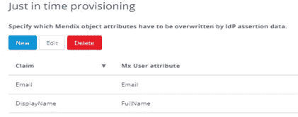

# 将 Azure AD SSO 添加到您的 Mendix 应用

> 原文：<https://medium.com/mendix/azure-ad-sso-integration-with-mendix-app-b7bddd1429f6?source=collection_archive---------0----------------------->

Azure AD SSO Integration with Mendix App

## 如今，你可能已经通过单点登录访问了应用程序。但是你知道它是如何被集成的吗，它是如何允许你登录应用程序的？

## 在这篇博客中，我将解释 SSO 是什么，它是如何工作的，并指导您将 Azure AD 与 Mendix 应用程序集成以实现这种 SSO 机制的步骤。

作为用户，我们不希望必须记住访问每个应用程序的凭证。这就是我们可以实现 SSO 的地方，SSO 解决了记住每个应用的凭证的压力。

## **我是这样定义 SSO 的—**

SSO 代表单点登录，允许用户使用一组凭证访问多个服务。

在这里，我们将看到 Azure AD 与 Mendix 应用程序的集成，该应用程序为用户提供 SSO 功能。

如果你很好奇想了解更多关于 SSO 的知识，请看下图:

## **这是其中涉及的流程**

1.当用户试图访问应用程序时，它会创建一个 SAML 请求并将其发送给身份提供者，如 Azure Active Directory。

2.现在 IP 将验证用户并返回 SAML 响应。

3.Mendix 应用程序验证 SAML 响应，并允许用户登录应用程序。认证机制如上图所示。

下面我将在 **SAML 模块**的帮助下，在 Mendix 应用中配置**身份提供者**和**服务提供者**信息，以在 Mendix 应用中实现上述过程

## 只需按照以下步骤在您的应用中使用它

要开始集成过程，我们需要一个帐户来访问 Azure Active Directory。在 Microsoft 365 开发人员计划成员的帮助下，创建拥有完全管理权限的开发人员帐户。

点击此处[https://developer . Microsoft . com/en-us/Microsoft-365/dev-program](https://developer.microsoft.com/en-us/microsoft-365/dev-program)设置新的 Microsoft 365 E5 订阅。

为了根据 Azure AD 对 Mendix 应用程序中的用户进行身份验证，我们需要在 Azure AD 管理控制台和 Mendix 应用程序中进行基本设置。

[https://www.mendix.com/pricing/](https://www.mendix.com/pricing/)

**要在 Azure AD 中完成的基本设置步骤**

**第一步:使用开发者账号登录**[https://portal.azure.com/](https://portal.azure.com/)，打开 Azure Active Directory 概述。

**第二步:** **从菜单中点击**企业应用**点击**创建自己的应用。

**第三步:** **点击**设置单点登录选项，从单点登录方式中**选择** SAML。

**步骤 4:在基本 saml 配置部分输入**沙盒 URL，不要忘记**复制**应用联盟元数据 URL。

例如:

【https://yourappname-sandbox.mxapps.io/】标识符:

**回复网址:**[https://yourappname-sandbox.mxapps.io/SSO/](https://yourappname-sandbox.mxapps.io/SSO/)

**第 5 步:** **点击**用户和组，为用户提供该企业应用的访问权限。**点击**添加用户按钮，选择用户，如下图

**Mendix 应用程序的基本设置步骤**

**第一步:**新建一个 Mendix 应用程序**下载** **Saml 模块和 MxModelReflection 模块**。不要忘记在运行时设置下映射 Saml 启动微流。

**第二步:调用导航中的 Saml 配置**，输入 SP 配置明细。**复制**应用程序的 URL，然后**将**粘贴到组织 URL 中。然后更新组织&联系人的详细信息并保存。

**第三步:** **点击**新增按钮，进入 IDP 配置下的 IDP 详细信息。**在 URL 字段中粘贴**应用联盟元数据 URL，然后**点击**下一步。

**步骤 4:** **选择**“允许 IdP 发起的认证”，然后**选择**“使用名称 ID”作为断言类型，如下所示。

**第五步:** **选择**账户主体和尊重属性。

**第 6 步:**在用户配置部分，**选择**是，创建用户并映射用户角色。

**第 7 步:**在“及时供应”部分，**通过**点击**新建添加**两个索赔，然后进行搜索，如下所示

**1。权利要求 1**

**姓名**:[http://schemas.xmlsoap.org/ws/2005/05/identity/claims/name](http://schemas.xmlsoap.org/ws/2005/05/identity/claims/name)

**名称格式**:字符串

**友好名称**:电子邮件

**2。权利要求 2**

**姓名**:http://schemas.microsoft.com/identity/claims/displayname

**名称** **格式**:字符串

**友好** **名称**:显示名称

**第 8 步:** **按照描述创建**上述声明，并映射属性，如下所示:

**步骤 9:** **点击**保存，然后**点击**切换激活，使新的 IDP 配置激活。

**第 10 步:**用户现在可以访问 SSO 登录 URL[**https://{ your app name }-sandbox . MX apps . io/SSO/**](/mendix/{yourappname}-sandbox.mxapps.io/SSO/)，并且能够使用他们的 Azure AD 凭据登录。

## 最后的想法

我希望这篇文章是有见地的帮助。我很乐意在评论区听到你的想法、建议和问题。

我们将在下一篇文章中再见——再见！！！

## 阅读更多

 [## SAML -市场指南| Mendix 文档

### SAML 模块可用作您支持的身份验证方法的替代或扩展。该模块允许…

docs.mendix.com](https://docs.mendix.com/appstore/modules/saml)  [## Mx 模型反映-市场指南| Mendix 文档

### Mx 模型反射模块允许您从应用程序中访问有关应用程序的域模型的信息。对于…

docs.mendix.com](https://docs.mendix.com/appstore/modules/model-reflection) 

*来自发布者-*

如果你喜欢这篇文章，你可以在我们的 [*媒体页面*](https://medium.com/mendix) *找到更多喜欢的。对于精彩的视频和直播会话，您可以前往*[*MxLive*](https://www.mendix.com/live/)*或我们的社区*[*Youtube PAG*](https://www.youtube.com/c/MendixCommunity/community)*e .*

*希望入门的创客，可以注册一个* [*免费账号*](https://signup.mendix.com/link/signup/?source=direct) *，通过我们的* [*学院*](https://academy.mendix.com/link/home) *获得即时学习。*

有兴趣更多地参与我们的社区吗？你可以加入我们的 [*闲散社区频道*](https://join.slack.com/t/mendixcommunity/shared_invite/zt-hwhwkcxu-~59ywyjqHlUHXmrw5heqpQ) *或者想更多参与的人，看看加入我们的* [*遇见 ups*](https://developers.mendix.com/meetups/#meetupsNearYou) *。*