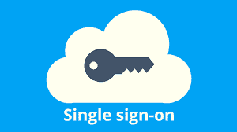
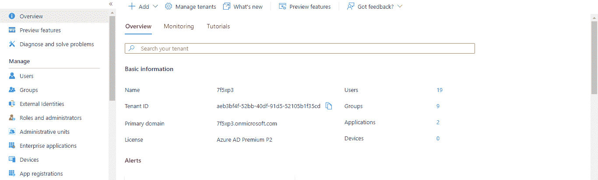
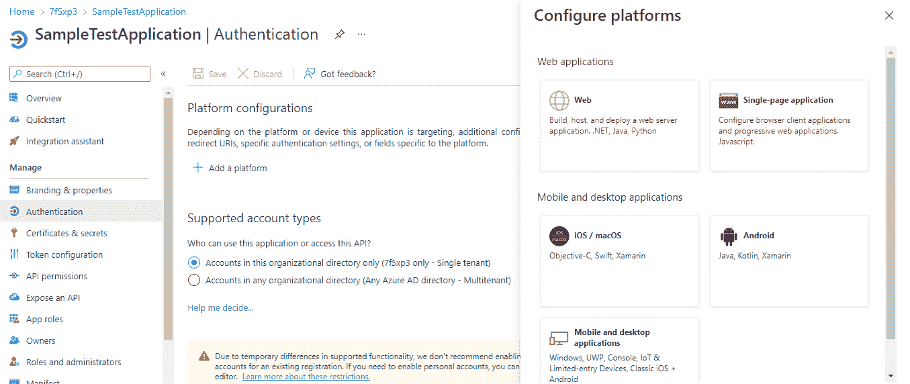
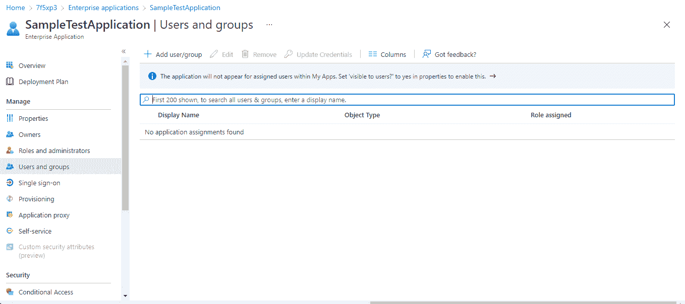
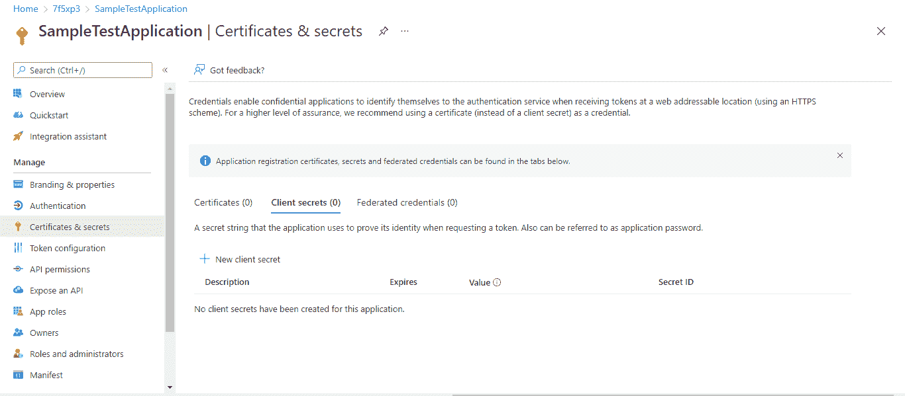
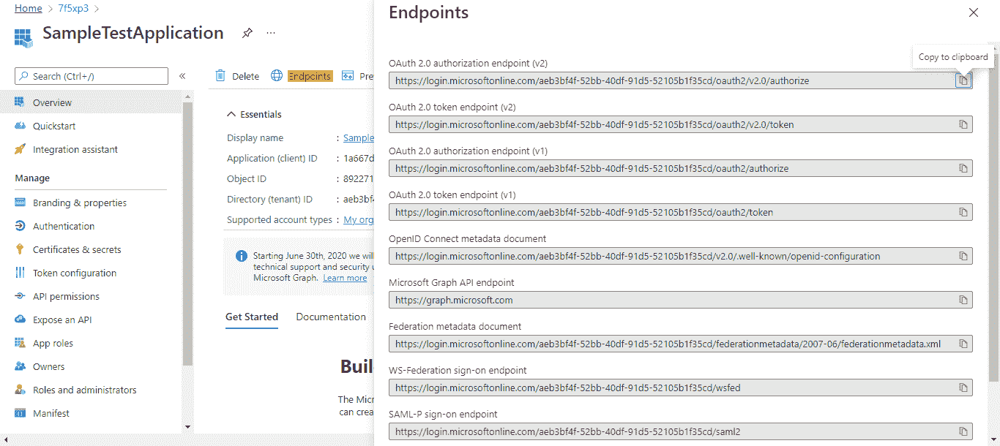
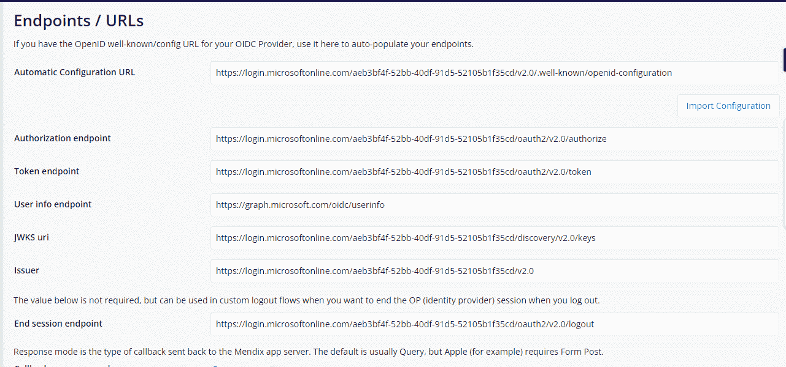
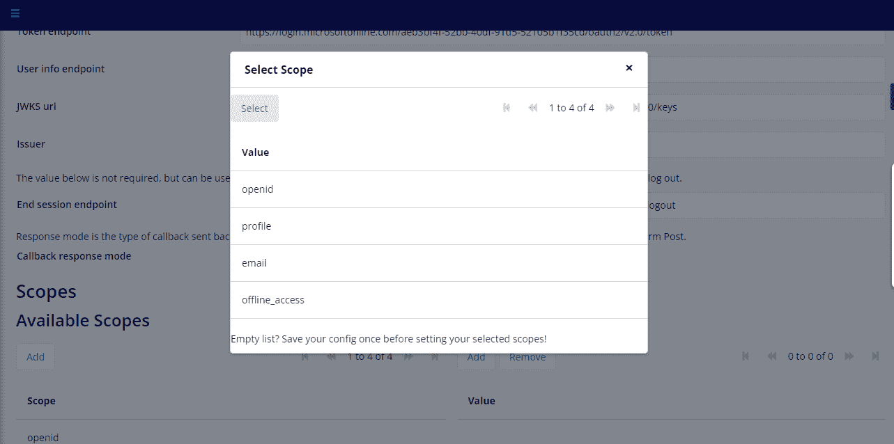

# Azure AD SSO 使用 Mendix 中的 OIDC 模块

> 原文：<https://medium.com/mendix/azure-ad-sso-using-oidc-module-6b5eeff4be56?source=collection_archive---------0----------------------->

Azure AD SSO using the OIDC Module in Mendix

在这篇博客中，我将向您展示如何使用 OIDC 门迪克斯市场模块(OpenID Connect 单点登录)通过 Azure SSO 实现用户身份验证

目前正在开发的几乎所有应用都使用 SSO 进行身份验证。你试过用 OIDC 集成 Azure SSO 吗？让我知道，在这里评论。

**只需按照这些步骤在你的 Mendix 应用中使用 Azure AD SSO**

*   在 Microsoft 365 开发人员计划会员资格中创建一个开发人员帐户。

使用以下链接设置新的 Microsoft 365 E5 订阅。

[https://developer . Microsoft . com/en-us/Microsoft-365/dev-program](https://developer.microsoft.com/en-us/microsoft-365/dev-program)。

**Azure AD 要做的步骤:**

*   使用开发者帐户登录**[https://portal.azure.com/](https://portal.azure.com/)，打开 Azure Active Directory 概述。**

****

*   ****点击菜单中的**企业应用，然后**点击**创建自己的应用。**

**在应用程序注册中，选择您已经创建的应用程序并设置重定向 URL。**

****

**选择 web 应用程序并输入重定向 URI，然后单击配置。**

*   **在企业应用程序导航中分配可以访问应用程序的用户和组。**

****

****在您的 Mendix 应用中需要完成的步骤:****

*   ****从 Mendix 市场下载**OIDC 模块，并将 OIDC 配置页面添加到导航中。**
*   **运行时，**在 OIDC 配置页面点击**新建，添加新的配置，设置客户端 ID、客户端密码和端点 URL。**
*   ****客户 id:****

> **C 客户 id 可以从申请注册页面的概览页面获取。**

*   ****客户端密码:****

**通过应用程序注册页面上的证书和机密导航，在 Azure AD Portal 中创建新的客户端机密。**

****

*   ****端点 URL:****

**在概览页面**上，点击“端点”上的**以获取 OpenId Connect 元数据文档，如下所示**

****

**添加端点 URL 并单击导入配置**

****

**通过单击新建并保存配置，在选择范围部分添加范围。**

****

**用户现在可以使用 Azure SSO 登录应用程序。**

****最后:****

**该模块也适用于本地移动设备。**

## **阅读更多**

** [## 使用 OIDC 模块将 Google SSO 添加到您的 Mendix 应用程序中

### 这些天没有最终用户有时间来完成一个漫长的注册过程，我们都填写了足够的“确认您的…

medium.com](/mendix/add-google-sso-to-your-mendix-app-using-the-oidc-module-a76784b2690f)  [## OpenID 连接| OpenID

### OpenID Connect 1.0 是 OAuth 2.0 协议之上的一个简单的身份层。它允许客户验证…

openid.net](https://openid.net/connect/)  [## Mendix SSO

### 描述 Mendix SSO 模块的配置和用法，该模块可在 Mendix 市场中获得。

docs.mendix.com](https://docs.mendix.com/appstore/modules/mendix-sso/)** 

***来自发布者-***

***如果你喜欢这篇文章，你可以在我们的* [*中页*](https://medium.com/mendix) *找到更多喜欢的。对于精彩的视频和直播会话，您可以前往*[*MxLive*](https://www.mendix.com/live/)*或我们的社区*[*Youtube PAG*](https://www.youtube.com/c/MendixCommunity/community)*e .***

***希望入门的创客，可以注册一个* [*免费账号*](https://signup.mendix.com/link/signup/?source=direct) *，通过我们的* [*学苑*](https://academy.mendix.com/link/home) *获得即时学习。***

**有兴趣加入我们的社区吗？加入我们的 [*松弛社区频道*](https://join.slack.com/t/mendixcommunity/shared_invite/zt-hwhwkcxu-~59ywyjqHlUHXmrw5heqpQ) *。***