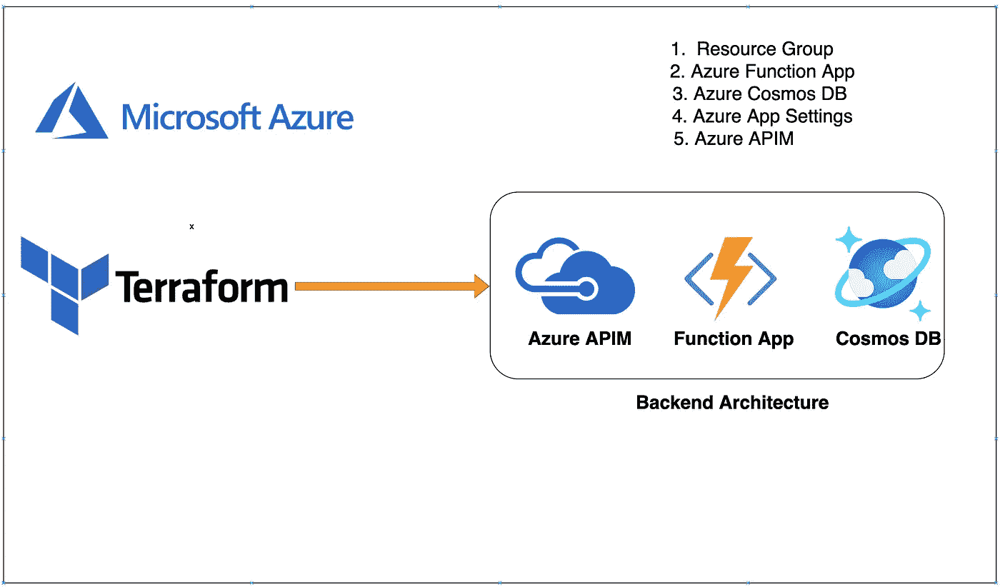

# Azure——后端架构模块，带有 Azure APIM、功能应用程序、带有 Terraform 的 Cosmos DB

> 原文：<https://medium.com/bb-tutorials-and-thoughts/azure-backend-architecture-modules-with-azure-apim-function-app-cosmos-db-with-terraform-54ddde4228cb?source=collection_archive---------0----------------------->

## 包含示例项目的逐步指南

在 Terraform 中，模块是模块化 terraform 代码并使其可重用的方法。我们不应该为每个资源创建一个包装器，并把它称为一个模块。该模块应该是一组逻辑资源，您可以部署在…