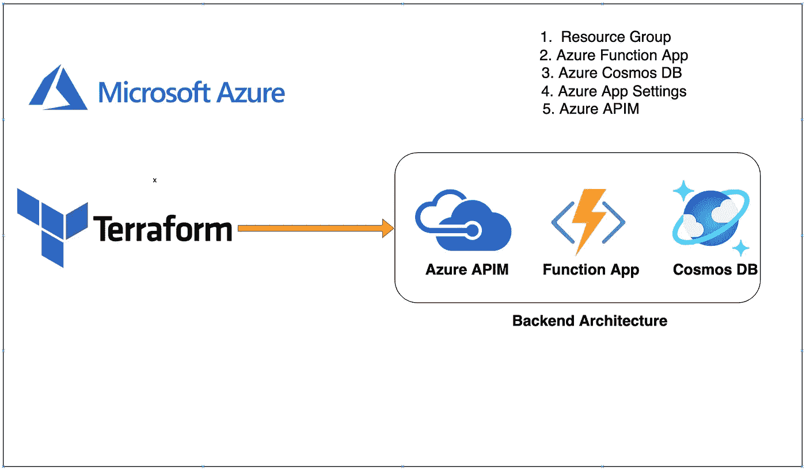

# Azure——后端架构有 Azure APIM、功能应用程序、CosmosDB 有 Terraform

> 原文：<https://medium.com/bb-tutorials-and-thoughts/azure-backend-architecture-with-azure-apim-function-app-cosmosdb-with-terraform-7e1520de7a50?source=collection_archive---------0----------------------->

## 包含示例项目的逐步指南

有很多方法可以在 Azure 上构建后端基础设施，如应用服务、功能应用等。您甚至可以在 Kubernetes 上构建和部署整个后端。公司越来越多地使用无服务器架构…