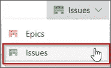

# Azure Boards——如何在 Azure 上开始敏捷规划？

> 原文：<https://medium.com/edureka/azure-boards-ce093b2688bb?source=collection_archive---------0----------------------->

Azure Boards — Edureka

在我之前的文章中，我们讨论了 Azure DevOps 及其组件。本文将详细阐述 Azure Boards 中的一个组件。在这个过程中，我们将探索它如何有助于跨不同团队计划、跟踪和讨论工作。

首先，让我们先来看看这篇 Azure Boards 文章中要讨论的要点:

1.  什么是 Azure 板
2.  Azure Boards 功能
3.  演示:Azure Boards 入门

因此，让我们从理解这个术语的实际含义开始。

# 什么是 Azure 板？

嗯，你可以把它想象成一个界面，让你跟踪任务、特性，甚至可能与你的项目相关的错误。这里有三种工作项类型为您提供帮助:

*   史诗
*   问题
*   任务

以下是以图片形式的描述(图片来源:Microsoft.com):

此外，随着工作的完成，状态会从以下位置逐步更新:

*   去做
*   做
*   完成的

下面的图片描述了同样的情况(图片来源:Microsoft.com):

每当我们创建或添加一个问题、任务或史诗，这意味着我们正在创建一个工作项目。我们创建的每个工作项都代表一个对象。该对象存储在工作项数据存储区中。这里的每个项目都有一个标识符，分配给它。这些 id 对于特定的项目是唯一的。

如果您希望跟踪重要的特性或需求，您可以添加 epics。另一方面，问题用于跟踪用户故事、bug 或其他较小的工作项目。同样，任务意味着跟踪少量的工作。追踪器可用于每小时和每天的追踪。

现在让我们来看看 Azure Boards 的一些特性。

# Azure 板的特点

## 看板实施

用 Azure Boards 实现和使用看板非常容易。它简化了两项重要任务，即:

*   更新问题的状态
*   优先处理你积压的问题

这意味着分配工作变得更加容易，您可以更好地共享信息，并通过提供的拖放功能优先处理您的工作。

## 使用 Azure 板协作

*   **讨论**部分可以让你更好地与项目中的人合作
*   您可以创建仪表板，并跟踪已完成工作的状态和趋势。获得关于创建、更改或解决的问题的即时警报
*   您可以设置通知，以便在创建或更改问题时获得提醒

## 在 sprints 中工作和实施 Scrum 的灵活性

*   通过适当的分配来计划短跑变得更加容易
*   您可以使用工作量估计来预测工作
*   可以批量分配问题或任务

## 与 GitHub 集成

很容易连接到 GitHub，这意味着:

*   您可以轻松地执行拉、推和提交请求
*   您可以轻松地链接到 GitHub 提交和拉请求

现在让我们进一步看看如何使用 Azure Boards 来实现我们上面讨论的一些特性。

# 演示:Azure Boards 入门

**第一步:**首先在你的浏览器**' https://aex . dev . azure . com/sign up/boards '**中打开这个链接。您将被重定向到此页面。点击**继续。**

**步骤 2:** 接下来，您将被要求输入**组织**名称和**地点**，您将从那里开始运营。输入这些信息，然后单击继续。

**步骤 3:** 下一步是创建一个项目。在下面输入详细信息并创建一个项目。

**步骤 4:** 您将被重定向到以下界面，您有四个部分。第一个让你可以访问 Azure Boards 的所有主要标签。第二个允许您添加项目。第三个用于问题，第四个用于管理项目和项目成员。

**步骤 5:** 让我们创建一个问题，为此，单击屏幕左上角的**问题**下拉菜单，然后选择**问题**。

**步骤 6:** 点击添加项目，输入问题名称。一旦你点击了回车键，问题标签将出现如下。

**第七步:**我们可以将状态更改为**正在进行**，您的项目将移动到名为**正在进行**的列下。

**步骤 8:** 您可以向问题添加任务。这一部分包含了需要做的事情。我添加了三个任务，并划掉了一个，这表明任务已经完成。

所以，伙计们，这是关于添加一个简单的问题到你的 Azure 板。Azure boards 可以做很多事情。你可以自由探索 Azure Boards。如果你想查看更多关于 Python、DevOps、Ethical Hacking 等市场最热门技术的文章，那么你可以参考 [Edureka 的官方网站。](https://www.edureka.co/blog/?utm_source=medium&utm_medium=content-link&utm_campaign=azure-boards)

请留意本系列中的其他文章，它们将解释 Azure 的各个方面。

> 1.[蔚蓝教程](/edureka/azure-tutorial-5a97e30ee9a7)
> 
> 2. [Azure 门户](/edureka/azure-portal-all-you-need-to-know-about-the-azure-console-8ade1effa474)
> 
> 3. [Azure 存储教程](/edureka/azure-storage-tutorial-an-introduction-to-azure-storage-dae8fd8f555c)
> 
> 4. [Azure 私有网络](/edureka/azure-virtual-network-securing-your-applications-using-vpc-744eba3aa5b1)
> 
> 5. [Azure DevOps 教程](/edureka/azure-devops-cf755fb334ae)
> 
> 6.[天蓝色管道](/edureka/azure-pipelines-1faa653e4cff)

*原载于 2019 年 4 月 26 日*[*【https://www.edureka.co*](https://www.edureka.co/blog/azure-boards/)*。*