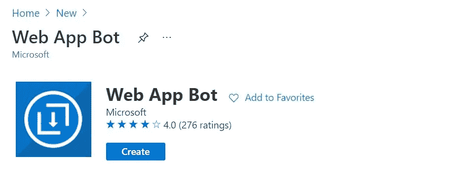
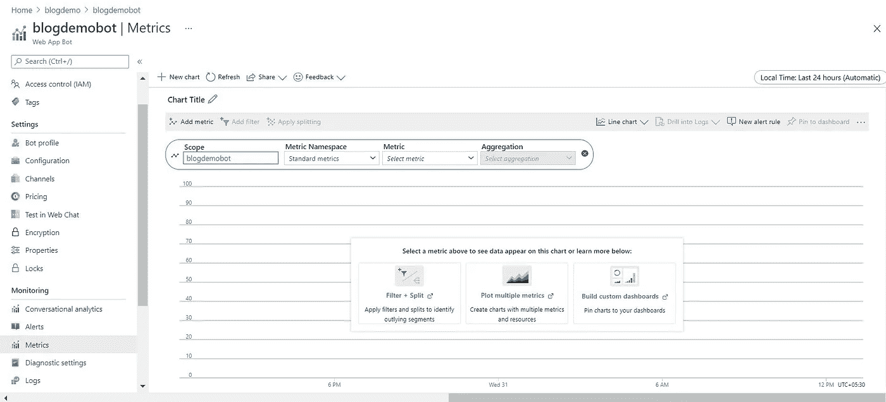

# Azure Bot 服务

> 原文：<https://medium.com/globant/azure-bot-service-98152110b6f3?source=collection_archive---------0----------------------->

Azure bot 服务是主要的 Azure AI 服务之一。它与 Azure Bot 服务和 Bot 框架一起提供了在一个地方构建、测试、部署和管理智能 Bot 的功能。Azure bot 服务用于创建智能的企业 bot，帮助您丰富客户体验，同时保持对您自己品牌的虚拟助理/bot 的数据控制，以快速连接和解决用户/客户查询。

下图解释了机器人服务和认知服务流程。

Image from [M](https://azure.microsoft.com/)icrosoft

**a .用户输入:**虚拟助手/机器人是用户使用文本、图形或语音以对话方式进行交互的应用。

**b .渠道:**跨多个沟通渠道的 Bot 服务支持，将更多客户从微软团队、Skype、Slack、Cortana、Facebook Messenger 等更多渠道接触到你的网站或 app。

**c .设备:** Bot 服务支持多个设备与虚拟助手/bot 进行通信，如手机、智能手表、智能设备。

**d. Bot 框架:** Bot 框架用于 Bot 服务与后端源/知识库/认知服务之间的通信。bot 框架 SDK 允许您创建和开发 Bot。它有助于减少 bot 开发时间和开发人员的工作量。它允许集成认知服务，如语言、视觉、语音、第三方 API。

# **Bot 生命周期:**

Image from Microsoft

**a .设计:**Bot 生命周期的第一步是架构设计，最终确定语言、业务流程、认知服务、渠道和 Bot 招募。

**b. Build:** 使用 bot 框架，用 c#/node js 代码构建 Bot。集成所有需要的认知服务和 bot 框架特性。

**c .测试:**一旦开发完成或任何模块准备就绪，然后我们可以使用**机器人模拟器**进行本地测试，对于部署，我们可以使用来自 Web 应用程序机器人组件的**网络聊天**。

**d .发布:**一旦 bot 通过测试，您就可以在自动创建的应用程序服务上手动发布 bot。否则，您可以为发布设置连续部署。

**e. Connect:** 使用部署的 bot 配置不同的所需通道，以连接并与最终用户通信。

**f .评估:** Azure Bot 服务提供 Bot Metrix 来跟踪 Bot 的分析和使用。

# 工作原理:

机器人框架服务在用户的机器人连接的应用程序通道和机器人之间发送信息。每个通道可以在它们发送的活动中包括附加信息。在创建机器人之前，了解机器人如何使用活动对象与其用户通信是很重要的。

消息活动携带各方之间的对话信息。在 echo bot 示例中，消息活动携带简单的文本，通道将呈现这些文本。或者，消息活动可以携带要朗读的文本、建议的动作或要显示的卡片。

让我们来看看在运行一个简单的 echo bot 时交换的活动。

Image from Microsoft

机器人框架服务可以在对话开始时发送对话更新。一个用于加入对话的用户，一个用于加入机器人。

# 好处:

**a .易于设置&规模:** Azure bot 服务与 bot 框架结合在一起，在一个地方提供构建、测试、部署和管理智能 Bot

**b .管理意图和数据:**它允许与管理意图、认知服务、第三方 API 和数据连接，以便在用户通信期间进行通信。

【24x7 可用: It 在所有地区提供无停机服务。协助客户聊天&在所有地区随时减少潜在客户。

**d .提供多语言支持:** Its 支持跨多个地区的多语言用户交互。

**e .多渠道支持:**跨多个沟通渠道整合 Bot 服务，以接触更多客户。

**f .保护敏感数据:**通过屏蔽客户的机密信息，让他们感到安全。

**h .高性价比:**支持多种定价模式，帮助用户根据业务需求选择定价模式，避免支付不必要的成本。

# **创建 Azure Bot 服务:**

打开 Azure 门户，单击一个新建并搜索“Web 应用程序机器人”

它将打开下面的屏幕，并点击创建按钮

根据要求填写 bot 表格必填字段

从单击 Bot 模板选项中选择 Bot 开发语言和模板。为了演示的目的，我采取 C#生态机器人。

一旦填写所有细节并创建机器人，它将创建 Web 应用程序机器人和 Web 应用程序服务组件。**用于部署定制 bot 代码的 Web App**和**用于配置 bot 的 Web App bot 服务**。

我们可以从“在网络聊天中测试”选项测试部署的机器人，如下图所示。因为我选择了 C#生态机器人，你可以在下面的测试屏幕中看到生态响应。

Web 应用程序机器人允许从门户网站更新机器人配置文件。它允许更新机器人图标，机器人显示名称和描述，将机器人用户可见。

Web App Bot Metrics 提供 Bot 使用的图形分析。

使用渠道选项，您可以轻松地配置渠道，如团队，松弛，电子邮件和其他更多的选项。Web 应用程序 Bot 默认使用直线通道进行通信。

通过点击“获取机器人嵌入代码”将打开配置网络聊天，我们将获得密钥和嵌入代码。我们可以在 HTML 页面上使用相同嵌入代码。

# 结论:

在这里，我试图解释非常有趣的 Azure 人工智能主题。这是对 Azure bot 服务以及 bot 框架和 Bot 的基本理解。当然，一旦开始工作，你会得到更多东西。我希望你喜欢博客，这将有助于你开发机器人应用程序。